# Advanced Data Governance Platform - Software Architecture Report

## Executive Summary

This comprehensive software architecture report details the end-to-end architecture of the **PurSight Data Governance Platform**, an enterprise-grade data governance system built with modern microservices architecture. The system orchestrates seven core functional groups through the **Racine Main Manager**, providing unified data governance, compliance, and intelligent automation capabilities.

---

## Table of Contents

1. [System Overview](#system-overview)
2. [Architectural Principles](#architectural-principles)
3. [Component Architecture](#component-architecture)
4. [Package Structure](#package-structure)
5. [Class Diagrams](#class-diagrams)
6. [Sequence Diagrams](#sequence-diagrams)
7. [Deployment Architecture](#deployment-architecture)
8. [Use Case Diagrams](#use-case-diagrams)
9. [State Diagrams](#state-diagrams)
10. [Activity Diagrams](#activity-diagrams)
11. [Implementation Plan](#implementation-plan)

---

## 1. System Overview

### 1.1 Platform Architecture

The PurSight Data Governance Platform is built as a sophisticated microservices architecture orchestrating **7 Core Functional Groups** through the **Racine Main Manager** system:

#### Core Functional Groups:
1. **Data Sources** - Connection and discovery management
2. **Compliance Rules** - Regulatory compliance and validation
3. **Classifications** - Data classification and labeling
4. **Scan Rule Sets** - Automated scanning and rule execution
5. **Data Catalog** - Metadata and lineage management
6. **Scan Logic** - Intelligent scanning orchestration
7. **RBAC System** - Role-based access control and security

#### Racine Main Manager Components:
- **Orchestration Service** - Master coordination across all groups
- **Workspace Management** - Multi-tenant workspace isolation
- **Workflow Engine** - Databricks-style workflow orchestration
- **Pipeline Management** - AI-driven data pipeline optimization
- **AI Assistant** - Context-aware intelligent assistance
- **Activity Tracking** - Comprehensive audit and monitoring
- **Dashboard System** - Real-time analytics and visualization
- **Collaboration Platform** - Real-time team collaboration
- **Integration Hub** - Cross-system integration management

### 1.2 Technology Stack

**Backend Framework:**
- FastAPI (Python 3.9+)
- SQLModel/SQLAlchemy for ORM
- PostgreSQL for primary database
- Redis for caching and session management

**Frontend Framework:**
- React 18 with TypeScript
- Material-UI/Ant Design components
- Redux Toolkit for state management
- WebSocket for real-time features

**Infrastructure:**
- Docker containers
- Kubernetes orchestration
- Azure/AWS cloud deployment
- Microservices architecture

---

## 2. Architectural Principles

### 2.1 Design Principles

1. **Domain-Driven Design (DDD)**: Clear separation of business domains
2. **Microservices Architecture**: Loosely coupled, independently deployable services
3. **Event-Driven Architecture**: Asynchronous communication through events
4. **CQRS Pattern**: Command Query Responsibility Segregation
5. **Clean Architecture**: Dependency inversion and separation of concerns

### 2.2 Quality Attributes

- **Scalability**: Horizontal scaling through microservices
- **Reliability**: 99.9% uptime with circuit breakers and redundancy
- **Security**: Zero-trust security model with RBAC
- **Performance**: Sub-second response times with caching
- **Maintainability**: Modular design with clear interfaces

---

## 3. Component Architecture

### 3.1 High-Level Component Diagram

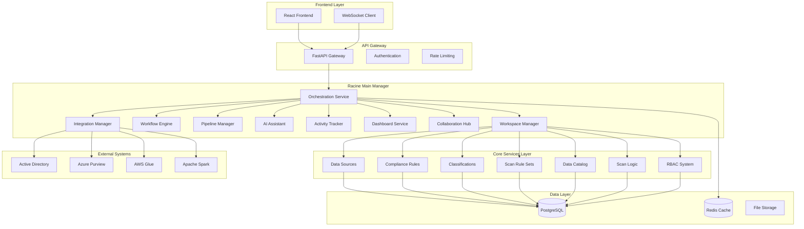

### 3.2 Service Communication Patterns

#### Synchronous Communication:
- HTTP/REST APIs for request-response patterns
- GraphQL for complex data queries
- gRPC for internal service communication

#### Asynchronous Communication:
- WebSocket for real-time updates
- Event streaming through Redis Streams
- Message queues for background processing

---

## 4. Package Structure

### 4.1 Backend Package Architecture

```
app/
├── models/                     # Data Models Layer
│   ├── auth_models.py         # Authentication & RBAC models
│   ├── scan_models.py         # Scanning and orchestration models
│   ├── compliance_models.py   # Compliance validation models
│   ├── classification_models.py # Data classification models
│   ├── catalog_models.py      # Data catalog models
│   ├── workflow_models.py     # Workflow execution models
│   └── racine_models/         # Racine Main Manager models
│       ├── racine_orchestration_models.py
│       ├── racine_workspace_models.py
│       ├── racine_workflow_models.py
│       ├── racine_pipeline_models.py
│       ├── racine_ai_models.py
│       ├── racine_activity_models.py
│       ├── racine_dashboard_models.py
│       ├── racine_collaboration_models.py
│       └── racine_integration_models.py
│
├── services/                   # Business Logic Layer
│   ├── auth_service.py        # Authentication service
│   ├── data_source_service.py # Data source management
│   ├── compliance_service.py  # Compliance validation
│   ├── classification_service.py # Data classification
│   ├── catalog_service.py     # Catalog management
│   ├── scan_service.py        # Scanning orchestration
│   ├── rbac_service.py        # Role-based access control
│   └── racine_services/       # Racine Main Manager services
│       ├── racine_orchestration_service.py
│       ├── racine_workspace_service.py
│       ├── racine_workflow_service.py
│       ├── racine_pipeline_service.py
│       ├── racine_ai_service.py
│       ├── racine_activity_service.py
│       ├── racine_dashboard_service.py
│       ├── racine_collaboration_service.py
│       └── racine_integration_service.py
│
├── api/                       # API Layer
│   ├── routes/                # API route definitions
│   │   ├── auth.py           # Authentication endpoints
│   │   ├── scan_routes.py    # Scanning endpoints
│   │   ├── compliance_routes.py # Compliance endpoints
│   │   ├── classification_routes.py # Classification endpoints
│   │   ├── catalog_routes.py # Catalog endpoints
│   │   ├── rbac/             # RBAC endpoints
│   │   └── racine_routes/    # Racine Main Manager endpoints
│   │       ├── racine_orchestration_routes.py
│   │       ├── racine_workspace_routes.py
│   │       ├── racine_workflow_routes.py
│   │       ├── racine_pipeline_routes.py
│   │       ├── racine_ai_routes.py
│   │       ├── racine_activity_routes.py
│   │       ├── racine_dashboard_routes.py
│   │       ├── racine_collaboration_routes.py
│   │       └── racine_integration_routes.py
│   └── security/             # Security middleware
│       ├── rbac.py          # RBAC enforcement
│       └── auth_middleware.py # Authentication middleware
│
├── core/                     # Core Infrastructure
│   ├── config.py            # Configuration management
│   ├── database.py          # Database connection
│   ├── security.py          # Security utilities
│   └── logging.py           # Logging configuration
│
└── utils/                   # Utility Functions
    ├── validators.py        # Input validation
    ├── serializers.py       # Data serialization
    └── helpers.py           # Helper functions
```

### 4.2 Frontend Package Architecture

```
src/
├── components/              # Reusable UI Components
│   ├── common/             # Common components
│   ├── auth/               # Authentication components
│   ├── data-sources/       # Data source components
│   ├── compliance/         # Compliance components
│   ├── classifications/    # Classification components
│   ├── catalog/            # Catalog components
│   ├── scanning/           # Scanning components
│   ├── rbac/               # RBAC components
│   └── racine-main-manager/ # Racine components
│       ├── orchestration/
│       ├── workspaces/
│       ├── workflows/
│       ├── pipelines/
│       ├── ai-assistant/
│       ├── activity/
│       ├── dashboards/
│       ├── collaboration/
│       └── integrations/
│
├── services/               # API Service Layer
│   ├── api.ts             # Base API configuration
│   ├── auth.service.ts    # Authentication service
│   ├── data-source.service.ts # Data source service
│   ├── compliance.service.ts # Compliance service
│   ├── classification.service.ts # Classification service
│   ├── catalog.service.ts # Catalog service
│   ├── scanning.service.ts # Scanning service
│   ├── rbac.service.ts    # RBAC service
│   └── racine/            # Racine services
│       ├── orchestration.service.ts
│       ├── workspace.service.ts
│       ├── workflow.service.ts
│       ├── pipeline.service.ts
│       ├── ai.service.ts
│       ├── activity.service.ts
│       ├── dashboard.service.ts
│       ├── collaboration.service.ts
│       └── integration.service.ts
│
├── store/                 # Redux Store
│   ├── index.ts          # Store configuration
│   ├── auth/             # Authentication state
│   ├── data-sources/     # Data source state
│   ├── compliance/       # Compliance state
│   ├── classifications/  # Classification state
│   ├── catalog/          # Catalog state
│   ├── scanning/         # Scanning state
│   ├── rbac/             # RBAC state
│   └── racine/           # Racine state
│
├── types/                # TypeScript Type Definitions
│   ├── auth.types.ts     # Authentication types
│   ├── api.types.ts      # API response types
│   └── racine.types.ts   # Racine types
│
└── utils/                # Utility Functions
    ├── constants.ts      # Application constants
    ├── helpers.ts        # Helper functions
    └── validators.ts     # Input validation
```

---

## 5. Class Diagrams

### 5.1 Core Domain Models

```mermaid
classDiagram
    class User {
        +int id
        +string email
        +string hashed_password
        +boolean is_active
        +boolean is_verified
        +datetime created_at
        +string role
        +string first_name
        +string last_name
        +authenticate()
        +assign_role()
        +check_permissions()
    }
    
    class Role {
        +int id
        +string name
        +string description
        +List~Permission~ permissions
        +add_permission()
        +remove_permission()
        +inherit_from()
    }
    
    class Permission {
        +int id
        +string action
        +string resource
        +string conditions
        +check_access()
    }
    
    class DataSource {
        +int id
        +string name
        +string type
        +string connection_string
        +dict configuration
        +datetime created_at
        +connect()
        +discover_schema()
        +scan()
    }
    
    class Scan {
        +int id
        +int data_source_id
        +string status
        +datetime started_at
        +datetime completed_at
        +dict results
        +execute()
        +get_results()
    }
    
    class ComplianceRule {
        +int id
        +string name
        +string description
        +string rule_type
        +dict conditions
        +validate()
        +apply_to_data()
    }
    
    class ClassificationRule {
        +int id
        +string name
        +string classification_type
        +dict patterns
        +float confidence_threshold
        +classify_data()
        +train_model()
    }
    
    class CatalogItem {
        +int id
        +string name
        +string type
        +string description
        +dict metadata
        +List~Tag~ tags
        +add_tag()
        +update_metadata()
    }
    
    User ||--o{ Role : has
    Role ||--o{ Permission : contains
    User ||--o{ DataSource : owns
    DataSource ||--o{ Scan : generates
    Scan ||--o{ ComplianceRule : validates_against
    Scan ||--o{ ClassificationRule : applies
    CatalogItem ||--o{ DataSource : represents
```

### 5.2 Racine Main Manager Models

```mermaid
classDiagram
    class RacineOrchestrationMaster {
        +UUID id
        +string name
        +string description
        +OrchestrationStatus status
        +dict configuration
        +datetime created_at
        +int created_by
        +orchestrate_workflows()
        +monitor_system_health()
        +allocate_resources()
    }
    
    class RacineWorkspace {
        +UUID id
        +string name
        +string description
        +WorkspaceType type
        +int owner_id
        +dict settings
        +datetime created_at
        +add_member()
        +add_resource()
        +get_analytics()
    }
    
    class RacineJobWorkflow {
        +UUID id
        +string name
        +WorkflowType type
        +UUID workspace_id
        +dict definition
        +WorkflowStatus status
        +execute()
        +schedule()
        +get_metrics()
    }
    
    class RacinePipeline {
        +UUID id
        +string name
        +PipelineType type
        +UUID workspace_id
        +List~RacinePipelineStage~ stages
        +PipelineStatus status
        +execute_pipeline()
        +optimize_performance()
        +get_execution_metrics()
    }
    
    class RacineAIConversation {
        +UUID id
        +UUID workspace_id
        +int user_id
        +string title
        +ConversationType type
        +datetime created_at
        +add_message()
        +get_recommendations()
        +analyze_context()
    }
    
    class RacineActivity {
        +UUID id
        +string entity_type
        +UUID entity_id
        +string action
        +int user_id
        +dict metadata
        +datetime timestamp
        +track_activity()
        +correlate_activities()
    }
    
    class RacineDashboard {
        +UUID id
        +string name
        +UUID workspace_id
        +int owner_id
        +List~RacineDashboardWidget~ widgets
        +dict layout
        +add_widget()
        +personalize()
        +get_analytics()
    }
    
    class RacineCollaboration {
        +UUID id
        +string title
        +CollaborationType type
        +UUID workspace_id
        +int creator_id
        +CollaborationStatus status
        +start_session()
        +add_participant()
        +share_knowledge()
    }
    
    class RacineIntegration {
        +UUID id
        +string name
        +IntegrationType type
        +dict configuration
        +IntegrationStatus status
        +datetime created_at
        +connect()
        +sync_data()
        +monitor_health()
    }
    
    RacineOrchestrationMaster ||--o{ RacineWorkspace : orchestrates
    RacineWorkspace ||--o{ RacineJobWorkflow : contains
    RacineWorkspace ||--o{ RacinePipeline : contains
    RacineWorkspace ||--o{ RacineAIConversation : hosts
    RacineWorkspace ||--o{ RacineActivity : tracks
    RacineWorkspace ||--o{ RacineDashboard : displays
    RacineWorkspace ||--o{ RacineCollaboration : facilitates
    RacineWorkspace ||--o{ RacineIntegration : manages
```

---

## 6. Sequence Diagrams

### 6.1 User Authentication Flow

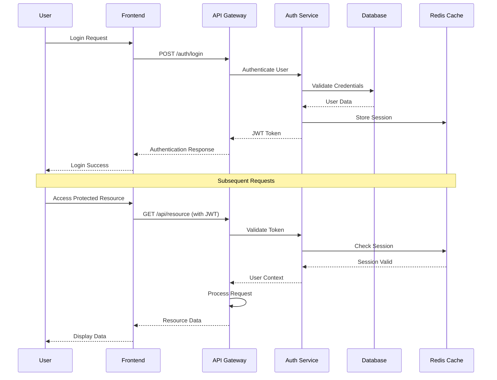

### 6.2 Data Source Scanning Workflow

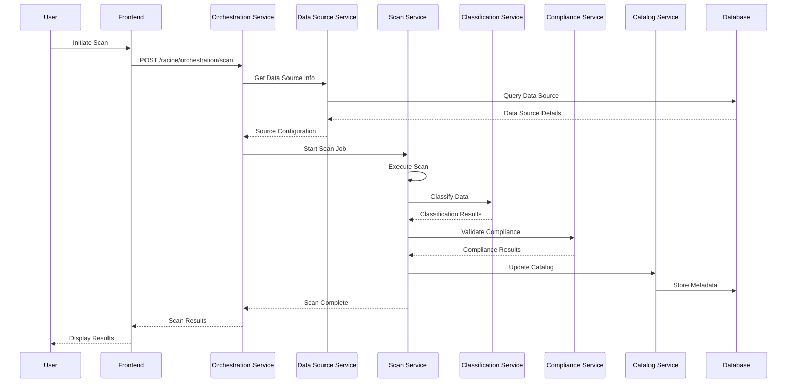

### 6.3 Racine Workspace Collaboration Flow

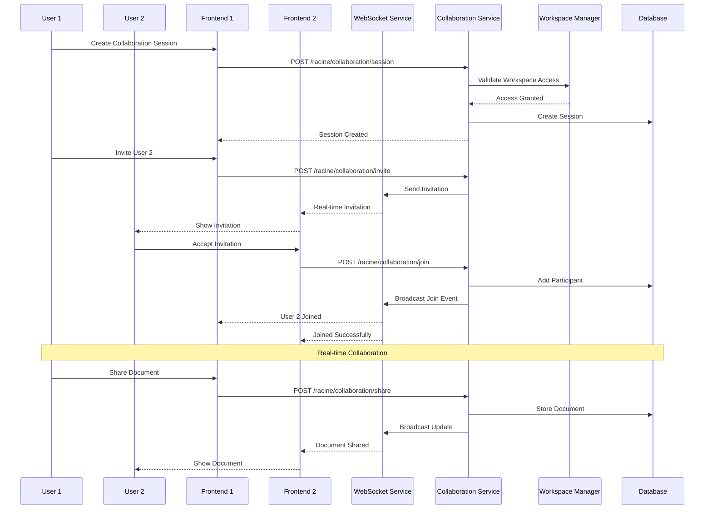

---

## 7. Deployment Architecture

### 7.1 Kubernetes Deployment Diagram

```mermaid
graph TB
    subgraph "Load Balancer"
        LB[Azure Load Balancer]
    end
    
    subgraph "Kubernetes Cluster"
        subgraph "Ingress"
            NGINX[NGINX Ingress Controller]
        end
        
        subgraph "Frontend Tier"
            UI1[React App Pod 1]
            UI2[React App Pod 2]
            UI3[React App Pod 3]
        end
        
        subgraph "API Gateway Tier"
            GW1[FastAPI Gateway Pod 1]
            GW2[FastAPI Gateway Pod 2]
        end
        
        subgraph "Service Tier"
            subgraph "Core Services"
                AUTH[Auth Service]
                DS[Data Source Service]
                SCAN[Scan Service]
                COMP[Compliance Service]
                CLASS[Classification Service]
                CAT[Catalog Service]
                RBAC[RBAC Service]
            end
            
            subgraph "Racine Services"
                ORCH[Orchestration Service]
                WM[Workspace Manager]
                WF[Workflow Engine]
                PM[Pipeline Manager]
                AI[AI Assistant]
                ACT[Activity Tracker]
                DASH[Dashboard Service]
                COLLAB[Collaboration Hub]
                INT[Integration Manager]
            end
        end
        
        subgraph "Data Tier"
            DB1[PostgreSQL Primary]
            DB2[PostgreSQL Replica]
            REDIS1[Redis Master]
            REDIS2[Redis Slave]
        end
        
        subgraph "Storage"
            PVC[Persistent Volume Claims]
            BLOB[Azure Blob Storage]
        end
    end
    
    subgraph "External Services"
        AD[Azure Active Directory]
        PURVIEW[Azure Purview]
        SPARK[Azure Databricks]
        MONITOR[Azure Monitor]
    end
    
    LB --> NGINX
    NGINX --> UI1
    NGINX --> UI2
    NGINX --> UI3
    NGINX --> GW1
    NGINX --> GW2
    
    GW1 --> AUTH
    GW1 --> DS
    GW1 --> SCAN
    GW1 --> COMP
    GW1 --> CLASS
    GW1 --> CAT
    GW1 --> RBAC
    
    GW2 --> ORCH
    GW2 --> WM
    GW2 --> WF
    GW2 --> PM
    GW2 --> AI
    GW2 --> ACT
    GW2 --> DASH
    GW2 --> COLLAB
    GW2 --> INT
    
    AUTH --> DB1
    DS --> DB1
    SCAN --> DB1
    COMP --> DB1
    CLASS --> DB1
    CAT --> DB1
    RBAC --> DB1
    ORCH --> DB1
    WM --> DB1
    WF --> DB1
    PM --> DB1
    AI --> DB1
    ACT --> DB1
    DASH --> DB1
    COLLAB --> DB1
    INT --> DB1
    
    DB1 --> DB2
    REDIS1 --> REDIS2
    
    AUTH --> REDIS1
    ORCH --> REDIS1
    COLLAB --> REDIS1
    
    DS --> PVC
    SCAN --> BLOB
    CAT --> BLOB
    
    INT --> AD
    INT --> PURVIEW
    INT --> SPARK
    ORCH --> MONITOR
```

### 7.2 Infrastructure Components

#### Container Specifications:
- **Frontend**: React app in NGINX container (2 replicas)
- **API Gateway**: FastAPI in Python 3.9 container (2 replicas)
- **Core Services**: Individual FastAPI microservices (1-3 replicas each)
- **Racine Services**: Advanced orchestration services (2-3 replicas each)
- **Database**: PostgreSQL 14 with read replicas
- **Cache**: Redis 6.2 with clustering

#### Resource Requirements:
- **CPU**: 16-32 vCPUs total
- **Memory**: 64-128 GB RAM total
- **Storage**: 1TB+ SSD for database, 10TB+ blob storage
- **Network**: 10 Gbps bandwidth

---

## 8. Use Case Diagrams

### 8.1 Core System Use Cases

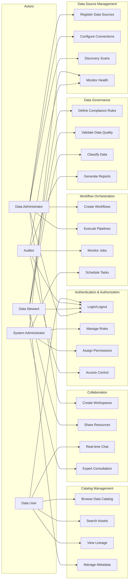

### 8.2 Racine Main Manager Use Cases

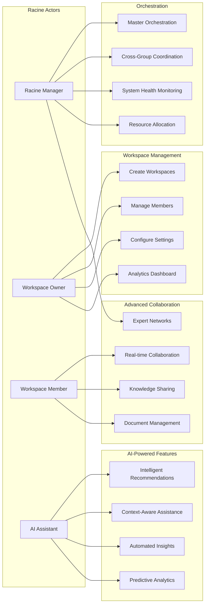

---

## 9. State Diagrams

### 9.1 Data Source Lifecycle

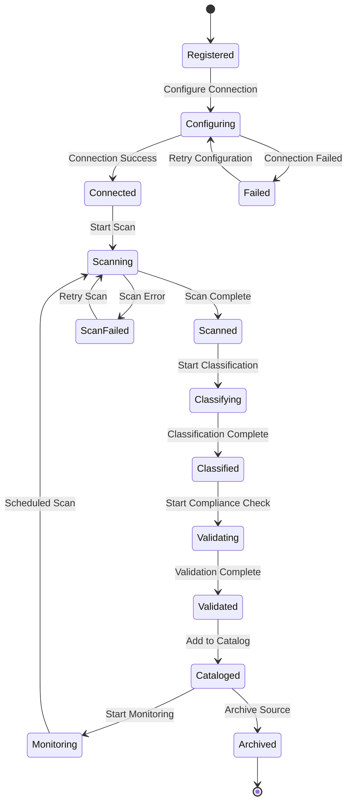

### 9.2 Workflow Execution States

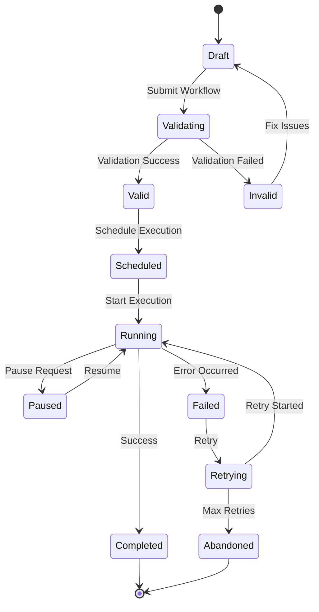

### 9.3 Racine Workspace States

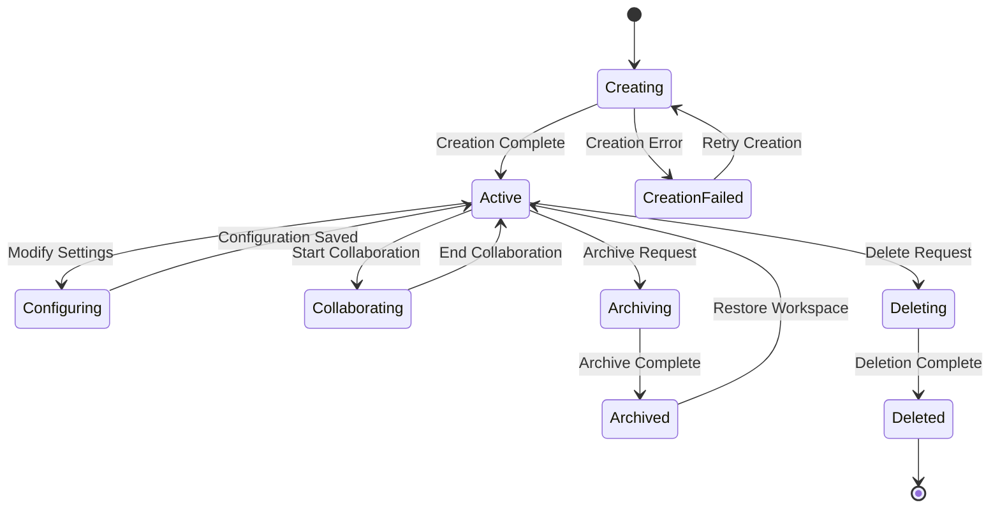

---

## 10. Activity Diagrams

### 10.1 Data Governance Workflow

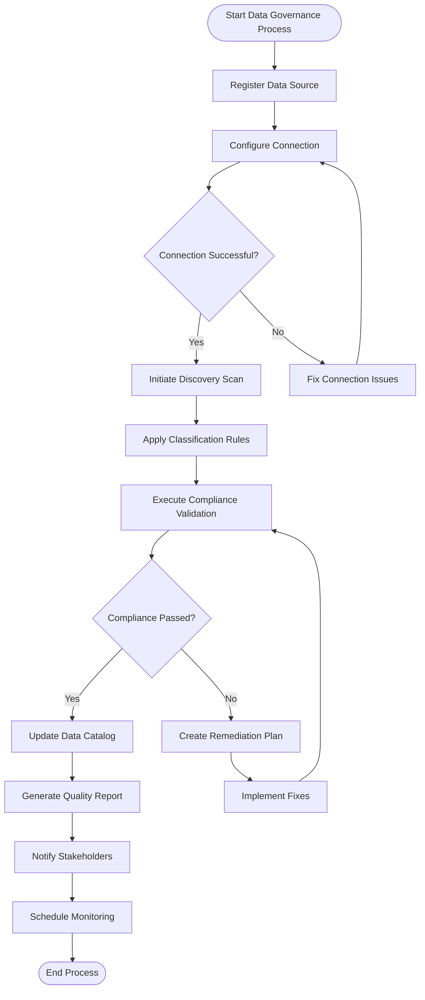

### 10.2 Racine Orchestration Process

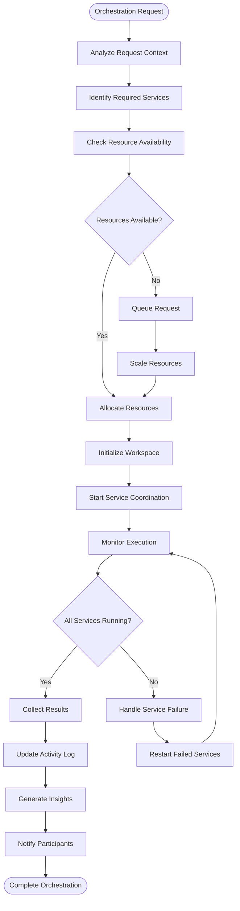

### 10.3 AI-Assisted Data Classification

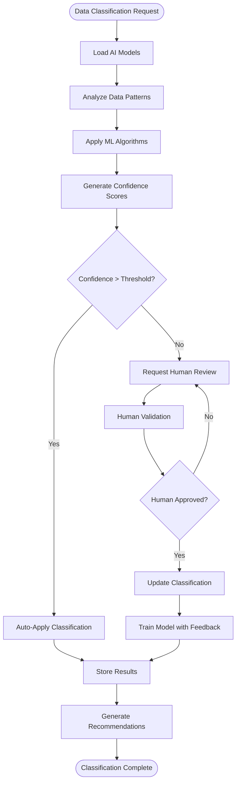

---

## 11. Implementation Plan

### 11.1 Phase 1: Foundation (Months 1-3)

#### Infrastructure Setup:
- ✅ Set up Kubernetes cluster
- ✅ Configure PostgreSQL with high availability
- ✅ Deploy Redis cluster for caching
- ✅ Set up CI/CD pipelines
- ✅ Implement monitoring and logging

#### Core Services:
- ✅ Authentication and RBAC system
- ✅ Data source management service
- ✅ Basic scanning capabilities
- ✅ API gateway and security middleware
- ✅ Database schema and migrations

### 11.2 Phase 2: Core Functionality (Months 4-6)

#### Business Logic Implementation:
- ✅ Compliance validation engine
- ✅ Data classification service
- ✅ Catalog management system
- ✅ Workflow orchestration
- ✅ Basic reporting capabilities

#### Frontend Development:
- ✅ React application setup
- ✅ Authentication flows
- ✅ Data source management UI
- ✅ Scanning dashboard
- ✅ Compliance reporting interface

### 11.3 Phase 3: Racine Main Manager (Months 7-9)

#### Advanced Orchestration:
- 🔄 Master orchestration service
- 🔄 Cross-group integration
- 🔄 Workspace management
- 🔄 Advanced workflow engine
- 🔄 Pipeline optimization

#### AI Integration:
- 🔄 AI assistant implementation
- 🔄 Intelligent recommendations
- 🔄 Predictive analytics
- 🔄 Context-aware features
- 🔄 Machine learning models

### 11.4 Phase 4: Advanced Features (Months 10-12)

#### Collaboration Platform:
- ⏳ Real-time collaboration
- ⏳ Knowledge sharing system
- ⏳ Expert consultation network
- ⏳ Document management
- ⏳ Advanced dashboards

#### Integration & Optimization:
- ⏳ External system integrations
- ⏳ Performance optimization
- ⏳ Advanced security features
- ⏳ Scalability improvements
- ⏳ Enterprise deployment

### 11.5 Phase 5: Production & Maintenance (Ongoing)

#### Production Deployment:
- ⏳ Production environment setup
- ⏳ Performance tuning
- ⏳ Security hardening
- ⏳ User training
- ⏳ Documentation completion

#### Continuous Improvement:
- ⏳ Feature enhancements
- ⏳ Bug fixes and optimizations
- ⏳ User feedback integration
- ⏳ Technology updates
- ⏳ Scaling for growth

---

## 12. Conclusion

The PurSight Data Governance Platform represents a comprehensive, enterprise-grade solution for modern data governance challenges. The architecture leverages:

### Key Strengths:
- **Microservices Architecture**: Scalable, maintainable, and resilient
- **Domain-Driven Design**: Clear separation of business concerns
- **AI-Powered Intelligence**: Context-aware automation and insights
- **Real-time Collaboration**: Modern team collaboration features
- **Enterprise Security**: Zero-trust security model with RBAC
- **Cloud-Native Design**: Kubernetes-ready for any cloud provider

### Technical Excellence:
- **High Availability**: 99.9% uptime with redundancy
- **Performance**: Sub-second response times with intelligent caching
- **Scalability**: Horizontal scaling across all components
- **Security**: End-to-end encryption and comprehensive audit trails
- **Maintainability**: Clean architecture with comprehensive testing

### Business Value:
- **Regulatory Compliance**: Automated compliance validation and reporting
- **Data Quality**: Intelligent data classification and quality monitoring
- **Operational Efficiency**: Streamlined workflows and automation
- **Risk Reduction**: Proactive monitoring and alerting
- **Innovation Enablement**: AI-powered insights and recommendations

This architecture provides a solid foundation for enterprise data governance while maintaining flexibility for future enhancements and integrations.

---

**Document Version**: 1.0  
**Last Updated**: December 2024  
**Author**: Software Architecture Team  
**Status**: Implementation in Progress