# DataWave Main System - Activity Architecture

## Advanced Activity Diagram for Complete DataGovernance Workflow

```mermaid
flowchart TD
    %% ===== WORKFLOW START =====
    START([🚀 Start DataGovernance Workflow]) --> AUTH_CHECK{🔐 Authentication Check}
    
    %% ===== AUTHENTICATION FLOW =====
    AUTH_CHECK -->|❌ Failed| AUTH_FAILED[❌ Authentication Failed]
    AUTH_CHECK -->|✅ Success| AUTHZ_CHECK{🚪 Authorization Check}
    AUTH_FAILED --> END_FAIL([❌ Workflow Failed])
    
    AUTHZ_CHECK -->|❌ Failed| AUTHZ_FAILED[🚫 Access Denied]
    AUTHZ_CHECK -->|✅ Success| WORKFLOW_INIT[🎭 Initialize Workflow]
    AUTHZ_FAILED --> END_FAIL
    
    %% ===== WORKFLOW INITIALIZATION =====
    WORKFLOW_INIT --> RACINE_INIT[🎭 Initialize Racine Orchestrator]
    RACINE_INIT --> AI_PLANNING[🧠 AI Workflow Planning]
    AI_PLANNING --> RESOURCE_ALLOCATION[💻 Allocate Resources]
    RESOURCE_ALLOCATION --> WORKFLOW_START[🚀 Start Workflow Execution]
    
    %% ===== PARALLEL WORKFLOW BRANCHES =====
    WORKFLOW_START --> PARALLEL_FORK{{🔄 Fork Parallel Processes}}
    
    %% ===== BRANCH 1: DATA DISCOVERY =====
    PARALLEL_FORK --> DISCOVERY_BRANCH[🔍 Data Discovery Branch]
    DISCOVERY_BRANCH --> DS_DISCOVERY[🗄️ DataSource Discovery]
    DS_DISCOVERY --> EDGE_DEPLOY[🌐 Deploy Edge Agents]
    EDGE_DEPLOY --> SCHEMA_SCAN[🔍 Schema Discovery]
    SCHEMA_SCAN --> METADATA_EXTRACT[📋 Extract Metadata]
    METADATA_EXTRACT --> DISCOVERY_VALIDATE[✅ Validate Discovery]
    DISCOVERY_VALIDATE --> DISCOVERY_COMPLETE[✅ Discovery Complete]
    
    %% ===== BRANCH 2: INTELLIGENT SCANNING =====
    PARALLEL_FORK --> SCANNING_BRANCH[🔍 Intelligent Scanning Branch]
    SCANNING_BRANCH --> SCAN_PLANNING[📋 Plan Scan Strategy]
    SCAN_PLANNING --> RULE_PREPARATION[📋 Prepare Scan Rules]
    RULE_PREPARATION --> SCAN_EXECUTION[⚡ Execute Intelligent Scans]
    SCAN_EXECUTION --> RESULT_PROCESSING[📊 Process Scan Results]
    RESULT_PROCESSING --> SCAN_VALIDATION[✅ Validate Scan Results]
    SCAN_VALIDATION --> SCANNING_COMPLETE[✅ Scanning Complete]
    
    %% ===== BRANCH 3: AI CLASSIFICATION =====
    PARALLEL_FORK --> CLASSIFICATION_BRANCH[🏷️ Classification Branch]
    CLASSIFICATION_BRANCH --> DATA_PREPARATION[📊 Prepare Data for Classification]
    DATA_PREPARATION --> ML_INFERENCE[🤖 ML Model Inference]
    ML_INFERENCE --> RULE_CLASSIFICATION[📋 Rule-Based Classification]
    RULE_CLASSIFICATION --> SEMANTIC_ANALYSIS[📝 Semantic Analysis]
    SEMANTIC_ANALYSIS --> CLASSIFICATION_VALIDATION[✅ Validate Classifications]
    CLASSIFICATION_VALIDATION --> SENSITIVITY_LABELING[🔒 Apply Sensitivity Labels]
    SENSITIVITY_LABELING --> CLASSIFICATION_COMPLETE[✅ Classification Complete]
    
    %% ===== CONVERGENCE POINT =====
    DISCOVERY_COMPLETE --> CONVERGENCE_POINT{{📊 Convergence Point}}
    SCANNING_COMPLETE --> CONVERGENCE_POINT
    CLASSIFICATION_COMPLETE --> CONVERGENCE_POINT
    
    %% ===== SEQUENTIAL PROCESSING =====
    CONVERGENCE_POINT --> COMPLIANCE_ASSESSMENT[📋 Compliance Assessment]
    COMPLIANCE_ASSESSMENT --> FRAMEWORK_VALIDATION[📚 Validate Compliance Frameworks]
    FRAMEWORK_VALIDATION --> RISK_ASSESSMENT[⚠️ Assess Compliance Risks]
    RISK_ASSESSMENT --> GAP_ANALYSIS[🔍 Analyze Compliance Gaps]
    GAP_ANALYSIS --> REMEDIATION_PLANNING[🔧 Plan Remediation]
    REMEDIATION_PLANNING --> COMPLIANCE_REPORTING[📊 Generate Compliance Reports]
    
    %% ===== CATALOG ENRICHMENT =====
    COMPLIANCE_REPORTING --> CATALOG_ENRICHMENT[📚 Enrich Data Catalog]
    CATALOG_ENRICHMENT --> LINEAGE_MAPPING[🕸️ Map Data Lineage]
    LINEAGE_MAPPING --> QUALITY_ASSESSMENT[⭐ Assess Data Quality]
    QUALITY_ASSESSMENT --> BUSINESS_CONTEXT[🏢 Add Business Context]
    BUSINESS_CONTEXT --> CATALOG_VALIDATION[✅ Validate Catalog Enrichment]
    
    %% ===== AI OPTIMIZATION =====
    CATALOG_VALIDATION --> AI_OPTIMIZATION[🧠 AI System Optimization]
    AI_OPTIMIZATION --> PERFORMANCE_ANALYSIS[📊 Analyze Performance]
    PERFORMANCE_ANALYSIS --> OPTIMIZATION_RECOMMENDATIONS[💡 Generate Recommendations]
    OPTIMIZATION_RECOMMENDATIONS --> APPLY_OPTIMIZATIONS[⚡ Apply Optimizations]
    APPLY_OPTIMIZATIONS --> OPTIMIZATION_VALIDATION[✅ Validate Optimizations]
    
    %% ===== REPORTING AND NOTIFICATION =====
    OPTIMIZATION_VALIDATION --> COMPREHENSIVE_REPORTING[📊 Generate Comprehensive Reports]
    COMPREHENSIVE_REPORTING --> STAKEHOLDER_NOTIFICATION[📢 Notify Stakeholders]
    STAKEHOLDER_NOTIFICATION --> DASHBOARD_UPDATE[📊 Update Dashboards]
    DASHBOARD_UPDATE --> ANALYTICS_UPDATE[📈 Update Analytics]
    ANALYTICS_UPDATE --> WORKFLOW_COMPLETE[✅ Workflow Complete]
    
    %% ===== CONTINUOUS MONITORING =====
    WORKFLOW_COMPLETE --> MONITORING_LOOP{{🔄 Continuous Monitoring Loop}}
    MONITORING_LOOP --> HEALTH_CHECK[❤️ System Health Check]
    HEALTH_CHECK --> PERFORMANCE_MONITOR[📊 Monitor Performance]
    PERFORMANCE_MONITOR --> ANOMALY_DETECTION[🚨 Detect Anomalies]
    ANOMALY_DETECTION --> PROACTIVE_OPTIMIZATION[⚡ Proactive Optimization]
    PROACTIVE_OPTIMIZATION --> MONITORING_LOOP
    
    %% ===== ERROR HANDLING =====
    DS_DISCOVERY -->|❌ Error| ERROR_HANDLER[❌ Error Handler]
    SCAN_EXECUTION -->|❌ Error| ERROR_HANDLER
    ML_INFERENCE -->|❌ Error| ERROR_HANDLER
    COMPLIANCE_ASSESSMENT -->|❌ Error| ERROR_HANDLER
    CATALOG_ENRICHMENT -->|❌ Error| ERROR_HANDLER
    AI_OPTIMIZATION -->|❌ Error| ERROR_HANDLER
    
    ERROR_HANDLER --> ERROR_ANALYSIS[🔍 Analyze Error]
    ERROR_ANALYSIS --> ERROR_CLASSIFICATION[🏷️ Classify Error Type]
    ERROR_CLASSIFICATION --> AUTO_RECOVERY{🤖 Auto Recovery Possible?}
    
    AUTO_RECOVERY -->|✅ Yes| AUTOMATED_RECOVERY[🤖 Automated Recovery]
    AUTO_RECOVERY -->|❌ No| MANUAL_INTERVENTION[👤 Manual Intervention Required]
    
    AUTOMATED_RECOVERY --> RECOVERY_VALIDATION[✅ Validate Recovery]
    MANUAL_INTERVENTION --> RECOVERY_VALIDATION
    
    RECOVERY_VALIDATION -->|✅ Success| WORKFLOW_RESUME[🔄 Resume Workflow]
    RECOVERY_VALIDATION -->|❌ Failed| ESCALATION[🚨 Escalate to Admin]
    
    WORKFLOW_RESUME --> CONVERGENCE_POINT
    ESCALATION --> END_FAIL
    
    %% ===== DECISION POINTS =====
    HEALTH_CHECK -->|❌ Unhealthy| SYSTEM_RECOVERY[🔧 System Recovery]
    HEALTH_CHECK -->|✅ Healthy| MONITORING_LOOP
    
    ANOMALY_DETECTION -->|🚨 Anomaly Found| ANOMALY_RESPONSE[🚨 Anomaly Response]
    ANOMALY_DETECTION -->|✅ Normal| MONITORING_LOOP
    
    SYSTEM_RECOVERY --> RECOVERY_VALIDATION
    ANOMALY_RESPONSE --> ERROR_HANDLER
    
    %% ===== WORKFLOW COMPLETION =====
    MONITORING_LOOP -->|🛑 Stop Requested| GRACEFUL_SHUTDOWN[🛑 Graceful Shutdown]
    GRACEFUL_SHUTDOWN --> CLEANUP_RESOURCES[🧹 Cleanup Resources]
    CLEANUP_RESOURCES --> PERSIST_STATE[💾 Persist Final State]
    PERSIST_STATE --> END_SUCCESS([✅ Workflow Completed Successfully])
    
    %% ===== CONDITIONAL FLOWS =====
    DISCOVERY_VALIDATE -->|❌ Failed| DISCOVERY_RETRY{🔄 Retry Discovery?}
    DISCOVERY_RETRY -->|✅ Yes| DS_DISCOVERY
    DISCOVERY_RETRY -->|❌ No| ERROR_HANDLER
    
    SCAN_VALIDATION -->|❌ Failed| SCAN_RETRY{🔄 Retry Scanning?}
    SCAN_RETRY -->|✅ Yes| SCAN_EXECUTION
    SCAN_RETRY -->|❌ No| ERROR_HANDLER
    
    CLASSIFICATION_VALIDATION -->|❌ Failed| CLASSIFICATION_RETRY{🔄 Retry Classification?}
    CLASSIFICATION_RETRY -->|✅ Yes| ML_INFERENCE
    CLASSIFICATION_RETRY -->|❌ No| ERROR_HANDLER
    
    %% ===== PARALLEL SUB-WORKFLOWS =====
    SCAN_EXECUTION --> PARALLEL_SCAN_FORK{{🔄 Fork Scan Processes}}
    
    PARALLEL_SCAN_FORK --> CONTENT_SCANNING[📄 Content Scanning]
    PARALLEL_SCAN_FORK --> METADATA_SCANNING[📋 Metadata Scanning]
    PARALLEL_SCAN_FORK --> PATTERN_SCANNING[🔍 Pattern Scanning]
    PARALLEL_SCAN_FORK --> QUALITY_SCANNING[⭐ Quality Scanning]
    
    CONTENT_SCANNING --> SCAN_JOIN{{📊 Join Scan Results}}
    METADATA_SCANNING --> SCAN_JOIN
    PATTERN_SCANNING --> SCAN_JOIN
    QUALITY_SCANNING --> SCAN_JOIN
    
    SCAN_JOIN --> RESULT_PROCESSING
    
    %% ===== BUSINESS RULES =====
    COMPLIANCE_ASSESSMENT --> FRAMEWORK_CHECK{📋 Framework Required?}
    FRAMEWORK_CHECK -->|✅ GDPR| GDPR_VALIDATION[🇪🇺 GDPR Validation]
    FRAMEWORK_CHECK -->|✅ HIPAA| HIPAA_VALIDATION[🏥 HIPAA Validation]
    FRAMEWORK_CHECK -->|✅ SOX| SOX_VALIDATION[📈 SOX Validation]
    FRAMEWORK_CHECK -->|✅ Custom| CUSTOM_VALIDATION[⚙️ Custom Validation]
    
    GDPR_VALIDATION --> COMPLIANCE_JOIN{{📊 Join Compliance Results}}
    HIPAA_VALIDATION --> COMPLIANCE_JOIN
    SOX_VALIDATION --> COMPLIANCE_JOIN
    CUSTOM_VALIDATION --> COMPLIANCE_JOIN
    
    COMPLIANCE_JOIN --> RISK_ASSESSMENT
    
    %% ===== STYLING =====
    classDef startEnd fill:#4caf50,stroke:#2e7d32,stroke-width:3px,color:#fff
    classDef process fill:#2196f3,stroke:#1565c0,stroke-width:2px,color:#fff
    classDef decision fill:#ff9800,stroke:#ef6c00,stroke-width:2px,color:#fff
    classDef error fill:#f44336,stroke:#c62828,stroke-width:2px,color:#fff
    classDef parallel fill:#9c27b0,stroke:#6a1b9a,stroke-width:2px,color:#fff
    classDef ai fill:#e91e63,stroke:#ad1457,stroke-width:2px,color:#fff
    classDef security fill:#795548,stroke:#5d4037,stroke-width:2px,color:#fff
    classDef monitoring fill:#607d8b,stroke:#455a64,stroke-width:2px,color:#fff
    
    class START,END_SUCCESS,END_FAIL startEnd
    class WORKFLOW_INIT,RACINE_INIT,DS_DISCOVERY,SCAN_EXECUTION,ML_INFERENCE,COMPLIANCE_ASSESSMENT,CATALOG_ENRICHMENT,COMPREHENSIVE_REPORTING process
    class AUTH_CHECK,AUTHZ_CHECK,AUTO_RECOVERY,DISCOVERY_RETRY,SCAN_RETRY,CLASSIFICATION_RETRY,FRAMEWORK_CHECK decision
    class AUTH_FAILED,AUTHZ_FAILED,ERROR_HANDLER,ERROR_ANALYSIS,ESCALATION error
    class PARALLEL_FORK,PARALLEL_SCAN_FORK,SCAN_JOIN,COMPLIANCE_JOIN,CONVERGENCE_POINT parallel
    class AI_PLANNING,AI_OPTIMIZATION,PERFORMANCE_ANALYSIS,OPTIMIZATION_RECOMMENDATIONS ai
    class DISCOVERY_VALIDATE,SCAN_VALIDATION,CLASSIFICATION_VALIDATION,RECOVERY_VALIDATION security
    class HEALTH_CHECK,PERFORMANCE_MONITOR,ANOMALY_DETECTION,MONITORING_LOOP monitoring
```

## Activity Architecture Analysis

### Workflow Orchestration

#### 1. **Authentication and Authorization Flow**
- **Authentication Check**: Multi-factor authentication validation
- **Authorization Check**: Role-based access control validation
- **Security Enforcement**: Comprehensive security policy enforcement
- **Access Denied Handling**: Graceful handling of access denials

#### 2. **Workflow Initialization**
- **Racine Orchestrator Initialization**: Central orchestrator setup
- **AI-Powered Planning**: Intelligent workflow planning and optimization
- **Resource Allocation**: Dynamic resource allocation based on requirements
- **Workflow Execution Start**: Coordinated workflow execution initiation

### Parallel Processing Architecture

#### 1. **Primary Parallel Branches**
- **Data Discovery Branch**: Automated data source discovery and cataloging
- **Intelligent Scanning Branch**: AI-powered data scanning and analysis
- **Classification Branch**: Machine learning-based data classification

#### 2. **Sub-Parallel Processing**
- **Scan Process Fork**: Parallel execution of different scan types
- **Content Scanning**: Deep content analysis and pattern detection
- **Metadata Scanning**: Comprehensive metadata extraction
- **Pattern Scanning**: Advanced pattern recognition and matching
- **Quality Scanning**: Data quality assessment and profiling

#### 3. **Convergence and Synchronization**
- **Convergence Point**: Synchronization of parallel processing results
- **Result Aggregation**: Intelligent aggregation of processing results
- **Quality Validation**: Comprehensive validation of all results

### Sequential Processing Flow

#### 1. **Compliance Assessment**
- **Framework Validation**: Multi-framework compliance validation
- **Risk Assessment**: Comprehensive risk assessment and scoring
- **Gap Analysis**: Compliance gap identification and analysis
- **Remediation Planning**: Automated remediation workflow creation
- **Compliance Reporting**: Regulatory reporting and documentation

#### 2. **Catalog Enrichment**
- **Data Catalog Enrichment**: Comprehensive catalog metadata enrichment
- **Lineage Mapping**: Data lineage discovery and visualization
- **Quality Assessment**: Multi-dimensional data quality evaluation
- **Business Context**: Business context and domain knowledge integration
- **Catalog Validation**: Catalog enrichment validation and verification

#### 3. **AI Optimization**
- **Performance Analysis**: AI-powered performance analysis
- **Optimization Recommendations**: Intelligent optimization suggestions
- **Optimization Application**: Automated optimization implementation
- **Optimization Validation**: Validation of optimization effectiveness

### Error Handling and Recovery

#### 1. **Comprehensive Error Management**
- **Error Detection**: Proactive error detection across all workflow stages
- **Error Analysis**: Intelligent error analysis and classification
- **Error Classification**: Error categorization and severity assessment
- **Recovery Strategy**: AI-powered recovery strategy selection

#### 2. **Automated Recovery**
- **Auto Recovery Assessment**: Evaluation of automated recovery feasibility
- **Automated Recovery Execution**: Intelligent automated recovery attempts
- **Manual Intervention**: Human intervention for complex recovery scenarios
- **Recovery Validation**: Complete recovery validation and verification

#### 3. **Escalation and Fallback**
- **Escalation Procedures**: Automated escalation to administrators
- **Fallback Mechanisms**: Graceful degradation and fallback procedures
- **Recovery Resumption**: Workflow resumption after successful recovery
- **Failure Documentation**: Comprehensive failure analysis and documentation

### Decision Points and Business Logic

#### 1. **Conditional Processing**
- **Framework-Specific Validation**: Conditional compliance framework processing
- **Retry Logic**: Intelligent retry mechanisms with backoff strategies
- **Quality Thresholds**: Quality-based conditional processing
- **Performance Optimization**: Performance-based decision making

#### 2. **Business Rule Integration**
- **Compliance Framework Selection**: Business rule-driven framework selection
- **Classification Rule Application**: Dynamic rule application based on context
- **Quality Standards Enforcement**: Business-defined quality standards
- **Approval Workflow Integration**: Multi-stage approval and review processes

### Continuous Operations

#### 1. **Monitoring Loop**
- **Continuous Health Monitoring**: Real-time system health monitoring
- **Performance Monitoring**: Continuous performance metrics collection
- **Anomaly Detection**: Proactive anomaly detection and alerting
- **Proactive Optimization**: Continuous system optimization and tuning

#### 2. **Feedback Integration**
- **User Feedback Processing**: User feedback integration and processing
- **System Learning**: Continuous system learning and improvement
- **Performance Feedback**: Performance feedback and optimization
- **Quality Feedback**: Quality feedback and improvement recommendations

### Workflow Completion

#### 1. **Comprehensive Reporting**
- **Multi-Dimensional Reporting**: Comprehensive reporting across all dimensions
- **Stakeholder Notification**: Automated stakeholder notification and updates
- **Dashboard Updates**: Real-time dashboard updates and visualization
- **Analytics Integration**: Analytics and business intelligence integration

#### 2. **Graceful Completion**
- **Resource Cleanup**: Proper resource cleanup and deallocation
- **State Persistence**: Final state persistence and backup
- **Audit Trail Completion**: Complete audit trail finalization
- **Success Notification**: Success notification and workflow completion

### Activity Characteristics

#### 1. **Scalability and Performance**
- **Parallel Processing**: Optimized parallel processing for performance
- **Resource Optimization**: Dynamic resource optimization throughout workflow
- **Load Balancing**: Intelligent load balancing across processing nodes
- **Performance Monitoring**: Continuous performance monitoring and optimization

#### 2. **Reliability and Resilience**
- **Error Recovery**: Comprehensive error recovery and resilience
- **Fault Tolerance**: Built-in fault tolerance and redundancy
- **Graceful Degradation**: Graceful service degradation under stress
- **Disaster Recovery**: Automated disaster recovery and business continuity

#### 3. **Security and Compliance**
- **Security Integration**: Security controls integrated throughout workflow
- **Compliance Validation**: Continuous compliance validation and monitoring
- **Audit Trail**: Complete audit trail for all workflow activities
- **Data Protection**: Comprehensive data protection and privacy controls

This activity architecture ensures that the DataWave system provides comprehensive, intelligent, and reliable data governance workflows while maintaining high performance, security, and compliance throughout all processing stages.