# DataSource Module - Component Architecture

## Advanced Component Diagram for DataSource System

```mermaid
graph TB
    %% ===== DATASOURCE CORE COMPONENTS =====
    subgraph DS_CORE ["🗄️ DataSource Core System"]
        direction TB
        
        subgraph DS_API ["🌐 API Layer"]
            DS_REST["🔌 REST API Gateway"]
            DS_WEBSOCKET["🔄 WebSocket Endpoints"]
            DS_GRAPHQL["📊 GraphQL Interface"]
            DS_STREAMING["📡 Streaming API"]
        end
        
        subgraph DS_SERVICES ["⚙️ Service Layer"]
            DS_CONN_MGR["🔗 Connection Manager"]
            DS_DISCOVERY["🔍 Schema Discovery Engine"]
            DS_METADATA["📋 Metadata Extractor"]
            DS_HEALTH["❤️ Health Monitor"]
            DS_VALIDATOR["✅ Connection Validator"]
            DS_OPTIMIZER["⚡ Performance Optimizer"]
        end
        
        subgraph DS_MODELS ["📊 Data Models"]
            DS_MODEL["🗂️ DataSource Model"]
            DS_CONN_MODEL["🔗 Connection Model"]
            DS_META_MODEL["📄 Metadata Model"]
            DS_HEALTH_MODEL["📈 Health Model"]
        end
        
        subgraph DS_STORAGE ["💾 Storage Layer"]
            DS_CACHE["⚡ Redis Cache"]
            DS_CONFIG_DB["🗃️ Configuration DB"]
            DS_METADATA_DB["📚 Metadata Store"]
            DS_LOGS_DB["📝 Logs Database"]
        end
    end
    
    %% ===== EDGE COMPUTING COMPONENTS =====
    subgraph DS_EDGE ["🌐 Edge Computing Layer"]
        direction TB
        
        subgraph DS_EDGE_NODES ["🖥️ Edge Nodes"]
            DS_EDGE_AGENT["🤖 Edge Agent"]
            DS_LOCAL_CACHE["💾 Local Cache"]
            DS_EDGE_PROCESSOR["⚙️ Edge Processor"]
            DS_SYNC_ENGINE["🔄 Sync Engine"]
        end
        
        subgraph DS_CLOUD_CONNECT ["☁️ Cloud Connectors"]
            DS_AWS_CONN["🟠 AWS Connector"]
            DS_AZURE_CONN["🔵 Azure Connector"]
            DS_GCP_CONN["🔴 GCP Connector"]
            DS_HYBRID_CONN["🌈 Hybrid Connector"]
        end
    end
    
    %% ===== INTEGRATION COMPONENTS =====
    subgraph DS_INTEGRATIONS ["🔗 Integration Components"]
        direction TB
        
        subgraph DS_MODULE_INTEGRATIONS ["🧩 Module Integrations"]
            DS_SCAN_INT["🔍 Scan Integration"]
            DS_CLASS_INT["🏷️ Classification Integration"]
            DS_COMP_INT["📋 Compliance Integration"]
            DS_CAT_INT["📚 Catalog Integration"]
            DS_RBAC_INT["🔒 RBAC Integration"]
        end
        
        subgraph DS_EXTERNAL ["🌍 External Systems"]
            DS_PURVIEW["🔍 Azure Purview"]
            DS_COLLIBRA["📊 Collibra"]
            DS_INFORMATICA["🔧 Informatica"]
            DS_TALEND["🔄 Talend"]
        end
    end
    
    %% ===== MONITORING & ANALYTICS =====
    subgraph DS_MONITORING ["📊 Monitoring & Analytics"]
        direction TB
        
        subgraph DS_METRICS ["📈 Metrics Collection"]
            DS_PERF_METRICS["⚡ Performance Metrics"]
            DS_USAGE_METRICS["📊 Usage Analytics"]
            DS_ERROR_METRICS["❌ Error Tracking"]
            DS_COST_METRICS["💰 Cost Analysis"]
        end
        
        subgraph DS_ALERTS ["🚨 Alert System"]
            DS_HEALTH_ALERTS["❤️ Health Alerts"]
            DS_PERF_ALERTS["⚡ Performance Alerts"]
            DS_SEC_ALERTS["🔒 Security Alerts"]
            DS_COMP_ALERTS["📋 Compliance Alerts"]
        end
    end
    
    %% ===== SECURITY LAYER =====
    subgraph DS_SECURITY ["🔒 Security Layer"]
        direction TB
        
        subgraph DS_AUTH ["🔐 Authentication"]
            DS_OAUTH["🔑 OAuth2 Provider"]
            DS_JWT["🎫 JWT Manager"]
            DS_API_KEYS["🗝️ API Key Manager"]
            DS_MFA["🔐 MFA Handler"]
        end
        
        subgraph DS_ENCRYPTION ["🛡️ Encryption"]
            DS_TLS["🔐 TLS/SSL"]
            DS_FIELD_ENC["🔒 Field Encryption"]
            DS_KEY_MGR["🗝️ Key Manager"]
            DS_VAULT["🏦 Secret Vault"]
        end
    end
    
    %% ===== COMPONENT CONNECTIONS =====
    
    %% API to Services
    DS_REST --> DS_CONN_MGR
    DS_REST --> DS_DISCOVERY
    DS_REST --> DS_HEALTH
    DS_WEBSOCKET --> DS_HEALTH
    DS_GRAPHQL --> DS_METADATA
    DS_STREAMING --> DS_OPTIMIZER
    
    %% Services to Models
    DS_CONN_MGR --> DS_MODEL
    DS_DISCOVERY --> DS_META_MODEL
    DS_HEALTH --> DS_HEALTH_MODEL
    DS_METADATA --> DS_META_MODEL
    
    %% Services to Storage
    DS_CONN_MGR --> DS_CONFIG_DB
    DS_METADATA --> DS_METADATA_DB
    DS_HEALTH --> DS_LOGS_DB
    DS_OPTIMIZER --> DS_CACHE
    
    %% Edge Integration
    DS_CONN_MGR --> DS_EDGE_AGENT
    DS_SYNC_ENGINE --> DS_METADATA_DB
    DS_LOCAL_CACHE --> DS_CACHE
    
    %% Cloud Connectors
    DS_CONN_MGR --> DS_AWS_CONN
    DS_CONN_MGR --> DS_AZURE_CONN
    DS_CONN_MGR --> DS_GCP_CONN
    DS_CONN_MGR --> DS_HYBRID_CONN
    
    %% Module Integrations
    DS_DISCOVERY --> DS_SCAN_INT
    DS_METADATA --> DS_CLASS_INT
    DS_HEALTH --> DS_COMP_INT
    DS_MODEL --> DS_CAT_INT
    DS_CONN_MGR --> DS_RBAC_INT
    
    %% External Systems
    DS_METADATA --> DS_PURVIEW
    DS_DISCOVERY --> DS_COLLIBRA
    DS_CONN_MGR --> DS_INFORMATICA
    DS_SYNC_ENGINE --> DS_TALEND
    
    %% Monitoring
    DS_HEALTH --> DS_PERF_METRICS
    DS_OPTIMIZER --> DS_USAGE_METRICS
    DS_CONN_MGR --> DS_ERROR_METRICS
    DS_HEALTH --> DS_COST_METRICS
    
    %% Alerts
    DS_PERF_METRICS --> DS_PERF_ALERTS
    DS_HEALTH --> DS_HEALTH_ALERTS
    DS_RBAC_INT --> DS_SEC_ALERTS
    DS_COMP_INT --> DS_COMP_ALERTS
    
    %% Security Integration
    DS_REST --> DS_OAUTH
    DS_WEBSOCKET --> DS_JWT
    DS_GRAPHQL --> DS_API_KEYS
    DS_STREAMING --> DS_MFA
    
    DS_CONFIG_DB --> DS_TLS
    DS_METADATA_DB --> DS_FIELD_ENC
    DS_CONN_MGR --> DS_KEY_MGR
    DS_VAULT --> DS_KEY_MGR
    
    %% ===== STYLING =====
    classDef coreSystem fill:#e1f5fe,stroke:#01579b,stroke-width:3px
    classDef apiLayer fill:#f3e5f5,stroke:#4a148c,stroke-width:2px
    classDef serviceLayer fill:#e8f5e8,stroke:#1b5e20,stroke-width:2px
    classDef dataLayer fill:#fff3e0,stroke:#e65100,stroke-width:2px
    classDef storageLayer fill:#fce4ec,stroke:#880e4f,stroke-width:2px
    classDef edgeLayer fill:#e0f2f1,stroke:#004d40,stroke-width:2px
    classDef integrationLayer fill:#fff8e1,stroke:#f57f17,stroke-width:2px
    classDef monitoringLayer fill:#f9fbe7,stroke:#827717,stroke-width:2px
    classDef securityLayer fill:#ffebee,stroke:#c62828,stroke-width:2px
    
    class DS_CORE coreSystem
    class DS_API,DS_WEBSOCKET,DS_GRAPHQL,DS_STREAMING apiLayer
    class DS_SERVICES,DS_CONN_MGR,DS_DISCOVERY,DS_METADATA,DS_HEALTH,DS_VALIDATOR,DS_OPTIMIZER serviceLayer
    class DS_MODELS,DS_MODEL,DS_CONN_MODEL,DS_META_MODEL,DS_HEALTH_MODEL dataLayer
    class DS_STORAGE,DS_CACHE,DS_CONFIG_DB,DS_METADATA_DB,DS_LOGS_DB storageLayer
    class DS_EDGE,DS_EDGE_NODES,DS_CLOUD_CONNECT edgeLayer
    class DS_INTEGRATIONS,DS_MODULE_INTEGRATIONS,DS_EXTERNAL integrationLayer
    class DS_MONITORING,DS_METRICS,DS_ALERTS monitoringLayer
    class DS_SECURITY,DS_AUTH,DS_ENCRYPTION securityLayer
```

## Component Architecture Analysis

### Core Components Overview

#### 1. **API Layer Components**
- **REST API Gateway**: Primary HTTP interface for CRUD operations
- **WebSocket Endpoints**: Real-time data source status updates
- **GraphQL Interface**: Flexible query interface for metadata
- **Streaming API**: High-throughput data ingestion interface

#### 2. **Service Layer Components**
- **Connection Manager**: Handles database connections and pooling
- **Schema Discovery Engine**: Automated schema detection and analysis
- **Metadata Extractor**: Extracts and processes data source metadata
- **Health Monitor**: Continuous health and performance monitoring
- **Connection Validator**: Validates connection parameters and credentials
- **Performance Optimizer**: Optimizes connection performance and resource usage

#### 3. **Data Model Components**
- **DataSource Model**: Core data source entity model
- **Connection Model**: Connection configuration and credentials
- **Metadata Model**: Schema and table metadata representation
- **Health Model**: Health metrics and status tracking

#### 4. **Storage Layer Components**
- **Redis Cache**: High-performance caching for frequently accessed data
- **Configuration DB**: Stores connection configurations and settings
- **Metadata Store**: Persistent storage for discovered metadata
- **Logs Database**: Audit logs and operational history

### Advanced Features

#### 1. **Edge Computing Integration**
- **Edge Agents**: Lightweight agents deployed at data source locations
- **Local Caching**: Edge-based caching for improved performance
- **Edge Processing**: Pre-processing capabilities at the edge
- **Sync Engine**: Bidirectional synchronization with central system

#### 2. **Cloud Provider Integration**
- **Multi-Cloud Support**: Native integration with AWS, Azure, GCP
- **Hybrid Connectivity**: Seamless hybrid cloud data source management
- **Cloud-Native Services**: Integration with cloud-native data services
- **Auto-Discovery**: Automatic discovery of cloud data sources

#### 3. **Security Architecture**
- **Multi-Factor Authentication**: Enhanced security for sensitive connections
- **End-to-End Encryption**: Field-level encryption for sensitive data
- **Secret Management**: Centralized secret and key management
- **Compliance Controls**: Built-in compliance and audit controls

### Integration Patterns

#### 1. **Module Integration**
- **Scan Integration**: Triggers and coordinates data scanning operations
- **Classification Integration**: Provides data for classification engines
- **Compliance Integration**: Ensures compliance with regulatory requirements
- **Catalog Integration**: Populates data catalog with discovered assets
- **RBAC Integration**: Enforces access control and permissions

#### 2. **External System Integration**
- **Azure Purview**: Native integration with Microsoft Purview
- **Collibra**: Integration with Collibra data governance platform
- **Informatica**: Connection with Informatica data management tools
- **Talend**: Integration with Talend data integration platform

### Performance Characteristics

- **High Availability**: 99.9% uptime with automatic failover
- **Scalability**: Horizontal scaling across multiple nodes
- **Performance**: Sub-second response times for metadata queries
- **Throughput**: Support for thousands of concurrent connections
- **Reliability**: Built-in retry mechanisms and error recovery

### Monitoring and Observability

- **Real-time Metrics**: Live performance and health metrics
- **Predictive Analytics**: AI-powered performance predictions
- **Automated Alerting**: Intelligent alerting based on anomaly detection
- **Cost Optimization**: Automated cost analysis and optimization recommendations

This component architecture ensures that the DataSource module serves as a robust, scalable, and secure foundation for the entire data governance system while maintaining high cohesion within components and low coupling between modules.