# Classification Module - Component Architecture

## Advanced Component Diagram for Classification System

```mermaid
graph TB
    %% ===== CLASSIFICATION CORE COMPONENTS =====
    subgraph CL_CORE ["🏷️ Classification Core System"]
        direction TB
        
        subgraph CL_API ["🌐 API Layer"]
            CL_REST["🔌 REST API Gateway"]
            CL_WEBSOCKET["🔄 WebSocket Endpoints"]
            CL_ML_API["🤖 ML API Interface"]
            CL_BATCH_API["📦 Batch Processing API"]
        end
        
        subgraph CL_ENGINES ["🧠 Classification Engines"]
            CL_RULE_ENGINE["⚙️ Rule-Based Engine"]
            CL_ML_ENGINE["🤖 ML Classification Engine"]
            CL_NLP_ENGINE["📝 NLP Processing Engine"]
            CL_PATTERN_ENGINE["🔍 Pattern Recognition Engine"]
            CL_SEMANTIC_ENGINE["🧠 Semantic Analysis Engine"]
            CL_ENSEMBLE_ENGINE["🎯 Ensemble Classifier"]
        end
        
        subgraph CL_SERVICES ["⚙️ Service Layer"]
            CL_CLASSIFIER["🏷️ Classification Service"]
            CL_TRAINER["🎓 Model Training Service"]
            CL_VALIDATOR["✅ Validation Service"]
            CL_FEEDBACK["🔄 Feedback Processing"]
            CL_OPTIMIZER["⚡ Performance Optimizer"]
            CL_SCHEDULER["⏰ Classification Scheduler"]
        end
        
        subgraph CL_MODELS ["📊 Data Models"]
            CL_CLASS_MODEL["🏷️ Classification Model"]
            CL_RULE_MODEL["📋 Rule Model"]
            CL_RESULT_MODEL["📊 Result Model"]
            CL_FEEDBACK_MODEL["💬 Feedback Model"]
            CL_PATTERN_MODEL["🔍 Pattern Model"]
        end
    end
    
    %% ===== AI/ML COMPONENTS =====
    subgraph CL_AI ["🤖 AI/ML Infrastructure"]
        direction TB
        
        subgraph CL_ML_MODELS ["🧠 ML Models"]
            CL_BERT_MODEL["🔤 BERT Model"]
            CL_TRANSFORMER["🔄 Transformer Model"]
            CL_CNN_MODEL["🕸️ CNN Model"]
            CL_ENSEMBLE_ML["🎯 Ensemble ML"]
            CL_CUSTOM_MODEL["⚙️ Custom Models"]
        end
        
        subgraph CL_TRAINING ["🎓 Training Infrastructure"]
            CL_DATA_PREP["📊 Data Preparation"]
            CL_FEATURE_ENG["🔧 Feature Engineering"]
            CL_MODEL_TRAIN["🏋️ Model Training"]
            CL_HYPEROPT["⚡ Hyperparameter Optimization"]
            CL_VALIDATION_ML["✅ Model Validation"]
        end
        
        subgraph CL_INFERENCE ["🚀 Inference Engine"]
            CL_BATCH_INFERENCE["📦 Batch Inference"]
            CL_STREAM_INFERENCE["🌊 Stream Inference"]
            CL_REAL_TIME["⚡ Real-time Inference"]
            CL_EDGE_INFERENCE["🌐 Edge Inference"]
        end
    end
    
    %% ===== PATTERN & RULE MANAGEMENT =====
    subgraph CL_PATTERNS ["🔍 Pattern & Rule Management"]
        direction TB
        
        subgraph CL_RULE_MGR ["📋 Rule Management"]
            CL_RULE_BUILDER["🏗️ Rule Builder"]
            CL_RULE_VALIDATOR["✅ Rule Validator"]
            CL_RULE_OPTIMIZER["⚡ Rule Optimizer"]
            CL_RULE_VERSIONING["📝 Rule Versioning"]
        end
        
        subgraph CL_PATTERN_LIB ["📚 Pattern Library"]
            CL_REGEX_LIB["🔤 Regex Patterns"]
            CL_SEMANTIC_LIB["🧠 Semantic Patterns"]
            CL_STATISTICAL_LIB["📊 Statistical Patterns"]
            CL_CUSTOM_PATTERNS["⚙️ Custom Patterns"]
        end
        
        subgraph CL_DICTIONARY ["📖 Dictionary Services"]
            CL_TERM_DICT["📝 Term Dictionary"]
            CL_CONTEXT_DICT["🎯 Context Dictionary"]
            CL_DOMAIN_DICT["🏢 Domain Dictionary"]
            CL_MULTILANG_DICT["🌍 Multi-language Dictionary"]
        end
    end
    
    %% ===== INTEGRATION HUB =====
    subgraph CL_INTEGRATION ["🔗 Integration Hub"]
        direction TB
        
        subgraph CL_DATA_SOURCES ["🗄️ Data Source Integration"]
            CL_DS_CONNECTOR["🔌 DataSource Connector"]
            CL_SCAN_CONNECTOR["🔍 Scan Connector"]
            CL_METADATA_CONN["📋 Metadata Connector"]
            CL_STREAM_CONN["🌊 Stream Connector"]
        end
        
        subgraph CL_MODULE_INT ["🧩 Module Integration"]
            CL_COMPLIANCE_INT["📋 Compliance Integration"]
            CL_CATALOG_INT["📚 Catalog Integration"]
            CL_RBAC_INT["🔒 RBAC Integration"]
            CL_AUDIT_INT["📝 Audit Integration"]
        end
        
        subgraph CL_EXTERNAL ["🌍 External Systems"]
            CL_PURVIEW_INT["🔍 Purview Integration"]
            CL_COLLIBRA_INT["📊 Collibra Integration"]
            CL_APACHE_ATLAS["🗺️ Apache Atlas"]
            CL_CUSTOM_INT["⚙️ Custom Integrations"]
        end
    end
    
    %% ===== STORAGE & CACHING =====
    subgraph CL_STORAGE ["💾 Storage & Caching"]
        direction TB
        
        subgraph CL_DATABASES ["🗃️ Databases"]
            CL_POSTGRES["🐘 PostgreSQL"]
            CL_MONGO["🍃 MongoDB"]
            CL_ELASTIC["🔍 Elasticsearch"]
            CL_VECTOR_DB["🧠 Vector Database"]
        end
        
        subgraph CL_CACHING ["⚡ Caching Layer"]
            CL_REDIS["🔴 Redis Cache"]
            CL_MEMCACHED["💾 Memcached"]
            CL_MODEL_CACHE["🤖 Model Cache"]
            CL_RESULT_CACHE["📊 Result Cache"]
        end
        
        subgraph CL_QUEUES ["📬 Message Queues"]
            CL_RABBITMQ["🐰 RabbitMQ"]
            CL_KAFKA["📡 Apache Kafka"]
            CL_CELERY["🌱 Celery"]
            CL_REDIS_QUEUE["🔴 Redis Queue"]
        end
    end
    
    %% ===== MONITORING & ANALYTICS =====
    subgraph CL_MONITORING ["📊 Monitoring & Analytics"]
        direction TB
        
        subgraph CL_METRICS ["📈 Metrics Collection"]
            CL_ACCURACY_METRICS["🎯 Accuracy Metrics"]
            CL_PERFORMANCE_METRICS["⚡ Performance Metrics"]
            CL_USAGE_METRICS["📊 Usage Analytics"]
            CL_MODEL_METRICS["🤖 Model Metrics"]
        end
        
        subgraph CL_ANALYTICS ["📊 Advanced Analytics"]
            CL_DRIFT_DETECTION["📉 Model Drift Detection"]
            CL_BIAS_ANALYSIS["⚖️ Bias Analysis"]
            CL_EXPLAINABILITY["💡 Explainability Engine"]
            CL_A_B_TESTING["🧪 A/B Testing"]
        end
        
        subgraph CL_ALERTS ["🚨 Alert System"]
            CL_ACCURACY_ALERTS["🎯 Accuracy Alerts"]
            CL_PERFORMANCE_ALERTS["⚡ Performance Alerts"]
            CL_DRIFT_ALERTS["📉 Drift Alerts"]
            CL_ANOMALY_ALERTS["⚠️ Anomaly Alerts"]
        end
    end
    
    %% ===== COMPONENT CONNECTIONS =====
    
    %% API to Engines
    CL_REST --> CL_RULE_ENGINE
    CL_ML_API --> CL_ML_ENGINE
    CL_BATCH_API --> CL_ENSEMBLE_ENGINE
    CL_WEBSOCKET --> CL_SEMANTIC_ENGINE
    
    %% Engines to Services
    CL_RULE_ENGINE --> CL_CLASSIFIER
    CL_ML_ENGINE --> CL_TRAINER
    CL_NLP_ENGINE --> CL_VALIDATOR
    CL_PATTERN_ENGINE --> CL_FEEDBACK
    CL_ENSEMBLE_ENGINE --> CL_OPTIMIZER
    
    %% Services to Models
    CL_CLASSIFIER --> CL_CLASS_MODEL
    CL_TRAINER --> CL_RULE_MODEL
    CL_VALIDATOR --> CL_RESULT_MODEL
    CL_FEEDBACK --> CL_FEEDBACK_MODEL
    
    %% AI/ML Integration
    CL_ML_ENGINE --> CL_BERT_MODEL
    CL_TRAINER --> CL_MODEL_TRAIN
    CL_CLASSIFIER --> CL_REAL_TIME
    CL_BATCH_API --> CL_BATCH_INFERENCE
    
    %% Pattern Management
    CL_RULE_ENGINE --> CL_RULE_BUILDER
    CL_PATTERN_ENGINE --> CL_REGEX_LIB
    CL_NLP_ENGINE --> CL_TERM_DICT
    CL_SEMANTIC_ENGINE --> CL_SEMANTIC_LIB
    
    %% Integration Connections
    CL_CLASSIFIER --> CL_DS_CONNECTOR
    CL_VALIDATOR --> CL_COMPLIANCE_INT
    CL_RESULT_MODEL --> CL_CATALOG_INT
    CL_FEEDBACK --> CL_AUDIT_INT
    
    %% Storage Connections
    CL_CLASS_MODEL --> CL_POSTGRES
    CL_PATTERN_MODEL --> CL_MONGO
    CL_RESULT_MODEL --> CL_ELASTIC
    CL_ML_ENGINE --> CL_VECTOR_DB
    
    %% Caching
    CL_CLASSIFIER --> CL_REDIS
    CL_ML_ENGINE --> CL_MODEL_CACHE
    CL_RESULT_MODEL --> CL_RESULT_CACHE
    
    %% Monitoring
    CL_CLASSIFIER --> CL_ACCURACY_METRICS
    CL_ML_ENGINE --> CL_MODEL_METRICS
    CL_TRAINER --> CL_DRIFT_DETECTION
    CL_VALIDATOR --> CL_BIAS_ANALYSIS
    
    %% ===== STYLING =====
    classDef coreSystem fill:#fff3e0,stroke:#e65100,stroke-width:3px
    classDef apiLayer fill:#f3e5f5,stroke:#4a148c,stroke-width:2px
    classDef engineLayer fill:#e8f5e8,stroke:#1b5e20,stroke-width:2px
    classDef serviceLayer fill:#e1f5fe,stroke:#01579b,stroke-width:2px
    classDef aiLayer fill:#fce4ec,stroke:#880e4f,stroke-width:2px
    classDef patternLayer fill:#e0f2f1,stroke:#004d40,stroke-width:2px
    classDef integrationLayer fill:#fff8e1,stroke:#f57f17,stroke-width:2px
    classDef storageLayer fill:#f9fbe7,stroke:#827717,stroke-width:2px
    classDef monitoringLayer fill:#ffebee,stroke:#c62828,stroke-width:2px
    
    class CL_CORE coreSystem
    class CL_API apiLayer
    class CL_ENGINES engineLayer
    class CL_SERVICES serviceLayer
    class CL_AI,CL_ML_MODELS,CL_TRAINING,CL_INFERENCE aiLayer
    class CL_PATTERNS,CL_RULE_MGR,CL_PATTERN_LIB,CL_DICTIONARY patternLayer
    class CL_INTEGRATION,CL_DATA_SOURCES,CL_MODULE_INT,CL_EXTERNAL integrationLayer
    class CL_STORAGE,CL_DATABASES,CL_CACHING,CL_QUEUES storageLayer
    class CL_MONITORING,CL_METRICS,CL_ANALYTICS,CL_ALERTS monitoringLayer
```

## Component Architecture Analysis

### Core Classification Engines

#### 1. **Multi-Engine Classification Architecture**
- **Rule-Based Engine**: Traditional rule-based classification using patterns and dictionaries
- **ML Classification Engine**: Machine learning models for automated classification
- **NLP Processing Engine**: Natural language processing for text-based classification
- **Pattern Recognition Engine**: Advanced pattern matching and recognition
- **Semantic Analysis Engine**: Semantic understanding and context-aware classification
- **Ensemble Classifier**: Combines multiple engines for optimal accuracy

#### 2. **AI/ML Infrastructure**
- **BERT Model**: Transformer-based model for text classification
- **CNN Models**: Convolutional neural networks for pattern recognition
- **Custom Models**: Domain-specific custom machine learning models
- **Ensemble ML**: Meta-learning approaches combining multiple models
- **Edge Inference**: Lightweight models for edge computing scenarios

### Advanced Features

#### 1. **Intelligent Training Pipeline**
- **Data Preparation**: Automated data cleaning and preprocessing
- **Feature Engineering**: Automated feature extraction and selection
- **Hyperparameter Optimization**: Automated model tuning and optimization
- **Model Validation**: Cross-validation and performance assessment
- **Continuous Learning**: Online learning and model updates

#### 2. **Pattern and Rule Management**
- **Visual Rule Builder**: Drag-and-drop rule creation interface
- **Rule Versioning**: Version control for classification rules
- **Pattern Library**: Comprehensive library of classification patterns
- **Multi-language Support**: International pattern and dictionary support
- **Custom Pattern Creation**: Tools for creating domain-specific patterns

#### 3. **Real-time Classification**
- **Stream Processing**: Real-time classification of streaming data
- **Batch Processing**: Efficient batch classification for large datasets
- **Edge Classification**: Classification at the data source edge
- **Hybrid Processing**: Combination of batch and stream processing

### Integration Architecture

#### 1. **Data Source Integration**
- **Native Connectors**: Direct integration with various data sources
- **Metadata Integration**: Classification based on metadata analysis
- **Schema Analysis**: Automatic classification based on schema patterns
- **Content Sampling**: Intelligent sampling for classification accuracy

#### 2. **Module Integration**
- **Compliance Integration**: Automatic compliance classification
- **Catalog Integration**: Enrichment of data catalog with classifications
- **RBAC Integration**: Access control based on classification levels
- **Audit Integration**: Complete audit trail for all classifications

### Performance and Scalability

#### 1. **High-Performance Architecture**
- **Distributed Processing**: Parallel processing across multiple nodes
- **GPU Acceleration**: GPU-based acceleration for ML models
- **Caching Strategy**: Multi-level caching for optimal performance
- **Load Balancing**: Intelligent load distribution across engines

#### 2. **Scalability Features**
- **Horizontal Scaling**: Auto-scaling based on workload
- **Model Serving**: Scalable model serving infrastructure
- **Queue Management**: Efficient queue management for batch processing
- **Resource Optimization**: Dynamic resource allocation and optimization

### Monitoring and Quality Assurance

#### 1. **Model Performance Monitoring**
- **Accuracy Tracking**: Continuous accuracy monitoring and alerting
- **Drift Detection**: Automated model drift detection and retraining
- **Bias Analysis**: Fairness and bias analysis for ML models
- **Explainability**: Model explainability and interpretability features

#### 2. **Operational Monitoring**
- **Performance Metrics**: Real-time performance and throughput metrics
- **Resource Utilization**: CPU, memory, and GPU utilization monitoring
- **Error Tracking**: Comprehensive error tracking and analysis
- **SLA Monitoring**: Service level agreement monitoring and reporting

This component architecture ensures that the Classification module provides intelligent, scalable, and accurate data classification capabilities while maintaining seamless integration with other data governance modules.