# Compliance Module - Component Architecture

## Advanced Component Diagram for Compliance System

```mermaid
graph TB
    %% ===== COMPLIANCE CORE COMPONENTS =====
    subgraph CO_CORE ["📋 Compliance Core System"]
        direction TB
        
        subgraph CO_API ["🌐 API Layer"]
            CO_REST["🔌 REST API Gateway"]
            CO_WEBSOCKET["🔄 WebSocket Endpoints"]
            CO_REPORT_API["📊 Reporting API"]
            CO_AUDIT_API["🔍 Audit API"]
        end
        
        subgraph CO_ENGINES ["⚙️ Compliance Engines"]
            CO_RULE_ENGINE["📋 Rule Evaluation Engine"]
            CO_POLICY_ENGINE["📜 Policy Engine"]
            CO_RISK_ENGINE["⚠️ Risk Assessment Engine"]
            CO_AUDIT_ENGINE["🔍 Audit Engine"]
            CO_REMEDIATION_ENGINE["🔧 Remediation Engine"]
            CO_VALIDATION_ENGINE["✅ Validation Engine"]
        end
        
        subgraph CO_SERVICES ["⚙️ Service Layer"]
            CO_COMPLIANCE_SVC["📋 Compliance Service"]
            CO_ASSESSMENT_SVC["📊 Assessment Service"]
            CO_MONITORING_SVC["👁️ Monitoring Service"]
            CO_REPORTING_SVC["📊 Reporting Service"]
            CO_WORKFLOW_SVC["🔄 Workflow Service"]
            CO_NOTIFICATION_SVC["📢 Notification Service"]
        end
        
        subgraph CO_MODELS ["📊 Data Models"]
            CO_FRAMEWORK_MODEL["📋 Framework Model"]
            CO_REQUIREMENT_MODEL["📜 Requirement Model"]
            CO_ASSESSMENT_MODEL["📊 Assessment Model"]
            CO_VIOLATION_MODEL["⚠️ Violation Model"]
            CO_REMEDIATION_MODEL["🔧 Remediation Model"]
        end
    end
    
    %% ===== REGULATORY FRAMEWORKS =====
    subgraph CO_FRAMEWORKS ["📚 Regulatory Frameworks"]
        direction TB
        
        subgraph CO_PRIVACY ["🔒 Privacy Regulations"]
            CO_GDPR["🇪🇺 GDPR Engine"]
            CO_CCPA["🇺🇸 CCPA Engine"]
            CO_PIPEDA["🇨🇦 PIPEDA Engine"]
            CO_LGPD["🇧🇷 LGPD Engine"]
        end
        
        subgraph CO_INDUSTRY ["🏢 Industry Standards"]
            CO_HIPAA["🏥 HIPAA Engine"]
            CO_PCI_DSS["💳 PCI-DSS Engine"]
            CO_SOX["📈 SOX Engine"]
            CO_GLBA["🏦 GLBA Engine"]
        end
        
        subgraph CO_SECURITY ["🛡️ Security Standards"]
            CO_ISO27001["🔒 ISO 27001"]
            CO_NIST["🇺🇸 NIST Framework"]
            CO_CIS["🛡️ CIS Controls"]
            CO_COBIT["⚙️ COBIT Framework"]
        end
        
        subgraph CO_CUSTOM ["⚙️ Custom Frameworks"]
            CO_CUSTOM_BUILDER["🏗️ Framework Builder"]
            CO_CUSTOM_RULES["📋 Custom Rules"]
            CO_CUSTOM_POLICIES["📜 Custom Policies"]
            CO_CUSTOM_METRICS["📊 Custom Metrics"]
        end
    end
    
    %% ===== ASSESSMENT & MONITORING =====
    subgraph CO_ASSESSMENT ["📊 Assessment & Monitoring"]
        direction TB
        
        subgraph CO_CONTINUOUS ["🔄 Continuous Monitoring"]
            CO_REAL_TIME["⚡ Real-time Monitoring"]
            CO_SCHEDULED["⏰ Scheduled Assessments"]
            CO_TRIGGERED["🎯 Event-triggered Checks"]
            CO_ANOMALY["🚨 Anomaly Detection"]
        end
        
        subgraph CO_ANALYTICS ["📈 Compliance Analytics"]
            CO_TREND_ANALYSIS["📈 Trend Analysis"]
            CO_RISK_SCORING["⚠️ Risk Scoring"]
            CO_PREDICTIVE["🔮 Predictive Analytics"]
            CO_BENCHMARKING["📊 Benchmarking"]
        end
        
        subgraph CO_EVIDENCE ["📄 Evidence Management"]
            CO_EVIDENCE_COLLECT["📥 Evidence Collection"]
            CO_EVIDENCE_STORE["💾 Evidence Storage"]
            CO_EVIDENCE_VERIFY["✅ Evidence Verification"]
            CO_EVIDENCE_ARCHIVE["📦 Evidence Archival"]
        end
    end
    
    %% ===== WORKFLOW & REMEDIATION =====
    subgraph CO_WORKFLOW ["🔄 Workflow & Remediation"]
        direction TB
        
        subgraph CO_WORKFLOWS ["🔄 Workflow Management"]
            CO_ASSESSMENT_WF["📊 Assessment Workflows"]
            CO_REMEDIATION_WF["🔧 Remediation Workflows"]
            CO_APPROVAL_WF["✅ Approval Workflows"]
            CO_ESCALATION_WF["📈 Escalation Workflows"]
        end
        
        subgraph CO_REMEDIATION ["🔧 Remediation Management"]
            CO_AUTO_REMEDIATION["🤖 Auto Remediation"]
            CO_MANUAL_REMEDIATION["👤 Manual Remediation"]
            CO_GUIDED_REMEDIATION["🧭 Guided Remediation"]
            CO_REMEDIATION_TRACK["📊 Remediation Tracking"]
        end
        
        subgraph CO_COLLABORATION ["🤝 Collaboration Tools"]
            CO_TASK_MANAGEMENT["📋 Task Management"]
            CO_TEAM_COLLAB["👥 Team Collaboration"]
            CO_STAKEHOLDER_COMM["📢 Stakeholder Communication"]
            CO_KNOWLEDGE_BASE["📚 Knowledge Base"]
        end
    end
    
    %% ===== INTEGRATION HUB =====
    subgraph CO_INTEGRATION ["🔗 Integration Hub"]
        direction TB
        
        subgraph CO_DATA_INT ["🗄️ Data Integration"]
            CO_DS_CONNECTOR["🔌 DataSource Connector"]
            CO_CLASS_CONNECTOR["🏷️ Classification Connector"]
            CO_CATALOG_CONNECTOR["📚 Catalog Connector"]
            CO_SCAN_CONNECTOR["🔍 Scan Connector"]
        end
        
        subgraph CO_EXTERNAL_INT ["🌍 External Integration"]
            CO_GRC_TOOLS["⚙️ GRC Tools"]
            CO_SIEM_TOOLS["🛡️ SIEM Integration"]
            CO_LEGAL_TOOLS["⚖️ Legal Tools"]
            CO_AUDIT_TOOLS["🔍 Audit Tools"]
        end
        
        subgraph CO_NOTIFICATION_INT ["📢 Notification Integration"]
            CO_EMAIL_NOTIF["📧 Email Notifications"]
            CO_SLACK_NOTIF["💬 Slack Integration"]
            CO_TEAMS_NOTIF["👥 Teams Integration"]
            CO_WEBHOOK_NOTIF["🔗 Webhook Notifications"]
        end
    end
    
    %% ===== REPORTING & DASHBOARDS =====
    subgraph CO_REPORTING ["📊 Reporting & Dashboards"]
        direction TB
        
        subgraph CO_DASHBOARDS ["📊 Executive Dashboards"]
            CO_EXEC_DASH["👔 Executive Dashboard"]
            CO_COMPLIANCE_DASH["📋 Compliance Dashboard"]
            CO_RISK_DASH["⚠️ Risk Dashboard"]
            CO_AUDIT_DASH["🔍 Audit Dashboard"]
        end
        
        subgraph CO_REPORTS ["📄 Report Generation"]
            CO_COMPLIANCE_REPORTS["📋 Compliance Reports"]
            CO_AUDIT_REPORTS["🔍 Audit Reports"]
            CO_RISK_REPORTS["⚠️ Risk Reports"]
            CO_REGULATORY_REPORTS["📜 Regulatory Reports"]
        end
        
        subgraph CO_VISUALIZATION ["📈 Data Visualization"]
            CO_CHARTS["📊 Charts & Graphs"]
            CO_HEATMAPS["🔥 Risk Heatmaps"]
            CO_TIMELINES["⏰ Compliance Timelines"]
            CO_NETWORK_VIEWS["🕸️ Network Views"]
        end
    end
    
    %% ===== STORAGE & SECURITY =====
    subgraph CO_STORAGE ["💾 Storage & Security"]
        direction TB
        
        subgraph CO_DATABASES ["🗃️ Databases"]
            CO_POSTGRES["🐘 PostgreSQL"]
            CO_MONGO["🍃 MongoDB"]
            CO_ELASTIC["🔍 Elasticsearch"]
            CO_TIME_SERIES["📈 Time Series DB"]
        end
        
        subgraph CO_SECURITY ["🔒 Security Layer"]
            CO_ENCRYPTION["🔐 Encryption"]
            CO_ACCESS_CONTROL["🚪 Access Control"]
            CO_AUDIT_LOG["📝 Audit Logging"]
            CO_DATA_PROTECTION["🛡️ Data Protection"]
        end
        
        subgraph CO_BACKUP ["💾 Backup & Recovery"]
            CO_BACKUP_SVC["💾 Backup Service"]
            CO_DISASTER_RECOVERY["🚨 Disaster Recovery"]
            CO_DATA_ARCHIVAL["📦 Data Archival"]
            CO_RETENTION_MGT["⏰ Retention Management"]
        end
    end
    
    %% ===== COMPONENT CONNECTIONS =====
    
    %% API to Engines
    CO_REST --> CO_RULE_ENGINE
    CO_REPORT_API --> CO_POLICY_ENGINE
    CO_AUDIT_API --> CO_AUDIT_ENGINE
    CO_WEBSOCKET --> CO_RISK_ENGINE
    
    %% Engines to Services
    CO_RULE_ENGINE --> CO_COMPLIANCE_SVC
    CO_POLICY_ENGINE --> CO_ASSESSMENT_SVC
    CO_RISK_ENGINE --> CO_MONITORING_SVC
    CO_AUDIT_ENGINE --> CO_REPORTING_SVC
    CO_REMEDIATION_ENGINE --> CO_WORKFLOW_SVC
    
    %% Services to Models
    CO_COMPLIANCE_SVC --> CO_FRAMEWORK_MODEL
    CO_ASSESSMENT_SVC --> CO_REQUIREMENT_MODEL
    CO_MONITORING_SVC --> CO_ASSESSMENT_MODEL
    CO_WORKFLOW_SVC --> CO_REMEDIATION_MODEL
    
    %% Framework Integration
    CO_RULE_ENGINE --> CO_GDPR
    CO_POLICY_ENGINE --> CO_HIPAA
    CO_RISK_ENGINE --> CO_ISO27001
    CO_VALIDATION_ENGINE --> CO_CUSTOM_BUILDER
    
    %% Assessment Integration
    CO_MONITORING_SVC --> CO_REAL_TIME
    CO_ASSESSMENT_SVC --> CO_SCHEDULED
    CO_RISK_ENGINE --> CO_RISK_SCORING
    CO_AUDIT_ENGINE --> CO_EVIDENCE_COLLECT
    
    %% Workflow Integration
    CO_WORKFLOW_SVC --> CO_ASSESSMENT_WF
    CO_REMEDIATION_ENGINE --> CO_AUTO_REMEDIATION
    CO_NOTIFICATION_SVC --> CO_TASK_MANAGEMENT
    
    %% Data Integration
    CO_COMPLIANCE_SVC --> CO_DS_CONNECTOR
    CO_ASSESSMENT_SVC --> CO_CLASS_CONNECTOR
    CO_MONITORING_SVC --> CO_CATALOG_CONNECTOR
    
    %% External Integration
    CO_REPORTING_SVC --> CO_GRC_TOOLS
    CO_AUDIT_ENGINE --> CO_SIEM_TOOLS
    CO_NOTIFICATION_SVC --> CO_EMAIL_NOTIF
    
    %% Reporting Integration
    CO_REPORTING_SVC --> CO_EXEC_DASH
    CO_ASSESSMENT_SVC --> CO_COMPLIANCE_REPORTS
    CO_RISK_ENGINE --> CO_HEATMAPS
    
    %% Storage Integration
    CO_FRAMEWORK_MODEL --> CO_POSTGRES
    CO_ASSESSMENT_MODEL --> CO_MONGO
    CO_AUDIT_ENGINE --> CO_ELASTIC
    CO_MONITORING_SVC --> CO_TIME_SERIES
    
    %% Security Integration
    CO_AUDIT_ENGINE --> CO_AUDIT_LOG
    CO_COMPLIANCE_SVC --> CO_ACCESS_CONTROL
    CO_ASSESSMENT_MODEL --> CO_ENCRYPTION
    
    %% ===== STYLING =====
    classDef coreSystem fill:#fce4ec,stroke:#880e4f,stroke-width:3px
    classDef apiLayer fill:#f3e5f5,stroke:#4a148c,stroke-width:2px
    classDef engineLayer fill:#e8f5e8,stroke:#1b5e20,stroke-width:2px
    classDef serviceLayer fill:#e1f5fe,stroke:#01579b,stroke-width:2px
    classDef frameworkLayer fill:#fff3e0,stroke:#e65100,stroke-width:2px
    classDef assessmentLayer fill:#e0f2f1,stroke:#004d40,stroke-width:2px
    classDef workflowLayer fill:#fff8e1,stroke:#f57f17,stroke-width:2px
    classDef integrationLayer fill:#f9fbe7,stroke:#827717,stroke-width:2px
    classDef reportingLayer fill:#ffebee,stroke:#c62828,stroke-width:2px
    classDef storageLayer fill:#f1f8e9,stroke:#33691e,stroke-width:2px
    
    class CO_CORE coreSystem
    class CO_API apiLayer
    class CO_ENGINES engineLayer
    class CO_SERVICES serviceLayer
    class CO_FRAMEWORKS,CO_PRIVACY,CO_INDUSTRY,CO_SECURITY,CO_CUSTOM frameworkLayer
    class CO_ASSESSMENT,CO_CONTINUOUS,CO_ANALYTICS,CO_EVIDENCE assessmentLayer
    class CO_WORKFLOW,CO_WORKFLOWS,CO_REMEDIATION,CO_COLLABORATION workflowLayer
    class CO_INTEGRATION,CO_DATA_INT,CO_EXTERNAL_INT,CO_NOTIFICATION_INT integrationLayer
    class CO_REPORTING,CO_DASHBOARDS,CO_REPORTS,CO_VISUALIZATION reportingLayer
    class CO_STORAGE,CO_DATABASES,CO_SECURITY,CO_BACKUP storageLayer
```

## Component Architecture Analysis

### Core Compliance Engines

#### 1. **Multi-Engine Compliance Architecture**
- **Rule Evaluation Engine**: Processes compliance rules and policies
- **Policy Engine**: Manages and enforces organizational policies
- **Risk Assessment Engine**: Continuous risk evaluation and scoring
- **Audit Engine**: Comprehensive audit trail and evidence management
- **Remediation Engine**: Automated and guided remediation workflows
- **Validation Engine**: Validates compliance status and evidence

#### 2. **Regulatory Framework Support**
- **Privacy Regulations**: GDPR, CCPA, PIPEDA, LGPD compliance engines
- **Industry Standards**: HIPAA, PCI-DSS, SOX, GLBA specialized engines
- **Security Standards**: ISO 27001, NIST, CIS Controls, COBIT frameworks
- **Custom Frameworks**: Flexible framework builder for organization-specific requirements

### Advanced Assessment Capabilities

#### 1. **Continuous Monitoring**
- **Real-time Monitoring**: Live compliance status monitoring
- **Scheduled Assessments**: Automated periodic compliance checks
- **Event-triggered Checks**: Compliance validation on data changes
- **Anomaly Detection**: AI-powered compliance anomaly detection

#### 2. **Compliance Analytics**
- **Trend Analysis**: Historical compliance trend analysis
- **Risk Scoring**: Dynamic risk scoring and prioritization
- **Predictive Analytics**: Predictive compliance risk modeling
- **Benchmarking**: Industry and peer benchmarking capabilities

#### 3. **Evidence Management**
- **Evidence Collection**: Automated evidence gathering and validation
- **Evidence Storage**: Secure, tamper-proof evidence storage
- **Evidence Verification**: Cryptographic evidence integrity verification
- **Evidence Archival**: Long-term evidence retention and archival

### Workflow and Remediation

#### 1. **Intelligent Workflow Management**
- **Assessment Workflows**: Automated compliance assessment processes
- **Remediation Workflows**: Structured remediation and resolution processes
- **Approval Workflows**: Multi-stage approval and sign-off processes
- **Escalation Workflows**: Automated escalation based on risk and timeline

#### 2. **Advanced Remediation**
- **Auto Remediation**: Automated fixing of common compliance issues
- **Manual Remediation**: Guided manual remediation with best practices
- **Guided Remediation**: Step-by-step remediation guidance and validation
- **Remediation Tracking**: Complete remediation lifecycle tracking

#### 3. **Collaboration Tools**
- **Task Management**: Integrated task management for compliance activities
- **Team Collaboration**: Cross-functional team collaboration tools
- **Stakeholder Communication**: Automated stakeholder notifications and updates
- **Knowledge Base**: Centralized compliance knowledge and best practices

### Integration Architecture

#### 1. **Data Integration**
- **DataSource Integration**: Direct integration with data sources for compliance monitoring
- **Classification Integration**: Leverage data classification for compliance assessment
- **Catalog Integration**: Compliance metadata enrichment in data catalog
- **Scan Integration**: Compliance validation during data scanning

#### 2. **External System Integration**
- **GRC Tools**: Integration with Governance, Risk, and Compliance platforms
- **SIEM Integration**: Security Information and Event Management integration
- **Legal Tools**: Integration with legal management and contract systems
- **Audit Tools**: Integration with external audit and assessment tools

#### 3. **Notification Integration**
- **Multi-channel Notifications**: Email, Slack, Teams, and webhook notifications
- **Intelligent Alerting**: AI-powered alert prioritization and routing
- **Escalation Management**: Automated escalation based on severity and response time
- **Stakeholder Updates**: Automated status updates to relevant stakeholders

### Reporting and Visualization

#### 1. **Executive Dashboards**
- **Executive Dashboard**: High-level compliance posture for executives
- **Compliance Dashboard**: Detailed compliance status and metrics
- **Risk Dashboard**: Risk visualization and heat maps
- **Audit Dashboard**: Audit status and evidence tracking

#### 2. **Advanced Reporting**
- **Regulatory Reports**: Automated regulatory reporting and submissions
- **Audit Reports**: Comprehensive audit reports and evidence packages
- **Risk Reports**: Risk assessment and mitigation reports
- **Custom Reports**: Flexible custom report builder

#### 3. **Data Visualization**
- **Interactive Charts**: Dynamic charts and graphs for compliance metrics
- **Risk Heat Maps**: Visual risk assessment and prioritization
- **Compliance Timelines**: Timeline views of compliance activities and milestones
- **Network Views**: Relationship and dependency visualization

### Security and Data Protection

#### 1. **Security Architecture**
- **End-to-End Encryption**: Encryption of compliance data at rest and in transit
- **Access Control**: Role-based access control for compliance functions
- **Audit Logging**: Comprehensive audit logging for all compliance activities
- **Data Protection**: Advanced data protection and privacy controls

#### 2. **Business Continuity**
- **Backup and Recovery**: Automated backup and disaster recovery
- **Data Archival**: Long-term data archival and retention management
- **High Availability**: 99.9% uptime with redundant infrastructure
- **Disaster Recovery**: Comprehensive disaster recovery and business continuity

This component architecture ensures that the Compliance module provides comprehensive, automated, and intelligent compliance management capabilities while maintaining seamless integration with other data governance modules and external compliance systems.