# Scan Logic Module - Component Architecture

## Advanced Component Diagram for Scan Logic System

```mermaid
graph TB
    %% ===== SCAN LOGIC CORE COMPONENTS =====
    subgraph SL_CORE ["🔍 Scan Logic Core System"]
        direction TB
        
        subgraph SL_API ["🌐 API Layer"]
            SL_REST["🔌 REST API Gateway"]
            SL_WEBSOCKET["🔄 WebSocket Endpoints"]
            SL_STREAMING_API["📡 Streaming API"]
            SL_BATCH_API["📦 Batch Processing API"]
        end
        
        subgraph SL_ORCHESTRATION ["🎯 Orchestration Layer"]
            SL_MASTER_ORCH["🎭 Master Orchestrator"]
            SL_WORKFLOW_ENGINE["🔄 Workflow Engine"]
            SL_SCHEDULER["⏰ Scan Scheduler"]
            SL_RESOURCE_MGR["💻 Resource Manager"]
            SL_LOAD_BALANCER["⚖️ Load Balancer"]
            SL_COORDINATOR["🎯 Scan Coordinator"]
        end
        
        subgraph SL_ENGINES ["⚙️ Scan Engines"]
            SL_DISCOVERY_ENGINE["🔍 Discovery Engine"]
            SL_METADATA_ENGINE["📋 Metadata Engine"]
            SL_CONTENT_ENGINE["📄 Content Scan Engine"]
            SL_PATTERN_ENGINE["🔍 Pattern Engine"]
            SL_AI_ENGINE["🤖 AI Scan Engine"]
            SL_VALIDATION_ENGINE["✅ Validation Engine"]
        end
        
        subgraph SL_SERVICES ["⚙️ Service Layer"]
            SL_SCAN_SVC["🔍 Scan Service"]
            SL_EXECUTION_SVC["⚡ Execution Service"]
            SL_MONITORING_SVC["👁️ Monitoring Service"]
            SL_RESULT_SVC["📊 Result Service"]
            SL_OPTIMIZATION_SVC["⚡ Optimization Service"]
            SL_INTEGRATION_SVC["🔗 Integration Service"]
        end
    end
    
    %% ===== INTELLIGENT PROCESSING =====
    subgraph SL_INTELLIGENCE ["🧠 Intelligent Processing"]
        direction TB
        
        subgraph SL_AI_COMPONENTS ["🤖 AI Components"]
            SL_ML_CLASSIFIER["🎯 ML Classifier"]
            SL_ANOMALY_DETECTOR["🚨 Anomaly Detector"]
            SL_PATTERN_LEARNER["📚 Pattern Learner"]
            SL_OPTIMIZATION_AI["⚡ Optimization AI"]
            SL_PREDICTION_ENGINE["🔮 Prediction Engine"]
        end
        
        subgraph SL_ADAPTIVE ["🔄 Adaptive Systems"]
            SL_ADAPTIVE_RULES["📋 Adaptive Rules"]
            SL_LEARNING_ENGINE["🎓 Learning Engine"]
            SL_FEEDBACK_LOOP["🔄 Feedback Loop"]
            SL_AUTO_TUNING["⚙️ Auto-tuning"]
        end
        
        subgraph SL_CONTEXT_AWARE ["🎯 Context Awareness"]
            SL_CONTEXT_ENGINE["🧠 Context Engine"]
            SL_SEMANTIC_ANALYZER["📝 Semantic Analyzer"]
            SL_RELATIONSHIP_MAPPER["🕸️ Relationship Mapper"]
            SL_BUSINESS_CONTEXT["🏢 Business Context"]
        end
    end
    
    %% ===== EXECUTION INFRASTRUCTURE =====
    subgraph SL_EXECUTION ["⚡ Execution Infrastructure"]
        direction TB
        
        subgraph SL_WORKERS ["👷 Worker Pool"]
            SL_SCAN_WORKERS["🔍 Scan Workers"]
            SL_PROCESSING_WORKERS["⚙️ Processing Workers"]
            SL_VALIDATION_WORKERS["✅ Validation Workers"]
            SL_CLEANUP_WORKERS["🧹 Cleanup Workers"]
        end
        
        subgraph SL_QUEUES ["📬 Queue Management"]
            SL_PRIORITY_QUEUE["🎯 Priority Queue"]
            SL_BATCH_QUEUE["📦 Batch Queue"]
            SL_STREAMING_QUEUE["🌊 Streaming Queue"]
            SL_RETRY_QUEUE["🔄 Retry Queue"]
        end
        
        subgraph SL_SCALING ["📈 Auto Scaling"]
            SL_HORIZONTAL_SCALING["↔️ Horizontal Scaling"]
            SL_VERTICAL_SCALING["↕️ Vertical Scaling"]
            SL_ELASTIC_SCALING["🔄 Elastic Scaling"]
            SL_RESOURCE_PREDICTION["🔮 Resource Prediction"]
        end
    end
    
    %% ===== DATA PROCESSING =====
    subgraph SL_PROCESSING ["📊 Data Processing"]
        direction TB
        
        subgraph SL_INGESTION ["📥 Data Ingestion"]
            SL_BATCH_INGESTION["📦 Batch Ingestion"]
            SL_STREAM_INGESTION["🌊 Stream Ingestion"]
            SL_MICRO_BATCH["⚡ Micro-batch"]
            SL_REAL_TIME["⚡ Real-time"]
        end
        
        subgraph SL_TRANSFORMATION ["🔄 Data Transformation"]
            SL_PARSER["📝 Data Parser"]
            SL_NORMALIZER["📏 Data Normalizer"]
            SL_ENRICHER["✨ Data Enricher"]
            SL_VALIDATOR_PROC["✅ Data Validator"]
        end
        
        subgraph SL_ANALYSIS ["🔬 Data Analysis"]
            SL_STATISTICAL_ANALYZER["📊 Statistical Analyzer"]
            SL_QUALITY_ANALYZER["⭐ Quality Analyzer"]
            SL_PROFILER["📋 Data Profiler"]
            SL_LINEAGE_TRACKER["🕸️ Lineage Tracker"]
        end
    end
    
    %% ===== PERFORMANCE OPTIMIZATION =====
    subgraph SL_OPTIMIZATION ["⚡ Performance Optimization"]
        direction TB
        
        subgraph SL_CACHING ["💾 Caching Strategy"]
            SL_RESULT_CACHE["📊 Result Cache"]
            SL_METADATA_CACHE["📋 Metadata Cache"]
            SL_QUERY_CACHE["🔍 Query Cache"]
            SL_DISTRIBUTED_CACHE["🌐 Distributed Cache"]
        end
        
        subgraph SL_PERFORMANCE ["📈 Performance Tuning"]
            SL_QUERY_OPTIMIZER["🔍 Query Optimizer"]
            SL_PARALLEL_PROCESSOR["⚡ Parallel Processor"]
            SL_MEMORY_OPTIMIZER["💾 Memory Optimizer"]
            SL_IO_OPTIMIZER["💿 I/O Optimizer"]
        end
        
        subgraph SL_MONITORING_PERF ["📊 Performance Monitoring"]
            SL_PERF_METRICS["📈 Performance Metrics"]
            SL_BOTTLENECK_DETECTOR["🚫 Bottleneck Detector"]
            SL_RESOURCE_MONITOR["💻 Resource Monitor"]
            SL_SLA_MONITOR["📋 SLA Monitor"]
        end
    end
    
    %% ===== INTEGRATION HUB =====
    subgraph SL_INTEGRATION ["🔗 Integration Hub"]
        direction TB
        
        subgraph SL_MODULE_INT ["🧩 Module Integration"]
            SL_DS_CONNECTOR["🗄️ DataSource Connector"]
            SL_RULES_CONNECTOR["📋 Rules Connector"]
            SL_CLASS_CONNECTOR["🏷️ Classification Connector"]
            SL_COMP_CONNECTOR["📋 Compliance Connector"]
            SL_CAT_CONNECTOR["📚 Catalog Connector"]
        end
        
        subgraph SL_EXTERNAL_INT ["🌍 External Integration"]
            SL_SPARK_INT["⚡ Apache Spark"]
            SL_AIRFLOW_INT["🌊 Apache Airflow"]
            SL_KAFKA_INT["📡 Apache Kafka"]
            SL_FLINK_INT["🌊 Apache Flink"]
        end
        
        subgraph SL_CLOUD_INT ["☁️ Cloud Integration"]
            SL_AWS_INT["🟠 AWS Integration"]
            SL_AZURE_INT["🔵 Azure Integration"]
            SL_GCP_INT["🔴 GCP Integration"]
            SL_K8S_INT["⚙️ Kubernetes"]
        end
    end
    
    %% ===== STORAGE & STATE MANAGEMENT =====
    subgraph SL_STORAGE ["💾 Storage & State"]
        direction TB
        
        subgraph SL_DATABASES ["🗃️ Databases"]
            SL_POSTGRES["🐘 PostgreSQL"]
            SL_MONGO["🍃 MongoDB"]
            SL_ELASTIC["🔍 Elasticsearch"]
            SL_REDIS["🔴 Redis"]
            SL_TIMESERIES["📈 Time Series DB"]
        end
        
        subgraph SL_STATE_MGT ["🎯 State Management"]
            SL_WORKFLOW_STATE["🔄 Workflow State"]
            SL_EXECUTION_STATE["⚡ Execution State"]
            SL_CHECKPOINT_MGT["📍 Checkpoint Management"]
            SL_RECOVERY_MGT["🔄 Recovery Management"]
        end
        
        subgraph SL_FILE_STORAGE ["📁 File Storage"]
            SL_OBJECT_STORE["📦 Object Storage"]
            SL_DATA_LAKE["🏞️ Data Lake"]
            SL_TEMP_STORAGE["⏳ Temp Storage"]
            SL_ARCHIVE_STORAGE["📦 Archive Storage"]
        end
    end
    
    %% ===== COMPONENT CONNECTIONS =====
    
    %% API to Orchestration
    SL_REST --> SL_MASTER_ORCH
    SL_WEBSOCKET --> SL_WORKFLOW_ENGINE
    SL_STREAMING_API --> SL_SCHEDULER
    SL_BATCH_API --> SL_RESOURCE_MGR
    
    %% Orchestration to Engines
    SL_MASTER_ORCH --> SL_DISCOVERY_ENGINE
    SL_WORKFLOW_ENGINE --> SL_METADATA_ENGINE
    SL_COORDINATOR --> SL_CONTENT_ENGINE
    SL_SCHEDULER --> SL_AI_ENGINE
    
    %% Engines to Services
    SL_DISCOVERY_ENGINE --> SL_SCAN_SVC
    SL_METADATA_ENGINE --> SL_EXECUTION_SVC
    SL_CONTENT_ENGINE --> SL_RESULT_SVC
    SL_AI_ENGINE --> SL_OPTIMIZATION_SVC
    
    %% Intelligence Integration
    SL_AI_ENGINE --> SL_ML_CLASSIFIER
    SL_PATTERN_ENGINE --> SL_PATTERN_LEARNER
    SL_OPTIMIZATION_SVC --> SL_OPTIMIZATION_AI
    SL_VALIDATION_ENGINE --> SL_ANOMALY_DETECTOR
    
    %% Adaptive Systems
    SL_ML_CLASSIFIER --> SL_LEARNING_ENGINE
    SL_PATTERN_LEARNER --> SL_ADAPTIVE_RULES
    SL_OPTIMIZATION_AI --> SL_AUTO_TUNING
    
    %% Execution Infrastructure
    SL_EXECUTION_SVC --> SL_SCAN_WORKERS
    SL_SCHEDULER --> SL_PRIORITY_QUEUE
    SL_RESOURCE_MGR --> SL_HORIZONTAL_SCALING
    
    %% Processing Pipeline
    SL_SCAN_WORKERS --> SL_BATCH_INGESTION
    SL_PARSER --> SL_NORMALIZER
    SL_ENRICHER --> SL_STATISTICAL_ANALYZER
    SL_PROFILER --> SL_LINEAGE_TRACKER
    
    %% Performance Optimization
    SL_RESULT_SVC --> SL_RESULT_CACHE
    SL_METADATA_ENGINE --> SL_METADATA_CACHE
    SL_QUERY_OPTIMIZER --> SL_PARALLEL_PROCESSOR
    SL_PERF_METRICS --> SL_BOTTLENECK_DETECTOR
    
    %% Module Integration
    SL_INTEGRATION_SVC --> SL_DS_CONNECTOR
    SL_RESULT_SVC --> SL_CLASS_CONNECTOR
    SL_VALIDATION_ENGINE --> SL_COMP_CONNECTOR
    SL_METADATA_ENGINE --> SL_CAT_CONNECTOR
    
    %% External Integration
    SL_EXECUTION_SVC --> SL_SPARK_INT
    SL_SCHEDULER --> SL_AIRFLOW_INT
    SL_STREAMING_API --> SL_KAFKA_INT
    
    %% Storage Integration
    SL_RESULT_SVC --> SL_POSTGRES
    SL_METADATA_ENGINE --> SL_MONGO
    SL_SEARCH_ENGINE --> SL_ELASTIC
    SL_CACHING --> SL_REDIS
    SL_MONITORING_SVC --> SL_TIMESERIES
    
    %% State Management
    SL_WORKFLOW_ENGINE --> SL_WORKFLOW_STATE
    SL_EXECUTION_SVC --> SL_EXECUTION_STATE
    SL_RESOURCE_MGR --> SL_CHECKPOINT_MGT
    
    %% ===== STYLING =====
    classDef coreSystem fill:#f3e5f5,stroke:#4a148c,stroke-width:3px
    classDef apiLayer fill:#e1f5fe,stroke:#01579b,stroke-width:2px
    classDef orchestrationLayer fill:#e8f5e8,stroke:#1b5e20,stroke-width:2px
    classDef engineLayer fill:#fff3e0,stroke:#e65100,stroke-width:2px
    classDef intelligenceLayer fill:#fce4ec,stroke:#880e4f,stroke-width:2px
    classDef executionLayer fill:#e0f2f1,stroke:#004d40,stroke-width:2px
    classDef processingLayer fill:#fff8e1,stroke:#f57f17,stroke-width:2px
    classDef optimizationLayer fill:#f9fbe7,stroke:#827717,stroke-width:2px
    classDef integrationLayer fill:#ffebee,stroke:#c62828,stroke-width:2px
    classDef storageLayer fill:#f1f8e9,stroke:#33691e,stroke-width:2px
    
    class SL_CORE coreSystem
    class SL_API apiLayer
    class SL_ORCHESTRATION orchestrationLayer
    class SL_ENGINES engineLayer
    class SL_INTELLIGENCE,SL_AI_COMPONENTS,SL_ADAPTIVE,SL_CONTEXT_AWARE intelligenceLayer
    class SL_EXECUTION,SL_WORKERS,SL_QUEUES,SL_SCALING executionLayer
    class SL_PROCESSING,SL_INGESTION,SL_TRANSFORMATION,SL_ANALYSIS processingLayer
    class SL_OPTIMIZATION,SL_CACHING,SL_PERFORMANCE,SL_MONITORING_PERF optimizationLayer
    class SL_INTEGRATION,SL_MODULE_INT,SL_EXTERNAL_INT,SL_CLOUD_INT integrationLayer
    class SL_STORAGE,SL_DATABASES,SL_STATE_MGT,SL_FILE_STORAGE storageLayer
```

## Component Architecture Analysis

### Core Orchestration Layer

#### 1. **Master Orchestration System**
- **Master Orchestrator**: Central coordinator for all scan operations
- **Workflow Engine**: Advanced workflow management and execution
- **Scan Scheduler**: Intelligent scheduling with priority management
- **Resource Manager**: Dynamic resource allocation and optimization
- **Load Balancer**: Intelligent load distribution across scan workers
- **Scan Coordinator**: Coordinates complex multi-source scan operations

#### 2. **Advanced Scan Engines**
- **Discovery Engine**: Automated schema and metadata discovery
- **Metadata Engine**: Comprehensive metadata extraction and processing
- **Content Scan Engine**: Deep content analysis and pattern detection
- **Pattern Engine**: Advanced pattern recognition and matching
- **AI Scan Engine**: Machine learning-powered intelligent scanning
- **Validation Engine**: Quality validation and data integrity checks

### Intelligent Processing Capabilities

#### 1. **AI-Powered Components**
- **ML Classifier**: Machine learning-based data classification
- **Anomaly Detector**: AI-powered anomaly detection and alerting
- **Pattern Learner**: Adaptive pattern learning and optimization
- **Optimization AI**: AI-driven performance optimization
- **Prediction Engine**: Predictive analytics for scan optimization

#### 2. **Adaptive Systems**
- **Adaptive Rules**: Self-adjusting rules based on historical performance
- **Learning Engine**: Continuous learning from scan results and feedback
- **Feedback Loop**: Automated feedback processing and rule adjustment
- **Auto-tuning**: Automatic performance tuning and optimization

#### 3. **Context-Aware Processing**
- **Context Engine**: Business and technical context understanding
- **Semantic Analyzer**: Semantic analysis for enhanced data understanding
- **Relationship Mapper**: Automatic relationship discovery and mapping
- **Business Context**: Business rule integration and context awareness

### High-Performance Execution

#### 1. **Scalable Worker Architecture**
- **Scan Workers**: Specialized workers for different scan types
- **Processing Workers**: Data processing and transformation workers
- **Validation Workers**: Quality validation and compliance checking
- **Cleanup Workers**: Resource cleanup and maintenance workers

#### 2. **Advanced Queue Management**
- **Priority Queue**: Priority-based job scheduling and execution
- **Batch Queue**: Efficient batch processing queue management
- **Streaming Queue**: Real-time streaming data processing
- **Retry Queue**: Intelligent retry mechanism for failed operations

#### 3. **Dynamic Scaling**
- **Horizontal Scaling**: Auto-scaling across multiple nodes
- **Vertical Scaling**: Dynamic resource scaling within nodes
- **Elastic Scaling**: Cloud-native elastic scaling capabilities
- **Resource Prediction**: Predictive resource requirement analysis

### Data Processing Pipeline

#### 1. **Multi-Modal Ingestion**
- **Batch Ingestion**: High-throughput batch data processing
- **Stream Ingestion**: Real-time stream processing capabilities
- **Micro-batch Processing**: Optimized micro-batch processing
- **Real-time Processing**: Ultra-low latency real-time processing

#### 2. **Advanced Transformation**
- **Data Parser**: Multi-format data parsing and interpretation
- **Data Normalizer**: Data standardization and normalization
- **Data Enricher**: Metadata and context enrichment
- **Data Validator**: Comprehensive data quality validation

#### 3. **Intelligent Analysis**
- **Statistical Analyzer**: Advanced statistical analysis and profiling
- **Quality Analyzer**: Multi-dimensional data quality assessment
- **Data Profiler**: Comprehensive data profiling and characterization
- **Lineage Tracker**: Automated data lineage discovery and tracking

### Performance Optimization

#### 1. **Multi-Level Caching**
- **Result Cache**: Intelligent result caching and invalidation
- **Metadata Cache**: High-performance metadata caching
- **Query Cache**: Query result caching and optimization
- **Distributed Cache**: Distributed caching across multiple nodes

#### 2. **Performance Tuning**
- **Query Optimizer**: Advanced query optimization and planning
- **Parallel Processor**: Parallel processing optimization
- **Memory Optimizer**: Memory usage optimization and management
- **I/O Optimizer**: I/O operation optimization and batching

#### 3. **Performance Monitoring**
- **Performance Metrics**: Real-time performance metrics collection
- **Bottleneck Detector**: Automatic bottleneck detection and resolution
- **Resource Monitor**: Comprehensive resource utilization monitoring
- **SLA Monitor**: Service level agreement monitoring and alerting

### Integration Architecture

#### 1. **Module Integration**
- **DataSource Integration**: Direct integration with data source management
- **Rules Integration**: Integration with scan rule sets and intelligent rules
- **Classification Integration**: Real-time classification during scanning
- **Compliance Integration**: Automated compliance validation
- **Catalog Integration**: Automatic catalog enrichment and updates

#### 2. **External System Integration**
- **Apache Spark**: Big data processing integration
- **Apache Airflow**: Workflow orchestration integration
- **Apache Kafka**: Stream processing integration
- **Apache Flink**: Real-time stream processing

#### 3. **Cloud-Native Integration**
- **Multi-Cloud Support**: AWS, Azure, GCP integration
- **Kubernetes**: Container orchestration and management
- **Cloud Storage**: Native cloud storage integration
- **Auto-scaling**: Cloud-native auto-scaling capabilities

### State Management and Storage

#### 1. **Multi-Database Architecture**
- **PostgreSQL**: Relational data and metadata storage
- **MongoDB**: Document-based flexible data storage
- **Elasticsearch**: Search and analytics capabilities
- **Redis**: High-performance caching and session storage
- **Time Series DB**: Performance metrics and monitoring data

#### 2. **Advanced State Management**
- **Workflow State**: Persistent workflow state management
- **Execution State**: Scan execution state tracking
- **Checkpoint Management**: Automatic checkpointing and recovery
- **Recovery Management**: Intelligent failure recovery and resumption

#### 3. **Scalable Storage**
- **Object Storage**: Scalable object storage for large datasets
- **Data Lake**: Data lake integration for big data scenarios
- **Temporary Storage**: Efficient temporary data management
- **Archive Storage**: Long-term data archival and retrieval

This component architecture ensures that the Scan Logic module provides high-performance, intelligent, and scalable data scanning capabilities while maintaining seamless integration with other data governance modules and external systems.