# Scan Rule Sets Module - Component Architecture

## Advanced Component Diagram for Scan Rule Sets System

```mermaid
graph TB
    %% ===== SCAN RULE SETS CORE COMPONENTS =====
    subgraph SR_CORE ["📋 Scan Rule Sets Core System"]
        direction TB
        
        subgraph SR_API ["🌐 API Layer"]
            SR_REST["🔌 REST API Gateway"]
            SR_WEBSOCKET["🔄 WebSocket Endpoints"]
            SR_GRAPHQL["📊 GraphQL Interface"]
            SR_RULE_API["📋 Rule Management API"]
        end
        
        subgraph SR_RULE_ENGINES ["⚙️ Rule Engines"]
            SR_INTELLIGENT_ENGINE["🧠 Intelligent Rule Engine"]
            SR_PATTERN_ENGINE["🔍 Pattern Matching Engine"]
            SR_ML_RULE_ENGINE["🤖 ML Rule Engine"]
            SR_SEMANTIC_ENGINE["📝 Semantic Rule Engine"]
            SR_COMPOSITE_ENGINE["🎯 Composite Rule Engine"]
            SR_EXECUTION_ENGINE["⚡ Rule Execution Engine"]
        end
        
        subgraph SR_SERVICES ["⚙️ Service Layer"]
            SR_RULE_SVC["📋 Rule Management Service"]
            SR_EXECUTION_SVC["⚡ Execution Service"]
            SR_OPTIMIZATION_SVC["⚡ Optimization Service"]
            SR_VALIDATION_SVC["✅ Validation Service"]
            SR_COLLABORATION_SVC["🤝 Collaboration Service"]
            SR_VERSIONING_SVC["📝 Versioning Service"]
        end
        
        subgraph SR_MODELS ["📊 Data Models"]
            SR_RULE_MODEL["📋 Rule Model"]
            SR_RULESET_MODEL["📚 RuleSet Model"]
            SR_EXECUTION_MODEL["⚡ Execution Model"]
            SR_PATTERN_MODEL["🔍 Pattern Model"]
            SR_VERSION_MODEL["📝 Version Model"]
        end
    end
    
    %% ===== INTELLIGENT RULE MANAGEMENT =====
    subgraph SR_INTELLIGENCE ["🧠 Intelligent Rule Management"]
        direction TB
        
        subgraph SR_AI_COMPONENTS ["🤖 AI Components"]
            SR_RULE_GENERATOR["🏗️ AI Rule Generator"]
            SR_PATTERN_LEARNER["📚 Pattern Learner"]
            SR_PERFORMANCE_OPTIMIZER["⚡ Performance Optimizer"]
            SR_ANOMALY_DETECTOR["🚨 Anomaly Detector"]
            SR_RECOMMENDATION_ENGINE["💡 Recommendation Engine"]
        end
        
        subgraph SR_LEARNING ["🎓 Learning Systems"]
            SR_FEEDBACK_PROCESSOR["🔄 Feedback Processor"]
            SR_ADAPTIVE_LEARNING["🔄 Adaptive Learning"]
            SR_REINFORCEMENT_LEARNING["🎯 Reinforcement Learning"]
            SR_TRANSFER_LEARNING["🔄 Transfer Learning"]
        end
        
        subgraph SR_OPTIMIZATION ["⚡ Optimization Systems"]
            SR_RULE_OPTIMIZER["📋 Rule Optimizer"]
            SR_PERFORMANCE_TUNER["⚡ Performance Tuner"]
            SR_RESOURCE_OPTIMIZER["💻 Resource Optimizer"]
            SR_COST_OPTIMIZER["💰 Cost Optimizer"]
        end
    end
    
    %% ===== RULE DEVELOPMENT PLATFORM =====
    subgraph SR_DEVELOPMENT ["🛠️ Rule Development Platform"]
        direction TB
        
        subgraph SR_AUTHORING ["✏️ Rule Authoring"]
            SR_VISUAL_BUILDER["🎨 Visual Rule Builder"]
            SR_CODE_EDITOR["💻 Code Editor"]
            SR_TEMPLATE_BUILDER["📋 Template Builder"]
            SR_WIZARD_BUILDER["🧙 Wizard Builder"]
        end
        
        subgraph SR_TESTING ["🧪 Testing & Validation"]
            SR_RULE_TESTER["🧪 Rule Tester"]
            SR_SANDBOX["🏖️ Sandbox Environment"]
            SR_UNIT_TESTING["🔬 Unit Testing"]
            SR_INTEGRATION_TESTING["🔗 Integration Testing"]
        end
        
        subgraph SR_COLLABORATION ["🤝 Collaboration Tools"]
            SR_TEAM_WORKSPACE["👥 Team Workspace"]
            SR_REVIEW_SYSTEM["👁️ Review System"]
            SR_APPROVAL_WORKFLOW["✅ Approval Workflow"]
            SR_KNOWLEDGE_SHARING["📚 Knowledge Sharing"]
        end
    end
    
    %% ===== PATTERN LIBRARY & MARKETPLACE =====
    subgraph SR_MARKETPLACE ["🏪 Pattern Library & Marketplace"]
        direction TB
        
        subgraph SR_PATTERN_LIB ["📚 Pattern Library"]
            SR_REGEX_PATTERNS["🔤 Regex Patterns"]
            SR_ML_PATTERNS["🤖 ML Patterns"]
            SR_SEMANTIC_PATTERNS["📝 Semantic Patterns"]
            SR_COMPOSITE_PATTERNS["🎯 Composite Patterns"]
        end
        
        subgraph SR_MARKETPLACE_CORE ["🏪 Marketplace Core"]
            SR_TEMPLATE_STORE["📋 Template Store"]
            SR_COMMUNITY_RULES["👥 Community Rules"]
            SR_CERTIFIED_RULES["✅ Certified Rules"]
            SR_CUSTOM_RULES["⚙️ Custom Rules"]
        end
        
        subgraph SR_QUALITY_ASSURANCE ["⭐ Quality Assurance"]
            SR_QUALITY_SCORING["📊 Quality Scoring"]
            SR_PEER_REVIEW["👥 Peer Review"]
            SR_AUTOMATED_TESTING["🤖 Automated Testing"]
            SR_CERTIFICATION["🏆 Certification"]
        end
    end
    
    %% ===== EXECUTION INFRASTRUCTURE =====
    subgraph SR_EXECUTION ["⚡ Execution Infrastructure"]
        direction TB
        
        subgraph SR_RUNTIME ["🏃 Runtime Environment"]
            SR_RULE_RUNTIME["📋 Rule Runtime"]
            SR_PARALLEL_EXECUTOR["⚡ Parallel Executor"]
            SR_DISTRIBUTED_EXECUTOR["🌐 Distributed Executor"]
            SR_STREAMING_EXECUTOR["🌊 Streaming Executor"]
        end
        
        subgraph SR_SCHEDULING ["⏰ Scheduling System"]
            SR_JOB_SCHEDULER["⏰ Job Scheduler"]
            SR_PRIORITY_SCHEDULER["🎯 Priority Scheduler"]
            SR_DEPENDENCY_RESOLVER["🔗 Dependency Resolver"]
            SR_RESOURCE_SCHEDULER["💻 Resource Scheduler"]
        end
        
        subgraph SR_MONITORING_EXEC ["👁️ Execution Monitoring"]
            SR_EXECUTION_MONITOR["📊 Execution Monitor"]
            SR_PERFORMANCE_TRACKER["📈 Performance Tracker"]
            SR_ERROR_HANDLER["❌ Error Handler"]
            SR_RECOVERY_MANAGER["🔄 Recovery Manager"]
        end
    end
    
    %% ===== INTEGRATION & CONNECTIVITY =====
    subgraph SR_INTEGRATION ["🔗 Integration & Connectivity"]
        direction TB
        
        subgraph SR_MODULE_INT ["🧩 Module Integration"]
            SR_DATASOURCE_INT["🗄️ DataSource Integration"]
            SR_SCAN_LOGIC_INT["🔍 Scan Logic Integration"]
            SR_CLASSIFICATION_INT["🏷️ Classification Integration"]
            SR_COMPLIANCE_INT["📋 Compliance Integration"]
            SR_CATALOG_INT["📚 Catalog Integration"]
        end
        
        subgraph SR_EXTERNAL_INT ["🌍 External Integration"]
            SR_SPARK_INT["⚡ Apache Spark"]
            SR_AIRFLOW_INT["🌊 Apache Airflow"]
            SR_KAFKA_INT["📡 Apache Kafka"]
            SR_ELASTICSEARCH_INT["🔍 Elasticsearch"]
        end
        
        subgraph SR_API_INT ["🔌 API Integration"]
            SR_REST_CLIENT["🔌 REST Client"]
            SR_GRAPHQL_CLIENT["📊 GraphQL Client"]
            SR_WEBHOOK_HANDLER["🪝 Webhook Handler"]
            SR_EVENT_PUBLISHER["📡 Event Publisher"]
        end
    end
    
    %% ===== ANALYTICS & INSIGHTS =====
    subgraph SR_ANALYTICS ["📊 Analytics & Insights"]
        direction TB
        
        subgraph SR_PERFORMANCE_ANALYTICS ["📈 Performance Analytics"]
            SR_RULE_METRICS["📊 Rule Metrics"]
            SR_EXECUTION_ANALYTICS["⚡ Execution Analytics"]
            SR_USAGE_ANALYTICS["📊 Usage Analytics"]
            SR_TREND_ANALYSIS["📈 Trend Analysis"]
        end
        
        subgraph SR_BUSINESS_INTELLIGENCE ["💼 Business Intelligence"]
            SR_ROI_CALCULATOR["💰 ROI Calculator"]
            SR_IMPACT_ANALYZER["🎯 Impact Analyzer"]
            SR_VALUE_ASSESSOR["💎 Value Assessor"]
            SR_COST_ANALYZER["💰 Cost Analyzer"]
        end
        
        subgraph SR_PREDICTIVE ["🔮 Predictive Analytics"]
            SR_PERFORMANCE_PREDICTOR["📈 Performance Predictor"]
            SR_FAILURE_PREDICTOR["⚠️ Failure Predictor"]
            SR_RESOURCE_PREDICTOR["💻 Resource Predictor"]
            SR_TREND_PREDICTOR["📈 Trend Predictor"]
        end
    end
    
    %% ===== STORAGE & PERSISTENCE =====
    subgraph SR_STORAGE ["💾 Storage & Persistence"]
        direction TB
        
        subgraph SR_DATABASES ["🗃️ Databases"]
            SR_POSTGRES["🐘 PostgreSQL"]
            SR_MONGO["🍃 MongoDB"]
            SR_REDIS["🔴 Redis"]
            SR_ELASTIC["🔍 Elasticsearch"]
            SR_GRAPH_DB["🕸️ Graph Database"]
        end
        
        subgraph SR_CACHING ["⚡ Caching Layer"]
            SR_RULE_CACHE["📋 Rule Cache"]
            SR_RESULT_CACHE["📊 Result Cache"]
            SR_PATTERN_CACHE["🔍 Pattern Cache"]
            SR_DISTRIBUTED_CACHE["🌐 Distributed Cache"]
        end
        
        subgraph SR_FILE_STORAGE ["📁 File Storage"]
            SR_RULE_REPOSITORY["📋 Rule Repository"]
            SR_VERSION_STORAGE["📝 Version Storage"]
            SR_TEMPLATE_STORAGE["📋 Template Storage"]
            SR_BACKUP_STORAGE["💾 Backup Storage"]
        end
    end
    
    %% ===== COMPONENT CONNECTIONS =====
    
    %% API to Engines
    SR_REST --> SR_INTELLIGENT_ENGINE
    SR_RULE_API --> SR_PATTERN_ENGINE
    SR_GRAPHQL --> SR_ML_RULE_ENGINE
    SR_WEBSOCKET --> SR_EXECUTION_ENGINE
    
    %% Engines to Services
    SR_INTELLIGENT_ENGINE --> SR_RULE_SVC
    SR_PATTERN_ENGINE --> SR_EXECUTION_SVC
    SR_ML_RULE_ENGINE --> SR_OPTIMIZATION_SVC
    SR_SEMANTIC_ENGINE --> SR_VALIDATION_SVC
    SR_COMPOSITE_ENGINE --> SR_COLLABORATION_SVC
    
    %% Services to Models
    SR_RULE_SVC --> SR_RULE_MODEL
    SR_EXECUTION_SVC --> SR_EXECUTION_MODEL
    SR_OPTIMIZATION_SVC --> SR_PATTERN_MODEL
    SR_VERSIONING_SVC --> SR_VERSION_MODEL
    
    %% Intelligence Integration
    SR_INTELLIGENT_ENGINE --> SR_RULE_GENERATOR
    SR_ML_RULE_ENGINE --> SR_PATTERN_LEARNER
    SR_OPTIMIZATION_SVC --> SR_PERFORMANCE_OPTIMIZER
    SR_EXECUTION_ENGINE --> SR_ANOMALY_DETECTOR
    
    %% Learning Systems
    SR_PATTERN_LEARNER --> SR_FEEDBACK_PROCESSOR
    SR_PERFORMANCE_OPTIMIZER --> SR_ADAPTIVE_LEARNING
    SR_RULE_GENERATOR --> SR_REINFORCEMENT_LEARNING
    
    %% Development Platform
    SR_RULE_SVC --> SR_VISUAL_BUILDER
    SR_VALIDATION_SVC --> SR_RULE_TESTER
    SR_COLLABORATION_SVC --> SR_TEAM_WORKSPACE
    SR_VERSIONING_SVC --> SR_REVIEW_SYSTEM
    
    %% Marketplace Integration
    SR_PATTERN_ENGINE --> SR_REGEX_PATTERNS
    SR_ML_RULE_ENGINE --> SR_ML_PATTERNS
    SR_RULE_SVC --> SR_TEMPLATE_STORE
    SR_VALIDATION_SVC --> SR_QUALITY_SCORING
    
    %% Execution Infrastructure
    SR_EXECUTION_SVC --> SR_RULE_RUNTIME
    SR_OPTIMIZATION_SVC --> SR_PARALLEL_EXECUTOR
    SR_RULE_SVC --> SR_JOB_SCHEDULER
    SR_EXECUTION_ENGINE --> SR_EXECUTION_MONITOR
    
    %% Module Integration
    SR_EXECUTION_SVC --> SR_DATASOURCE_INT
    SR_INTELLIGENT_ENGINE --> SR_SCAN_LOGIC_INT
    SR_PATTERN_ENGINE --> SR_CLASSIFICATION_INT
    SR_VALIDATION_SVC --> SR_COMPLIANCE_INT
    SR_RULE_SVC --> SR_CATALOG_INT
    
    %% External Integration
    SR_EXECUTION_SVC --> SR_SPARK_INT
    SR_OPTIMIZATION_SVC --> SR_AIRFLOW_INT
    SR_EXECUTION_ENGINE --> SR_KAFKA_INT
    
    %% Analytics Integration
    SR_EXECUTION_MONITOR --> SR_RULE_METRICS
    SR_PERFORMANCE_OPTIMIZER --> SR_EXECUTION_ANALYTICS
    SR_RULE_SVC --> SR_ROI_CALCULATOR
    SR_PATTERN_LEARNER --> SR_PERFORMANCE_PREDICTOR
    
    %% Storage Integration
    SR_RULE_MODEL --> SR_POSTGRES
    SR_PATTERN_MODEL --> SR_MONGO
    SR_EXECUTION_MODEL --> SR_REDIS
    SR_RULE_SVC --> SR_ELASTIC
    
    %% Caching Integration
    SR_RULE_SVC --> SR_RULE_CACHE
    SR_EXECUTION_SVC --> SR_RESULT_CACHE
    SR_PATTERN_ENGINE --> SR_PATTERN_CACHE
    
    %% ===== STYLING =====
    classDef coreSystem fill:#e8f5e8,stroke:#1b5e20,stroke-width:3px
    classDef apiLayer fill:#f3e5f5,stroke:#4a148c,stroke-width:2px
    classDef engineLayer fill:#e1f5fe,stroke:#01579b,stroke-width:2px
    classDef serviceLayer fill:#fff3e0,stroke:#e65100,stroke-width:2px
    classDef intelligenceLayer fill:#fce4ec,stroke:#880e4f,stroke-width:2px
    classDef developmentLayer fill:#e0f2f1,stroke:#004d40,stroke-width:2px
    classDef marketplaceLayer fill:#fff8e1,stroke:#f57f17,stroke-width:2px
    classDef executionLayer fill:#f9fbe7,stroke:#827717,stroke-width:2px
    classDef integrationLayer fill:#ffebee,stroke:#c62828,stroke-width:2px
    classDef analyticsLayer fill:#f1f8e9,stroke:#33691e,stroke-width:2px
    classDef storageLayer fill:#fafafa,stroke:#424242,stroke-width:2px
    
    class SR_CORE coreSystem
    class SR_API apiLayer
    class SR_RULE_ENGINES engineLayer
    class SR_SERVICES serviceLayer
    class SR_INTELLIGENCE,SR_AI_COMPONENTS,SR_LEARNING,SR_OPTIMIZATION intelligenceLayer
    class SR_DEVELOPMENT,SR_AUTHORING,SR_TESTING,SR_COLLABORATION developmentLayer
    class SR_MARKETPLACE,SR_PATTERN_LIB,SR_MARKETPLACE_CORE,SR_QUALITY_ASSURANCE marketplaceLayer
    class SR_EXECUTION,SR_RUNTIME,SR_SCHEDULING,SR_MONITORING_EXEC executionLayer
    class SR_INTEGRATION,SR_MODULE_INT,SR_EXTERNAL_INT,SR_API_INT integrationLayer
    class SR_ANALYTICS,SR_PERFORMANCE_ANALYTICS,SR_BUSINESS_INTELLIGENCE,SR_PREDICTIVE analyticsLayer
    class SR_STORAGE,SR_DATABASES,SR_CACHING,SR_FILE_STORAGE storageLayer
```

## Component Architecture Analysis

### Core Rule Engine Architecture

#### 1. **Multi-Engine Rule Processing**
- **Intelligent Rule Engine**: AI-powered rule processing and execution
- **Pattern Matching Engine**: Advanced pattern recognition and matching
- **ML Rule Engine**: Machine learning-based rule generation and optimization
- **Semantic Rule Engine**: Semantic understanding and context-aware processing
- **Composite Rule Engine**: Complex rule composition and orchestration
- **Rule Execution Engine**: High-performance rule execution and coordination

#### 2. **Advanced Service Layer**
- **Rule Management Service**: Comprehensive rule lifecycle management
- **Execution Service**: Scalable rule execution and orchestration
- **Optimization Service**: Performance optimization and tuning
- **Validation Service**: Rule validation and quality assurance
- **Collaboration Service**: Team collaboration and workflow management
- **Versioning Service**: Advanced version control and change management

### Intelligent Rule Management

#### 1. **AI-Powered Components**
- **AI Rule Generator**: Automated rule generation using machine learning
- **Pattern Learner**: Adaptive pattern learning from data and feedback
- **Performance Optimizer**: AI-driven performance optimization
- **Anomaly Detector**: Intelligent anomaly detection in rule execution
- **Recommendation Engine**: Smart recommendations for rule improvements

#### 2. **Advanced Learning Systems**
- **Feedback Processor**: Automated feedback processing and integration
- **Adaptive Learning**: Continuous adaptation based on performance data
- **Reinforcement Learning**: Reward-based rule optimization
- **Transfer Learning**: Knowledge transfer between different rule domains

#### 3. **Multi-Dimensional Optimization**
- **Rule Optimizer**: Rule logic and structure optimization
- **Performance Tuner**: Execution performance tuning and enhancement
- **Resource Optimizer**: Resource utilization optimization
- **Cost Optimizer**: Cost-aware rule execution and resource allocation

### Collaborative Development Platform

#### 1. **Advanced Rule Authoring**
- **Visual Rule Builder**: Drag-and-drop visual rule creation interface
- **Code Editor**: Advanced code editor with syntax highlighting and validation
- **Template Builder**: Template-based rule creation and customization
- **Wizard Builder**: Step-by-step guided rule creation process

#### 2. **Comprehensive Testing Framework**
- **Rule Tester**: Interactive rule testing and validation environment
- **Sandbox Environment**: Isolated testing environment for rule experimentation
- **Unit Testing**: Automated unit testing for individual rules
- **Integration Testing**: End-to-end integration testing capabilities

#### 3. **Collaboration Tools**
- **Team Workspace**: Shared workspace for collaborative rule development
- **Review System**: Peer review and approval workflow system
- **Approval Workflow**: Multi-stage approval process for rule deployment
- **Knowledge Sharing**: Centralized knowledge base and best practices

### Pattern Library and Marketplace

#### 1. **Comprehensive Pattern Library**
- **Regex Patterns**: Regular expression pattern library and management
- **ML Patterns**: Machine learning pattern templates and models
- **Semantic Patterns**: Semantic analysis patterns and templates
- **Composite Patterns**: Complex multi-pattern rule compositions

#### 2. **Rule Marketplace**
- **Template Store**: Centralized repository of rule templates
- **Community Rules**: Community-contributed rules and patterns
- **Certified Rules**: Professionally validated and certified rules
- **Custom Rules**: Organization-specific custom rule repository

#### 3. **Quality Assurance System**
- **Quality Scoring**: Automated quality assessment and scoring
- **Peer Review**: Community-based peer review and validation
- **Automated Testing**: Continuous automated testing and validation
- **Certification**: Professional certification and quality verification

### High-Performance Execution

#### 1. **Advanced Runtime Environment**
- **Rule Runtime**: High-performance rule execution runtime
- **Parallel Executor**: Multi-threaded parallel rule execution
- **Distributed Executor**: Distributed execution across multiple nodes
- **Streaming Executor**: Real-time streaming rule execution

#### 2. **Intelligent Scheduling**
- **Job Scheduler**: Advanced job scheduling and queue management
- **Priority Scheduler**: Priority-based rule execution scheduling
- **Dependency Resolver**: Automatic dependency resolution and ordering
- **Resource Scheduler**: Resource-aware scheduling and allocation

#### 3. **Execution Monitoring**
- **Execution Monitor**: Real-time execution monitoring and tracking
- **Performance Tracker**: Performance metrics collection and analysis
- **Error Handler**: Intelligent error handling and recovery
- **Recovery Manager**: Automatic failure recovery and resumption

### Integration Architecture

#### 1. **Module Integration**
- **DataSource Integration**: Direct integration with data source management
- **Scan Logic Integration**: Seamless integration with scan orchestration
- **Classification Integration**: Real-time classification rule integration
- **Compliance Integration**: Compliance rule validation and enforcement
- **Catalog Integration**: Automatic catalog enrichment with rule results

#### 2. **External System Integration**
- **Apache Spark**: Big data processing integration for large-scale rule execution
- **Apache Airflow**: Workflow orchestration and scheduling integration
- **Apache Kafka**: Real-time event streaming and processing
- **Elasticsearch**: Search and analytics integration for rule management

### Analytics and Business Intelligence

#### 1. **Performance Analytics**
- **Rule Metrics**: Comprehensive rule performance metrics and KPIs
- **Execution Analytics**: Detailed execution performance analysis
- **Usage Analytics**: Rule usage patterns and optimization insights
- **Trend Analysis**: Historical trend analysis and forecasting

#### 2. **Business Intelligence**
- **ROI Calculator**: Return on investment calculation for rule optimization
- **Impact Analyzer**: Business impact analysis of rule changes
- **Value Assessor**: Value assessment and prioritization of rules
- **Cost Analyzer**: Cost analysis and optimization recommendations

#### 3. **Predictive Analytics**
- **Performance Predictor**: Predictive performance modeling
- **Failure Predictor**: Proactive failure prediction and prevention
- **Resource Predictor**: Resource requirement prediction and planning
- **Trend Predictor**: Future trend prediction and scenario analysis

### Storage and Persistence

#### 1. **Multi-Database Architecture**
- **PostgreSQL**: Relational data storage for rule metadata and configurations
- **MongoDB**: Document-based storage for flexible rule definitions
- **Redis**: High-performance caching and session management
- **Elasticsearch**: Search and analytics capabilities for rule discovery
- **Graph Database**: Relationship and dependency management

#### 2. **Advanced Caching**
- **Rule Cache**: High-performance rule caching for fast execution
- **Result Cache**: Execution result caching for performance optimization
- **Pattern Cache**: Pattern matching result caching
- **Distributed Cache**: Distributed caching across multiple nodes

This component architecture ensures that the Scan Rule Sets module provides intelligent, collaborative, and high-performance rule management capabilities while maintaining seamless integration with other data governance modules and supporting advanced analytics and optimization features.