# Catalog Module - Component Architecture

## Advanced Component Diagram for Catalog System

```mermaid
graph TB
    %% ===== CATALOG CORE COMPONENTS =====
    subgraph CAT_CORE ["📚 Catalog Core System"]
        direction TB
        
        subgraph CAT_API ["🌐 API Layer"]
            CAT_REST["🔌 REST API Gateway"]
            CAT_GRAPHQL["📊 GraphQL Interface"]
            CAT_SEARCH_API["🔍 Search API"]
            CAT_WEBSOCKET["🔄 WebSocket Endpoints"]
        end
        
        subgraph CAT_ENGINES ["⚙️ Catalog Engines"]
            CAT_DISCOVERY_ENGINE["🔍 Discovery Engine"]
            CAT_LINEAGE_ENGINE["🕸️ Lineage Engine"]
            CAT_SEARCH_ENGINE["🔍 Search Engine"]
            CAT_RECOMMENDATION_ENGINE["💡 Recommendation Engine"]
            CAT_QUALITY_ENGINE["⭐ Quality Engine"]
            CAT_INTELLIGENCE_ENGINE["🧠 Intelligence Engine"]
        end
        
        subgraph CAT_SERVICES ["⚙️ Service Layer"]
            CAT_CATALOG_SVC["📚 Catalog Service"]
            CAT_METADATA_SVC["📋 Metadata Service"]
            CAT_LINEAGE_SVC["🕸️ Lineage Service"]
            CAT_SEARCH_SVC["🔍 Search Service"]
            CAT_COLLABORATION_SVC["🤝 Collaboration Service"]
            CAT_GOVERNANCE_SVC["⚖️ Governance Service"]
        end
        
        subgraph CAT_MODELS ["📊 Data Models"]
            CAT_ASSET_MODEL["📄 Asset Model"]
            CAT_METADATA_MODEL["📋 Metadata Model"]
            CAT_LINEAGE_MODEL["🕸️ Lineage Model"]
            CAT_QUALITY_MODEL["⭐ Quality Model"]
            CAT_USAGE_MODEL["📊 Usage Model"]
        end
    end
    
    %% ===== INTELLIGENT DATA DISCOVERY =====
    subgraph CAT_DISCOVERY ["🔍 Intelligent Data Discovery"]
        direction TB
        
        subgraph CAT_AUTO_DISCOVERY ["🤖 Auto Discovery"]
            CAT_SCHEMA_CRAWLER["🕷️ Schema Crawler"]
            CAT_CONTENT_ANALYZER["📄 Content Analyzer"]
            CAT_PATTERN_DETECTOR["🔍 Pattern Detector"]
            CAT_RELATIONSHIP_FINDER["🔗 Relationship Finder"]
        end
        
        subgraph CAT_AI_DISCOVERY ["🧠 AI-Powered Discovery"]
            CAT_ML_CLASSIFIER["🤖 ML Classifier"]
            CAT_SEMANTIC_ANALYZER["📝 Semantic Analyzer"]
            CAT_CONTEXT_EXTRACTOR["🎯 Context Extractor"]
            CAT_SIMILARITY_FINDER["🔄 Similarity Finder"]
        end
        
        subgraph CAT_ENRICHMENT ["✨ Data Enrichment"]
            CAT_METADATA_ENRICHER["📋 Metadata Enricher"]
            CAT_BUSINESS_CONTEXT["🏢 Business Context"]
            CAT_TECHNICAL_CONTEXT["⚙️ Technical Context"]
            CAT_USAGE_ENRICHER["📊 Usage Enricher"]
        end
    end
    
    %% ===== ADVANCED SEARCH & DISCOVERY =====
    subgraph CAT_SEARCH ["🔍 Advanced Search & Discovery"]
        direction TB
        
        subgraph CAT_SEARCH_CORE ["🔍 Search Core"]
            CAT_ELASTIC_SEARCH["🔍 Elasticsearch"]
            CAT_VECTOR_SEARCH["🧠 Vector Search"]
            CAT_SEMANTIC_SEARCH["📝 Semantic Search"]
            CAT_FUZZY_SEARCH["🔄 Fuzzy Search"]
        end
        
        subgraph CAT_QUERY_PROCESSING ["🔍 Query Processing"]
            CAT_QUERY_PARSER["📝 Query Parser"]
            CAT_INTENT_ANALYZER["🎯 Intent Analyzer"]
            CAT_QUERY_OPTIMIZER["⚡ Query Optimizer"]
            CAT_RESULT_RANKER["📊 Result Ranker"]
        end
        
        subgraph CAT_PERSONALIZATION ["👤 Personalization"]
            CAT_USER_PROFILER["👤 User Profiler"]
            CAT_PREFERENCE_LEARNER["🎓 Preference Learner"]
            CAT_CONTEXT_AWARE["🎯 Context Aware"]
            CAT_RECOMMENDATION_PERSONALIZER["💡 Recommendation Personalizer"]
        end
    end
    
    %% ===== DATA LINEAGE & IMPACT ANALYSIS =====
    subgraph CAT_LINEAGE ["🕸️ Data Lineage & Impact Analysis"]
        direction TB
        
        subgraph CAT_LINEAGE_CORE ["🕸️ Lineage Core"]
            CAT_LINEAGE_TRACKER["🕸️ Lineage Tracker"]
            CAT_IMPACT_ANALYZER["💥 Impact Analyzer"]
            CAT_DEPENDENCY_MAPPER["🔗 Dependency Mapper"]
            CAT_FLOW_VISUALIZER["📊 Flow Visualizer"]
        end
        
        subgraph CAT_LINEAGE_AI ["🧠 AI Lineage"]
            CAT_AUTO_LINEAGE["🤖 Auto Lineage Discovery"]
            CAT_LINEAGE_INFERENCE["🧠 Lineage Inference"]
            CAT_PATTERN_LINEAGE["🔍 Pattern-based Lineage"]
            CAT_ML_LINEAGE["🤖 ML Lineage Detection"]
        end
        
        subgraph CAT_IMPACT_ANALYSIS ["💥 Impact Analysis"]
            CAT_CHANGE_IMPACT["🔄 Change Impact"]
            CAT_DOWNSTREAM_IMPACT["⬇️ Downstream Impact"]
            CAT_UPSTREAM_IMPACT["⬆️ Upstream Impact"]
            CAT_BUSINESS_IMPACT["🏢 Business Impact"]
        end
    end
    
    %% ===== COLLABORATION & GOVERNANCE =====
    subgraph CAT_COLLABORATION ["🤝 Collaboration & Governance"]
        direction TB
        
        subgraph CAT_STEWARDSHIP ["👥 Data Stewardship"]
            CAT_STEWARD_ASSIGNMENT["👤 Steward Assignment"]
            CAT_OWNERSHIP_TRACKING["👑 Ownership Tracking"]
            CAT_RESPONSIBILITY_MATRIX["📋 Responsibility Matrix"]
            CAT_STEWARD_DASHBOARD["📊 Steward Dashboard"]
        end
        
        subgraph CAT_COLLABORATION_TOOLS ["🤝 Collaboration Tools"]
            CAT_ANNOTATION_SYSTEM["📝 Annotation System"]
            CAT_COMMENT_SYSTEM["💬 Comment System"]
            CAT_RATING_SYSTEM["⭐ Rating System"]
            CAT_TAGGING_SYSTEM["🏷️ Tagging System"]
        end
        
        subgraph CAT_GOVERNANCE_TOOLS ["⚖️ Governance Tools"]
            CAT_POLICY_ENGINE["📜 Policy Engine"]
            CAT_APPROVAL_WORKFLOW["✅ Approval Workflow"]
            CAT_CERTIFICATION_MGT["🏆 Certification Management"]
            CAT_COMPLIANCE_TRACKER["📋 Compliance Tracker"]
        end
    end
    
    %% ===== QUALITY MANAGEMENT =====
    subgraph CAT_QUALITY ["⭐ Quality Management"]
        direction TB
        
        subgraph CAT_QUALITY_ASSESSMENT ["📊 Quality Assessment"]
            CAT_DATA_PROFILER["📋 Data Profiler"]
            CAT_QUALITY_SCORER["⭐ Quality Scorer"]
            CAT_COMPLETENESS_CHECKER["✅ Completeness Checker"]
            CAT_CONSISTENCY_ANALYZER["🔄 Consistency Analyzer"]
        end
        
        subgraph CAT_QUALITY_MONITORING ["👁️ Quality Monitoring"]
            CAT_QUALITY_DASHBOARD["📊 Quality Dashboard"]
            CAT_QUALITY_ALERTS["🚨 Quality Alerts"]
            CAT_TREND_MONITOR["📈 Trend Monitor"]
            CAT_ANOMALY_DETECTOR["🚨 Anomaly Detector"]
        end
        
        subgraph CAT_QUALITY_IMPROVEMENT ["📈 Quality Improvement"]
            CAT_IMPROVEMENT_SUGGESTIONS["💡 Improvement Suggestions"]
            CAT_QUALITY_RULES["📋 Quality Rules"]
            CAT_REMEDIATION_TRACKER["🔧 Remediation Tracker"]
            CAT_QUALITY_REPORTS["📊 Quality Reports"]
        end
    end
    
    %% ===== INTEGRATION HUB =====
    subgraph CAT_INTEGRATION ["🔗 Integration Hub"]
        direction TB
        
        subgraph CAT_DATA_INTEGRATION ["🗄️ Data Integration"]
            CAT_DS_CONNECTOR["🔌 DataSource Connector"]
            CAT_SCAN_CONNECTOR["🔍 Scan Connector"]
            CAT_CLASS_CONNECTOR["🏷️ Classification Connector"]
            CAT_COMP_CONNECTOR["📋 Compliance Connector"]
        end
        
        subgraph CAT_EXTERNAL_INTEGRATION ["🌍 External Integration"]
            CAT_PURVIEW_CONNECTOR["🔍 Azure Purview"]
            CAT_COLLIBRA_CONNECTOR["📊 Collibra"]
            CAT_ATLAS_CONNECTOR["🗺️ Apache Atlas"]
            CAT_CUSTOM_CONNECTORS["⚙️ Custom Connectors"]
        end
        
        subgraph CAT_API_INTEGRATION ["🔌 API Integration"]
            CAT_REST_CLIENT["🔌 REST Client"]
            CAT_GRAPHQL_CLIENT["📊 GraphQL Client"]
            CAT_WEBHOOK_HANDLER["🪝 Webhook Handler"]
            CAT_EVENT_PROCESSOR["📡 Event Processor"]
        end
    end
    
    %% ===== ANALYTICS & INSIGHTS =====
    subgraph CAT_ANALYTICS ["📊 Analytics & Insights"]
        direction TB
        
        subgraph CAT_USAGE_ANALYTICS ["📊 Usage Analytics"]
            CAT_ACCESS_TRACKER["👁️ Access Tracker"]
            CAT_USAGE_PATTERNS["📊 Usage Patterns"]
            CAT_POPULARITY_SCORER["⭐ Popularity Scorer"]
            CAT_USER_BEHAVIOR["👤 User Behavior"]
        end
        
        subgraph CAT_BUSINESS_INSIGHTS ["💼 Business Insights"]
            CAT_VALUE_ASSESSOR["💎 Value Assessor"]
            CAT_ROI_CALCULATOR["💰 ROI Calculator"]
            CAT_COST_ANALYZER["💰 Cost Analyzer"]
            CAT_BUSINESS_METRICS["📊 Business Metrics"]
        end
        
        subgraph CAT_PREDICTIVE_ANALYTICS ["🔮 Predictive Analytics"]
            CAT_USAGE_PREDICTOR["📈 Usage Predictor"]
            CAT_QUALITY_PREDICTOR["⭐ Quality Predictor"]
            CAT_TREND_PREDICTOR["📈 Trend Predictor"]
            CAT_ANOMALY_PREDICTOR["🚨 Anomaly Predictor"]
        end
    end
    
    %% ===== STORAGE & PERSISTENCE =====
    subgraph CAT_STORAGE ["💾 Storage & Persistence"]
        direction TB
        
        subgraph CAT_DATABASES ["🗃️ Databases"]
            CAT_POSTGRES["🐘 PostgreSQL"]
            CAT_MONGO["🍃 MongoDB"]
            CAT_ELASTIC["🔍 Elasticsearch"]
            CAT_NEO4J["🕸️ Neo4j Graph DB"]
            CAT_REDIS["🔴 Redis Cache"]
        end
        
        subgraph CAT_SEARCH_STORAGE ["🔍 Search Storage"]
            CAT_SEARCH_INDEX["📇 Search Index"]
            CAT_VECTOR_INDEX["🧠 Vector Index"]
            CAT_KNOWLEDGE_GRAPH["🧠 Knowledge Graph"]
            CAT_TAXONOMY_STORE["📚 Taxonomy Store"]
        end
        
        subgraph CAT_FILE_STORAGE ["📁 File Storage"]
            CAT_METADATA_STORE["📋 Metadata Store"]
            CAT_DOCUMENTATION_STORE["📄 Documentation Store"]
            CAT_ATTACHMENT_STORE["📎 Attachment Store"]
            CAT_BACKUP_STORE["💾 Backup Store"]
        end
    end
    
    %% ===== COMPONENT CONNECTIONS =====
    
    %% API to Engines
    CAT_REST --> CAT_DISCOVERY_ENGINE
    CAT_GRAPHQL --> CAT_LINEAGE_ENGINE
    CAT_SEARCH_API --> CAT_SEARCH_ENGINE
    CAT_WEBSOCKET --> CAT_INTELLIGENCE_ENGINE
    
    %% Engines to Services
    CAT_DISCOVERY_ENGINE --> CAT_CATALOG_SVC
    CAT_LINEAGE_ENGINE --> CAT_LINEAGE_SVC
    CAT_SEARCH_ENGINE --> CAT_SEARCH_SVC
    CAT_QUALITY_ENGINE --> CAT_GOVERNANCE_SVC
    CAT_RECOMMENDATION_ENGINE --> CAT_COLLABORATION_SVC
    
    %% Services to Models
    CAT_CATALOG_SVC --> CAT_ASSET_MODEL
    CAT_METADATA_SVC --> CAT_METADATA_MODEL
    CAT_LINEAGE_SVC --> CAT_LINEAGE_MODEL
    CAT_GOVERNANCE_SVC --> CAT_QUALITY_MODEL
    
    %% Discovery Integration
    CAT_DISCOVERY_ENGINE --> CAT_SCHEMA_CRAWLER
    CAT_INTELLIGENCE_ENGINE --> CAT_ML_CLASSIFIER
    CAT_METADATA_SVC --> CAT_METADATA_ENRICHER
    CAT_CATALOG_SVC --> CAT_BUSINESS_CONTEXT
    
    %% Search Integration
    CAT_SEARCH_ENGINE --> CAT_ELASTIC_SEARCH
    CAT_SEARCH_SVC --> CAT_VECTOR_SEARCH
    CAT_RECOMMENDATION_ENGINE --> CAT_SEMANTIC_SEARCH
    CAT_SEARCH_API --> CAT_QUERY_PARSER
    
    %% Lineage Integration
    CAT_LINEAGE_ENGINE --> CAT_LINEAGE_TRACKER
    CAT_LINEAGE_SVC --> CAT_IMPACT_ANALYZER
    CAT_INTELLIGENCE_ENGINE --> CAT_AUTO_LINEAGE
    CAT_QUALITY_ENGINE --> CAT_CHANGE_IMPACT
    
    %% Collaboration Integration
    CAT_COLLABORATION_SVC --> CAT_STEWARD_ASSIGNMENT
    CAT_GOVERNANCE_SVC --> CAT_ANNOTATION_SYSTEM
    CAT_CATALOG_SVC --> CAT_POLICY_ENGINE
    
    %% Quality Integration
    CAT_QUALITY_ENGINE --> CAT_DATA_PROFILER
    CAT_GOVERNANCE_SVC --> CAT_QUALITY_DASHBOARD
    CAT_METADATA_SVC --> CAT_IMPROVEMENT_SUGGESTIONS
    
    %% Data Integration
    CAT_CATALOG_SVC --> CAT_DS_CONNECTOR
    CAT_DISCOVERY_ENGINE --> CAT_SCAN_CONNECTOR
    CAT_METADATA_SVC --> CAT_CLASS_CONNECTOR
    CAT_GOVERNANCE_SVC --> CAT_COMP_CONNECTOR
    
    %% External Integration
    CAT_LINEAGE_SVC --> CAT_PURVIEW_CONNECTOR
    CAT_CATALOG_SVC --> CAT_COLLIBRA_CONNECTOR
    CAT_METADATA_SVC --> CAT_ATLAS_CONNECTOR
    
    %% Analytics Integration
    CAT_SEARCH_SVC --> CAT_ACCESS_TRACKER
    CAT_RECOMMENDATION_ENGINE --> CAT_USAGE_PATTERNS
    CAT_QUALITY_ENGINE --> CAT_VALUE_ASSESSOR
    CAT_INTELLIGENCE_ENGINE --> CAT_USAGE_PREDICTOR
    
    %% Storage Integration
    CAT_ASSET_MODEL --> CAT_POSTGRES
    CAT_METADATA_MODEL --> CAT_MONGO
    CAT_SEARCH_ENGINE --> CAT_ELASTIC
    CAT_LINEAGE_MODEL --> CAT_NEO4J
    CAT_SEARCH_SVC --> CAT_REDIS
    
    %% Search Storage
    CAT_SEARCH_ENGINE --> CAT_SEARCH_INDEX
    CAT_RECOMMENDATION_ENGINE --> CAT_VECTOR_INDEX
    CAT_INTELLIGENCE_ENGINE --> CAT_KNOWLEDGE_GRAPH
    
    %% ===== STYLING =====
    classDef coreSystem fill:#e0f2f1,stroke:#004d40,stroke-width:3px
    classDef apiLayer fill:#f3e5f5,stroke:#4a148c,stroke-width:2px
    classDef engineLayer fill:#e1f5fe,stroke:#01579b,stroke-width:2px
    classDef serviceLayer fill:#fff3e0,stroke:#e65100,stroke-width:2px
    classDef discoveryLayer fill:#fce4ec,stroke:#880e4f,stroke-width:2px
    classDef searchLayer fill:#e8f5e8,stroke:#1b5e20,stroke-width:2px
    classDef lineageLayer fill:#fff8e1,stroke:#f57f17,stroke-width:2px
    classDef collaborationLayer fill:#f9fbe7,stroke:#827717,stroke-width:2px
    classDef qualityLayer fill:#ffebee,stroke:#c62828,stroke-width:2px
    classDef integrationLayer fill:#f1f8e9,stroke:#33691e,stroke-width:2px
    classDef analyticsLayer fill:#fafafa,stroke:#424242,stroke-width:2px
    classDef storageLayer fill:#f3e5f5,stroke:#4a148c,stroke-width:2px
    
    class CAT_CORE coreSystem
    class CAT_API apiLayer
    class CAT_ENGINES engineLayer
    class CAT_SERVICES serviceLayer
    class CAT_DISCOVERY,CAT_AUTO_DISCOVERY,CAT_AI_DISCOVERY,CAT_ENRICHMENT discoveryLayer
    class CAT_SEARCH,CAT_SEARCH_CORE,CAT_QUERY_PROCESSING,CAT_PERSONALIZATION searchLayer
    class CAT_LINEAGE,CAT_LINEAGE_CORE,CAT_LINEAGE_AI,CAT_IMPACT_ANALYSIS lineageLayer
    class CAT_COLLABORATION,CAT_STEWARDSHIP,CAT_COLLABORATION_TOOLS,CAT_GOVERNANCE_TOOLS collaborationLayer
    class CAT_QUALITY,CAT_QUALITY_ASSESSMENT,CAT_QUALITY_MONITORING,CAT_QUALITY_IMPROVEMENT qualityLayer
    class CAT_INTEGRATION,CAT_DATA_INTEGRATION,CAT_EXTERNAL_INTEGRATION,CAT_API_INTEGRATION integrationLayer
    class CAT_ANALYTICS,CAT_USAGE_ANALYTICS,CAT_BUSINESS_INSIGHTS,CAT_PREDICTIVE_ANALYTICS analyticsLayer
    class CAT_STORAGE,CAT_DATABASES,CAT_SEARCH_STORAGE,CAT_FILE_STORAGE storageLayer
```

## Component Architecture Analysis

### Core Catalog Architecture

#### 1. **Multi-Engine Catalog System**
- **Discovery Engine**: Automated data asset discovery and cataloging
- **Lineage Engine**: Advanced data lineage tracking and impact analysis
- **Search Engine**: Intelligent search and discovery capabilities
- **Recommendation Engine**: AI-powered asset recommendations
- **Quality Engine**: Comprehensive data quality assessment and monitoring
- **Intelligence Engine**: AI-driven insights and automation

#### 2. **Comprehensive Service Layer**
- **Catalog Service**: Core cataloging and asset management
- **Metadata Service**: Metadata extraction, enrichment, and management
- **Lineage Service**: Data lineage tracking and visualization
- **Search Service**: Advanced search and discovery capabilities
- **Collaboration Service**: Team collaboration and data stewardship
- **Governance Service**: Data governance and policy enforcement

### Intelligent Data Discovery

#### 1. **Automated Discovery**
- **Schema Crawler**: Automated schema discovery and analysis
- **Content Analyzer**: Deep content analysis and profiling
- **Pattern Detector**: Intelligent pattern recognition and classification
- **Relationship Finder**: Automatic relationship discovery between assets

#### 2. **AI-Powered Discovery**
- **ML Classifier**: Machine learning-based asset classification
- **Semantic Analyzer**: Semantic understanding and context extraction
- **Context Extractor**: Business and technical context identification
- **Similarity Finder**: Asset similarity detection and clustering

#### 3. **Data Enrichment**
- **Metadata Enricher**: Automated metadata enhancement and completion
- **Business Context**: Business context and domain knowledge integration
- **Technical Context**: Technical metadata and system information
- **Usage Enricher**: Usage patterns and statistics integration

### Advanced Search and Discovery

#### 1. **Multi-Modal Search**
- **Elasticsearch**: Full-text search and analytics
- **Vector Search**: Semantic vector-based search capabilities
- **Semantic Search**: Natural language and semantic search
- **Fuzzy Search**: Approximate matching and typo tolerance

#### 2. **Intelligent Query Processing**
- **Query Parser**: Natural language query parsing and understanding
- **Intent Analyzer**: User intent analysis and query optimization
- **Query Optimizer**: Search query optimization and performance tuning
- **Result Ranker**: Intelligent result ranking and relevance scoring

#### 3. **Personalization Engine**
- **User Profiler**: User behavior and preference profiling
- **Preference Learner**: Adaptive learning of user preferences
- **Context Aware**: Context-aware search and recommendations
- **Recommendation Personalizer**: Personalized asset recommendations

### Data Lineage and Impact Analysis

#### 1. **Comprehensive Lineage Tracking**
- **Lineage Tracker**: End-to-end data lineage tracking and visualization
- **Impact Analyzer**: Impact analysis for changes and dependencies
- **Dependency Mapper**: Dependency mapping and relationship visualization
- **Flow Visualizer**: Data flow visualization and interactive exploration

#### 2. **AI-Powered Lineage**
- **Auto Lineage Discovery**: Automated lineage discovery using AI
- **Lineage Inference**: Intelligent lineage inference and prediction
- **Pattern-based Lineage**: Pattern-based lineage detection
- **ML Lineage Detection**: Machine learning-based lineage discovery

#### 3. **Impact Analysis**
- **Change Impact**: Change impact analysis and assessment
- **Downstream Impact**: Downstream dependency impact analysis
- **Upstream Impact**: Upstream dependency impact analysis
- **Business Impact**: Business impact assessment and quantification

### Collaboration and Governance

#### 1. **Data Stewardship**
- **Steward Assignment**: Automated and manual steward assignment
- **Ownership Tracking**: Data ownership tracking and management
- **Responsibility Matrix**: Clear responsibility assignment and tracking
- **Steward Dashboard**: Personalized steward dashboard and workflows

#### 2. **Collaboration Tools**
- **Annotation System**: Rich annotation and documentation capabilities
- **Comment System**: Collaborative commenting and discussion
- **Rating System**: Asset rating and quality feedback
- **Tagging System**: Flexible tagging and categorization

#### 3. **Governance Framework**
- **Policy Engine**: Data governance policy definition and enforcement
- **Approval Workflow**: Multi-stage approval and review processes
- **Certification Management**: Data certification and quality assurance
- **Compliance Tracker**: Compliance status tracking and reporting

### Quality Management

#### 1. **Quality Assessment**
- **Data Profiler**: Comprehensive data profiling and analysis
- **Quality Scorer**: Multi-dimensional quality scoring
- **Completeness Checker**: Data completeness assessment
- **Consistency Analyzer**: Data consistency analysis and validation

#### 2. **Quality Monitoring**
- **Quality Dashboard**: Real-time quality monitoring dashboard
- **Quality Alerts**: Automated quality issue detection and alerting
- **Trend Monitor**: Quality trend analysis and monitoring
- **Anomaly Detector**: Quality anomaly detection and notification

#### 3. **Quality Improvement**
- **Improvement Suggestions**: AI-powered quality improvement recommendations
- **Quality Rules**: Configurable quality rules and validation
- **Remediation Tracker**: Quality issue remediation tracking
- **Quality Reports**: Comprehensive quality reporting and analytics

### Integration Architecture

#### 1. **Data Integration**
- **DataSource Integration**: Direct integration with data source management
- **Scan Integration**: Integration with scan results and discoveries
- **Classification Integration**: Classification metadata integration
- **Compliance Integration**: Compliance metadata and validation

#### 2. **External System Integration**
- **Azure Purview**: Native integration with Microsoft Purview
- **Collibra**: Integration with Collibra data governance platform
- **Apache Atlas**: Integration with Apache Atlas metadata management
- **Custom Connectors**: Flexible custom connector framework

### Analytics and Business Intelligence

#### 1. **Usage Analytics**
- **Access Tracker**: Comprehensive access tracking and analytics
- **Usage Patterns**: Usage pattern analysis and optimization
- **Popularity Scorer**: Asset popularity scoring and ranking
- **User Behavior**: User behavior analysis and insights

#### 2. **Business Intelligence**
- **Value Assessor**: Data asset value assessment and quantification
- **ROI Calculator**: Return on investment calculation and analysis
- **Cost Analyzer**: Cost analysis and optimization recommendations
- **Business Metrics**: Business-focused metrics and KPIs

#### 3. **Predictive Analytics**
- **Usage Predictor**: Predictive usage analysis and forecasting
- **Quality Predictor**: Quality trend prediction and early warning
- **Trend Predictor**: Data trend analysis and prediction
- **Anomaly Predictor**: Predictive anomaly detection and prevention

### Storage Architecture

#### 1. **Multi-Database Strategy**
- **PostgreSQL**: Relational data and metadata storage
- **MongoDB**: Flexible document-based metadata storage
- **Elasticsearch**: Search index and analytics storage
- **Neo4j**: Graph database for lineage and relationships
- **Redis**: High-performance caching and session storage

#### 2. **Specialized Storage**
- **Search Index**: Optimized search indexing and retrieval
- **Vector Index**: Vector-based semantic search capabilities
- **Knowledge Graph**: Semantic knowledge graph and ontologies
- **Taxonomy Store**: Hierarchical taxonomy and classification storage

This component architecture ensures that the Catalog module provides comprehensive, intelligent, and collaborative data cataloging capabilities while maintaining seamless integration with other data governance modules and supporting advanced search, lineage, and quality management features.