# RBAC System Module - Component Architecture

## Advanced Component Diagram for RBAC Security System

```mermaid
graph TB
    %% ===== RBAC CORE COMPONENTS =====
    subgraph RBAC_CORE ["🔒 RBAC Core Security System"]
        direction TB
        
        subgraph RBAC_API ["🌐 API Layer"]
            RBAC_REST["🔌 REST API Gateway"]
            RBAC_OAUTH["🔑 OAuth2 Server"]
            RBAC_SAML["🎫 SAML Provider"]
            RBAC_WEBSOCKET["🔄 WebSocket Security"]
        end
        
        subgraph RBAC_AUTH ["🔐 Authentication Layer"]
            RBAC_AUTH_ENGINE["🔐 Authentication Engine"]
            RBAC_MFA_ENGINE["🔐 MFA Engine"]
            RBAC_SSO_ENGINE["🎫 SSO Engine"]
            RBAC_IDENTITY_ENGINE["👤 Identity Engine"]
            RBAC_TOKEN_ENGINE["🎫 Token Engine"]
            RBAC_BIOMETRIC_ENGINE["👆 Biometric Engine"]
        end
        
        subgraph RBAC_AUTHZ ["🚪 Authorization Layer"]
            RBAC_POLICY_ENGINE["📜 Policy Engine"]
            RBAC_PERMISSION_ENGINE["🔑 Permission Engine"]
            RBAC_ROLE_ENGINE["👤 Role Engine"]
            RBAC_ABAC_ENGINE["🎯 ABAC Engine"]
            RBAC_DYNAMIC_AUTHZ["⚡ Dynamic Authorization"]
            RBAC_CONTEXT_ENGINE["🎯 Context Engine"]
        end
        
        subgraph RBAC_SERVICES ["⚙️ Service Layer"]
            RBAC_USER_SVC["👤 User Service"]
            RBAC_ROLE_SVC["👤 Role Service"]
            RBAC_PERMISSION_SVC["🔑 Permission Service"]
            RBAC_SESSION_SVC["🎫 Session Service"]
            RBAC_AUDIT_SVC["📝 Audit Service"]
            RBAC_SECURITY_SVC["🔒 Security Service"]
        end
    end
    
    %% ===== IDENTITY MANAGEMENT =====
    subgraph RBAC_IDENTITY ["👤 Identity Management"]
        direction TB
        
        subgraph RBAC_USER_MGT ["👥 User Management"]
            RBAC_USER_REGISTRY["📋 User Registry"]
            RBAC_PROFILE_MGT["👤 Profile Management"]
            RBAC_LIFECYCLE_MGT["🔄 Lifecycle Management"]
            RBAC_SELF_SERVICE["🛠️ Self-Service Portal"]
        end
        
        subgraph RBAC_FEDERATION ["🌐 Identity Federation"]
            RBAC_LDAP_CONNECTOR["📁 LDAP Connector"]
            RBAC_AD_CONNECTOR["🏢 Active Directory"]
            RBAC_OKTA_CONNECTOR["🔵 Okta Connector"]
            RBAC_AZURE_AD["🔵 Azure AD"]
        end
        
        subgraph RBAC_PROVISIONING ["⚙️ Provisioning"]
            RBAC_AUTO_PROVISIONING["🤖 Auto Provisioning"]
            RBAC_JUST_IN_TIME["⏰ Just-in-Time"]
            RBAC_DEPROVISIONING["🗑️ Deprovisioning"]
            RBAC_BULK_OPERATIONS["📦 Bulk Operations"]
        end
    end
    
    %% ===== ADVANCED SECURITY =====
    subgraph RBAC_SECURITY ["🛡️ Advanced Security"]
        direction TB
        
        subgraph RBAC_THREAT_DETECTION ["🚨 Threat Detection"]
            RBAC_ANOMALY_DETECTOR["🚨 Anomaly Detector"]
            RBAC_BEHAVIORAL_ANALYTICS["📊 Behavioral Analytics"]
            RBAC_RISK_ENGINE["⚠️ Risk Engine"]
            RBAC_FRAUD_DETECTOR["🕵️ Fraud Detector"]
        end
        
        subgraph RBAC_ENCRYPTION ["🔐 Encryption & Crypto"]
            RBAC_KEY_MANAGEMENT["🗝️ Key Management"]
            RBAC_ENCRYPTION_SVC["🔐 Encryption Service"]
            RBAC_DIGITAL_SIGNATURES["✍️ Digital Signatures"]
            RBAC_CERTIFICATE_MGT["📜 Certificate Management"]
        end
        
        subgraph RBAC_COMPLIANCE_SEC ["📋 Security Compliance"]
            RBAC_GDPR_COMPLIANCE["🇪🇺 GDPR Compliance"]
            RBAC_SOC2_COMPLIANCE["📋 SOC2 Compliance"]
            RBAC_ISO27001_COMPLIANCE["🔒 ISO27001 Compliance"]
            RBAC_CUSTOM_COMPLIANCE["⚙️ Custom Compliance"]
        end
    end
    
    %% ===== ACCESS CONTROL =====
    subgraph RBAC_ACCESS ["🚪 Access Control"]
        direction TB
        
        subgraph RBAC_FINE_GRAINED ["🎯 Fine-Grained Control"]
            RBAC_ROW_LEVEL["📊 Row-Level Security"]
            RBAC_COLUMN_LEVEL["📋 Column-Level Security"]
            RBAC_FIELD_LEVEL["🔍 Field-Level Security"]
            RBAC_DYNAMIC_MASKING["🎭 Dynamic Data Masking"]
        end
        
        subgraph RBAC_CONTEXTUAL ["🎯 Contextual Access"]
            RBAC_TIME_BASED["⏰ Time-Based Access"]
            RBAC_LOCATION_BASED["📍 Location-Based Access"]
            RBAC_DEVICE_BASED["📱 Device-Based Access"]
            RBAC_RISK_BASED["⚠️ Risk-Based Access"]
        end
        
        subgraph RBAC_DELEGATION ["🔄 Access Delegation"]
            RBAC_DELEGATION_ENGINE["🔄 Delegation Engine"]
            RBAC_TEMPORARY_ACCESS["⏰ Temporary Access"]
            RBAC_EMERGENCY_ACCESS["🚨 Emergency Access"]
            RBAC_BREAK_GLASS["🔨 Break Glass Access"]
        end
    end
    
    %% ===== AUDIT & MONITORING =====
    subgraph RBAC_MONITORING ["👁️ Audit & Monitoring"]
        direction TB
        
        subgraph RBAC_AUDIT_CORE ["📝 Audit Core"]
            RBAC_AUDIT_LOGGER["📝 Audit Logger"]
            RBAC_EVENT_PROCESSOR["📡 Event Processor"]
            RBAC_TRAIL_ANALYZER["🔍 Trail Analyzer"]
            RBAC_FORENSICS["🕵️ Forensics Engine"]
        end
        
        subgraph RBAC_COMPLIANCE_AUDIT ["📋 Compliance Audit"]
            RBAC_REGULATORY_AUDIT["📜 Regulatory Audit"]
            RBAC_INTERNAL_AUDIT["🏢 Internal Audit"]
            RBAC_EXTERNAL_AUDIT["🌍 External Audit"]
            RBAC_CONTINUOUS_AUDIT["🔄 Continuous Audit"]
        end
        
        subgraph RBAC_REPORTING ["📊 Security Reporting"]
            RBAC_SECURITY_DASHBOARD["📊 Security Dashboard"]
            RBAC_COMPLIANCE_REPORTS["📋 Compliance Reports"]
            RBAC_RISK_REPORTS["⚠️ Risk Reports"]
            RBAC_EXECUTIVE_REPORTS["👔 Executive Reports"]
        end
    end
    
    %% ===== SESSION MANAGEMENT =====
    subgraph RBAC_SESSION ["🎫 Session Management"]
        direction TB
        
        subgraph RBAC_SESSION_CORE ["🎫 Session Core"]
            RBAC_SESSION_MGR["🎫 Session Manager"]
            RBAC_TOKEN_MGR["🎫 Token Manager"]
            RBAC_REFRESH_MGR["🔄 Refresh Manager"]
            RBAC_EXPIRY_MGR["⏰ Expiry Manager"]
        end
        
        subgraph RBAC_SESSION_SECURITY ["🔒 Session Security"]
            RBAC_SESSION_VALIDATION["✅ Session Validation"]
            RBAC_CONCURRENT_MGT["⚡ Concurrent Management"]
            RBAC_DEVICE_TRACKING["📱 Device Tracking"]
            RBAC_ANOMALY_SESSION["🚨 Session Anomaly"]
        end
        
        subgraph RBAC_API_SECURITY ["🔌 API Security"]
            RBAC_API_KEY_MGT["🗝️ API Key Management"]
            RBAC_RATE_LIMITING["⏱️ Rate Limiting"]
            RBAC_THROTTLING["🐌 Throttling"]
            RBAC_API_MONITORING["📊 API Monitoring"]
        end
    end
    
    %% ===== INTEGRATION SECURITY =====
    subgraph RBAC_INTEGRATION ["🔗 Integration Security"]
        direction TB
        
        subgraph RBAC_MODULE_SECURITY ["🧩 Module Security"]
            RBAC_DS_SECURITY["🗄️ DataSource Security"]
            RBAC_SCAN_SECURITY["🔍 Scan Security"]
            RBAC_CLASS_SECURITY["🏷️ Classification Security"]
            RBAC_COMP_SECURITY["📋 Compliance Security"]
            RBAC_CAT_SECURITY["📚 Catalog Security"]
        end
        
        subgraph RBAC_EXTERNAL_SECURITY ["🌍 External Security"]
            RBAC_API_GATEWAY_SEC["🔌 API Gateway Security"]
            RBAC_MICROSERVICE_SEC["🔧 Microservice Security"]
            RBAC_CLOUD_SECURITY["☁️ Cloud Security"]
            RBAC_NETWORK_SECURITY["🌐 Network Security"]
        end
        
        subgraph RBAC_DATA_PROTECTION ["🛡️ Data Protection"]
            RBAC_ENCRYPTION_AT_REST["💾 Encryption at Rest"]
            RBAC_ENCRYPTION_IN_TRANSIT["🔄 Encryption in Transit"]
            RBAC_DATA_LOSS_PREVENTION["🛡️ Data Loss Prevention"]
            RBAC_PRIVACY_PROTECTION["🔒 Privacy Protection"]
        end
    end
    
    %% ===== STORAGE & PERSISTENCE =====
    subgraph RBAC_STORAGE ["💾 Storage & Persistence"]
        direction TB
        
        subgraph RBAC_DATABASES ["🗃️ Databases"]
            RBAC_POSTGRES["🐘 PostgreSQL"]
            RBAC_REDIS["🔴 Redis"]
            RBAC_VAULT["🏦 HashiCorp Vault"]
            RBAC_LDAP_STORE["📁 LDAP Store"]
        end
        
        subgraph RBAC_SECURE_STORAGE ["🔒 Secure Storage"]
            RBAC_ENCRYPTED_DB["🔐 Encrypted Database"]
            RBAC_AUDIT_STORE["📝 Audit Store"]
            RBAC_KEY_STORE["🗝️ Key Store"]
            RBAC_BACKUP_STORE["💾 Backup Store"]
        end
        
        subgraph RBAC_CACHING ["⚡ Security Caching"]
            RBAC_SESSION_CACHE["🎫 Session Cache"]
            RBAC_PERMISSION_CACHE["🔑 Permission Cache"]
            RBAC_POLICY_CACHE["📜 Policy Cache"]
            RBAC_USER_CACHE["👤 User Cache"]
        end
    end
    
    %% ===== COMPONENT CONNECTIONS =====
    
    %% API to Authentication
    RBAC_REST --> RBAC_AUTH_ENGINE
    RBAC_OAUTH --> RBAC_TOKEN_ENGINE
    RBAC_SAML --> RBAC_SSO_ENGINE
    RBAC_WEBSOCKET --> RBAC_IDENTITY_ENGINE
    
    %% Authentication to Authorization
    RBAC_AUTH_ENGINE --> RBAC_POLICY_ENGINE
    RBAC_TOKEN_ENGINE --> RBAC_PERMISSION_ENGINE
    RBAC_IDENTITY_ENGINE --> RBAC_ROLE_ENGINE
    RBAC_MFA_ENGINE --> RBAC_DYNAMIC_AUTHZ
    
    %% Authorization to Services
    RBAC_POLICY_ENGINE --> RBAC_USER_SVC
    RBAC_PERMISSION_ENGINE --> RBAC_ROLE_SVC
    RBAC_ROLE_ENGINE --> RBAC_PERMISSION_SVC
    RBAC_CONTEXT_ENGINE --> RBAC_SESSION_SVC
    
    %% Identity Management
    RBAC_USER_SVC --> RBAC_USER_REGISTRY
    RBAC_IDENTITY_ENGINE --> RBAC_LDAP_CONNECTOR
    RBAC_SSO_ENGINE --> RBAC_AZURE_AD
    RBAC_USER_SVC --> RBAC_AUTO_PROVISIONING
    
    %% Security Integration
    RBAC_SECURITY_SVC --> RBAC_ANOMALY_DETECTOR
    RBAC_AUTH_ENGINE --> RBAC_KEY_MANAGEMENT
    RBAC_AUDIT_SVC --> RBAC_AUDIT_LOGGER
    RBAC_POLICY_ENGINE --> RBAC_GDPR_COMPLIANCE
    
    %% Access Control
    RBAC_PERMISSION_ENGINE --> RBAC_ROW_LEVEL
    RBAC_DYNAMIC_AUTHZ --> RBAC_TIME_BASED
    RBAC_CONTEXT_ENGINE --> RBAC_RISK_BASED
    RBAC_ROLE_ENGINE --> RBAC_DELEGATION_ENGINE
    
    %% Session Management
    RBAC_SESSION_SVC --> RBAC_SESSION_MGR
    RBAC_TOKEN_ENGINE --> RBAC_TOKEN_MGR
    RBAC_SECURITY_SVC --> RBAC_SESSION_VALIDATION
    RBAC_SESSION_MGR --> RBAC_API_KEY_MGT
    
    %% Module Security Integration
    RBAC_PERMISSION_ENGINE --> RBAC_DS_SECURITY
    RBAC_ROLE_ENGINE --> RBAC_SCAN_SECURITY
    RBAC_POLICY_ENGINE --> RBAC_CLASS_SECURITY
    RBAC_AUDIT_SVC --> RBAC_COMP_SECURITY
    RBAC_CONTEXT_ENGINE --> RBAC_CAT_SECURITY
    
    %% External Security
    RBAC_SECURITY_SVC --> RBAC_API_GATEWAY_SEC
    RBAC_ENCRYPTION_SVC --> RBAC_MICROSERVICE_SEC
    RBAC_KEY_MANAGEMENT --> RBAC_CLOUD_SECURITY
    
    %% Data Protection
    RBAC_ENCRYPTION_SVC --> RBAC_ENCRYPTION_AT_REST
    RBAC_KEY_MANAGEMENT --> RBAC_ENCRYPTION_IN_TRANSIT
    RBAC_SECURITY_SVC --> RBAC_DATA_LOSS_PREVENTION
    
    %% Monitoring Integration
    RBAC_AUDIT_SVC --> RBAC_SECURITY_DASHBOARD
    RBAC_ANOMALY_DETECTOR --> RBAC_RISK_REPORTS
    RBAC_BEHAVIORAL_ANALYTICS --> RBAC_EXECUTIVE_REPORTS
    
    %% Storage Integration
    RBAC_USER_SVC --> RBAC_POSTGRES
    RBAC_SESSION_SVC --> RBAC_REDIS
    RBAC_SECURITY_SVC --> RBAC_VAULT
    RBAC_AUDIT_SVC --> RBAC_AUDIT_STORE
    
    %% Caching Integration
    RBAC_SESSION_SVC --> RBAC_SESSION_CACHE
    RBAC_PERMISSION_SVC --> RBAC_PERMISSION_CACHE
    RBAC_POLICY_ENGINE --> RBAC_POLICY_CACHE
    RBAC_USER_SVC --> RBAC_USER_CACHE
    
    %% ===== STYLING =====
    classDef coreSystem fill:#fff8e1,stroke:#f57f17,stroke-width:3px
    classDef apiLayer fill:#f3e5f5,stroke:#4a148c,stroke-width:2px
    classDef authLayer fill:#e1f5fe,stroke:#01579b,stroke-width:2px
    classDef authzLayer fill:#fff3e0,stroke:#e65100,stroke-width:2px
    classDef identityLayer fill:#fce4ec,stroke:#880e4f,stroke-width:2px
    classDef securityLayer fill:#e8f5e8,stroke:#1b5e20,stroke-width:2px
    classDef accessLayer fill:#e0f2f1,stroke:#004d40,stroke-width:2px
    classDef monitoringLayer fill:#f9fbe7,stroke:#827717,stroke-width:2px
    classDef sessionLayer fill:#ffebee,stroke:#c62828,stroke-width:2px
    classDef integrationLayer fill:#f1f8e9,stroke:#33691e,stroke-width:2px
    classDef storageLayer fill:#fafafa,stroke:#424242,stroke-width:2px
    
    class RBAC_CORE coreSystem
    class RBAC_API apiLayer
    class RBAC_AUTH authLayer
    class RBAC_AUTHZ authzLayer
    class RBAC_IDENTITY,RBAC_USER_MGT,RBAC_FEDERATION,RBAC_PROVISIONING identityLayer
    class RBAC_SECURITY,RBAC_THREAT_DETECTION,RBAC_ENCRYPTION,RBAC_COMPLIANCE_SEC securityLayer
    class RBAC_ACCESS,RBAC_FINE_GRAINED,RBAC_CONTEXTUAL,RBAC_DELEGATION accessLayer
    class RBAC_MONITORING,RBAC_AUDIT_CORE,RBAC_COMPLIANCE_AUDIT,RBAC_REPORTING monitoringLayer
    class RBAC_SESSION,RBAC_SESSION_CORE,RBAC_SESSION_SECURITY,RBAC_API_SECURITY sessionLayer
    class RBAC_INTEGRATION,RBAC_MODULE_SECURITY,RBAC_EXTERNAL_SECURITY,RBAC_DATA_PROTECTION integrationLayer
    class RBAC_STORAGE,RBAC_DATABASES,RBAC_SECURE_STORAGE,RBAC_CACHING storageLayer
```

## Component Architecture Analysis

### Core RBAC Security Architecture

#### 1. **Multi-Layer Authentication**
- **Authentication Engine**: Central authentication processing and validation
- **MFA Engine**: Multi-factor authentication with TOTP, SMS, and biometric support
- **SSO Engine**: Single sign-on integration with enterprise identity providers
- **Identity Engine**: Identity management and validation
- **Token Engine**: JWT and OAuth token management
- **Biometric Engine**: Biometric authentication and verification

#### 2. **Advanced Authorization**
- **Policy Engine**: Policy-based access control and enforcement
- **Permission Engine**: Fine-grained permission management and evaluation
- **Role Engine**: Role-based access control and hierarchy management
- **ABAC Engine**: Attribute-based access control for complex scenarios
- **Dynamic Authorization**: Runtime authorization decisions based on context
- **Context Engine**: Context-aware authorization and policy evaluation

### Identity Management Platform

#### 1. **Comprehensive User Management**
- **User Registry**: Centralized user identity registry and management
- **Profile Management**: User profile and attribute management
- **Lifecycle Management**: Complete user lifecycle from onboarding to offboarding
- **Self-Service Portal**: User self-service capabilities for password reset, profile updates

#### 2. **Identity Federation**
- **LDAP Connector**: Integration with LDAP directories
- **Active Directory**: Native Active Directory integration
- **Okta Connector**: Okta identity provider integration
- **Azure AD**: Azure Active Directory integration and federation

#### 3. **Automated Provisioning**
- **Auto Provisioning**: Automated user and resource provisioning
- **Just-in-Time**: JIT provisioning based on access requests
- **Deprovisioning**: Automated deprovisioning and access revocation
- **Bulk Operations**: Bulk user and permission management operations

### Advanced Security Features

#### 1. **Threat Detection and Prevention**
- **Anomaly Detector**: AI-powered security anomaly detection
- **Behavioral Analytics**: User and entity behavioral analysis (UEBA)
- **Risk Engine**: Dynamic risk assessment and scoring
- **Fraud Detector**: Fraud detection and prevention capabilities

#### 2. **Encryption and Cryptography**
- **Key Management**: Centralized cryptographic key management
- **Encryption Service**: Data encryption and decryption services
- **Digital Signatures**: Digital signature creation and verification
- **Certificate Management**: PKI certificate lifecycle management

#### 3. **Security Compliance**
- **GDPR Compliance**: Data protection and privacy compliance
- **SOC2 Compliance**: Security controls and audit compliance
- **ISO27001 Compliance**: Information security management compliance
- **Custom Compliance**: Flexible compliance framework support

### Fine-Grained Access Control

#### 1. **Data-Level Security**
- **Row-Level Security**: Dynamic row-level access control
- **Column-Level Security**: Column-based access restrictions
- **Field-Level Security**: Individual field access control
- **Dynamic Data Masking**: Real-time data masking and anonymization

#### 2. **Contextual Access Control**
- **Time-Based Access**: Temporal access control and restrictions
- **Location-Based Access**: Geographic access control and restrictions
- **Device-Based Access**: Device-specific access control
- **Risk-Based Access**: Risk-adaptive access control decisions

#### 3. **Access Delegation**
- **Delegation Engine**: Secure access delegation and proxy capabilities
- **Temporary Access**: Time-limited access grants and management
- **Emergency Access**: Emergency access procedures and break-glass protocols
- **Break Glass Access**: Emergency override capabilities with full audit

### Comprehensive Audit and Monitoring

#### 1. **Audit Infrastructure**
- **Audit Logger**: Comprehensive audit logging and trail management
- **Event Processor**: Real-time security event processing and correlation
- **Trail Analyzer**: Audit trail analysis and pattern detection
- **Forensics Engine**: Digital forensics and incident investigation

#### 2. **Compliance Auditing**
- **Regulatory Audit**: Automated regulatory compliance auditing
- **Internal Audit**: Internal security audit and assessment
- **External Audit**: External auditor support and evidence management
- **Continuous Audit**: Continuous compliance monitoring and validation

#### 3. **Security Reporting**
- **Security Dashboard**: Real-time security posture dashboard
- **Compliance Reports**: Automated compliance reporting and documentation
- **Risk Reports**: Risk assessment and mitigation reports
- **Executive Reports**: Executive-level security and compliance summaries

### Session and API Security

#### 1. **Session Management**
- **Session Manager**: Secure session lifecycle management
- **Token Manager**: Token generation, validation, and refresh
- **Refresh Manager**: Token refresh and rotation management
- **Expiry Manager**: Session and token expiration management

#### 2. **Session Security**
- **Session Validation**: Real-time session validation and verification
- **Concurrent Management**: Concurrent session management and control
- **Device Tracking**: Device fingerprinting and tracking
- **Session Anomaly**: Session-based anomaly detection and response

#### 3. **API Security**
- **API Key Management**: API key generation, rotation, and management
- **Rate Limiting**: API rate limiting and quota management
- **Throttling**: Request throttling and traffic shaping
- **API Monitoring**: API security monitoring and analytics

### Integration Security Architecture

#### 1. **Module Security Wrapper**
- **DataSource Security**: Security wrapper for data source access
- **Scan Security**: Security controls for scan operations
- **Classification Security**: Security for classification processes
- **Compliance Security**: Security for compliance workflows
- **Catalog Security**: Security for catalog access and operations

#### 2. **External Security Integration**
- **API Gateway Security**: API gateway security integration
- **Microservice Security**: Inter-service security and communication
- **Cloud Security**: Cloud-native security integration
- **Network Security**: Network-level security controls and monitoring

#### 3. **Data Protection**
- **Encryption at Rest**: Data encryption for stored data
- **Encryption in Transit**: Data encryption for data in motion
- **Data Loss Prevention**: DLP policies and enforcement
- **Privacy Protection**: Privacy controls and data minimization

### Storage and Persistence Security

#### 1. **Secure Databases**
- **PostgreSQL**: Primary database with encryption and access controls
- **Redis**: Secure caching with encryption and access controls
- **HashiCorp Vault**: Secret management and secure storage
- **LDAP Store**: Directory services integration and management

#### 2. **Security Storage**
- **Encrypted Database**: Encrypted storage for sensitive security data
- **Audit Store**: Tamper-proof audit log storage
- **Key Store**: Secure cryptographic key storage
- **Backup Store**: Secure backup and recovery storage

This component architecture ensures that the RBAC System module provides comprehensive, enterprise-grade security capabilities while serving as a security wrapper for all other data governance modules and maintaining the highest levels of security, compliance, and auditability.