# DataWave Main System - Component Architecture

## Advanced Component Diagram for Complete DataGovernance System

```mermaid
graph TB
    %% ===== RACINE ORCHESTRATOR (CENTRAL MANAGER) =====
    subgraph RACINE_CORE ["🎭 Racine Orchestrator - Main Manager"]
        direction TB
        
        subgraph RACINE_API ["🌐 Central API Gateway"]
            RACINE_GATEWAY["🚪 API Gateway"]
            RACINE_LOAD_BALANCER["⚖️ Load Balancer"]
            RACINE_RATE_LIMITER["⏱️ Rate Limiter"]
            RACINE_CIRCUIT_BREAKER["🔌 Circuit Breaker"]
        end
        
        subgraph RACINE_ORCHESTRATION ["🎯 Orchestration Layer"]
            RACINE_MASTER["🎭 Master Orchestrator"]
            RACINE_WORKFLOW_ENGINE["🔄 Workflow Engine"]
            RACINE_SCHEDULER["⏰ Global Scheduler"]
            RACINE_RESOURCE_MGR["💻 Resource Manager"]
            RACINE_COORDINATOR["🎯 Cross-Module Coordinator"]
        end
        
        subgraph RACINE_INTELLIGENCE ["🧠 Intelligence Layer"]
            RACINE_AI_ENGINE["🤖 AI Orchestration Engine"]
            RACINE_DECISION_ENGINE["🧠 Decision Engine"]
            RACINE_OPTIMIZATION_ENGINE["⚡ Optimization Engine"]
            RACINE_PREDICTION_ENGINE["🔮 Prediction Engine"]
            RACINE_LEARNING_ENGINE["🎓 Learning Engine"]
        end
    end
    
    %% ===== MODULE 1: DATASOURCE SYSTEM =====
    subgraph DS_SYSTEM ["🗄️ DataSource System"]
        direction TB
        
        DS_API_LAYER["🌐 DataSource APIs"]
        DS_CONNECTION_HUB["🔗 Connection Hub"]
        DS_DISCOVERY_SVC["🔍 Discovery Service"]
        DS_METADATA_SVC["📋 Metadata Service"]
        DS_HEALTH_MONITOR["❤️ Health Monitor"]
        DS_EDGE_COMPUTING["🌐 Edge Computing"]
    end
    
    %% ===== MODULE 2: CLASSIFICATION SYSTEM =====
    subgraph CL_SYSTEM ["🏷️ Classification System"]
        direction TB
        
        CL_API_LAYER["🌐 Classification APIs"]
        CL_ML_ENGINE["🤖 ML Engine"]
        CL_RULE_ENGINE["📋 Rule Engine"]
        CL_PATTERN_ENGINE["🔍 Pattern Engine"]
        CL_SEMANTIC_ENGINE["📝 Semantic Engine"]
        CL_FEEDBACK_LOOP["🔄 Feedback Loop"]
    end
    
    %% ===== MODULE 3: COMPLIANCE SYSTEM =====
    subgraph CO_SYSTEM ["📋 Compliance System"]
        direction TB
        
        CO_API_LAYER["🌐 Compliance APIs"]
        CO_FRAMEWORK_ENGINE["📚 Framework Engine"]
        CO_ASSESSMENT_ENGINE["📊 Assessment Engine"]
        CO_RISK_ENGINE["⚠️ Risk Engine"]
        CO_AUDIT_ENGINE["🔍 Audit Engine"]
        CO_REMEDIATION_ENGINE["🔧 Remediation Engine"]
    end
    
    %% ===== MODULE 4: SCAN LOGIC SYSTEM =====
    subgraph SL_SYSTEM ["🔍 Scan Logic System"]
        direction TB
        
        SL_API_LAYER["🌐 Scan APIs"]
        SL_ORCHESTRATION_ENGINE["🎯 Orchestration Engine"]
        SL_EXECUTION_ENGINE["⚡ Execution Engine"]
        SL_PROCESSING_ENGINE["📊 Processing Engine"]
        SL_AI_SCAN_ENGINE["🤖 AI Scan Engine"]
        SL_PERFORMANCE_ENGINE["📈 Performance Engine"]
    end
    
    %% ===== MODULE 5: SCAN RULE SETS SYSTEM =====
    subgraph SR_SYSTEM ["📋 Scan Rule Sets System"]
        direction TB
        
        SR_API_LAYER["🌐 Rule APIs"]
        SR_INTELLIGENT_ENGINE["🧠 Intelligent Engine"]
        SR_PATTERN_LIB["📚 Pattern Library"]
        SR_MARKETPLACE["🏪 Rule Marketplace"]
        SR_COLLABORATION_PLATFORM["🤝 Collaboration Platform"]
        SR_OPTIMIZATION_ENGINE["⚡ Optimization Engine"]
    end
    
    %% ===== MODULE 6: CATALOG SYSTEM =====
    subgraph CAT_SYSTEM ["📚 Catalog System"]
        direction TB
        
        CAT_API_LAYER["🌐 Catalog APIs"]
        CAT_DISCOVERY_ENGINE["🔍 Discovery Engine"]
        CAT_SEARCH_ENGINE["🔍 Search Engine"]
        CAT_LINEAGE_ENGINE["🕸️ Lineage Engine"]
        CAT_QUALITY_ENGINE["⭐ Quality Engine"]
        CAT_COLLABORATION_ENGINE["🤝 Collaboration Engine"]
    end
    
    %% ===== MODULE 7: RBAC SYSTEM (SECURITY WRAPPER) =====
    subgraph RBAC_SYSTEM ["🔒 RBAC Security System"]
        direction TB
        
        RBAC_API_LAYER["🌐 Security APIs"]
        RBAC_AUTH_ENGINE["🔐 Authentication Engine"]
        RBAC_AUTHZ_ENGINE["🚪 Authorization Engine"]
        RBAC_AUDIT_ENGINE["📝 Audit Engine"]
        RBAC_THREAT_ENGINE["🚨 Threat Detection"]
        RBAC_COMPLIANCE_ENGINE["📋 Security Compliance"]
    end
    
    %% ===== INFRASTRUCTURE LAYER =====
    subgraph INFRA_LAYER ["🏗️ Infrastructure Layer"]
        direction TB
        
        subgraph INFRA_COMPUTE ["💻 Compute Infrastructure"]
            INFRA_K8S["⚙️ Kubernetes Cluster"]
            INFRA_CONTAINERS["📦 Container Runtime"]
            INFRA_SERVERLESS["⚡ Serverless Functions"]
            INFRA_EDGE_NODES["🌐 Edge Nodes"]
        end
        
        subgraph INFRA_STORAGE ["💾 Storage Infrastructure"]
            INFRA_POSTGRES["🐘 PostgreSQL Cluster"]
            INFRA_MONGO["🍃 MongoDB Cluster"]
            INFRA_REDIS["🔴 Redis Cluster"]
            INFRA_ELASTIC["🔍 Elasticsearch Cluster"]
            INFRA_OBJECT_STORE["📦 Object Storage"]
        end
        
        subgraph INFRA_MESSAGING ["📡 Messaging Infrastructure"]
            INFRA_KAFKA["📡 Apache Kafka"]
            INFRA_RABBITMQ["🐰 RabbitMQ"]
            INFRA_NATS["📬 NATS"]
            INFRA_EVENT_BUS["📡 Event Bus"]
        end
        
        subgraph INFRA_MONITORING ["📊 Monitoring Infrastructure"]
            INFRA_PROMETHEUS["📊 Prometheus"]
            INFRA_GRAFANA["📈 Grafana"]
            INFRA_JAEGER["🔍 Jaeger Tracing"]
            INFRA_ELK["📊 ELK Stack"]
        end
    end
    
    %% ===== EXTERNAL INTEGRATIONS =====
    subgraph EXTERNAL_SYSTEMS ["🌍 External Systems"]
        direction TB
        
        subgraph CLOUD_PROVIDERS ["☁️ Cloud Providers"]
            CLOUD_AWS["🟠 AWS Services"]
            CLOUD_AZURE["🔵 Azure Services"]
            CLOUD_GCP["🔴 GCP Services"]
            CLOUD_HYBRID["🌈 Hybrid Cloud"]
        end
        
        subgraph DATA_PLATFORMS ["📊 Data Platforms"]
            EXT_SNOWFLAKE["❄️ Snowflake"]
            EXT_DATABRICKS["🧱 Databricks"]
            EXT_SPARK["⚡ Apache Spark"]
            EXT_AIRFLOW["🌊 Apache Airflow"]
        end
        
        subgraph GOVERNANCE_TOOLS ["⚖️ Governance Tools"]
            EXT_PURVIEW["🔍 Azure Purview"]
            EXT_COLLIBRA["📊 Collibra"]
            EXT_ATLAS["🗺️ Apache Atlas"]
            EXT_INFORMATICA["🔧 Informatica"]
        end
    end
    
    %% ===== CENTRAL ORCHESTRATION CONNECTIONS =====
    
    %% Racine to All Modules
    RACINE_MASTER --> DS_SYSTEM
    RACINE_MASTER --> CL_SYSTEM
    RACINE_MASTER --> CO_SYSTEM
    RACINE_MASTER --> SL_SYSTEM
    RACINE_MASTER --> SR_SYSTEM
    RACINE_MASTER --> CAT_SYSTEM
    
    %% RBAC Wraps All Systems
    RBAC_SYSTEM --> DS_SYSTEM
    RBAC_SYSTEM --> CL_SYSTEM
    RBAC_SYSTEM --> CO_SYSTEM
    RBAC_SYSTEM --> SL_SYSTEM
    RACINE_MASTER --> RBAC_SYSTEM
    RBAC_SYSTEM --> SR_SYSTEM
    RBAC_SYSTEM --> CAT_SYSTEM
    
    %% Core Module Interactions
    DS_SYSTEM --> SL_SYSTEM
    SL_SYSTEM --> SR_SYSTEM
    DS_SYSTEM --> CL_SYSTEM
    CL_SYSTEM --> CAT_SYSTEM
    CO_SYSTEM --> DS_SYSTEM
    CO_SYSTEM --> CL_SYSTEM
    CO_SYSTEM --> SL_SYSTEM
    CO_SYSTEM --> CAT_SYSTEM
    
    %% API Gateway Integration
    RACINE_GATEWAY --> DS_API_LAYER
    RACINE_GATEWAY --> CL_API_LAYER
    RACINE_GATEWAY --> CO_API_LAYER
    RACINE_GATEWAY --> SL_API_LAYER
    RACINE_GATEWAY --> SR_API_LAYER
    RACINE_GATEWAY --> CAT_API_LAYER
    RACINE_GATEWAY --> RBAC_API_LAYER
    
    %% Intelligence Integration
    RACINE_AI_ENGINE --> DS_EDGE_COMPUTING
    RACINE_AI_ENGINE --> CL_ML_ENGINE
    RACINE_AI_ENGINE --> SL_AI_SCAN_ENGINE
    RACINE_AI_ENGINE --> SR_INTELLIGENT_ENGINE
    RACINE_AI_ENGINE --> CAT_DISCOVERY_ENGINE
    
    %% Infrastructure Integration
    DS_SYSTEM --> INFRA_K8S
    CL_SYSTEM --> INFRA_K8S
    SL_SYSTEM --> INFRA_K8S
    SR_SYSTEM --> INFRA_K8S
    CAT_SYSTEM --> INFRA_K8S
    CO_SYSTEM --> INFRA_K8S
    RBAC_SYSTEM --> INFRA_K8S
    
    %% Storage Integration
    DS_SYSTEM --> INFRA_POSTGRES
    CL_SYSTEM --> INFRA_MONGO
    SL_SYSTEM --> INFRA_REDIS
    CAT_SYSTEM --> INFRA_ELASTIC
    RBAC_SYSTEM --> INFRA_POSTGRES
    
    %% Messaging Integration
    RACINE_COORDINATOR --> INFRA_KAFKA
    SL_SYSTEM --> INFRA_KAFKA
    CL_SYSTEM --> INFRA_RABBITMQ
    CO_SYSTEM --> INFRA_EVENT_BUS
    
    %% Monitoring Integration
    RACINE_MASTER --> INFRA_PROMETHEUS
    DS_HEALTH_MONITOR --> INFRA_GRAFANA
    SL_PERFORMANCE_ENGINE --> INFRA_JAEGER
    RBAC_AUDIT_ENGINE --> INFRA_ELK
    
    %% External System Integration
    DS_SYSTEM --> CLOUD_AWS
    DS_SYSTEM --> CLOUD_AZURE
    DS_SYSTEM --> CLOUD_GCP
    
    SL_SYSTEM --> EXT_SPARK
    SL_SYSTEM --> EXT_AIRFLOW
    
    CAT_SYSTEM --> EXT_PURVIEW
    CAT_SYSTEM --> EXT_COLLIBRA
    CAT_SYSTEM --> EXT_ATLAS
    
    %% ===== STYLING =====
    classDef racineCore fill:#ffebee,stroke:#c62828,stroke-width:4px
    classDef dataSourceSystem fill:#e1f5fe,stroke:#01579b,stroke-width:3px
    classDef classificationSystem fill:#fff3e0,stroke:#e65100,stroke-width:3px
    classDef complianceSystem fill:#fce4ec,stroke:#880e4f,stroke-width:3px
    classDef scanLogicSystem fill:#f3e5f5,stroke:#4a148c,stroke-width:3px
    classDef scanRuleSystem fill:#e8f5e8,stroke:#1b5e20,stroke-width:3px
    classDef catalogSystem fill:#e0f2f1,stroke:#004d40,stroke-width:3px
    classDef rbacSystem fill:#fff8e1,stroke:#f57f17,stroke-width:3px
    classDef infrastructureLayer fill:#f9fbe7,stroke:#827717,stroke-width:2px
    classDef externalSystems fill:#f1f8e9,stroke:#33691e,stroke-width:2px
    
    class RACINE_CORE racineCore
    class DS_SYSTEM dataSourceSystem
    class CL_SYSTEM classificationSystem
    class CO_SYSTEM complianceSystem
    class SL_SYSTEM scanLogicSystem
    class SR_SYSTEM scanRuleSystem
    class CAT_SYSTEM catalogSystem
    class RBAC_SYSTEM rbacSystem
    class INFRA_LAYER,INFRA_COMPUTE,INFRA_STORAGE,INFRA_MESSAGING,INFRA_MONITORING infrastructureLayer
    class EXTERNAL_SYSTEMS,CLOUD_PROVIDERS,DATA_PLATFORMS,GOVERNANCE_TOOLS externalSystems
```

## Main System Component Architecture Analysis

### Central Orchestration Architecture

#### 1. **Racine Orchestrator - Supreme Manager**
- **Master Orchestrator**: Central coordination hub for all 7 data governance modules
- **Workflow Engine**: Complex cross-module workflow orchestration and management
- **Global Scheduler**: Enterprise-wide scheduling and resource allocation
- **Resource Manager**: Intelligent resource management across all modules
- **Cross-Module Coordinator**: Seamless coordination between all governance modules

#### 2. **Central API Gateway**
- **API Gateway**: Unified entry point for all system APIs
- **Load Balancer**: Intelligent load distribution across all modules
- **Rate Limiter**: Global rate limiting and traffic management
- **Circuit Breaker**: Fault tolerance and resilience patterns

#### 3. **Intelligence Layer**
- **AI Orchestration Engine**: AI-powered orchestration decisions and optimization
- **Decision Engine**: Intelligent decision making across all modules
- **Optimization Engine**: System-wide performance optimization
- **Prediction Engine**: Predictive analytics for proactive management
- **Learning Engine**: Continuous learning and system improvement

### Module Integration Architecture

#### 1. **DataSource System Integration**
- **Connection Hub**: Centralized connection management for all data sources
- **Discovery Service**: Automated data source discovery and cataloging
- **Metadata Service**: Metadata extraction and enrichment
- **Health Monitor**: Continuous health monitoring and alerting
- **Edge Computing**: Edge-based processing and optimization

#### 2. **Classification System Integration**
- **ML Engine**: Machine learning-based data classification
- **Rule Engine**: Rule-based classification and pattern matching
- **Pattern Engine**: Advanced pattern recognition and analysis
- **Semantic Engine**: Semantic understanding and context awareness
- **Feedback Loop**: Continuous improvement through feedback

#### 3. **Compliance System Integration**
- **Framework Engine**: Multi-framework compliance management
- **Assessment Engine**: Automated compliance assessment and validation
- **Risk Engine**: Risk assessment and mitigation management
- **Audit Engine**: Comprehensive audit and evidence management
- **Remediation Engine**: Automated and guided remediation workflows

#### 4. **Scan Logic System Integration**
- **Orchestration Engine**: Complex scan orchestration and coordination
- **Execution Engine**: High-performance scan execution
- **Processing Engine**: Advanced data processing and analysis
- **AI Scan Engine**: AI-powered intelligent scanning
- **Performance Engine**: Performance optimization and monitoring

#### 5. **Scan Rule Sets System Integration**
- **Intelligent Engine**: AI-powered rule management and optimization
- **Pattern Library**: Comprehensive pattern and template library
- **Rule Marketplace**: Collaborative rule sharing and marketplace
- **Collaboration Platform**: Team-based rule development and management
- **Optimization Engine**: Continuous rule performance optimization

#### 6. **Catalog System Integration**
- **Discovery Engine**: Intelligent data asset discovery and cataloging
- **Search Engine**: Advanced search and discovery capabilities
- **Lineage Engine**: Data lineage tracking and impact analysis
- **Quality Engine**: Data quality assessment and monitoring
- **Collaboration Engine**: Collaborative data stewardship and governance

#### 7. **RBAC System Integration (Security Wrapper)**
- **Authentication Engine**: Multi-factor authentication and identity management
- **Authorization Engine**: Fine-grained access control and policy enforcement
- **Audit Engine**: Comprehensive security audit and compliance
- **Threat Detection**: Advanced threat detection and response
- **Security Compliance**: Multi-framework security compliance management

### Infrastructure Layer

#### 1. **Compute Infrastructure**
- **Kubernetes Cluster**: Container orchestration and management
- **Container Runtime**: Containerized microservices deployment
- **Serverless Functions**: Event-driven serverless computing
- **Edge Nodes**: Distributed edge computing capabilities

#### 2. **Storage Infrastructure**
- **PostgreSQL Cluster**: Primary relational database for structured data
- **MongoDB Cluster**: Document database for flexible data storage
- **Redis Cluster**: High-performance caching and session storage
- **Elasticsearch Cluster**: Search and analytics capabilities
- **Object Storage**: Scalable object storage for large datasets

#### 3. **Messaging Infrastructure**
- **Apache Kafka**: High-throughput distributed streaming platform
- **RabbitMQ**: Reliable message queuing and routing
- **NATS**: Lightweight messaging for microservices communication
- **Event Bus**: Enterprise event bus for event-driven architecture

#### 4. **Monitoring Infrastructure**
- **Prometheus**: Metrics collection and monitoring
- **Grafana**: Visualization and dashboard platform
- **Jaeger**: Distributed tracing and performance monitoring
- **ELK Stack**: Logging, search, and analytics platform

### External System Integration

#### 1. **Cloud Provider Integration**
- **AWS Services**: Native integration with Amazon Web Services
- **Azure Services**: Microsoft Azure cloud services integration
- **GCP Services**: Google Cloud Platform services integration
- **Hybrid Cloud**: Hybrid cloud deployment and management

#### 2. **Data Platform Integration**
- **Snowflake**: Data warehouse integration and management
- **Databricks**: Unified analytics platform integration
- **Apache Spark**: Big data processing and analytics
- **Apache Airflow**: Workflow orchestration and scheduling

#### 3. **Governance Tool Integration**
- **Azure Purview**: Microsoft Purview data governance integration
- **Collibra**: Collibra data governance platform integration
- **Apache Atlas**: Open-source data governance integration
- **Informatica**: Informatica data management integration

### System-Wide Features

#### 1. **Enterprise Scalability**
- **Horizontal Scaling**: Auto-scaling across all modules
- **Load Distribution**: Intelligent load balancing and distribution
- **Resource Optimization**: Dynamic resource allocation and optimization
- **Performance Monitoring**: Real-time performance monitoring and alerting

#### 2. **High Availability and Resilience**
- **Fault Tolerance**: Built-in fault tolerance and error recovery
- **Disaster Recovery**: Comprehensive disaster recovery and business continuity
- **Circuit Breakers**: Circuit breaker patterns for resilience
- **Health Checks**: Continuous health monitoring and automated recovery

#### 3. **Security and Compliance**
- **Zero Trust Architecture**: Zero trust security model implementation
- **End-to-End Encryption**: Comprehensive encryption for all data
- **Compliance Automation**: Automated compliance validation and reporting
- **Audit Trail**: Immutable audit trails across all modules

#### 4. **Intelligence and Automation**
- **AI-Driven Optimization**: AI-powered system optimization and tuning
- **Predictive Analytics**: Predictive analytics for proactive management
- **Automated Remediation**: Intelligent automated issue resolution
- **Continuous Learning**: System-wide continuous learning and improvement

### Integration Patterns

#### 1. **Event-Driven Architecture**
- **Event Sourcing**: Event-driven state management and processing
- **CQRS Pattern**: Command Query Responsibility Segregation
- **Saga Pattern**: Distributed transaction management
- **Publisher-Subscriber**: Asynchronous messaging and communication

#### 2. **Microservices Architecture**
- **Service Mesh**: Istio-based service mesh for microservices communication
- **API Gateway**: Centralized API management and routing
- **Service Discovery**: Automatic service discovery and registration
- **Configuration Management**: Centralized configuration management

#### 3. **Data Flow Architecture**
- **Stream Processing**: Real-time data stream processing
- **Batch Processing**: Efficient batch data processing
- **Lambda Architecture**: Hybrid batch and stream processing
- **Kappa Architecture**: Stream-first processing architecture

This main system component architecture ensures that the DataWave data governance system provides comprehensive, scalable, and intelligent data governance capabilities through seamless integration of all seven core modules, supported by robust infrastructure and extensive external system integration.