# DataWave Main System - Deployment Architecture

## Advanced Deployment Diagram for Complete DataGovernance System

```mermaid
graph TB
    %% ===== CLOUD INFRASTRUCTURE =====
    subgraph CLOUD_INFRA ["☁️ Multi-Cloud Infrastructure"]
        direction TB
        
        subgraph AWS_REGION ["🟠 AWS Region (Primary)"]
            subgraph AWS_AZ1 ["🟠 Availability Zone 1"]
                AWS_EKS1["⚙️ EKS Cluster 1"]
                AWS_RDS1["🗃️ RDS PostgreSQL"]
                AWS_REDIS1["🔴 ElastiCache Redis"]
                AWS_ES1["🔍 OpenSearch"]
            end
            
            subgraph AWS_AZ2 ["🟠 Availability Zone 2"]
                AWS_EKS2["⚙️ EKS Cluster 2"]
                AWS_RDS2["🗃️ RDS PostgreSQL (Replica)"]
                AWS_REDIS2["🔴 ElastiCache Redis (Replica)"]
                AWS_ES2["🔍 OpenSearch (Replica)"]
            end
            
            AWS_ALB["⚖️ Application Load Balancer"]
            AWS_S3["📦 S3 Object Storage"]
            AWS_LAMBDA["⚡ Lambda Functions"]
            AWS_MSK["📡 MSK Kafka"]
        end
        
        subgraph AZURE_REGION ["🔵 Azure Region (Secondary)"]
            subgraph AZURE_AZ1 ["🔵 Availability Zone 1"]
                AZURE_AKS1["⚙️ AKS Cluster 1"]
                AZURE_POSTGRES1["🗃️ Azure PostgreSQL"]
                AZURE_REDIS1["🔴 Azure Cache Redis"]
                AZURE_SEARCH1["🔍 Azure Search"]
            end
            
            subgraph AZURE_AZ2 ["🔵 Availability Zone 2"]
                AZURE_AKS2["⚙️ AKS Cluster 2"]
                AZURE_POSTGRES2["🗃️ Azure PostgreSQL (Replica)"]
                AZURE_REDIS2["🔴 Azure Cache Redis (Replica)"]
                AZURE_SEARCH2["🔍 Azure Search (Replica)"]
            end
            
            AZURE_APPGW["⚖️ Application Gateway"]
            AZURE_STORAGE["📦 Azure Blob Storage"]
            AZURE_FUNCTIONS["⚡ Azure Functions"]
            AZURE_EVENTHUB["📡 Event Hub"]
        end
        
        subgraph HYBRID_EDGE ["🌐 Edge Computing Network"]
            subgraph EDGE_REGION1 ["🌐 Edge Region 1"]
                EDGE_NODE1["🖥️ Edge Node 1"]
                EDGE_CACHE1["💾 Edge Cache 1"]
                EDGE_PROCESSOR1["⚙️ Edge Processor 1"]
            end
            
            subgraph EDGE_REGION2 ["🌐 Edge Region 2"]
                EDGE_NODE2["🖥️ Edge Node 2"]
                EDGE_CACHE2["💾 Edge Cache 2"]
                EDGE_PROCESSOR2["⚙️ Edge Processor 2"]
            end
            
            subgraph EDGE_REGION3 ["🌐 Edge Region 3"]
                EDGE_NODE3["🖥️ Edge Node 3"]
                EDGE_CACHE3["💾 Edge Cache 3"]
                EDGE_PROCESSOR3["⚙️ Edge Processor 3"]
            end
        end
    end
    
    %% ===== KUBERNETES DEPLOYMENT =====
    subgraph K8S_DEPLOYMENT ["⚙️ Kubernetes Deployment Architecture"]
        direction TB
        
        subgraph K8S_INGRESS ["🌐 Ingress Layer"]
            K8S_NGINX["🌐 NGINX Ingress"]
            K8S_ISTIO["🕸️ Istio Service Mesh"]
            K8S_CERT_MANAGER["🔒 Cert Manager"]
            K8S_EXTERNAL_DNS["🌐 External DNS"]
        end
        
        subgraph K8S_APPS ["📦 Application Layer"]
            subgraph RACINE_DEPLOYMENT ["🎭 Racine Orchestrator"]
                RACINE_PODS["🎭 Racine Pods (3 replicas)"]
                RACINE_HPA["📈 Horizontal Pod Autoscaler"]
                RACINE_PDB["🛡️ Pod Disruption Budget"]
            end
            
            subgraph MODULE_DEPLOYMENTS ["🧩 Module Deployments"]
                DS_DEPLOYMENT["🗄️ DataSource Pods (5 replicas)"]
                CL_DEPLOYMENT["🏷️ Classification Pods (3 replicas)"]
                CO_DEPLOYMENT["📋 Compliance Pods (3 replicas)"]
                SL_DEPLOYMENT["🔍 Scan Logic Pods (10 replicas)"]
                SR_DEPLOYMENT["📋 Scan Rules Pods (5 replicas)"]
                CAT_DEPLOYMENT["📚 Catalog Pods (5 replicas)"]
                RBAC_DEPLOYMENT["🔒 RBAC Pods (3 replicas)"]
            end
            
            subgraph SUPPORT_SERVICES ["⚙️ Support Services"]
                MONITORING_DEPLOYMENT["📊 Monitoring Stack"]
                LOGGING_DEPLOYMENT["📝 Logging Stack"]
                ANALYTICS_DEPLOYMENT["📊 Analytics Stack"]
                NOTIFICATION_DEPLOYMENT["📢 Notification Service"]
            end
        end
        
        subgraph K8S_DATA ["💾 Data Layer"]
            K8S_POSTGRES["🐘 PostgreSQL StatefulSet"]
            K8S_MONGO["🍃 MongoDB StatefulSet"]
            K8S_REDIS["🔴 Redis Cluster"]
            K8S_ELASTIC["🔍 Elasticsearch Cluster"]
            K8S_KAFKA["📡 Kafka Cluster"]
        end
        
        subgraph K8S_STORAGE ["💾 Storage Layer"]
            K8S_PVC["💾 Persistent Volume Claims"]
            K8S_STORAGE_CLASS["📦 Storage Classes"]
            K8S_CSI["🔌 CSI Drivers"]
            K8S_BACKUP["💾 Backup Operators"]
        end
    end
    
    %% ===== SECURITY DEPLOYMENT =====
    subgraph SECURITY_DEPLOYMENT ["🔒 Security Deployment"]
        direction TB
        
        subgraph NETWORK_SECURITY ["🌐 Network Security"]
            FIREWALL["🔥 Cloud Firewall"]
            WAF["🛡️ Web Application Firewall"]
            DDoS_PROTECTION["🛡️ DDoS Protection"]
            VPN_GATEWAY["🔒 VPN Gateway"]
        end
        
        subgraph IDENTITY_SECURITY ["👤 Identity Security"]
            IDENTITY_PROVIDER["🔐 Identity Provider"]
            OAUTH_SERVER["🔑 OAuth2 Server"]
            SAML_PROVIDER["🎫 SAML Provider"]
            MFA_SERVICE["🔐 MFA Service"]
        end
        
        subgraph DATA_SECURITY ["🛡️ Data Security"]
            ENCRYPTION_SERVICE["🔐 Encryption Service"]
            KEY_MANAGEMENT["🗝️ Key Management"]
            SECRET_MANAGER["🔒 Secret Manager"]
            VAULT_SERVICE["🏦 Vault Service"]
        end
        
        subgraph COMPLIANCE_SECURITY ["📋 Compliance Security"]
            AUDIT_SERVICE["📝 Audit Service"]
            COMPLIANCE_MONITOR["📋 Compliance Monitor"]
            REGULATORY_REPORTING["📊 Regulatory Reporting"]
            EVIDENCE_STORE["📄 Evidence Store"]
        end
    end
    
    %% ===== MONITORING & OBSERVABILITY =====
    subgraph MONITORING_STACK ["📊 Monitoring & Observability"]
        direction TB
        
        subgraph METRICS_COLLECTION ["📈 Metrics Collection"]
            PROMETHEUS["📊 Prometheus"]
            GRAFANA["📈 Grafana"]
            ALERTMANAGER["🚨 AlertManager"]
            PUSHGATEWAY["📤 PushGateway"]
        end
        
        subgraph LOGGING_STACK ["📝 Logging Stack"]
            FLUENTD["📝 Fluentd"]
            ELASTICSEARCH_LOG["🔍 Elasticsearch"]
            KIBANA["📊 Kibana"]
            LOGSTASH["🔄 Logstash"]
        end
        
        subgraph TRACING_STACK ["🔍 Distributed Tracing"]
            JAEGER["🔍 Jaeger"]
            ZIPKIN["📍 Zipkin"]
            OPENTELEMETRY["📡 OpenTelemetry"]
            TRACE_COLLECTOR["📥 Trace Collector"]
        end
        
        subgraph APM_STACK ["📊 Application Performance"]
            NEWRELIC["📊 New Relic"]
            DATADOG["🐕 Datadog"]
            DYNATRACE["📊 Dynatrace"]
            CUSTOM_APM["⚙️ Custom APM"]
        end
    end
    
    %% ===== EXTERNAL INTEGRATIONS =====
    subgraph EXTERNAL_SYSTEMS ["🌍 External System Integrations"]
        direction TB
        
        subgraph DATA_SOURCES ["🗄️ Data Sources"]
            ON_PREM_DB["🏢 On-Premise Databases"]
            CLOUD_DB["☁️ Cloud Databases"]
            DATA_LAKES["🏞️ Data Lakes"]
            STREAMING_SOURCES["🌊 Streaming Sources"]
        end
        
        subgraph GOVERNANCE_TOOLS ["⚖️ Governance Tools"]
            AZURE_PURVIEW["🔍 Azure Purview"]
            COLLIBRA["📊 Collibra"]
            APACHE_ATLAS["🗺️ Apache Atlas"]
            INFORMATICA["🔧 Informatica"]
        end
        
        subgraph ANALYTICS_PLATFORMS ["📊 Analytics Platforms"]
            SNOWFLAKE["❄️ Snowflake"]
            DATABRICKS["🧱 Databricks"]
            TABLEAU["📊 Tableau"]
            POWER_BI["📊 Power BI"]
        end
        
        subgraph NOTIFICATION_CHANNELS ["📢 Notification Channels"]
            EMAIL_SERVICE["📧 Email Service"]
            SLACK_API["💬 Slack API"]
            TEAMS_API["👥 Teams API"]
            WEBHOOK_ENDPOINTS["🔗 Webhook Endpoints"]
        end
    end
    
    %% ===== DEPLOYMENT CONNECTIONS =====
    
    %% Load Balancer Connections
    AWS_ALB --> AWS_EKS1
    AWS_ALB --> AWS_EKS2
    AZURE_APPGW --> AZURE_AKS1
    AZURE_APPGW --> AZURE_AKS2
    
    %% Kubernetes Ingress
    K8S_NGINX --> RACINE_PODS
    K8S_NGINX --> MODULE_DEPLOYMENTS
    K8S_ISTIO --> SUPPORT_SERVICES
    
    %% Database Connections
    AWS_EKS1 --> AWS_RDS1
    AWS_EKS2 --> AWS_RDS2
    AZURE_AKS1 --> AZURE_POSTGRES1
    AZURE_AKS2 --> AZURE_POSTGRES2
    
    %% Cache Connections
    MODULE_DEPLOYMENTS --> AWS_REDIS1
    MODULE_DEPLOYMENTS --> AZURE_REDIS1
    RACINE_PODS --> K8S_REDIS
    
    %% Search Connections
    CAT_DEPLOYMENT --> AWS_ES1
    CL_DEPLOYMENT --> AZURE_SEARCH1
    SUPPORT_SERVICES --> K8S_ELASTIC
    
    %% Messaging Connections
    MODULE_DEPLOYMENTS --> AWS_MSK
    SUPPORT_SERVICES --> AZURE_EVENTHUB
    RACINE_PODS --> K8S_KAFKA
    
    %% Edge Computing Connections
    EDGE_NODE1 --> AWS_EKS1
    EDGE_NODE2 --> AZURE_AKS1
    EDGE_NODE3 --> AWS_EKS2
    
    %% Security Connections
    K8S_NGINX --> FIREWALL
    RACINE_PODS --> IDENTITY_PROVIDER
    RBAC_DEPLOYMENT --> OAUTH_SERVER
    MODULE_DEPLOYMENTS --> ENCRYPTION_SERVICE
    
    %% Monitoring Connections
    MODULE_DEPLOYMENTS --> PROMETHEUS
    SUPPORT_SERVICES --> FLUENTD
    RACINE_PODS --> JAEGER
    ANALYTICS_DEPLOYMENT --> NEWRELIC
    
    %% External System Connections
    DS_DEPLOYMENT --> ON_PREM_DB
    CAT_DEPLOYMENT --> AZURE_PURVIEW
    CL_DEPLOYMENT --> COLLIBRA
    CO_DEPLOYMENT --> INFORMATICA
    
    %% Analytics Platform Connections
    CAT_DEPLOYMENT --> SNOWFLAKE
    ANALYTICS_DEPLOYMENT --> DATABRICKS
    SUPPORT_SERVICES --> TABLEAU
    
    %% Notification Connections
    NOTIFICATION_DEPLOYMENT --> EMAIL_SERVICE
    SUPPORT_SERVICES --> SLACK_API
    RACINE_PODS --> TEAMS_API
    
    %% ===== STYLING =====
    classDef cloudInfra fill:#e3f2fd,stroke:#1976d2,stroke-width:3px
    classDef awsServices fill:#fff3e0,stroke:#f57c00,stroke-width:2px
    classDef azureServices fill:#e8eaf6,stroke:#3f51b5,stroke-width:2px
    classDef edgeServices fill:#e0f2f1,stroke:#00695c,stroke-width:2px
    classDef k8sServices fill:#f3e5f5,stroke:#7b1fa2,stroke-width:2px
    classDef securityServices fill:#ffebee,stroke:#c62828,stroke-width:2px
    classDef monitoringServices fill:#f9fbe7,stroke:#689f38,stroke-width:2px
    classDef externalServices fill:#fce4ec,stroke:#ad1457,stroke-width:2px
    
    class CLOUD_INFRA cloudInfra
    class AWS_REGION,AWS_AZ1,AWS_AZ2 awsServices
    class AZURE_REGION,AZURE_AZ1,AZURE_AZ2 azureServices
    class HYBRID_EDGE,EDGE_REGION1,EDGE_REGION2,EDGE_REGION3 edgeServices
    class K8S_DEPLOYMENT,K8S_INGRESS,K8S_APPS,K8S_DATA,K8S_STORAGE k8sServices
    class SECURITY_DEPLOYMENT,NETWORK_SECURITY,IDENTITY_SECURITY,DATA_SECURITY,COMPLIANCE_SECURITY securityServices
    class MONITORING_STACK,METRICS_COLLECTION,LOGGING_STACK,TRACING_STACK,APM_STACK monitoringServices
    class EXTERNAL_SYSTEMS,DATA_SOURCES,GOVERNANCE_TOOLS,ANALYTICS_PLATFORMS,NOTIFICATION_CHANNELS externalServices
```

## Deployment Architecture Analysis

### Multi-Cloud Deployment Strategy

#### 1. **Primary AWS Region**
- **High Availability**: Deployed across multiple availability zones
- **EKS Clusters**: Kubernetes clusters for container orchestration
- **RDS PostgreSQL**: Primary database with read replicas
- **ElastiCache Redis**: High-performance caching layer
- **OpenSearch**: Search and analytics capabilities
- **Application Load Balancer**: Traffic distribution and SSL termination

#### 2. **Secondary Azure Region**
- **Disaster Recovery**: Secondary region for disaster recovery
- **AKS Clusters**: Azure Kubernetes Service for container management
- **Azure PostgreSQL**: Database replication and backup
- **Azure Cache**: Redis caching for performance
- **Azure Search**: Search service integration
- **Application Gateway**: Azure load balancing and security

#### 3. **Edge Computing Network**
- **Distributed Edge Nodes**: Edge computing nodes at data source locations
- **Local Processing**: Edge-based data processing and caching
- **Reduced Latency**: Minimized network latency for data operations
- **Offline Capability**: Offline operation and synchronization

### Kubernetes Deployment Architecture

#### 1. **Ingress and Service Mesh**
- **NGINX Ingress**: HTTP/HTTPS traffic routing and SSL termination
- **Istio Service Mesh**: Service-to-service communication and security
- **Certificate Manager**: Automated SSL certificate management
- **External DNS**: Automated DNS management for services

#### 2. **Application Deployment**
- **Racine Orchestrator**: Central orchestration with high availability
- **Module Deployments**: Independent microservice deployments
- **Auto-scaling**: Horizontal pod autoscaling based on metrics
- **Pod Disruption Budgets**: Ensures availability during updates

#### 3. **Data and Storage**
- **StatefulSets**: Stateful database deployments with persistent storage
- **Persistent Volumes**: Durable storage for databases and applications
- **Storage Classes**: Different storage tiers for performance optimization
- **Backup Operators**: Automated backup and recovery

### Security Deployment

#### 1. **Network Security**
- **Cloud Firewall**: Network-level security and access control
- **Web Application Firewall**: Application-level security protection
- **DDoS Protection**: Distributed denial of service protection
- **VPN Gateway**: Secure remote access and site-to-site connectivity

#### 2. **Identity and Access Management**
- **Identity Provider**: Centralized identity management
- **OAuth2 Server**: API authentication and authorization
- **SAML Provider**: Enterprise single sign-on integration
- **MFA Service**: Multi-factor authentication enforcement

#### 3. **Data Protection**
- **Encryption Service**: Data encryption at rest and in transit
- **Key Management**: Centralized cryptographic key management
- **Secret Manager**: Secure secret storage and rotation
- **Vault Service**: Enterprise secret management

### Monitoring and Observability

#### 1. **Metrics and Monitoring**
- **Prometheus**: Metrics collection and storage
- **Grafana**: Visualization and dashboarding
- **AlertManager**: Alert routing and notification
- **PushGateway**: Metrics collection for batch jobs

#### 2. **Logging Infrastructure**
- **Fluentd**: Log collection and forwarding
- **Elasticsearch**: Log storage and indexing
- **Kibana**: Log visualization and analysis
- **Logstash**: Log processing and transformation

#### 3. **Distributed Tracing**
- **Jaeger**: Distributed tracing and performance monitoring
- **Zipkin**: Alternative tracing solution
- **OpenTelemetry**: Observability framework and standards
- **Trace Collector**: Centralized trace collection and processing

#### 4. **Application Performance Monitoring**
- **New Relic**: Application performance monitoring
- **Datadog**: Infrastructure and application monitoring
- **Dynatrace**: AI-powered monitoring and analytics
- **Custom APM**: Custom application performance monitoring

### External System Integration

#### 1. **Data Source Integration**
- **On-Premise Databases**: Direct connection to enterprise databases
- **Cloud Databases**: Native cloud database integration
- **Data Lakes**: Big data and data lake integration
- **Streaming Sources**: Real-time data stream integration

#### 2. **Governance Tool Integration**
- **Azure Purview**: Microsoft data governance platform
- **Collibra**: Enterprise data governance and catalog
- **Apache Atlas**: Open-source data governance
- **Informatica**: Data management and integration platform

#### 3. **Analytics Platform Integration**
- **Snowflake**: Cloud data warehouse integration
- **Databricks**: Unified analytics platform
- **Tableau**: Business intelligence and visualization
- **Power BI**: Microsoft business intelligence platform

### Deployment Characteristics

#### 1. **High Availability**
- **Multi-Region Deployment**: Primary and secondary regions
- **Auto-Failover**: Automatic failover between regions
- **Load Distribution**: Traffic distribution across availability zones
- **Redundancy**: Multiple replicas for critical services

#### 2. **Scalability**
- **Horizontal Scaling**: Auto-scaling based on demand
- **Vertical Scaling**: Resource scaling within nodes
- **Elastic Scaling**: Cloud-native elastic scaling
- **Performance Optimization**: Continuous performance tuning

#### 3. **Security**
- **Defense in Depth**: Multiple layers of security protection
- **Zero Trust**: Zero trust network security model
- **Encryption Everywhere**: End-to-end encryption
- **Compliance**: Multi-framework compliance support

#### 4. **Observability**
- **Comprehensive Monitoring**: Full-stack monitoring and observability
- **Real-time Alerts**: Proactive alerting and notification
- **Performance Analytics**: Advanced performance analysis
- **Business Intelligence**: Business metrics and insights

This deployment architecture ensures that the DataWave system provides enterprise-grade reliability, scalability, security, and performance while supporting multi-cloud deployment, edge computing, and comprehensive monitoring and observability.