# DataSource Module - Package Architecture

## Advanced Package Diagram for DataSource System

```mermaid
graph TB
    %% ===== DATASOURCE PACKAGE STRUCTURE =====
    subgraph DS_ROOT ["📦 datawave.datasource"]
        direction TB
        
        subgraph DS_API_PKG ["📦 api"]
            DS_REST_PKG["📦 rest"]
            DS_WEBSOCKET_PKG["📦 websocket"]
            DS_GRAPHQL_PKG["📦 graphql"]
            DS_STREAMING_PKG["📦 streaming"]
        end
        
        subgraph DS_CORE_PKG ["📦 core"]
            DS_MODELS_PKG["📦 models"]
            DS_SERVICES_PKG["📦 services"]
            DS_ENGINES_PKG["📦 engines"]
            DS_UTILS_PKG["📦 utils"]
        end
        
        subgraph DS_CONNECTORS_PKG ["📦 connectors"]
            DS_DATABASE_PKG["📦 database"]
            DS_CLOUD_PKG["📦 cloud"]
            DS_FILE_PKG["📦 file"]
            DS_STREAMING_CONN_PKG["📦 streaming"]
        end
        
        subgraph DS_EDGE_PKG ["📦 edge"]
            DS_EDGE_AGENTS_PKG["📦 agents"]
            DS_EDGE_CACHE_PKG["📦 cache"]
            DS_EDGE_SYNC_PKG["📦 sync"]
            DS_EDGE_PROCESSING_PKG["📦 processing"]
        end
        
        subgraph DS_SECURITY_PKG ["📦 security"]
            DS_AUTH_PKG["📦 authentication"]
            DS_ENCRYPTION_PKG["📦 encryption"]
            DS_ACCESS_PKG["📦 access_control"]
            DS_AUDIT_PKG["📦 audit"]
        end
        
        subgraph DS_INTEGRATION_PKG ["📦 integration"]
            DS_MODULE_INT_PKG["📦 modules"]
            DS_EXTERNAL_INT_PKG["📦 external"]
            DS_EVENTS_PKG["📦 events"]
            DS_MESSAGING_PKG["📦 messaging"]
        end
        
        subgraph DS_MONITORING_PKG ["📦 monitoring"]
            DS_METRICS_PKG["📦 metrics"]
            DS_HEALTH_PKG["📦 health"]
            DS_ALERTS_PKG["📦 alerts"]
            DS_ANALYTICS_PKG["📦 analytics"]
        end
        
        subgraph DS_CONFIG_PKG ["📦 config"]
            DS_SETTINGS_PKG["📦 settings"]
            DS_PROFILES_PKG["📦 profiles"]
            DS_SECRETS_PKG["📦 secrets"]
            DS_VALIDATION_PKG["📦 validation"]
        end
    end
    
    %% ===== DETAILED PACKAGE BREAKDOWN =====
    
    %% API Package Details
    subgraph DS_REST_DETAIL ["📦 rest"]
        DS_CONTROLLERS["🎮 controllers"]
        DS_MIDDLEWARE["🔗 middleware"]
        DS_VALIDATORS["✅ validators"]
        DS_SERIALIZERS["📄 serializers"]
    end
    
    %% Core Package Details
    subgraph DS_MODELS_DETAIL ["📦 models"]
        DS_DATASOURCE_MODEL["🗄️ datasource.py"]
        DS_CONNECTION_MODEL["🔗 connection.py"]
        DS_METADATA_MODEL["📋 metadata.py"]
        DS_HEALTH_MODEL["❤️ health.py"]
    end
    
    subgraph DS_SERVICES_DETAIL ["📦 services"]
        DS_CONNECTION_SVC["🔗 connection_service.py"]
        DS_DISCOVERY_SVC["🔍 discovery_service.py"]
        DS_METADATA_SVC["📋 metadata_service.py"]
        DS_HEALTH_SVC["❤️ health_service.py"]
    end
    
    subgraph DS_ENGINES_DETAIL ["📦 engines"]
        DS_DISCOVERY_ENGINE["🔍 discovery_engine.py"]
        DS_VALIDATION_ENGINE["✅ validation_engine.py"]
        DS_OPTIMIZATION_ENGINE["⚡ optimization_engine.py"]
        DS_SYNC_ENGINE["🔄 sync_engine.py"]
    end
    
    %% Connectors Package Details
    subgraph DS_DATABASE_DETAIL ["📦 database"]
        DS_POSTGRES_CONN["🐘 postgresql.py"]
        DS_MYSQL_CONN["🐬 mysql.py"]
        DS_ORACLE_CONN["🔴 oracle.py"]
        DS_SQLSERVER_CONN["🔵 sqlserver.py"]
    end
    
    subgraph DS_CLOUD_DETAIL ["📦 cloud"]
        DS_AWS_CONN["🟠 aws.py"]
        DS_AZURE_CONN["🔵 azure.py"]
        DS_GCP_CONN["🔴 gcp.py"]
        DS_HYBRID_CONN["🌈 hybrid.py"]
    end
    
    %% Edge Package Details
    subgraph DS_EDGE_AGENTS_DETAIL ["📦 agents"]
        DS_LIGHTWEIGHT_AGENT["🪶 lightweight_agent.py"]
        DS_FULL_AGENT["🤖 full_agent.py"]
        DS_MONITORING_AGENT["👁️ monitoring_agent.py"]
        DS_SYNC_AGENT["🔄 sync_agent.py"]
    end
    
    %% Security Package Details
    subgraph DS_AUTH_DETAIL ["📦 authentication"]
        DS_OAUTH_AUTH["🔑 oauth.py"]
        DS_JWT_AUTH["🎫 jwt.py"]
        DS_API_KEY_AUTH["🗝️ api_key.py"]
        DS_CERT_AUTH["📜 certificate.py"]
    end
    
    %% Integration Package Details
    subgraph DS_MODULE_INT_DETAIL ["📦 modules"]
        DS_SCAN_INT["🔍 scan_integration.py"]
        DS_CLASS_INT["🏷️ classification_integration.py"]
        DS_COMP_INT["📋 compliance_integration.py"]
        DS_CAT_INT["📚 catalog_integration.py"]
    end
    
    %% Monitoring Package Details
    subgraph DS_METRICS_DETAIL ["📦 metrics"]
        DS_PERFORMANCE_METRICS["⚡ performance.py"]
        DS_USAGE_METRICS["📊 usage.py"]
        DS_ERROR_METRICS["❌ errors.py"]
        DS_COST_METRICS["💰 cost.py"]
    end
    
    %% ===== PACKAGE DEPENDENCIES =====
    
    %% API Dependencies
    DS_REST_PKG --> DS_SERVICES_PKG
    DS_WEBSOCKET_PKG --> DS_HEALTH_PKG
    DS_GRAPHQL_PKG --> DS_MODELS_PKG
    DS_STREAMING_PKG --> DS_ENGINES_PKG
    
    %% Core Dependencies
    DS_SERVICES_PKG --> DS_MODELS_PKG
    DS_SERVICES_PKG --> DS_CONNECTORS_PKG
    DS_ENGINES_PKG --> DS_MODELS_PKG
    DS_ENGINES_PKG --> DS_UTILS_PKG
    
    %% Connector Dependencies
    DS_DATABASE_PKG --> DS_SECURITY_PKG
    DS_CLOUD_PKG --> DS_AUTH_PKG
    DS_FILE_PKG --> DS_ENCRYPTION_PKG
    DS_STREAMING_CONN_PKG --> DS_MESSAGING_PKG
    
    %% Edge Dependencies
    DS_EDGE_AGENTS_PKG --> DS_CORE_PKG
    DS_EDGE_CACHE_PKG --> DS_MONITORING_PKG
    DS_EDGE_SYNC_PKG --> DS_INTEGRATION_PKG
    DS_EDGE_PROCESSING_PKG --> DS_ENGINES_PKG
    
    %% Security Dependencies
    DS_AUTH_PKG --> DS_CONFIG_PKG
    DS_ENCRYPTION_PKG --> DS_SECRETS_PKG
    DS_ACCESS_PKG --> DS_AUDIT_PKG
    DS_AUDIT_PKG --> DS_MODELS_PKG
    
    %% Integration Dependencies
    DS_MODULE_INT_PKG --> DS_EVENTS_PKG
    DS_EXTERNAL_INT_PKG --> DS_MESSAGING_PKG
    DS_EVENTS_PKG --> DS_MODELS_PKG
    DS_MESSAGING_PKG --> DS_CONFIG_PKG
    
    %% Monitoring Dependencies
    DS_METRICS_PKG --> DS_ANALYTICS_PKG
    DS_HEALTH_PKG --> DS_ALERTS_PKG
    DS_ALERTS_PKG --> DS_INTEGRATION_PKG
    DS_ANALYTICS_PKG --> DS_MODELS_PKG
    
    %% Configuration Dependencies
    DS_SETTINGS_PKG --> DS_VALIDATION_PKG
    DS_PROFILES_PKG --> DS_SECRETS_PKG
    DS_SECRETS_PKG --> DS_ENCRYPTION_PKG
    DS_VALIDATION_PKG --> DS_UTILS_PKG
    
    %% Detailed Package Dependencies
    DS_REST_PKG --> DS_REST_DETAIL
    DS_MODELS_PKG --> DS_MODELS_DETAIL
    DS_SERVICES_PKG --> DS_SERVICES_DETAIL
    DS_ENGINES_PKG --> DS_ENGINES_DETAIL
    DS_DATABASE_PKG --> DS_DATABASE_DETAIL
    DS_CLOUD_PKG --> DS_CLOUD_DETAIL
    DS_EDGE_AGENTS_PKG --> DS_EDGE_AGENTS_DETAIL
    DS_AUTH_PKG --> DS_AUTH_DETAIL
    DS_MODULE_INT_PKG --> DS_MODULE_INT_DETAIL
    DS_METRICS_PKG --> DS_METRICS_DETAIL
    
    %% ===== STYLING =====
    classDef rootPackage fill:#e1f5fe,stroke:#01579b,stroke-width:4px
    classDef apiPackage fill:#f3e5f5,stroke:#4a148c,stroke-width:2px
    classDef corePackage fill:#e8f5e8,stroke:#1b5e20,stroke-width:2px
    classDef connectorPackage fill:#fff3e0,stroke:#e65100,stroke-width:2px
    classDef edgePackage fill:#fce4ec,stroke:#880e4f,stroke-width:2px
    classDef securityPackage fill:#e0f2f1,stroke:#004d40,stroke-width:2px
    classDef integrationPackage fill:#fff8e1,stroke:#f57f17,stroke-width:2px
    classDef monitoringPackage fill:#f9fbe7,stroke:#827717,stroke-width:2px
    classDef configPackage fill:#ffebee,stroke:#c62828,stroke-width:2px
    classDef detailPackage fill:#f1f8e9,stroke:#33691e,stroke-width:1px
    
    class DS_ROOT rootPackage
    class DS_API_PKG,DS_REST_PKG,DS_WEBSOCKET_PKG,DS_GRAPHQL_PKG,DS_STREAMING_PKG apiPackage
    class DS_CORE_PKG,DS_MODELS_PKG,DS_SERVICES_PKG,DS_ENGINES_PKG,DS_UTILS_PKG corePackage
    class DS_CONNECTORS_PKG,DS_DATABASE_PKG,DS_CLOUD_PKG,DS_FILE_PKG,DS_STREAMING_CONN_PKG connectorPackage
    class DS_EDGE_PKG,DS_EDGE_AGENTS_PKG,DS_EDGE_CACHE_PKG,DS_EDGE_SYNC_PKG,DS_EDGE_PROCESSING_PKG edgePackage
    class DS_SECURITY_PKG,DS_AUTH_PKG,DS_ENCRYPTION_PKG,DS_ACCESS_PKG,DS_AUDIT_PKG securityPackage
    class DS_INTEGRATION_PKG,DS_MODULE_INT_PKG,DS_EXTERNAL_INT_PKG,DS_EVENTS_PKG,DS_MESSAGING_PKG integrationPackage
    class DS_MONITORING_PKG,DS_METRICS_PKG,DS_HEALTH_PKG,DS_ALERTS_PKG,DS_ANALYTICS_PKG monitoringPackage
    class DS_CONFIG_PKG,DS_SETTINGS_PKG,DS_PROFILES_PKG,DS_SECRETS_PKG,DS_VALIDATION_PKG configPackage
    class DS_REST_DETAIL,DS_MODELS_DETAIL,DS_SERVICES_DETAIL,DS_ENGINES_DETAIL,DS_DATABASE_DETAIL,DS_CLOUD_DETAIL,DS_EDGE_AGENTS_DETAIL,DS_AUTH_DETAIL,DS_MODULE_INT_DETAIL,DS_METRICS_DETAIL detailPackage
```

## Package Architecture Analysis

### Core Package Structure

#### 1. **API Package Layer** (`datawave.datasource.api`)
- **REST Package**: RESTful API endpoints and controllers
- **WebSocket Package**: Real-time WebSocket communication
- **GraphQL Package**: GraphQL schema and resolvers
- **Streaming Package**: High-throughput streaming API endpoints

#### 2. **Core Package Layer** (`datawave.datasource.core`)
- **Models Package**: SQLModel entities and database models
- **Services Package**: Business logic and service implementations
- **Engines Package**: Core processing engines and algorithms
- **Utils Package**: Utility functions and helper classes

#### 3. **Connectors Package Layer** (`datawave.datasource.connectors`)
- **Database Package**: Database-specific connectors (PostgreSQL, MySQL, Oracle, SQL Server)
- **Cloud Package**: Cloud provider connectors (AWS, Azure, GCP, Hybrid)
- **File Package**: File system and object storage connectors
- **Streaming Package**: Streaming platform connectors (Kafka, Kinesis, Event Hubs)

### Advanced Package Features

#### 4. **Edge Computing Package** (`datawave.datasource.edge`)
- **Agents Package**: Edge computing agents and lightweight processors
- **Cache Package**: Edge-based caching and local storage
- **Sync Package**: Bidirectional synchronization with central system
- **Processing Package**: Edge-based data processing and transformation

#### 5. **Security Package Layer** (`datawave.datasource.security`)
- **Authentication Package**: Multi-factor authentication and identity management
- **Encryption Package**: Data encryption and cryptographic operations
- **Access Control Package**: Fine-grained access control and permissions
- **Audit Package**: Security audit logging and compliance tracking

#### 6. **Integration Package Layer** (`datawave.datasource.integration`)
- **Modules Package**: Integration with other data governance modules
- **External Package**: External system integration and connectors
- **Events Package**: Event-driven architecture and messaging
- **Messaging Package**: Message queue and pub/sub integration

### Monitoring and Configuration

#### 7. **Monitoring Package Layer** (`datawave.datasource.monitoring`)
- **Metrics Package**: Performance metrics collection and analysis
- **Health Package**: Health monitoring and status tracking
- **Alerts Package**: Alert generation and notification management
- **Analytics Package**: Advanced analytics and reporting

#### 8. **Configuration Package Layer** (`datawave.datasource.config`)
- **Settings Package**: Configuration settings and environment management
- **Profiles Package**: Environment-specific configuration profiles
- **Secrets Package**: Secret management and secure configuration
- **Validation Package**: Configuration validation and schema enforcement

### Package Dependencies and Relationships

#### 1. **Layered Architecture Dependencies**
- **API Layer** depends on **Core Layer** for business logic
- **Core Layer** depends on **Connectors Layer** for data access
- **All layers** depend on **Security Layer** for authentication and authorization
- **Integration Layer** facilitates communication between packages

#### 2. **Cross-Cutting Concerns**
- **Security Package** provides security services to all other packages
- **Monitoring Package** collects metrics from all operational packages
- **Configuration Package** provides settings to all functional packages
- **Integration Package** enables communication with external systems

#### 3. **Specialized Dependencies**
- **Edge Package** depends on **Core Package** for business logic
- **Connectors Package** depends on **Security Package** for secure connections
- **API Package** depends on **Monitoring Package** for request tracking
- **Services Package** depends on **Integration Package** for module communication

### Package Interaction Patterns

#### 1. **Inward Dependencies**
- Higher-level packages depend on lower-level packages
- API packages depend on service packages
- Service packages depend on model packages
- No circular dependencies between packages

#### 2. **Cross-Cutting Dependencies**
- Security package is used by all other packages
- Monitoring package observes all operational packages
- Configuration package provides settings to all packages
- Utilities package provides common functionality

#### 3. **Integration Dependencies**
- Integration packages facilitate external communication
- Event packages enable asynchronous communication
- Messaging packages handle inter-service communication
- External packages manage third-party integrations

### Package Design Principles

#### 1. **High Cohesion**
- Each package has a single, well-defined responsibility
- Related functionality is grouped within the same package
- Package interfaces are clean and minimal
- Internal implementation details are encapsulated

#### 2. **Low Coupling**
- Minimal dependencies between packages
- Well-defined interfaces between packages
- Dependency injection for loose coupling
- Event-driven communication where appropriate

#### 3. **Separation of Concerns**
- Clear separation between API, business logic, and data access
- Security concerns are isolated in dedicated packages
- Monitoring and configuration are cross-cutting concerns
- Integration logic is separated from core business logic

#### 4. **Scalability and Maintainability**
- Modular package structure supports independent development
- Clear package boundaries enable team specialization
- Package versioning supports backward compatibility
- Extensible architecture supports future enhancements

This package architecture ensures that the DataSource module maintains a clean, modular, and scalable codebase while supporting advanced features like edge computing, comprehensive security, and seamless integration with other data governance modules.