# Classification Module - Package Architecture

## Advanced Package Diagram for Classification System

```mermaid
graph TB
    %% ===== CLASSIFICATION PACKAGE STRUCTURE =====
    subgraph CL_ROOT ["📦 datawave.classification"]
        direction TB
        
        subgraph CL_API_PKG ["📦 api"]
            CL_REST_PKG["📦 rest"]
            CL_WEBSOCKET_PKG["📦 websocket"]
            CL_ML_API_PKG["📦 ml_api"]
            CL_BATCH_API_PKG["📦 batch_api"]
        end
        
        subgraph CL_CORE_PKG ["📦 core"]
            CL_MODELS_PKG["📦 models"]
            CL_SERVICES_PKG["📦 services"]
            CL_ENGINES_PKG["📦 engines"]
            CL_ALGORITHMS_PKG["📦 algorithms"]
        end
        
        subgraph CL_ML_PKG ["📦 ml"]
            CL_MODELS_ML_PKG["📦 models"]
            CL_TRAINING_PKG["📦 training"]
            CL_INFERENCE_PKG["📦 inference"]
            CL_EVALUATION_PKG["📦 evaluation"]
        end
        
        subgraph CL_PATTERNS_PKG ["📦 patterns"]
            CL_REGEX_PKG["📦 regex"]
            CL_SEMANTIC_PKG["📦 semantic"]
            CL_STATISTICAL_PKG["📦 statistical"]
            CL_CUSTOM_PKG["📦 custom"]
        end
        
        subgraph CL_RULES_PKG ["📦 rules"]
            CL_BUILDER_PKG["📦 builder"]
            CL_VALIDATOR_PKG["📦 validator"]
            CL_EXECUTOR_PKG["📦 executor"]
            CL_OPTIMIZER_PKG["📦 optimizer"]
        end
        
        subgraph CL_INTEGRATION_PKG ["📦 integration"]
            CL_DATASOURCE_INT_PKG["📦 datasource"]
            CL_SCAN_INT_PKG["📦 scan"]
            CL_CATALOG_INT_PKG["📦 catalog"]
            CL_COMPLIANCE_INT_PKG["📦 compliance"]
        end
        
        subgraph CL_ANALYTICS_PKG ["📦 analytics"]
            CL_METRICS_PKG["📦 metrics"]
            CL_REPORTING_PKG["📦 reporting"]
            CL_VISUALIZATION_PKG["📦 visualization"]
            CL_INSIGHTS_PKG["📦 insights"]
        end
    end
    
    %% ===== PACKAGE DEPENDENCIES =====
    
    %% API Dependencies
    CL_REST_PKG --> CL_SERVICES_PKG
    CL_ML_API_PKG --> CL_ML_PKG
    CL_BATCH_API_PKG --> CL_ENGINES_PKG
    CL_WEBSOCKET_PKG --> CL_ANALYTICS_PKG
    
    %% Core Dependencies
    CL_SERVICES_PKG --> CL_MODELS_PKG
    CL_ENGINES_PKG --> CL_ALGORITHMS_PKG
    CL_ALGORITHMS_PKG --> CL_PATTERNS_PKG
    CL_SERVICES_PKG --> CL_RULES_PKG
    
    %% ML Dependencies
    CL_TRAINING_PKG --> CL_MODELS_ML_PKG
    CL_INFERENCE_PKG --> CL_MODELS_ML_PKG
    CL_EVALUATION_PKG --> CL_TRAINING_PKG
    CL_ML_PKG --> CL_ANALYTICS_PKG
    
    %% Pattern Dependencies
    CL_REGEX_PKG --> CL_BUILDER_PKG
    CL_SEMANTIC_PKG --> CL_ML_PKG
    CL_STATISTICAL_PKG --> CL_ANALYTICS_PKG
    CL_CUSTOM_PKG --> CL_VALIDATOR_PKG
    
    %% Rule Dependencies
    CL_BUILDER_PKG --> CL_PATTERNS_PKG
    CL_EXECUTOR_PKG --> CL_ENGINES_PKG
    CL_OPTIMIZER_PKG --> CL_ML_PKG
    CL_VALIDATOR_PKG --> CL_ANALYTICS_PKG
    
    %% Integration Dependencies
    CL_DATASOURCE_INT_PKG --> CL_CORE_PKG
    CL_SCAN_INT_PKG --> CL_SERVICES_PKG
    CL_CATALOG_INT_PKG --> CL_MODELS_PKG
    CL_COMPLIANCE_INT_PKG --> CL_RULES_PKG
    
    %% Analytics Dependencies
    CL_METRICS_PKG --> CL_MODELS_PKG
    CL_REPORTING_PKG --> CL_METRICS_PKG
    CL_VISUALIZATION_PKG --> CL_ANALYTICS_PKG
    CL_INSIGHTS_PKG --> CL_ML_PKG
    
    %% ===== STYLING =====
    classDef rootPackage fill:#fff3e0,stroke:#e65100,stroke-width:4px
    classDef apiPackage fill:#f3e5f5,stroke:#4a148c,stroke-width:2px
    classDef corePackage fill:#e8f5e8,stroke:#1b5e20,stroke-width:2px
    classDef mlPackage fill:#fce4ec,stroke:#880e4f,stroke-width:2px
    classDef patternPackage fill:#e0f2f1,stroke:#004d40,stroke-width:2px
    classDef rulePackage fill:#fff8e1,stroke:#f57f17,stroke-width:2px
    classDef integrationPackage fill:#f9fbe7,stroke:#827717,stroke-width:2px
    classDef analyticsPackage fill:#ffebee,stroke:#c62828,stroke-width:2px
    
    class CL_ROOT rootPackage
    class CL_API_PKG apiPackage
    class CL_CORE_PKG corePackage
    class CL_ML_PKG mlPackage
    class CL_PATTERNS_PKG patternPackage
    class CL_RULES_PKG rulePackage
    class CL_INTEGRATION_PKG integrationPackage
    class CL_ANALYTICS_PKG analyticsPackage
```

## Package Architecture Analysis

### Core Package Structure

#### 1. **API Package Layer** (`datawave.classification.api`)
- **REST Package**: RESTful endpoints for classification operations
- **WebSocket Package**: Real-time classification status and results
- **ML API Package**: Machine learning model serving and inference
- **Batch API Package**: Batch classification processing endpoints

#### 2. **Core Package Layer** (`datawave.classification.core`)
- **Models Package**: Classification data models and entities
- **Services Package**: Classification business logic and orchestration
- **Engines Package**: Core classification processing engines
- **Algorithms Package**: Classification algorithms and implementations

#### 3. **Machine Learning Package** (`datawave.classification.ml`)
- **Models Package**: ML model definitions and architectures
- **Training Package**: Model training pipelines and optimization
- **Inference Package**: Model serving and inference engines
- **Evaluation Package**: Model evaluation and performance metrics

### Advanced Package Features

#### 4. **Pattern Management Package** (`datawave.classification.patterns`)
- **Regex Package**: Regular expression pattern management
- **Semantic Package**: Semantic pattern recognition and NLP
- **Statistical Package**: Statistical pattern analysis and detection
- **Custom Package**: Custom pattern development and management

#### 5. **Rule Management Package** (`datawave.classification.rules`)
- **Builder Package**: Visual and programmatic rule building
- **Validator Package**: Rule validation and testing framework
- **Executor Package**: Rule execution and processing engine
- **Optimizer Package**: Rule performance optimization

#### 6. **Integration Package Layer** (`datawave.classification.integration`)
- **DataSource Integration**: Integration with data source discovery
- **Scan Integration**: Integration with scan logic and results
- **Catalog Integration**: Integration with data catalog enrichment
- **Compliance Integration**: Integration with compliance validation

### Package Dependencies

#### 1. **Layered Dependencies**
- API packages depend on Core packages for business logic
- Core packages depend on ML packages for intelligent classification
- ML packages depend on Pattern packages for feature extraction
- All packages depend on Integration packages for external communication

#### 2. **Cross-Package Dependencies**
- Services depend on Models for data persistence
- Engines depend on Algorithms for processing logic
- Training depends on Evaluation for model validation
- Integration packages facilitate inter-module communication

This package architecture ensures clean separation of concerns, maintainable code structure, and scalable development while supporting advanced AI/ML capabilities and seamless integration with other data governance modules.