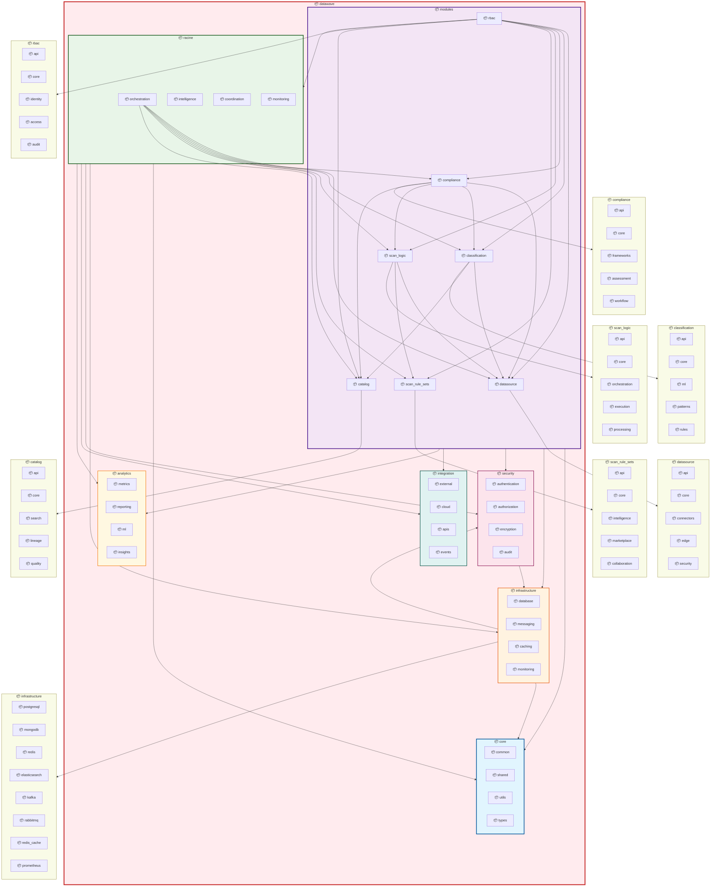

# DataWave Main System - Package Architecture

## Advanced Package Diagram for Complete DataGovernance System

## Main System Package Architecture Analysis

### Root Package Structure

#### 1. **Core Foundation** (`datawave.core`)
- **Common Package**: Shared utilities and common functionality
- **Shared Package**: Shared models and interfaces across modules
- **Utils Package**: Utility functions and helper classes
- **Types Package**: Type definitions and data structures

#### 2. **Module Layer** (`datawave.modules`)
- **DataSource Module**: Data source management and connectivity
- **Classification Module**: AI-powered data classification
- **Compliance Module**: Regulatory compliance and governance
- **Scan Logic Module**: Intelligent data scanning and discovery
- **Scan Rule Sets Module**: Advanced rule management and optimization
- **Catalog Module**: Data catalog and metadata management
- **RBAC Module**: Role-based access control and security

#### 3. **Racine Orchestration** (`datawave.racine`)
- **Orchestration Package**: Central orchestration and coordination
- **Intelligence Package**: AI-powered decision making and optimization
- **Coordination Package**: Cross-module coordination and workflow management
- **Monitoring Package**: System-wide monitoring and health management

### Infrastructure and Cross-Cutting Packages

#### 4. **Infrastructure Layer** (`datawave.infrastructure`)
- **Database Package**: Database connection and management
- **Messaging Package**: Message queue and event bus management
- **Caching Package**: Distributed caching and performance optimization
- **Monitoring Package**: Infrastructure monitoring and observability

#### 5. **Security Layer** (`datawave.security`)
- **Authentication Package**: Identity and authentication management
- **Authorization Package**: Access control and permission management
- **Encryption Package**: Data encryption and cryptographic operations
- **Audit Package**: Security audit and compliance tracking

#### 6. **Integration Layer** (`datawave.integration`)
- **External Package**: External system integration and connectors
- **Cloud Package**: Cloud provider integration and services
- **APIs Package**: API integration and management
- **Events Package**: Event-driven architecture and messaging

#### 7. **Analytics Layer** (`datawave.analytics`)
- **Metrics Package**: Metrics collection and aggregation
- **Reporting Package**: Report generation and distribution
- **ML Package**: Analytics machine learning and AI
- **Insights Package**: Business insights and intelligence

### Package Dependency Patterns

#### 1. **Hierarchical Dependencies**
- **Top-Level Modules** depend on **Core Foundation**
- **Racine Orchestration** depends on **All Modules**
- **RBAC Security** wraps **All Modules** (security wrapper pattern)
- **Infrastructure** supports **All Layers**

#### 2. **Cross-Cutting Dependencies**
- **Security** is used by **All Packages**
- **Analytics** observes **All Operational Packages**
- **Integration** facilitates **External Communication**
- **Infrastructure** provides **Foundation Services**

#### 3. **Module Interaction Dependencies**
- **Scan Logic** depends on **DataSource** and **Scan Rule Sets**
- **Classification** depends on **DataSource** and integrates with **Catalog**
- **Compliance** depends on **All Modules** for comprehensive governance
- **Catalog** integrates with **All Modules** for metadata enrichment

### Design Principles

#### 1. **Separation of Concerns**
- Each package has a single, well-defined responsibility
- Clear boundaries between business logic, infrastructure, and integration
- Security and monitoring are separated as cross-cutting concerns
- Configuration and utilities are isolated in dedicated packages

#### 2. **Dependency Management**
- No circular dependencies between packages
- Dependencies flow from higher-level to lower-level packages
- Cross-cutting concerns are injected rather than directly coupled
- External dependencies are isolated in integration packages

#### 3. **Scalability and Maintainability**
- Modular package structure supports independent development
- Clear package interfaces enable team specialization
- Package versioning supports backward compatibility
- Extensible architecture supports future module additions

#### 4. **Enterprise Architecture Patterns**
- **Layered Architecture**: Clear separation between API, business, and data layers
- **Microservices Architecture**: Each module can be deployed independently
- **Event-Driven Architecture**: Loose coupling through event-based communication
- **Domain-Driven Design**: Packages align with business domains and bounded contexts

This package architecture ensures that the DataWave system maintains a clean, modular, and scalable codebase while supporting enterprise-grade features like security, monitoring, analytics, and seamless integration with external systems.