# DataSource Discovery - Sequence Diagram

## Advanced Sequence Diagram for DataSource Discovery Workflow

```mermaid
sequenceDiagram
    participant User as 👤 Data Steward
    participant UI as 🖥️ Frontend UI
    participant Gateway as 🚪 API Gateway
    participant RBAC as 🔒 RBAC System
    participant Racine as 🎭 Racine Orchestrator
    participant DS_API as 🌐 DataSource API
    participant DS_Service as ⚙️ DataSource Service
    participant Discovery as 🔍 Discovery Engine
    participant Validation as ✅ Validation Engine
    participant Edge as 🌐 Edge Agent
    participant DB as 🗃️ Database
    participant Cache as ⚡ Redis Cache
    participant Scan as 🔍 Scan Logic
    participant Classification as 🏷️ Classification
    participant Catalog as 📚 Catalog
    participant Compliance as 📋 Compliance
    participant Notification as 📢 Notification Service
    
    %% ===== AUTHENTICATION & AUTHORIZATION =====
    Note over User, RBAC: 🔐 Authentication & Authorization Phase
    
    User->>+UI: 🔍 Initiate DataSource Discovery
    UI->>+Gateway: 🔐 Request with Auth Token
    Gateway->>+RBAC: 🔍 Validate Token & Permissions
    RBAC-->>-Gateway: ✅ Authentication Success
    Gateway->>+Racine: 🎯 Route Discovery Request
    
    %% ===== ORCHESTRATION PHASE =====
    Note over Racine, DS_Service: 🎭 Orchestration & Coordination Phase
    
    Racine->>+DS_API: 🔍 Initiate Discovery Workflow
    DS_API->>+DS_Service: 📋 Create Discovery Job
    DS_Service->>+DB: 💾 Store Discovery Job
    DB-->>-DS_Service: ✅ Job Created
    
    %% ===== EDGE AGENT COORDINATION =====
    Note over DS_Service, Edge: 🌐 Edge Computing Phase
    
    DS_Service->>+Edge: 🚀 Deploy Edge Agent
    Edge->>Edge: 🔍 Local Schema Discovery
    Edge->>+Discovery: 📊 Stream Discovery Data
    Discovery->>+Validation: ✅ Validate Schema Data
    Validation-->>-Discovery: ✅ Validation Results
    Discovery->>+Cache: ⚡ Cache Discovery Results
    Cache-->>-Discovery: ✅ Cached Successfully
    
    %% ===== PARALLEL PROCESSING =====
    Note over Discovery, Compliance: 🔄 Parallel Module Integration
    
    par Scan Integration
        Discovery->>+Scan: 🔍 Trigger Metadata Scan
        Scan->>Scan: 📊 Process Schema Metadata
        Scan-->>-Discovery: 📊 Scan Results
    and Classification Integration
        Discovery->>+Classification: 🏷️ Classify Data Elements
        Classification->>Classification: 🤖 ML Classification
        Classification-->>-Discovery: 🏷️ Classification Results
    and Catalog Integration
        Discovery->>+Catalog: 📚 Enrich Catalog
        Catalog->>Catalog: ✨ Metadata Enrichment
        Catalog-->>-Discovery: 📚 Enrichment Complete
    and Compliance Integration
        Discovery->>+Compliance: 📋 Compliance Check
        Compliance->>Compliance: ✅ Validate Compliance
        Compliance-->>-Discovery: 📋 Compliance Status
    end
    
    %% ===== RESULT AGGREGATION =====
    Note over Discovery, Racine: 📊 Result Aggregation Phase
    
    Discovery->>+DS_Service: 📊 Aggregate Results
    DS_Service->>+DB: 💾 Store Discovery Results
    DB-->>-DS_Service: ✅ Results Stored
    DS_Service->>+Cache: ⚡ Update Cache
    Cache-->>-DS_Service: ✅ Cache Updated
    
    %% ===== NOTIFICATION & COMPLETION =====
    Note over DS_Service, User: 📢 Notification & Completion Phase
    
    DS_Service->>+Racine: 📊 Discovery Complete
    Racine->>+Notification: 📢 Send Notifications
    Notification->>User: 📧 Discovery Complete Email
    Notification->>UI: 🔔 Real-time Notification
    
    Racine-->>-Gateway: ✅ Discovery Workflow Complete
    Gateway-->>-UI: 📊 Discovery Results
    UI-->>-User: 🎉 Discovery Complete Dashboard
    
    %% ===== ERROR HANDLING =====
    Note over Discovery, Racine: ❌ Error Handling & Recovery
    
    alt Discovery Failure
        Discovery->>+DS_Service: ❌ Discovery Failed
        DS_Service->>+Racine: 🚨 Error Notification
        Racine->>+Notification: 📢 Alert Stakeholders
        Notification->>User: 🚨 Error Alert
        Racine->>+Discovery: 🔄 Retry Discovery
        Discovery-->>-Racine: ✅ Retry Success
    end
    
    %% ===== MONITORING & ANALYTICS =====
    Note over DS_Service, Analytics: 📊 Monitoring & Analytics
    
    loop Continuous Monitoring
        DS_Service->>Analytics: 📈 Send Metrics
        Analytics->>Analytics: 📊 Analyze Performance
        Analytics->>Racine: 💡 Optimization Insights
        Racine->>DS_Service: ⚡ Apply Optimizations
    end
```

## Sequence Analysis

### Workflow Phases

#### 1. **Authentication & Authorization Phase**
- User initiates discovery through the frontend interface
- API Gateway validates authentication tokens and user permissions
- RBAC system ensures user has appropriate access rights
- Request is routed through Racine Orchestrator for coordination

#### 2. **Orchestration & Coordination Phase**
- Racine Orchestrator coordinates the discovery workflow
- DataSource API creates and manages the discovery job
- Job details are persisted in the database for tracking
- Discovery workflow is initiated with proper resource allocation

#### 3. **Edge Computing Phase**
- Edge agents are deployed for local schema discovery
- Local discovery reduces network overhead and improves performance
- Discovery data is streamed to central validation engine
- Results are cached for performance optimization

#### 4. **Parallel Module Integration**
- Multiple modules process discovery data simultaneously
- Scan Logic performs metadata scanning and analysis
- Classification engine classifies discovered data elements
- Catalog system enriches metadata with business context
- Compliance system validates regulatory requirements

#### 5. **Result Aggregation Phase**
- Discovery results are aggregated from all modules
- Comprehensive results are stored in the database
- Cache is updated with latest discovery information
- Performance metrics are collected for optimization

#### 6. **Notification & Completion Phase**
- Stakeholders are notified of discovery completion
- Real-time notifications are sent to the frontend
- Dashboard is updated with discovery results
- Workflow completion is logged and tracked

### Advanced Features

#### 1. **Error Handling & Recovery**
- Comprehensive error handling with automatic retry mechanisms
- Intelligent error recovery and workflow resumption
- Stakeholder notification for critical failures
- Performance impact analysis and optimization

#### 2. **Continuous Monitoring**
- Real-time performance monitoring and metrics collection
- Continuous analytics and optimization insights
- Proactive performance optimization recommendations
- Adaptive system tuning based on usage patterns

#### 3. **Parallel Processing**
- Concurrent processing across multiple modules
- Optimized resource utilization and performance
- Reduced overall processing time through parallelization
- Intelligent coordination to prevent resource conflicts

This sequence diagram demonstrates the sophisticated orchestration and coordination capabilities of the DataWave system, showcasing how multiple modules work together seamlessly while maintaining high performance, reliability, and comprehensive error handling.