# Main System Workflow - Sequence Diagram

## Advanced Sequence Diagram for Complete DataGovernance Workflow

```mermaid
sequenceDiagram
    participant User as 👤 Data Governance Admin
    participant UI as 🖥️ Frontend Dashboard
    participant Gateway as 🚪 API Gateway
    participant RBAC as 🔒 RBAC System
    participant Racine as 🎭 Racine Orchestrator
    participant DS as 🗄️ DataSource System
    participant SL as 🔍 Scan Logic System
    participant SR as 📋 Scan Rule Sets
    participant CL as 🏷️ Classification System
    participant CO as 📋 Compliance System
    participant CAT as 📚 Catalog System
    participant AI as 🤖 AI Engine
    participant Analytics as 📊 Analytics Engine
    participant Notification as 📢 Notification Service
    participant Monitoring as 👁️ Monitoring System
    
    %% ===== INITIALIZATION PHASE =====
    Note over User, Monitoring: 🚀 System Initialization & Authentication
    
    User->>+UI: 🔐 Login to DataGovernance System
    UI->>+Gateway: 🔑 Authentication Request
    Gateway->>+RBAC: 🔍 Validate Credentials
    RBAC->>RBAC: 🔐 Multi-Factor Authentication
    RBAC-->>-Gateway: ✅ Authentication Success
    Gateway->>+Racine: 🎭 Initialize User Session
    Racine->>+Monitoring: 📊 Log User Session
    Monitoring-->>-Racine: ✅ Session Logged
    Racine-->>-Gateway: 🎯 Session Initialized
    Gateway-->>-UI: 🏠 Dashboard Access Granted
    UI-->>-User: 🎉 Welcome to DataGovernance
    
    %% ===== COMPREHENSIVE WORKFLOW INITIATION =====
    Note over User, Analytics: 🎯 Comprehensive Data Governance Workflow
    
    User->>+UI: 🚀 Start Complete Governance Workflow
    UI->>+Gateway: 📋 Workflow Request
    Gateway->>+RBAC: 🔍 Check Workflow Permissions
    RBAC-->>-Gateway: ✅ Permissions Validated
    Gateway->>+Racine: 🎭 Orchestrate Complete Workflow
    
    %% ===== RACINE ORCHESTRATION =====
    Note over Racine, Analytics: 🎭 Central Orchestration Phase
    
    Racine->>+AI: 🧠 Generate Optimal Workflow Plan
    AI->>AI: 🤖 Analyze System State & Resources
    AI-->>-Racine: 📋 Optimized Workflow Plan
    
    Racine->>+Analytics: 📊 Initialize Analytics Tracking
    Analytics-->>-Racine: ✅ Tracking Initialized
    
    %% ===== PHASE 1: DATA SOURCE DISCOVERY =====
    Note over Racine, CAT: 🔍 Phase 1: Data Source Discovery & Cataloging
    
    Racine->>+DS: 🗄️ Initiate Data Source Discovery
    DS->>DS: 🔍 Auto-discover Data Sources
    DS->>+CAT: 📚 Register Discovered Assets
    CAT->>CAT: ✨ Enrich Asset Metadata
    CAT-->>-DS: 📚 Assets Cataloged
    DS->>+Monitoring: 📊 Report Discovery Metrics
    Monitoring-->>-DS: ✅ Metrics Recorded
    DS-->>-Racine: ✅ Discovery Complete
    
    %% ===== PHASE 2: SCAN ORCHESTRATION =====
    Note over Racine, CL: 🔍 Phase 2: Intelligent Scanning & Classification
    
    Racine->>+SL: 🔍 Orchestrate Intelligent Scans
    SL->>+SR: 📋 Apply Enhanced Rule Sets
    SR->>SR: 🧠 Execute Intelligent Rules
    SR-->>-SL: 📊 Rule Execution Results
    
    SL->>+CL: 🏷️ Classify Discovered Data
    CL->>CL: 🤖 AI-Powered Classification
    CL->>+CAT: 📚 Update Catalog with Classifications
    CAT-->>-CL: ✅ Catalog Updated
    CL-->>-SL: 🏷️ Classification Complete
    
    SL->>+Analytics: 📊 Report Scan Analytics
    Analytics-->>-SL: ✅ Analytics Recorded
    SL-->>-Racine: ✅ Scanning Complete
    
    %% ===== PHASE 3: COMPLIANCE VALIDATION =====
    Note over Racine, Notification: 📋 Phase 3: Compliance Validation & Risk Assessment
    
    Racine->>+CO: 📋 Validate Compliance Requirements
    
    par GDPR Compliance
        CO->>CO: 🇪🇺 GDPR Validation
    and HIPAA Compliance
        CO->>CO: 🏥 HIPAA Validation
    and SOX Compliance
        CO->>CO: 📈 SOX Validation
    and Custom Compliance
        CO->>CO: ⚙️ Custom Framework Validation
    end
    
    CO->>+CAT: 📚 Update Compliance Metadata
    CAT-->>-CO: ✅ Metadata Updated
    
    CO->>+Notification: 📢 Generate Compliance Alerts
    Notification->>User: 🚨 Compliance Status Alert
    Notification-->>-CO: ✅ Notifications Sent
    
    CO->>+Analytics: 📊 Report Compliance Metrics
    Analytics-->>-CO: ✅ Metrics Recorded
    CO-->>-Racine: ✅ Compliance Validation Complete
    
    %% ===== PHASE 4: QUALITY ASSESSMENT =====
    Note over Racine, Monitoring: ⭐ Phase 4: Data Quality Assessment & Optimization
    
    Racine->>+CAT: ⭐ Assess Data Quality
    CAT->>CAT: 📊 Quality Analysis & Scoring
    CAT->>+CL: 🏷️ Validate Classification Quality
    CL-->>-CAT: ✅ Quality Validated
    
    CAT->>+CO: 📋 Check Quality Compliance
    CO-->>-CAT: ✅ Compliance Verified
    
    CAT->>+Analytics: 📊 Report Quality Metrics
    Analytics->>Analytics: 📈 Generate Quality Insights
    Analytics-->>-CAT: 💡 Quality Recommendations
    
    CAT->>+Monitoring: 👁️ Update Quality Dashboard
    Monitoring-->>-CAT: ✅ Dashboard Updated
    CAT-->>-Racine: ⭐ Quality Assessment Complete
    
    %% ===== PHASE 5: INTELLIGENT OPTIMIZATION =====
    Note over Racine, Analytics: ⚡ Phase 5: AI-Powered Optimization
    
    Racine->>+AI: 🧠 Analyze Complete Workflow
    AI->>+Analytics: 📊 Request Performance Data
    Analytics-->>-AI: 📈 Performance Analytics
    
    AI->>AI: 🤖 Generate Optimization Recommendations
    
    par DataSource Optimization
        AI->>DS: ⚡ Optimize Connection Performance
        DS-->>AI: ✅ Optimization Applied
    and Scan Optimization
        AI->>SL: ⚡ Optimize Scan Performance
        SL-->>AI: ✅ Optimization Applied
    and Rule Optimization
        AI->>SR: ⚡ Optimize Rule Performance
        SR-->>AI: ✅ Optimization Applied
    and Classification Optimization
        AI->>CL: ⚡ Optimize ML Models
        CL-->>AI: ✅ Optimization Applied
    end
    
    AI-->>-Racine: ⚡ System Optimization Complete
    
    %% ===== PHASE 6: COMPREHENSIVE REPORTING =====
    Note over Racine, User: 📊 Phase 6: Comprehensive Reporting & Dashboard Update
    
    Racine->>+Analytics: 📊 Generate Comprehensive Report
    Analytics->>Analytics: 📈 Aggregate All Metrics
    Analytics->>+CAT: 📚 Include Catalog Insights
    CAT-->>-Analytics: 📚 Catalog Data
    Analytics->>+CO: 📋 Include Compliance Status
    CO-->>-Analytics: 📋 Compliance Data
    Analytics->>+Monitoring: 👁️ Include Performance Data
    Monitoring-->>-Analytics: 📊 Performance Data
    Analytics-->>-Racine: 📊 Comprehensive Report Ready
    
    %% ===== FINAL NOTIFICATION =====
    Note over Racine, User: 🎉 Workflow Completion & User Notification
    
    Racine->>+Notification: 📢 Workflow Complete Notification
    Notification->>User: 🎉 Workflow Success Email
    Notification->>UI: 🔔 Real-time Success Notification
    Notification-->>-Racine: ✅ Notifications Sent
    
    Racine->>+UI: 📊 Update Dashboard
    UI->>UI: 🔄 Refresh All Components
    UI-->>-Racine: ✅ Dashboard Updated
    
    Racine-->>-Gateway: 🎯 Complete Workflow Success
    Gateway-->>-UI: ✅ Workflow Response
    UI-->>-User: 🎉 Complete Governance Dashboard
    
    %% ===== CONTINUOUS MONITORING =====
    Note over Monitoring, Analytics: 🔄 Continuous Monitoring & Learning
    
    loop Continuous System Optimization
        Monitoring->>Analytics: 📊 Real-time Metrics
        Analytics->>AI: 🧠 Performance Analysis
        AI->>Racine: 💡 Optimization Recommendations
        Racine->>Racine: ⚡ Apply System Optimizations
    end
    
    %% ===== ERROR SCENARIOS =====
    Note over RBAC, Notification: ❌ Error Handling Scenarios
    
    alt Authentication Failure
        RBAC-->>Gateway: ❌ Authentication Failed
        Gateway-->>UI: 🚫 Access Denied
        UI-->>User: ❌ Login Failed
    else Authorization Failure
        RBAC-->>Gateway: 🚫 Insufficient Permissions
        Gateway-->>UI: 🚫 Permission Denied
        UI-->>User: ⚠️ Access Restricted
    else System Failure
        Racine->>Notification: 🚨 System Alert
        Notification->>User: 🚨 System Issue Alert
        Racine->>Racine: 🔄 Initiate Recovery
    end
```

## Sequence Analysis

### Workflow Orchestration

#### 1. **Multi-Phase Workflow**
- **Authentication**: Secure user authentication with MFA
- **Discovery**: Automated data source discovery with edge computing
- **Scanning**: Intelligent scanning with AI-powered rule execution
- **Classification**: ML-based data classification and sensitivity labeling
- **Compliance**: Multi-framework compliance validation
- **Quality Assessment**: Comprehensive data quality evaluation
- **Optimization**: AI-powered system optimization

#### 2. **Parallel Processing**
- Concurrent execution across multiple modules
- Optimized resource utilization and performance
- Reduced overall processing time
- Intelligent coordination to prevent conflicts

#### 3. **Comprehensive Integration**
- Seamless integration between all 7 modules
- Real-time data flow and synchronization
- Event-driven architecture for loose coupling
- Centralized orchestration through Racine

### Advanced Features

#### 1. **Edge Computing Integration**
- Edge agents for local processing
- Reduced network overhead and latency
- Improved performance and scalability
- Local caching and optimization

#### 2. **AI-Powered Optimization**
- Continuous performance analysis
- Intelligent optimization recommendations
- Adaptive system tuning
- Predictive performance management

#### 3. **Comprehensive Monitoring**
- Real-time monitoring across all modules
- Performance metrics and analytics
- Proactive issue detection and resolution
- Continuous system improvement

#### 4. **Enterprise Security**
- Multi-factor authentication
- Role-based access control
- Comprehensive audit logging
- Security incident management

This sequence diagram demonstrates the sophisticated workflow orchestration capabilities of the DataWave system, showing how all modules work together to provide comprehensive data governance while maintaining high performance, security, and reliability.