# DataWave Main System - State Architecture

## Advanced State Diagram for Complete DataGovernance System

```mermaid
stateDiagram-v2
    %% ===== SYSTEM INITIALIZATION =====
    [*] --> SystemStartup : 🚀 System Boot
    
    state SystemStartup {
        [*] --> InfrastructureInit : 🏗️ Initialize Infrastructure
        InfrastructureInit --> DatabaseInit : 🗃️ Initialize Databases
        DatabaseInit --> CacheInit : ⚡ Initialize Caches
        CacheInit --> MessagingInit : 📡 Initialize Messaging
        MessagingInit --> SecurityInit : 🔒 Initialize Security
        SecurityInit --> ModuleInit : 🧩 Initialize Modules
        ModuleInit --> [*] : ✅ Startup Complete
    }
    
    SystemStartup --> SystemReady : ✅ All Components Ready
    
    %% ===== SYSTEM READY STATE =====
    state SystemReady {
        [*] --> Idle : 🏠 System Idle
        
        %% ===== OPERATIONAL STATES =====
        Idle --> DataDiscovery : 🔍 Start Discovery
        Idle --> DataScanning : 🔍 Start Scanning
        Idle --> DataClassification : 🏷️ Start Classification
        Idle --> ComplianceAssessment : 📋 Start Compliance Check
        Idle --> QualityAssessment : ⭐ Start Quality Assessment
        Idle --> SystemMaintenance : 🔧 Start Maintenance
        
        %% ===== DATA DISCOVERY STATE =====
        state DataDiscovery {
            [*] --> DiscoveryPlanning : 📋 Plan Discovery
            DiscoveryPlanning --> EdgeDeployment : 🌐 Deploy Edge Agents
            EdgeDeployment --> SchemaDiscovery : 🔍 Discover Schemas
            SchemaDiscovery --> MetadataExtraction : 📋 Extract Metadata
            MetadataExtraction --> ValidationProcessing : ✅ Validate Data
            ValidationProcessing --> CatalogEnrichment : 📚 Enrich Catalog
            CatalogEnrichment --> [*] : ✅ Discovery Complete
        }
        
        %% ===== DATA SCANNING STATE =====
        state DataScanning {
            [*] --> ScanPlanning : 📋 Plan Scan Strategy
            ScanPlanning --> ResourceAllocation : 💻 Allocate Resources
            ResourceAllocation --> RuleExecution : 📋 Execute Rules
            RuleExecution --> ParallelProcessing : ⚡ Parallel Processing
            ParallelProcessing --> ResultAggregation : 📊 Aggregate Results
            ResultAggregation --> QualityValidation : ✅ Validate Quality
            QualityValidation --> [*] : ✅ Scan Complete
        }
        
        %% ===== DATA CLASSIFICATION STATE =====
        state DataClassification {
            [*] --> ClassificationPrep : 📋 Prepare Classification
            ClassificationPrep --> MLInference : 🤖 ML Inference
            MLInference --> RuleBasedClassification : 📋 Rule-Based Classification
            RuleBasedClassification --> SemanticAnalysis : 📝 Semantic Analysis
            SemanticAnalysis --> ResultValidation : ✅ Validate Results
            ResultValidation --> SensitivityLabeling : 🔒 Apply Sensitivity Labels
            SensitivityLabeling --> [*] : ✅ Classification Complete
        }
        
        %% ===== COMPLIANCE ASSESSMENT STATE =====
        state ComplianceAssessment {
            [*] --> CompliancePrep : 📋 Prepare Assessment
            CompliancePrep --> FrameworkValidation : 📚 Validate Frameworks
            FrameworkValidation --> RiskAssessment : ⚠️ Assess Risks
            RiskAssessment --> GapAnalysis : 🔍 Analyze Gaps
            GapAnalysis --> RemediationPlanning : 🔧 Plan Remediation
            RemediationPlanning --> ComplianceReporting : 📊 Generate Reports
            ComplianceReporting --> [*] : ✅ Assessment Complete
        }
        
        %% ===== QUALITY ASSESSMENT STATE =====
        state QualityAssessment {
            [*] --> QualityPrep : 📋 Prepare Quality Check
            QualityPrep --> DataProfiling : 📊 Profile Data
            DataProfiling --> QualityScoring : ⭐ Score Quality
            QualityScoring --> AnomalyDetection : 🚨 Detect Anomalies
            AnomalyDetection --> QualityRecommendations : 💡 Generate Recommendations
            QualityRecommendations --> [*] : ✅ Quality Assessment Complete
        }
        
        %% ===== SYSTEM MAINTENANCE STATE =====
        state SystemMaintenance {
            [*] --> MaintenancePrep : 📋 Prepare Maintenance
            MaintenancePrep --> BackupCreation : 💾 Create Backups
            BackupCreation --> SystemUpdate : 🔄 Update System
            SystemUpdate --> PerformanceOptimization : ⚡ Optimize Performance
            PerformanceOptimization --> SecurityPatching : 🔒 Apply Security Patches
            SecurityPatching --> ValidationTesting : ✅ Validate Updates
            ValidationTesting --> [*] : ✅ Maintenance Complete
        }
        
        %% ===== STATE TRANSITIONS =====
        DataDiscovery --> Idle : ✅ Discovery Complete
        DataScanning --> Idle : ✅ Scanning Complete
        DataClassification --> Idle : ✅ Classification Complete
        ComplianceAssessment --> Idle : ✅ Assessment Complete
        QualityAssessment --> Idle : ✅ Quality Check Complete
        SystemMaintenance --> Idle : ✅ Maintenance Complete
        
        %% ===== CROSS-STATE TRANSITIONS =====
        DataDiscovery --> DataScanning : 🔄 Trigger Scanning
        DataScanning --> DataClassification : 🔄 Trigger Classification
        DataClassification --> ComplianceAssessment : 🔄 Trigger Compliance
        ComplianceAssessment --> QualityAssessment : 🔄 Trigger Quality Check
        
        %% ===== ERROR STATES =====
        DataDiscovery --> ErrorRecovery : ❌ Discovery Failed
        DataScanning --> ErrorRecovery : ❌ Scanning Failed
        DataClassification --> ErrorRecovery : ❌ Classification Failed
        ComplianceAssessment --> ErrorRecovery : ❌ Assessment Failed
        QualityAssessment --> ErrorRecovery : ❌ Quality Check Failed
        SystemMaintenance --> ErrorRecovery : ❌ Maintenance Failed
        
        state ErrorRecovery {
            [*] --> ErrorAnalysis : 🔍 Analyze Error
            ErrorAnalysis --> ErrorClassification : 🏷️ Classify Error
            ErrorClassification --> RecoveryPlanning : 📋 Plan Recovery
            RecoveryPlanning --> AutoRecovery : 🤖 Attempt Auto Recovery
            AutoRecovery --> ManualIntervention : 👤 Manual Intervention
            ManualIntervention --> ValidationCheck : ✅ Validate Recovery
            ValidationCheck --> [*] : ✅ Recovery Complete
        }
        
        ErrorRecovery --> Idle : ✅ Recovery Successful
        ErrorRecovery --> SystemFailure : ❌ Recovery Failed
    }
    
    %% ===== SYSTEM FAILURE HANDLING =====
    SystemReady --> SystemFailure : ❌ Critical Failure
    
    state SystemFailure {
        [*] --> FailureAssessment : 🔍 Assess Failure
        FailureAssessment --> DisasterRecovery : 🚨 Initiate DR
        DisasterRecovery --> BackupRestoration : 💾 Restore from Backup
        BackupRestoration --> SystemValidation : ✅ Validate System
        SystemValidation --> [*] : ✅ Recovery Complete
    }
    
    SystemFailure --> SystemStartup : 🔄 Restart System
    
    %% ===== SHUTDOWN PROCESS =====
    SystemReady --> SystemShutdown : 🛑 Graceful Shutdown
    
    state SystemShutdown {
        [*] --> GracefulStop : 🛑 Stop Services
        GracefulStop --> DataPersistence : 💾 Persist Data
        DataPersistence --> ResourceCleanup : 🧹 Cleanup Resources
        ResourceCleanup --> FinalValidation : ✅ Final Validation
        FinalValidation --> [*] : ✅ Shutdown Complete
    }
    
    SystemShutdown --> [*] : 🏁 System Stopped
    
    %% ===== CONCURRENT STATES =====
    SystemReady --> ConcurrentOperations : 🔄 Multiple Operations
    
    state ConcurrentOperations {
        state fork_state <<fork>>
        state join_state <<join>>
        
        [*] --> fork_state
        fork_state --> RealTimeMonitoring : 👁️ Real-time Monitoring
        fork_state --> BackgroundProcessing : 🔄 Background Processing
        fork_state --> UserInteractions : 👤 User Interactions
        fork_state --> ScheduledTasks : ⏰ Scheduled Tasks
        
        RealTimeMonitoring --> join_state
        BackgroundProcessing --> join_state
        UserInteractions --> join_state
        ScheduledTasks --> join_state
        
        join_state --> [*]
    }
    
    ConcurrentOperations --> SystemReady : 🔄 Return to Ready
    
    %% ===== STATE ANNOTATIONS =====
    note right of SystemStartup : 🚀 System initialization with \nfull infrastructure setup
    note right of DataDiscovery : 🔍 Automated data source \ndiscovery with edge computing
    note right of DataScanning : 🔍 Intelligent scanning with \nAI-powered rule execution
    note right of DataClassification : 🏷️ ML-based classification \nwith semantic analysis
    note right of ComplianceAssessment : 📋 Multi-framework compliance \nvalidation and reporting
    note right of ErrorRecovery : 🔄 Intelligent error recovery \nwith automated remediation
    note right of ConcurrentOperations : ⚡ Parallel processing \nwith real-time monitoring
```

## State Architecture Analysis

### System Lifecycle States

#### 1. **System Initialization**
- **Infrastructure Initialization**: Core infrastructure setup and configuration
- **Database Initialization**: Database cluster setup and schema creation
- **Cache Initialization**: Distributed cache setup and configuration
- **Messaging Initialization**: Message queue and event bus setup
- **Security Initialization**: Security services and encryption setup
- **Module Initialization**: All 7 modules initialization and health checks

#### 2. **System Ready State**
- **Idle State**: System ready for operation requests
- **Multi-Operation Support**: Concurrent operation handling
- **Resource Management**: Dynamic resource allocation and optimization
- **Health Monitoring**: Continuous system health monitoring

### Operational States

#### 1. **Data Discovery State**
- **Discovery Planning**: Intelligent discovery strategy planning
- **Edge Deployment**: Edge agent deployment and coordination
- **Schema Discovery**: Automated schema and metadata discovery
- **Metadata Extraction**: Comprehensive metadata extraction and processing
- **Validation Processing**: Data validation and quality checks
- **Catalog Enrichment**: Automatic catalog enrichment and updates

#### 2. **Data Scanning State**
- **Scan Planning**: Intelligent scan strategy and resource planning
- **Resource Allocation**: Dynamic resource allocation for optimal performance
- **Rule Execution**: Advanced rule execution with AI optimization
- **Parallel Processing**: Concurrent processing across multiple data sources
- **Result Aggregation**: Intelligent result aggregation and analysis
- **Quality Validation**: Comprehensive quality validation and scoring

#### 3. **Data Classification State**
- **Classification Preparation**: Data preparation for classification processing
- **ML Inference**: Machine learning model inference and prediction
- **Rule-Based Classification**: Traditional rule-based classification processing
- **Semantic Analysis**: Advanced semantic analysis and context understanding
- **Result Validation**: Classification result validation and verification
- **Sensitivity Labeling**: Automatic sensitivity label application

#### 4. **Compliance Assessment State**
- **Compliance Preparation**: Assessment preparation and framework selection
- **Framework Validation**: Multi-framework compliance validation
- **Risk Assessment**: Comprehensive risk assessment and scoring
- **Gap Analysis**: Compliance gap identification and analysis
- **Remediation Planning**: Automated remediation planning and workflow creation
- **Compliance Reporting**: Automated regulatory reporting and documentation

#### 5. **Quality Assessment State**
- **Quality Preparation**: Quality assessment preparation and configuration
- **Data Profiling**: Comprehensive data profiling and analysis
- **Quality Scoring**: Multi-dimensional quality scoring and assessment
- **Anomaly Detection**: Intelligent anomaly detection and alerting
- **Quality Recommendations**: AI-powered quality improvement recommendations

### Advanced State Features

#### 1. **Error Recovery State**
- **Error Analysis**: Intelligent error analysis and classification
- **Error Classification**: Error categorization and severity assessment
- **Recovery Planning**: Automated recovery strategy planning
- **Auto Recovery**: Intelligent automated recovery attempts
- **Manual Intervention**: Human intervention for complex issues
- **Validation Check**: Recovery validation and system integrity checks

#### 2. **System Failure State**
- **Failure Assessment**: Critical failure assessment and impact analysis
- **Disaster Recovery**: Automated disaster recovery procedures
- **Backup Restoration**: Data restoration from secure backups
- **System Validation**: Complete system validation and integrity checks

#### 3. **Concurrent Operations State**
- **Real-time Monitoring**: Continuous system monitoring and health checks
- **Background Processing**: Automated background task processing
- **User Interactions**: Real-time user interaction handling
- **Scheduled Tasks**: Automated scheduled task execution

### State Transition Logic

#### 1. **Normal Operation Flow**
- Sequential progression through operational states
- Automatic triggering of dependent operations
- Parallel execution where appropriate
- Graceful completion and return to idle state

#### 2. **Error Handling Flow**
- Automatic error detection and classification
- Intelligent recovery strategy selection
- Automated recovery attempts with fallback to manual intervention
- Complete validation before returning to normal operation

#### 3. **Concurrent Processing**
- Fork and join patterns for parallel processing
- Independent state management for concurrent operations
- Resource coordination and conflict prevention
- Synchronized completion and state consolidation

### State Management Characteristics

#### 1. **Resilience and Recovery**
- **Automatic Error Detection**: Proactive error detection and classification
- **Intelligent Recovery**: AI-powered recovery strategy selection
- **Graceful Degradation**: Gradual service degradation under stress
- **Fast Recovery**: Rapid recovery and service restoration

#### 2. **Performance Optimization**
- **State Caching**: Intelligent state caching for performance
- **Lazy Loading**: On-demand state initialization and loading
- **Resource Optimization**: Dynamic resource allocation based on state
- **Predictive State Management**: Predictive state transition planning

#### 3. **Monitoring and Observability**
- **State Tracking**: Comprehensive state tracking and logging
- **Transition Monitoring**: State transition monitoring and analysis
- **Performance Metrics**: State-based performance metrics collection
- **Anomaly Detection**: State-based anomaly detection and alerting

#### 4. **Security and Compliance**
- **Secure State Transitions**: Secure state transition validation
- **Audit Trail**: Complete audit trail for all state changes
- **Compliance Validation**: State-based compliance validation
- **Security Monitoring**: Security-focused state monitoring

### Business Logic Integration

#### 1. **Workflow Integration**
- States align with business workflow phases
- Automatic progression based on business rules
- Conditional state transitions based on business logic
- Integration with external workflow systems

#### 2. **User Experience Integration**
- State changes reflected in user interface
- Real-time state updates and notifications
- User-initiated state transitions
- Context-aware user interface adaptation

#### 3. **System Integration**
- State synchronization across all modules
- Cross-module state coordination
- External system state integration
- Event-driven state management

This state architecture ensures that the DataWave system maintains consistent, reliable, and observable state management while supporting complex workflows, error recovery, concurrent operations, and seamless integration with all data governance modules.