# Scan Logic Module - Advanced Use Case Architecture (PlantUML)

## Advanced Use Case Diagram for Intelligent Scan Orchestration & Processing System

```plantuml
@startuml Scan_Logic_Module_UseCase_Architecture
!define RECTANGLE class
!theme aws-orange
skinparam backgroundColor #FAFAFA
skinparam handwritten false
skinparam shadowing false
skinparam roundCorner 10
skinparam packageStyle rectangle

' System boundary
rectangle "🔍 SCAN LOGIC ORCHESTRATION MODULE" as System {

  ' === PRIMARY ACTORS ===
  package "👥 PRIMARY ACTORS" as PrimaryActors {
    
    package "👨‍💻 Technical Professionals" as TechnicalProfessionals {
      actor "👨‍💻 Data Engineer" as DataEngineer
      actor "👤 System Architect" as SystemArchitect  
      actor "👨‍💻 DevOps Engineer" as DevOpsEngineer
    }
    
    package "⚙️ Operations Team" as OperationsTeam {
      actor "⚙️ System Administrator" as SystemAdmin
      actor "👔 Operations Manager" as OperationsManager
    }
    
    package "👤 Data Professionals" as DataProfessionals {
      actor "👤 Data Steward" as DataSteward
      actor "👩‍📊 Data Analyst" as DataAnalyst
    }
  }

  ' === SECONDARY ACTORS ===
  package "🤖 SECONDARY ACTORS" as SecondaryActors {
    actor "☸️ Kubernetes" as Kubernetes
    actor "☁️ Cloud Services" as CloudServices
    actor "📬 Message Systems" as MessageSystems
    actor "🗄️ Data Sources" as DataSources
    actor "⚙️ Processing Engines" as ProcessingEngines
    actor "👁️ Observability" as Observability
    actor "🚨 Alerting Systems" as AlertingSystems
  }

  ' === CORE USE CASES ===
  package "🎯 CORE SCAN LOGIC USE CASES" as CoreUseCases {
    
    ' SCAN ORCHESTRATION
    package "🎯 Advanced Scan Orchestration" as Orchestration {
      usecase "📋 Scan Planning\n├─ Scan Strategy Definition\n├─ Resource Allocation\n├─ Priority Management\n├─ Dependency Analysis\n├─ Risk Assessment\n├─ Timeline Planning\n├─ Constraint Management\n└─ Success Criteria" as UC_ScanPlanning
      
      usecase "🎭 Workflow Orchestration\n├─ DAG Management\n├─ Task Scheduling\n├─ Dependency Resolution\n├─ Parallel Execution\n├─ Error Handling\n├─ Retry Logic\n├─ Rollback Procedures\n└─ Workflow Monitoring" as UC_WorkflowOrchestration
      
      usecase "💻 Resource Orchestration\n├─ Compute Resource Management\n├─ Storage Resource Allocation\n├─ Network Resource Optimization\n├─ Memory Management\n├─ CPU Optimization\n├─ GPU Utilization\n├─ Cost Optimization\n└─ Performance Tuning" as UC_ResourceOrchestration
      
      usecase "🌐 Distributed Coordination\n├─ Multi-Node Coordination\n├─ Load Distribution\n├─ Task Partitioning\n├─ Data Locality\n├─ Fault Tolerance\n├─ Consensus Management\n├─ State Synchronization\n└─ Cluster Management" as UC_DistributedCoordination
    }
    
    ' EXECUTION ENGINE
    package "⚡ Execution Engine" as Execution {
      usecase "🚀 Scan Execution\n├─ Parallel Processing\n├─ Stream Processing\n├─ Batch Processing\n├─ Real-time Processing\n├─ Incremental Processing\n├─ Delta Processing\n├─ Hybrid Processing\n└─ Adaptive Processing" as UC_ScanExecution
      
      usecase "📋 Task Management\n├─ Task Creation\n├─ Task Queuing\n├─ Task Prioritization\n├─ Task Execution\n├─ Task Monitoring\n├─ Task Completion\n├─ Task Recovery\n└─ Task Analytics" as UC_TaskManagement
      
      usecase "📊 Data Processing\n├─ Data Ingestion\n├─ Data Transformation\n├─ Data Validation\n├─ Data Enrichment\n├─ Data Cleansing\n├─ Data Aggregation\n├─ Data Partitioning\n└─ Data Output" as UC_DataProcessing
      
      usecase "✅ Quality Control\n├─ Data Quality Validation\n├─ Process Quality Monitoring\n├─ Result Validation\n├─ Anomaly Detection\n├─ Error Detection\n├─ Quality Scoring\n├─ Quality Reporting\n└─ Quality Improvement" as UC_QualityControl
    }
    
    ' OPTIMIZATION
    package "⚡ Performance Optimization" as Optimization {
      usecase "⚡ Performance Optimization\n├─ Query Optimization\n├─ Execution Optimization\n├─ Resource Optimization\n├─ Memory Optimization\n├─ I/O Optimization\n├─ Network Optimization\n├─ Cache Optimization\n└─ Algorithm Optimization" as UC_PerformanceOptimization
      
      usecase "📈 Auto Scaling\n├─ Horizontal Scaling\n├─ Vertical Scaling\n├─ Predictive Scaling\n├─ Reactive Scaling\n├─ Cost-Based Scaling\n├─ Performance-Based Scaling\n├─ Schedule-Based Scaling\n└─ Intelligent Scaling" as UC_AutoScaling
      
      usecase "⚖️ Load Balancing\n├─ Dynamic Load Distribution\n├─ Workload Balancing\n├─ Resource Balancing\n├─ Geographic Distribution\n├─ Capacity Management\n├─ Performance Balancing\n├─ Fault-Tolerant Balancing\n└─ Intelligent Routing" as UC_LoadBalancing
      
      usecase "💾 Caching Strategy\n├─ Multi-Level Caching\n├─ Distributed Caching\n├─ Intelligent Caching\n├─ Cache Optimization\n├─ Cache Invalidation\n├─ Cache Warming\n├─ Cache Analytics\n└─ Cache Management" as UC_CachingStrategy
    }
    
    ' MONITORING & ANALYTICS
    package "📊 Monitoring & Analytics" as Monitoring {
      usecase "⚡ Real-Time Monitoring\n├─ Live Performance Metrics\n├─ Resource Utilization\n├─ System Health\n├─ Process Status\n├─ Error Tracking\n├─ Throughput Monitoring\n├─ Latency Monitoring\n└─ Availability Monitoring" as UC_RealTimeMonitoring
      
      usecase "📈 Performance Analytics\n├─ Historical Analysis\n├─ Trend Analysis\n├─ Bottleneck Analysis\n├─ Capacity Analysis\n├─ Efficiency Analysis\n├─ Cost Analysis\n├─ ROI Analysis\n└─ Predictive Analysis" as UC_PerformanceAnalytics
      
      usecase "🧠 Operational Intelligence\n├─ Pattern Recognition\n├─ Anomaly Detection\n├─ Root Cause Analysis\n├─ Predictive Insights\n├─ Optimization Recommendations\n├─ Automated Insights\n├─ Intelligent Alerting\n└─ Decision Support" as UC_OperationalIntelligence
      
      usecase "📊 Dashboard & Reporting\n├─ Real-Time Dashboards\n├─ Executive Reports\n├─ Operational Reports\n├─ Performance Reports\n├─ Custom Reports\n├─ Automated Reports\n├─ Interactive Visualizations\n└─ Mobile Dashboards" as UC_DashboardReporting
    }
  }

  ' === ADVANCED USE CASES ===
  package "🚀 ADVANCED SCAN LOGIC CAPABILITIES" as AdvancedUseCases {
    
    ' AI-POWERED OPTIMIZATION
    package "🤖 AI-Powered Optimization" as AI {
      usecase "🧠 Intelligent Scheduling\n├─ ML-Based Scheduling\n├─ Predictive Scheduling\n├─ Adaptive Scheduling\n├─ Context-Aware Scheduling\n├─ Resource-Aware Scheduling\n├─ Performance-Optimized Scheduling\n├─ Cost-Optimized Scheduling\n└─ Self-Learning Scheduling" as UC_IntelligentScheduling
      
      usecase "🔮 Predictive Scaling\n├─ Workload Prediction\n├─ Resource Demand Forecasting\n├─ Performance Prediction\n├─ Capacity Planning\n├─ Cost Prediction\n├─ Failure Prediction\n├─ Maintenance Prediction\n└─ Optimization Prediction" as UC_PredictiveScaling
      
      usecase "🎯 Adaptive Optimization\n├─ Self-Tuning Systems\n├─ Dynamic Configuration\n├─ Continuous Optimization\n├─ Learning-Based Optimization\n├─ Context-Aware Optimization\n├─ Multi-Objective Optimization\n├─ Real-Time Adaptation\n└─ Evolutionary Optimization" as UC_AdaptiveOptimization
      
      usecase "🚨 Anomaly Detection\n├─ Performance Anomalies\n├─ Resource Anomalies\n├─ Data Anomalies\n├─ Process Anomalies\n├─ Security Anomalies\n├─ Quality Anomalies\n├─ Pattern Anomalies\n└─ Behavioral Anomalies" as UC_AnomalyDetection
    }
    
    ' FAULT TOLERANCE
    package "🛡️ Fault Tolerance & Recovery" as FaultTolerance {
      usecase "🔍 Fault Detection\n├─ System Fault Detection\n├─ Process Fault Detection\n├─ Data Fault Detection\n├─ Network Fault Detection\n├─ Hardware Fault Detection\n├─ Software Fault Detection\n├─ Configuration Fault Detection\n└─ Performance Fault Detection" as UC_FaultDetection
      
      usecase "🔄 Automatic Recovery\n├─ Self-Healing Systems\n├─ Automatic Restart\n├─ Failover Management\n├─ State Recovery\n├─ Data Recovery\n├─ Process Recovery\n├─ Service Recovery\n└─ System Recovery" as UC_AutomaticRecovery
      
      usecase "⚡ Circuit Breaker\n├─ Service Protection\n├─ Cascade Failure Prevention\n├─ Graceful Degradation\n├─ Recovery Detection\n├─ Health Monitoring\n├─ Threshold Management\n├─ Fallback Mechanisms\n└─ Resilience Patterns" as UC_CircuitBreaker
      
      usecase "🚨 Disaster Recovery\n├─ Backup Management\n├─ Recovery Planning\n├─ Business Continuity\n├─ Data Protection\n├─ System Restoration\n├─ Recovery Testing\n├─ Documentation\n└─ Recovery Automation" as UC_DisasterRecovery
    }
    
    ' INTEGRATION
    package "🔗 Integration & Connectivity" as Integration {
      usecase "🌐 API Integration\n├─ RESTful APIs\n├─ GraphQL APIs\n├─ gRPC Services\n├─ Webhook Integration\n├─ Event-Driven APIs\n├─ Streaming APIs\n├─ Batch APIs\n└─ Custom Protocols" as UC_APIIntegration
      
      usecase "📬 Message Integration\n├─ Message Queue Integration\n├─ Event Stream Processing\n├─ Pub/Sub Messaging\n├─ Message Routing\n├─ Message Transformation\n├─ Message Persistence\n├─ Message Security\n└─ Message Analytics" as UC_MessageIntegration
      
      usecase "🔄 Data Pipeline Integration\n├─ ETL Integration\n├─ ELT Integration\n├─ Stream Processing Integration\n├─ Batch Processing Integration\n├─ Real-Time Integration\n├─ Hybrid Integration\n├─ Multi-Cloud Integration\n└─ Edge Integration" as UC_DataPipelineIntegration
      
      usecase "🌍 External System Integration\n├─ Third-Party Integration\n├─ Legacy System Integration\n├─ Cloud Service Integration\n├─ SaaS Integration\n├─ Partner Integration\n├─ Vendor Integration\n├─ Enterprise Integration\n└─ Custom Integration" as UC_ExternalSystemIntegration
    }
  }
}

' === USE CASE RELATIONSHIPS ===

' Technical Professionals Relationships
DataEngineer --> UC_ScanPlanning : "Planning"
DataEngineer --> UC_WorkflowOrchestration : "Orchestration"
DataEngineer --> UC_ScanExecution : "Execution"
DataEngineer --> UC_DataProcessing : "Processing"
DataEngineer --> UC_PerformanceOptimization : "Optimization"
DataEngineer --> UC_DataPipelineIntegration : "Integration"

SystemArchitect --> UC_ResourceOrchestration : "Architecture"
SystemArchitect --> UC_DistributedCoordination : "Coordination"
SystemArchitect --> UC_AutoScaling : "Scaling"
SystemArchitect --> UC_LoadBalancing : "Balancing"
SystemArchitect --> UC_ExternalSystemIntegration : "Integration"

DevOpsEngineer --> UC_AutoScaling : "DevOps"
DevOpsEngineer --> UC_FaultDetection : "Fault Management"
DevOpsEngineer --> UC_AutomaticRecovery : "Recovery"
DevOpsEngineer --> UC_DisasterRecovery : "Disaster Recovery"
DevOpsEngineer --> UC_APIIntegration : "API Management"

' Operations Team Relationships
SystemAdmin --> UC_RealTimeMonitoring : "Monitoring"
SystemAdmin --> UC_PerformanceAnalytics : "Analytics"
SystemAdmin --> UC_DashboardReporting : "Reporting"
SystemAdmin --> UC_FaultDetection : "Fault Detection"
SystemAdmin --> UC_CircuitBreaker : "Circuit Breaker"

OperationsManager --> UC_OperationalIntelligence : "Intelligence"
OperationsManager --> UC_PerformanceAnalytics : "Performance"
OperationsManager --> UC_DashboardReporting : "Dashboards"
OperationsManager --> UC_PredictiveScaling : "Scaling"

' Data Professionals Relationships
DataSteward --> UC_QualityControl : "Quality"
DataSteward --> UC_AnomalyDetection : "Anomaly Detection"
DataSteward --> UC_OperationalIntelligence : "Intelligence"
DataSteward --> UC_DashboardReporting : "Reporting"

DataAnalyst --> UC_PerformanceAnalytics : "Analytics"
DataAnalyst --> UC_OperationalIntelligence : "Intelligence"
DataAnalyst --> UC_DashboardReporting : "Reporting"
DataAnalyst --> UC_AnomalyDetection : "Analysis"

' Use Case Dependencies (Include Relationships)
UC_ScanPlanning ..> UC_WorkflowOrchestration : "<<includes>>"
UC_WorkflowOrchestration ..> UC_TaskManagement : "<<includes>>"
UC_ScanExecution ..> UC_DataProcessing : "<<includes>>"
UC_ResourceOrchestration ..> UC_AutoScaling : "<<includes>>"
UC_PerformanceOptimization ..> UC_CachingStrategy : "<<includes>>"
UC_RealTimeMonitoring ..> UC_DashboardReporting : "<<includes>>"
UC_FaultDetection ..> UC_AutomaticRecovery : "<<includes>>"
UC_APIIntegration ..> UC_MessageIntegration : "<<includes>>"

' Extend Relationships (Extensions)
UC_IntelligentScheduling ..> UC_ScanPlanning : "<<extends>>"
UC_PredictiveScaling ..> UC_AutoScaling : "<<extends>>"
UC_AdaptiveOptimization ..> UC_PerformanceOptimization : "<<extends>>"
UC_AnomalyDetection ..> UC_RealTimeMonitoring : "<<extends>>"
UC_CircuitBreaker ..> UC_FaultDetection : "<<extends>>"
UC_DisasterRecovery ..> UC_AutomaticRecovery : "<<extends>>"
UC_OperationalIntelligence ..> UC_PerformanceAnalytics : "<<extends>>"
UC_ExternalSystemIntegration ..> UC_APIIntegration : "<<extends>>"

@enduml
```

## Scan Logic Module Use Case Analysis

### Intelligent Orchestration Engine

The Scan Logic Module serves as the orchestration brain of the DataWave Data Governance System, providing advanced scan orchestration, execution, and optimization capabilities that ensure efficient, scalable, and reliable data processing across the entire platform with AI-powered intelligence and fault tolerance.

#### **1. Advanced Scan Orchestration**
- **Scan Planning**: Strategic planning with resource allocation, priority management, and dependency analysis
- **Workflow Orchestration**: DAG management with task scheduling and parallel execution
- **Resource Orchestration**: Comprehensive resource management with optimization and performance tuning
- **Distributed Coordination**: Multi-node coordination with fault tolerance and state synchronization

#### **2. High-Performance Execution Engine**
- **Scan Execution**: Multi-modal processing including parallel, stream, batch, and real-time processing
- **Task Management**: Complete task lifecycle with creation, queuing, prioritization, and recovery
- **Data Processing**: End-to-end data processing with ingestion, transformation, validation, and output
- **Quality Control**: Comprehensive quality validation with anomaly detection and quality scoring

#### **3. AI-Powered Optimization**
- **Performance Optimization**: Multi-dimensional optimization including query, execution, and resource optimization
- **Auto Scaling**: Intelligent scaling with horizontal, vertical, predictive, and cost-based scaling
- **Load Balancing**: Dynamic load distribution with workload balancing and intelligent routing
- **Caching Strategy**: Multi-level caching with distributed, intelligent, and analytics-driven caching

This Scan Logic Module provides a comprehensive, intelligent, and highly scalable orchestration platform that serves as the execution engine for all data governance activities, ensuring optimal performance, reliability, and efficiency.