# DataWave Main System - Use Case Architecture

## Advanced Use Case Diagram for Complete DataGovernance System

```mermaid
graph TB
    %% ===== ACTORS =====
    subgraph ACTORS ["👥 System Actors"]
        direction TB
        
        subgraph PRIMARY_ACTORS ["👤 Primary Actors"]
            DATA_STEWARD["👤 Data Steward"]
            DATA_ANALYST["👤 Data Analyst"]
            COMPLIANCE_OFFICER["👤 Compliance Officer"]
            SECURITY_ADMIN["👤 Security Administrator"]
            SYSTEM_ADMIN["👤 System Administrator"]
            BUSINESS_USER["👤 Business User"]
            DATA_SCIENTIST["👤 Data Scientist"]
        end
        
        subgraph SECONDARY_ACTORS ["🤖 Secondary Actors"]
            EXTERNAL_SYSTEMS["🌍 External Systems"]
            CLOUD_SERVICES["☁️ Cloud Services"]
            REGULATORY_BODIES["⚖️ Regulatory Bodies"]
            AUDIT_SYSTEMS["📝 Audit Systems"]
            ML_PLATFORMS["🤖 ML Platforms"]
        end
    end
    
    %% ===== CORE USE CASES =====
    subgraph CORE_USECASES ["🎯 Core Use Cases"]
        direction TB
        
        subgraph DATA_DISCOVERY ["🔍 Data Discovery & Cataloging"]
            UC_DISCOVER_SOURCES["🔍 Discover Data Sources"]
            UC_CATALOG_ASSETS["📚 Catalog Data Assets"]
            UC_EXTRACT_METADATA["📋 Extract Metadata"]
            UC_MAP_LINEAGE["🕸️ Map Data Lineage"]
            UC_PROFILE_DATA["📊 Profile Data Quality"]
        end
        
        subgraph DATA_CLASSIFICATION ["🏷️ Data Classification & Labeling"]
            UC_CLASSIFY_DATA["🏷️ Classify Data Elements"]
            UC_APPLY_SENSITIVITY["🔒 Apply Sensitivity Labels"]
            UC_MANAGE_RULES["📋 Manage Classification Rules"]
            UC_TRAIN_MODELS["🎓 Train ML Models"]
            UC_VALIDATE_CLASSIFICATIONS["✅ Validate Classifications"]
        end
        
        subgraph COMPLIANCE_MANAGEMENT ["📋 Compliance & Governance"]
            UC_ASSESS_COMPLIANCE["📊 Assess Compliance Status"]
            UC_MANAGE_POLICIES["📜 Manage Governance Policies"]
            UC_GENERATE_REPORTS["📊 Generate Compliance Reports"]
            UC_TRACK_REMEDIATION["🔧 Track Remediation"]
            UC_AUDIT_ACTIVITIES["📝 Audit Data Activities"]
        end
        
        subgraph SCAN_ORCHESTRATION ["🔍 Scan Orchestration & Execution"]
            UC_ORCHESTRATE_SCANS["🎯 Orchestrate Data Scans"]
            UC_EXECUTE_RULES["📋 Execute Scan Rules"]
            UC_MONITOR_PERFORMANCE["📊 Monitor Scan Performance"]
            UC_OPTIMIZE_RESOURCES["⚡ Optimize Resources"]
            UC_SCHEDULE_SCANS["⏰ Schedule Automated Scans"]
        end
    end
    
    %% ===== ADVANCED USE CASES =====
    subgraph ADVANCED_USECASES ["🚀 Advanced Use Cases"]
        direction TB
        
        subgraph AI_INTELLIGENCE ["🧠 AI & Intelligence"]
            UC_AI_INSIGHTS["🧠 Generate AI Insights"]
            UC_PREDICTIVE_ANALYTICS["🔮 Predictive Analytics"]
            UC_ANOMALY_DETECTION["🚨 Anomaly Detection"]
            UC_OPTIMIZATION_RECOMMENDATIONS["💡 Optimization Recommendations"]
            UC_AUTOMATED_REMEDIATION["🤖 Automated Remediation"]
        end
        
        subgraph COLLABORATION ["🤝 Collaboration & Workflow"]
            UC_COLLABORATE_STEWARDSHIP["🤝 Collaborate on Data Stewardship"]
            UC_MANAGE_WORKFLOWS["🔄 Manage Governance Workflows"]
            UC_REVIEW_APPROVE["✅ Review and Approve Changes"]
            UC_SHARE_KNOWLEDGE["📚 Share Knowledge & Best Practices"]
            UC_TEAM_COMMUNICATION["💬 Team Communication"]
        end
        
        subgraph INTEGRATION_MGMT ["🔗 Integration Management"]
            UC_INTEGRATE_EXTERNAL["🌍 Integrate External Systems"]
            UC_MANAGE_APIS["🔌 Manage API Integrations"]
            UC_SYNC_METADATA["🔄 Synchronize Metadata"]
            UC_FEDERATE_IDENTITY["🔐 Federate Identity"]
            UC_ORCHESTRATE_WORKFLOWS["🎭 Orchestrate Cross-System Workflows"]
        end
        
        subgraph ANALYTICS_REPORTING ["📊 Analytics & Reporting"]
            UC_EXECUTIVE_DASHBOARD["👔 Executive Dashboard"]
            UC_OPERATIONAL_REPORTS["📊 Operational Reports"]
            UC_CUSTOM_ANALYTICS["📈 Custom Analytics"]
            UC_BUSINESS_INTELLIGENCE["💼 Business Intelligence"]
            UC_PERFORMANCE_METRICS["📊 Performance Metrics"]
        end
    end
    
    %% ===== ADMINISTRATIVE USE CASES =====
    subgraph ADMIN_USECASES ["⚙️ Administrative Use Cases"]
        direction TB
        
        subgraph SYSTEM_ADMINISTRATION ["⚙️ System Administration"]
            UC_MANAGE_USERS["👥 Manage Users & Roles"]
            UC_CONFIGURE_SYSTEM["⚙️ Configure System Settings"]
            UC_MONITOR_HEALTH["❤️ Monitor System Health"]
            UC_MANAGE_RESOURCES["💻 Manage Resources"]
            UC_BACKUP_RECOVERY["💾 Backup & Recovery"]
        end
        
        subgraph SECURITY_ADMINISTRATION ["🔒 Security Administration"]
            UC_MANAGE_SECURITY["🔒 Manage Security Policies"]
            UC_ACCESS_CONTROL["🚪 Manage Access Control"]
            UC_AUDIT_SECURITY["📝 Audit Security Events"]
            UC_INCIDENT_RESPONSE["🚨 Incident Response"]
            UC_COMPLIANCE_MONITORING["📋 Monitor Compliance"]
        end
        
        subgraph PERFORMANCE_OPTIMIZATION ["⚡ Performance & Optimization"]
            UC_OPTIMIZE_PERFORMANCE["⚡ Optimize System Performance"]
            UC_SCALE_RESOURCES["📈 Scale Resources"]
            UC_TUNE_ALGORITHMS["🔧 Tune ML Algorithms"]
            UC_MANAGE_CAPACITY["📊 Manage Capacity"]
            UC_COST_OPTIMIZATION["💰 Cost Optimization"]
        end
    end
    
    %% ===== USE CASE RELATIONSHIPS =====
    
    %% Primary Actor Relationships
    DATA_STEWARD --> UC_DISCOVER_SOURCES
    DATA_STEWARD --> UC_CATALOG_ASSETS
    DATA_STEWARD --> UC_COLLABORATE_STEWARDSHIP
    DATA_STEWARD --> UC_MANAGE_WORKFLOWS
    
    DATA_ANALYST --> UC_PROFILE_DATA
    DATA_ANALYST --> UC_MAP_LINEAGE
    DATA_ANALYST --> UC_CUSTOM_ANALYTICS
    DATA_ANALYST --> UC_BUSINESS_INTELLIGENCE
    
    COMPLIANCE_OFFICER --> UC_ASSESS_COMPLIANCE
    COMPLIANCE_OFFICER --> UC_MANAGE_POLICIES
    COMPLIANCE_OFFICER --> UC_GENERATE_REPORTS
    COMPLIANCE_OFFICER --> UC_TRACK_REMEDIATION
    COMPLIANCE_OFFICER --> UC_AUDIT_ACTIVITIES
    
    SECURITY_ADMIN --> UC_MANAGE_SECURITY
    SECURITY_ADMIN --> UC_ACCESS_CONTROL
    SECURITY_ADMIN --> UC_AUDIT_SECURITY
    SECURITY_ADMIN --> UC_INCIDENT_RESPONSE
    
    SYSTEM_ADMIN --> UC_CONFIGURE_SYSTEM
    SYSTEM_ADMIN --> UC_MONITOR_HEALTH
    SYSTEM_ADMIN --> UC_MANAGE_RESOURCES
    SYSTEM_ADMIN --> UC_BACKUP_RECOVERY
    SYSTEM_ADMIN --> UC_OPTIMIZE_PERFORMANCE
    
    BUSINESS_USER --> UC_EXECUTIVE_DASHBOARD
    BUSINESS_USER --> UC_OPERATIONAL_REPORTS
    BUSINESS_USER --> UC_SHARE_KNOWLEDGE
    
    DATA_SCIENTIST --> UC_CLASSIFY_DATA
    DATA_SCIENTIST --> UC_TRAIN_MODELS
    DATA_SCIENTIST --> UC_AI_INSIGHTS
    DATA_SCIENTIST --> UC_PREDICTIVE_ANALYTICS
    DATA_SCIENTIST --> UC_TUNE_ALGORITHMS
    
    %% Secondary Actor Relationships
    EXTERNAL_SYSTEMS --> UC_INTEGRATE_EXTERNAL
    CLOUD_SERVICES --> UC_SYNC_METADATA
    REGULATORY_BODIES --> UC_COMPLIANCE_MONITORING
    AUDIT_SYSTEMS --> UC_AUDIT_ACTIVITIES
    ML_PLATFORMS --> UC_TRAIN_MODELS
    
    %% Use Case Dependencies (Include Relationships)
    UC_DISCOVER_SOURCES --> UC_EXTRACT_METADATA
    UC_CATALOG_ASSETS --> UC_MAP_LINEAGE
    UC_CLASSIFY_DATA --> UC_APPLY_SENSITIVITY
    UC_ASSESS_COMPLIANCE --> UC_GENERATE_REPORTS
    UC_ORCHESTRATE_SCANS --> UC_EXECUTE_RULES
    
    %% Extended Use Cases
    UC_AI_INSIGHTS --> UC_PREDICTIVE_ANALYTICS
    UC_ANOMALY_DETECTION --> UC_AUTOMATED_REMEDIATION
    UC_MANAGE_WORKFLOWS --> UC_REVIEW_APPROVE
    UC_INTEGRATE_EXTERNAL --> UC_FEDERATE_IDENTITY
    
    %% ===== STYLING =====
    classDef actorGroup fill:#e3f2fd,stroke:#1976d2,stroke-width:2px
    classDef primaryActor fill:#fff3e0,stroke:#f57c00,stroke-width:2px
    classDef secondaryActor fill:#e8eaf6,stroke:#3f51b5,stroke-width:2px
    classDef coreUseCase fill:#e0f2f1,stroke:#00695c,stroke-width:2px
    classDef advancedUseCase fill:#f3e5f5,stroke:#7b1fa2,stroke-width:2px
    classDef adminUseCase fill:#ffebee,stroke:#c62828,stroke-width:2px
    classDef discoveryUseCase fill:#f9fbe7,stroke:#689f38,stroke-width:1px
    classDef classificationUseCase fill:#fce4ec,stroke:#ad1457,stroke-width:1px
    classDef complianceUseCase fill:#fff8e1,stroke:#ff8f00,stroke-width:1px
    classDef scanUseCase fill:#f1f8e9,stroke:#388e3c,stroke-width:1px
    
    class ACTORS actorGroup
    class PRIMARY_ACTORS primaryActor
    class SECONDARY_ACTORS secondaryActor
    class CORE_USECASES coreUseCase
    class ADVANCED_USECASES advancedUseCase
    class ADMIN_USECASES adminUseCase
    class DATA_DISCOVERY discoveryUseCase
    class DATA_CLASSIFICATION classificationUseCase
    class COMPLIANCE_MANAGEMENT complianceUseCase
    class SCAN_ORCHESTRATION scanUseCase
```

## Use Case Architecture Analysis

### Primary Actor Use Cases

#### 1. **Data Steward Use Cases**
- **Discover Data Sources**: Automated discovery of enterprise data sources
- **Catalog Data Assets**: Comprehensive data asset cataloging and management
- **Collaborate on Stewardship**: Team-based data stewardship and governance
- **Manage Workflows**: Data governance workflow management and coordination

#### 2. **Data Analyst Use Cases**
- **Profile Data Quality**: Comprehensive data quality assessment and profiling
- **Map Data Lineage**: Data lineage tracking and impact analysis
- **Custom Analytics**: Custom analytics and reporting capabilities
- **Business Intelligence**: Business intelligence and insights generation

#### 3. **Compliance Officer Use Cases**
- **Assess Compliance Status**: Multi-framework compliance assessment
- **Manage Governance Policies**: Policy definition and enforcement
- **Generate Compliance Reports**: Automated regulatory reporting
- **Track Remediation**: Remediation workflow tracking and management
- **Audit Data Activities**: Comprehensive audit and evidence management

#### 4. **Security Administrator Use Cases**
- **Manage Security Policies**: Security policy definition and enforcement
- **Manage Access Control**: Role-based access control and permissions
- **Audit Security Events**: Security audit and incident management
- **Incident Response**: Security incident response and remediation

#### 5. **System Administrator Use Cases**
- **Configure System Settings**: System configuration and management
- **Monitor System Health**: System health monitoring and alerting
- **Manage Resources**: Resource allocation and optimization
- **Backup & Recovery**: Data backup and disaster recovery
- **Optimize Performance**: System performance optimization and tuning

### Advanced Use Cases

#### 1. **AI & Intelligence Use Cases**
- **Generate AI Insights**: AI-powered insights and recommendations
- **Predictive Analytics**: Predictive modeling and forecasting
- **Anomaly Detection**: Intelligent anomaly detection and alerting
- **Optimization Recommendations**: AI-driven optimization suggestions
- **Automated Remediation**: Intelligent automated issue resolution

#### 2. **Collaboration & Workflow Use Cases**
- **Collaborate on Data Stewardship**: Team-based data stewardship
- **Manage Governance Workflows**: Workflow orchestration and management
- **Review and Approve Changes**: Multi-stage review and approval processes
- **Share Knowledge**: Knowledge sharing and best practices
- **Team Communication**: Integrated team communication and collaboration

#### 3. **Integration Management Use Cases**
- **Integrate External Systems**: External system integration and management
- **Manage API Integrations**: API integration and lifecycle management
- **Synchronize Metadata**: Cross-system metadata synchronization
- **Federate Identity**: Identity federation and single sign-on
- **Orchestrate Cross-System Workflows**: Complex cross-system workflow orchestration

#### 4. **Analytics & Reporting Use Cases**
- **Executive Dashboard**: High-level executive dashboard and KPIs
- **Operational Reports**: Detailed operational reporting and analytics
- **Custom Analytics**: Flexible custom analytics and visualization
- **Business Intelligence**: Advanced business intelligence and insights
- **Performance Metrics**: System performance metrics and monitoring

### Administrative Use Cases

#### 1. **System Administration**
- **Manage Users & Roles**: User and role management and administration
- **Configure System Settings**: System configuration and customization
- **Monitor System Health**: System health monitoring and maintenance
- **Manage Resources**: Resource allocation and capacity management
- **Backup & Recovery**: Data protection and disaster recovery

#### 2. **Security Administration**
- **Manage Security Policies**: Security policy definition and enforcement
- **Manage Access Control**: Access control and permission management
- **Audit Security Events**: Security event monitoring and analysis
- **Incident Response**: Security incident response and management
- **Monitor Compliance**: Continuous compliance monitoring and validation

#### 3. **Performance & Optimization**
- **Optimize System Performance**: System performance optimization and tuning
- **Scale Resources**: Dynamic resource scaling and management
- **Tune ML Algorithms**: Machine learning algorithm optimization
- **Manage Capacity**: Capacity planning and resource management
- **Cost Optimization**: Cost analysis and optimization recommendations

### Use Case Relationships

#### 1. **Include Relationships**
- Discovery use cases include metadata extraction
- Classification use cases include sensitivity labeling
- Compliance use cases include report generation
- Orchestration use cases include rule execution

#### 2. **Extend Relationships**
- AI insights extend predictive analytics
- Anomaly detection extends automated remediation
- Workflow management extends review and approval
- External integration extends identity federation

#### 3. **Generalization Relationships**
- Specialized use cases inherit from general use cases
- Domain-specific use cases extend core functionality
- Advanced features build upon basic capabilities
- Administrative use cases provide system management

### Actor Interaction Patterns

#### 1. **Primary Actor Interactions**
- Direct interaction with system functionality
- Business-focused use case execution
- Collaborative workflow participation
- Self-service capabilities and automation

#### 2. **Secondary Actor Interactions**
- System-to-system integration and communication
- Automated data exchange and synchronization
- External service consumption and integration
- Regulatory compliance and audit support

#### 3. **Cross-Actor Collaboration**
- Multi-actor workflow participation
- Shared responsibility and accountability
- Cross-functional team collaboration
- Stakeholder communication and notification

### System Boundaries

#### 1. **Core System Boundary**
- Internal data governance functionality
- Module integration and orchestration
- User interface and interaction
- Business logic and processing

#### 2. **Extended System Boundary**
- External system integration
- Cloud service integration
- Third-party tool integration
- Regulatory compliance integration

#### 3. **Security Boundary**
- Authentication and authorization
- Data protection and encryption
- Audit and compliance monitoring
- Security incident management

This use case architecture ensures that the DataWave system provides comprehensive functionality for all stakeholders while maintaining clear boundaries, proper security, and seamless integration with external systems and regulatory requirements.