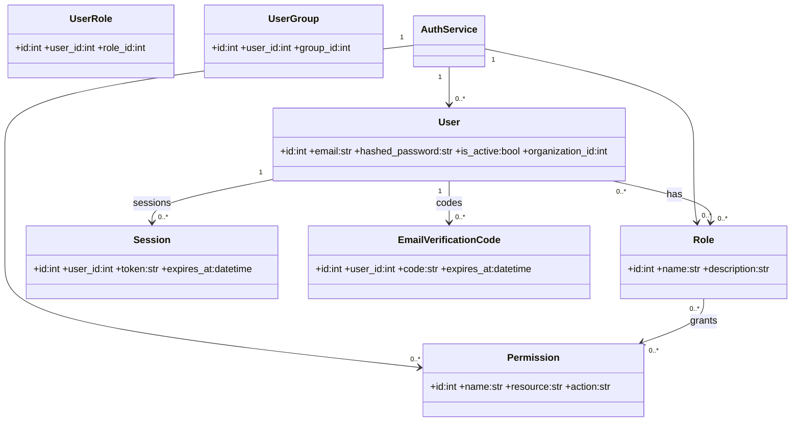
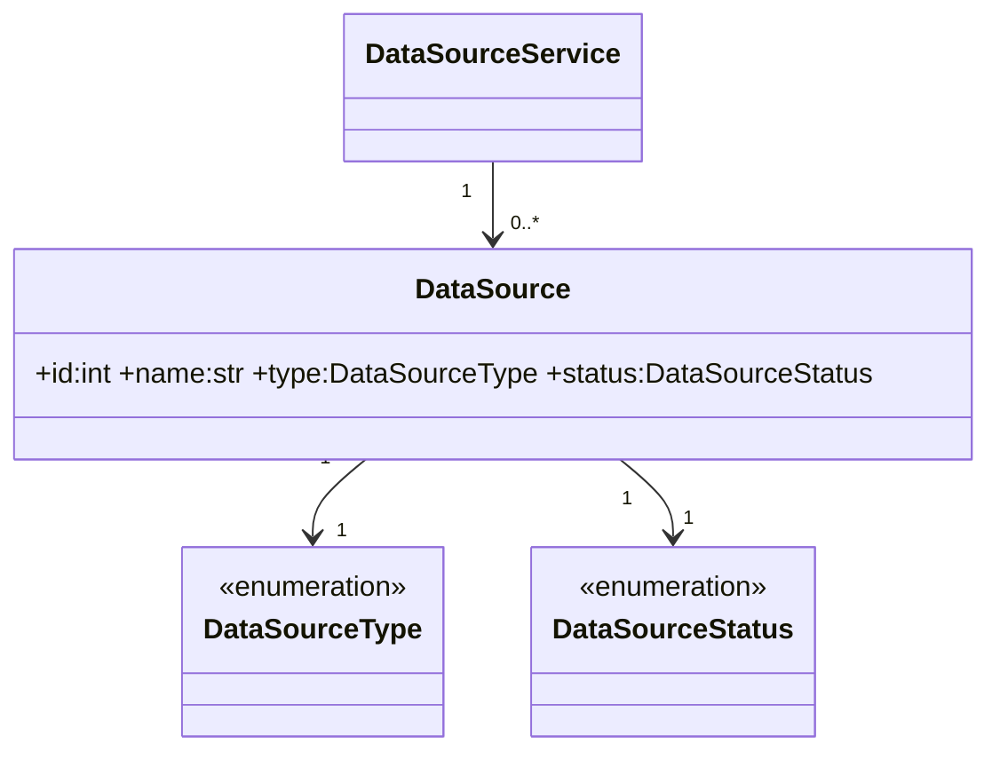
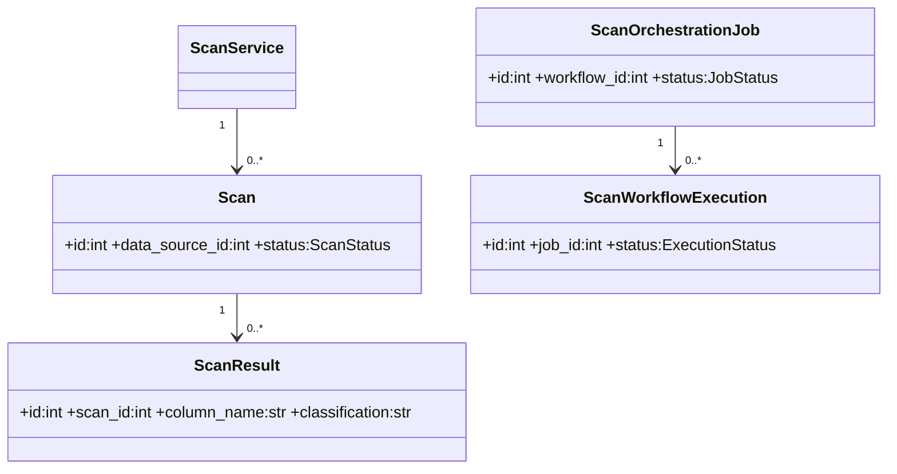
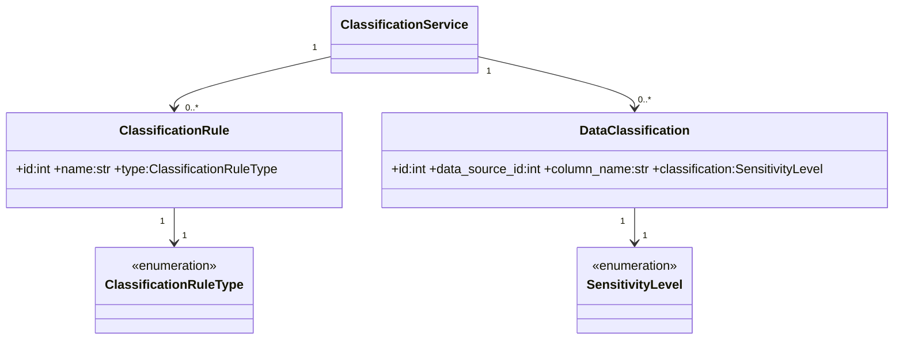
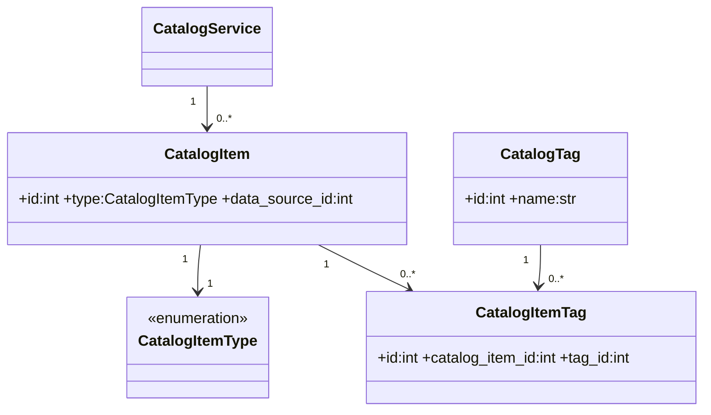
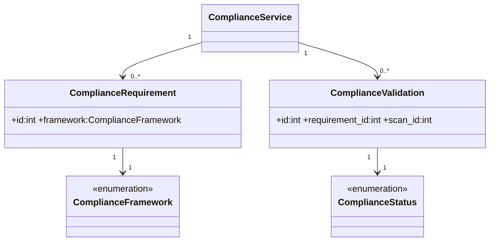
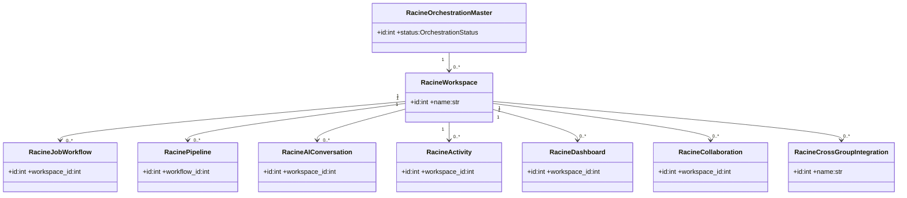

# Backend Scripts Automation App — Grouped Class Architecture (High Cohesion, Low Coupling)

This file provides two complementary visualizations:
- Flowchart with subgraphs to clearly group the seven domains and enforce low coupling via a central orchestrator.
- Per-group class diagrams with valid Mermaid class diagram syntax and multiplicities (no loops), showing high cohesion inside each group.

---

## A) System Grouping and Interactions (Subgraphs, No Loops)

```mermaid
flowchart TB
  %% Styling
  classDef hub fill:#1a237e,stroke:#0d133f,stroke-width:2px,color:#ffffff
  classDef core fill:#e6f7ff,stroke:#1565c0,color:#000000
  classDef auth fill:#fff3cd,stroke:#6c5ce7,color:#000000
  classDef ds fill:#e8f5e9,stroke:#2e7d32,color:#000000
  classDef scans fill:#ffebee,stroke:#d32f2f,color:#000000
  classDef classif fill:#fff8e1,stroke:#ff6f00,color:#000000
  classDef catalog fill:#e3f2fd,stroke:#1565c0,color:#000000
  classDef comp fill:#fce4ec,stroke:#ad1457,color:#000000
  classDef racine fill:#ede7f6,stroke:#512da8,color:#000000

  %% Central orchestrator hub to avoid tight coupling and loops
  subgraph HUB[Central Orchestrator Hub]
    direction TB
    racine_os[RacineOrchestrationService]
    racine_ws[RacineWorkspaceService]
    racine_wf[RacineWorkflowService]
    racine_pl[RacinePipelineService]
    racine_ai[RacineAIService]
    racine_act[RacineActivityService]
    racine_dash[RacineDashboardService]
    racine_collab[RacineCollaborationService]
    racine_int[RacineIntegrationService]
  end
  class HUB hub

  %% Core Infrastructure
  subgraph CORE[Core Infrastructure]
    direction TB
    FastAPI
    DatabaseEngine
    SessionLocal
    SecurityManager
    ConfigManager
    CORSMW[CORSMiddleware]
    DBCB[DatabaseCircuitBreakerMiddleware]
    RateLMW[RateLimitingMiddleware]
    ErrMW[ErrorHandlingMiddleware]
    AuthMW[AuthenticationMiddleware]
  end
  class CORE core

  %% Auth / RBAC
  subgraph AUTH[Authentication & RBAC]
    direction TB
    User
    Role
    Permission
    UserRole
    UserGroup
    Session
    EmailVerificationCode
    AuthService
  end
  class AUTH auth

  %% Data Sources
  subgraph DS[Data Sources]
    direction TB
    DataSource
    DataSourceService
    DataSourceType
    DataSourceStatus
  end
  class DS ds

  %% Scans
  subgraph SCAN[Scans]
    direction TB
    Scan
    ScanResult
    ScanService
    ScanOrchestrationJob
    ScanWorkflowExecution
  end
  class SCAN scans

  %% Classification
  subgraph CLASSIF[Classification]
    direction TB
    ClassificationRule
    DataClassification
    SensitivityLevel
    ClassificationRuleType
    ClassificationService
  end
  class CLASSIF classif

  %% Catalog
  subgraph CATALOG[Catalog]
    direction TB
    CatalogItem
    CatalogItemType
    CatalogTag
    CatalogItemTag
    CatalogService
  end
  class CATALOG catalog

  %% Compliance
  subgraph COMP[Compliance]
    direction TB
    ComplianceRequirement
    ComplianceValidation
    ComplianceFramework
    ComplianceStatus
    ComplianceService
  end
  class COMP comp

  %% Racine Domain Models
  subgraph RACINE[Racine Domain Models]
    direction TB
    RacineOrchestrationMaster
    RacineWorkspace
    RacineJobWorkflow
    RacinePipeline
    RacineAIConversation
    RacineActivity
    RacineDashboard
    RacineCollaboration
    RacineCrossGroupIntegration
  end
  class RACINE racine

  %% Hub routes all cross-domain communications (low coupling, no loops)
  FastAPI --> racine_os
  FastAPI --> AuthService
  FastAPI --> CatalogService
  FastAPI --> ClassificationService
  FastAPI --> ComplianceService
  FastAPI --> ScanService
  FastAPI --> DataSourceService

  %% Core dependencies
  FastAPI --> DatabaseEngine
  FastAPI --> SecurityManager
  FastAPI --> ConfigManager
  FastAPI --> CORSMW
  FastAPI --> DBCB
  FastAPI --> RateLMW
  FastAPI --> ErrMW
  FastAPI --> AuthMW

  %% Cross-group flows via HUB only
  DataSourceService --> racine_int
  ScanService --> racine_wf
  ClassificationService --> racine_ai
  CatalogService --> racine_os
  ComplianceService --> racine_os
  AuthService --> racine_ws

  %% Domain-to-domain allowed path through HUB (unidirectional)
  DataSourceService --> CATALOG
  CATALOG --> CLASSIF
  CLASSIF --> SCAN
  SCAN --> COMP
  COMP --> AUTH
  AUTH --> HUB
```

Notes:
- All cross-domain edges flow through the HUB or follow the documented unidirectional chain, eliminating loops.
- Subgraphs visually establish cohesion; HUB ensures low coupling.

---

## B) Per-Group Class Diagrams (Valid Multiplicities, No Loops)

### 1) Authentication & RBAC

### 2) Data Sources

### 3) Scans

### 4) Classification

### 5) Catalog

### 6) Compliance

### 7) Racine (Workspace/Orchestration)

---

### Design Rules Enforced
- High cohesion: Subgraphs and per-group diagrams keep related classes together.
- Low coupling: Cross-domain communication goes via HUB; per-group class diagrams avoid cross edges.
- No loops: Flowchart edges are unidirectional; class diagrams only show intra-group relations.
- Correct multiplicities: Mermaid-compliant syntax with quotes (e.g., "1", "0..*").
