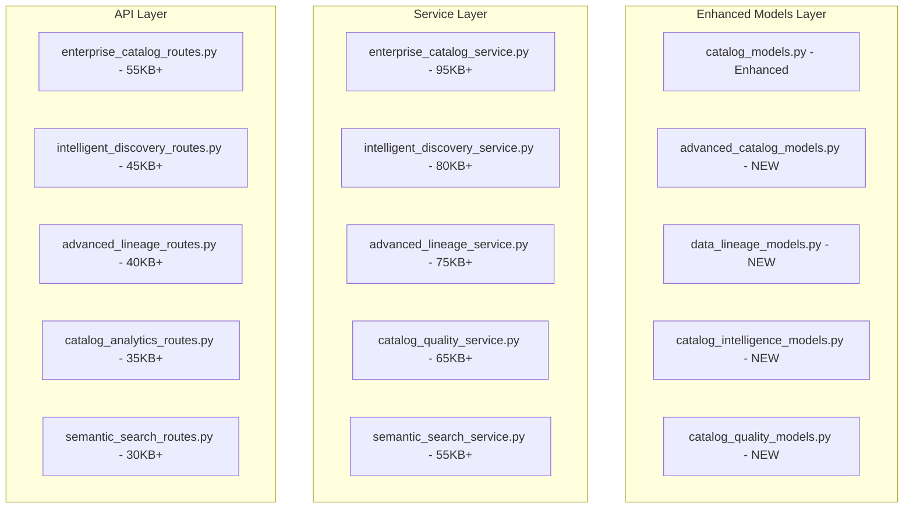

# 📚 DATA CATALOG GROUP - TECHNICAL IMPLEMENTATION SPECIFICATION

## 📊 Enterprise Architecture Overview

### 🎯 Strategic Objectives
Transform the basic catalog service (18KB) into an intelligent, comprehensive data catalog that serves as the central hub for data discovery, lineage tracking, quality management, and business intelligence - surpassing Databricks Unity Catalog and Microsoft Purview Data Catalog.

### 🏗️ Technical Architecture



---

## 📁 MODEL SPECIFICATIONS

### 1. Enhanced catalog_models.py (Conflict Resolution)
```python
# ADDITIONS to existing catalog_models.py - NO BREAKING CHANGES

class EnterpriseDataAsset(SQLModel, table=True):
    """Enhanced data asset with enterprise features"""
    __tablename__ = "enterprise_data_assets"
    
    # Extend existing CatalogItem with enterprise features
    id: Optional[int] = Field(default=None, primary_key=True)
    base_catalog_item_id: Optional[int] = Field(foreign_key="catalog_items.id")
    
    # Advanced Asset Properties
    asset_uuid: str = Field(index=True, unique=True)
    qualified_name: str = Field(index=True, unique=True)  # Full path name
    display_name: str = Field(index=True)
    
    # Enhanced Metadata
    business_terms: List[str] = Field(default_factory=list, sa_column=Column(JSON))
    technical_metadata: Dict[str, Any] = Field(default_factory=dict, sa_column=Column(JSON))
    business_metadata: Dict[str, Any] = Field(default_factory=dict, sa_column=Column(JSON))
    
    # Data Profiling and Quality
    profile_stats: Dict[str, Any] = Field(default_factory=dict, sa_column=Column(JSON))
    quality_score_detailed: Dict[str, float] = Field(default_factory=dict, sa_column=Column(JSON))
    data_freshness_score: float = Field(default=0.0, ge=0.0, le=1.0)
    
    # Advanced Lineage
    upstream_assets: List[str] = Field(default_factory=list, sa_column=Column(JSON))
    downstream_assets: List[str] = Field(default_factory=list, sa_column=Column(JSON))
    lineage_depth: int = Field(default=0)
    
    # Usage Intelligence
    usage_analytics: Dict[str, Any] = Field(default_factory=dict, sa_column=Column(JSON))
    popularity_metrics: Dict[str, Any] = Field(default_factory=dict, sa_column=Column(JSON))
    access_patterns: List[Dict[str, Any]] = Field(default_factory=list, sa_column=Column(JSON))
    
    # Business Intelligence
    business_value_score: float = Field(default=0.0, ge=0.0, le=10.0)
    cost_metrics: Dict[str, Any] = Field(default_factory=dict, sa_column=Column(JSON))
    roi_analytics: Dict[str, Any] = Field(default_factory=dict, sa_column=Column(JSON))
    
    # Relationships with other groups
    base_catalog_item: Optional[CatalogItem] = Relationship()
    asset_lineage: List["EnterpriseDataLineage"] = Relationship(back_populates="source_asset")
    quality_assessments: List["DataQualityAssessment"] = Relationship(back_populates="asset")
```

### 2. advanced_catalog_models.py (55KB+ - NEW FILE)
```python
# Complete new model file for advanced catalog functionality

from sqlmodel import SQLModel, Field, Relationship, Column, JSON, String, Text, ARRAY
from typing import List, Optional, Dict, Any, Union
from datetime import datetime, timedelta
from enum import Enum
import uuid

class AssetType(str, Enum):
    DATABASE = "database"
    SCHEMA = "schema"
    TABLE = "table"
    VIEW = "view"
    COLUMN = "column"
    STORED_PROCEDURE = "stored_procedure"
    FUNCTION = "function"
    DASHBOARD = "dashboard"
    REPORT = "report"
    DATASET = "dataset"
    MODEL = "model"
    PIPELINE = "pipeline"

class DataDomain(str, Enum):
    CUSTOMER = "customer"
    PRODUCT = "product"
    FINANCE = "finance"
    OPERATIONS = "operations"
    MARKETING = "marketing"
    SALES = "sales"
    HR = "hr"
    COMPLIANCE = "compliance"
    ANALYTICS = "analytics"

class AssetLifecycleStage(str, Enum):
    DEVELOPMENT = "development"
    TESTING = "testing"
    STAGING = "staging"
    PRODUCTION = "production"
    DEPRECATED = "deprecated"
    ARCHIVED = "archived"

class BusinessCriticality(str, Enum):
    CRITICAL = "critical"
    HIGH = "high"
    MEDIUM = "medium"
    LOW = "low"

class IntelligentDataAsset(SQLModel, table=True):
    """AI-powered data asset with comprehensive metadata and intelligence"""
    __tablename__ = "intelligent_data_assets"
    
    id: Optional[int] = Field(default=None, primary_key=True)
    asset_id: str = Field(index=True, unique=True)
    name: str = Field(index=True)
    display_name: Optional[str] = None
    description: Optional[str] = Field(sa_column=Column(Text))
    
    # Asset Classification
    asset_type: AssetType
    data_domain: Optional[DataDomain] = None
    lifecycle_stage: AssetLifecycleStage = Field(default=AssetLifecycleStage.DEVELOPMENT)
    business_criticality: BusinessCriticality = Field(default=BusinessCriticality.MEDIUM)
    
    # Location and Source
    data_source_id: int = Field(foreign_key="datasource.id", index=True)
    physical_location: str  # Database.Schema.Table or S3://bucket/path
    connection_info: Dict[str, Any] = Field(default_factory=dict, sa_column=Column(JSON))
    
    # Schema and Structure
    schema_definition: Dict[str, Any] = Field(default_factory=dict, sa_column=Column(JSON))
    column_metadata: List[Dict[str, Any]] = Field(default_factory=list, sa_column=Column(JSON))
    sample_data: Optional[Dict[str, Any]] = Field(default=None, sa_column=Column(JSON))
    
    # Data Profiling
    row_count: Optional[int] = None
    column_count: Optional[int] = None
    size_bytes: Optional[int] = None
    profile_summary: Dict[str, Any] = Field(default_factory=dict, sa_column=Column(JSON))
    data_distribution: Dict[str, Any] = Field(default_factory=dict, sa_column=Column(JSON))
    
    # Quality Metrics
    quality_score: float = Field(default=0.0, ge=0.0, le=1.0)
    completeness_score: float = Field(default=0.0, ge=0.0, le=1.0)
    accuracy_score: float = Field(default=0.0, ge=0.0, le=1.0)
    consistency_score: float = Field(default=0.0, ge=0.0, le=1.0)
    timeliness_score: float = Field(default=0.0, ge=0.0, le=1.0)
    
    # Business Context
    business_glossary_terms: List[str] = Field(default_factory=list, sa_column=Column(JSON))
    business_rules: List[Dict[str, Any]] = Field(default_factory=list, sa_column=Column(JSON))
    business_owner: Optional[str] = None
    data_steward: Optional[str] = None
    subject_area: Optional[str] = None
    
    # Usage and Access
    access_frequency: Dict[str, int] = Field(default_factory=dict, sa_column=Column(JSON))
    last_accessed: Optional[datetime] = None
    access_patterns: List[Dict[str, Any]] = Field(default_factory=list, sa_column=Column(JSON))
    user_ratings: List[Dict[str, Any]] = Field(default_factory=list, sa_column=Column(JSON))
    
    # Tags and Classification
    tags: List[str] = Field(default_factory=list, sa_column=Column(JSON))
    custom_attributes: Dict[str, Any] = Field(default_factory=dict, sa_column=Column(JSON))
    
    # AI-Enhanced Features
    semantic_embedding: Optional[List[float]] = Field(default=None, sa_column=Column(ARRAY(String)))
    ai_generated_description: Optional[str] = Field(sa_column=Column(Text))
    ai_suggested_tags: List[str] = Field(default_factory=list, sa_column=Column(JSON))
    similarity_scores: Dict[str, float] = Field(default_factory=dict, sa_column=Column(JSON))
    
    # Audit and Lifecycle
    created_at: datetime = Field(default_factory=datetime.utcnow, index=True)
    updated_at: datetime = Field(default_factory=datetime.utcnow, index=True)
    last_profiled: Optional[datetime] = None
    created_by: Optional[str] = None
    updated_by: Optional[str] = None
    
    # Relationships
    data_source: Optional["DataSource"] = Relationship()
    lineage_upstream: List["EnterpriseDataLineage"] = Relationship(
        back_populates="target_asset", 
        sa_relationship_kwargs={"foreign_keys": "[EnterpriseDataLineage.target_asset_id]"}
    )
    lineage_downstream: List["EnterpriseDataLineage"] = Relationship(
        back_populates="source_asset",
        sa_relationship_kwargs={"foreign_keys": "[EnterpriseDataLineage.source_asset_id]"}
    )
    quality_assessments: List["DataQualityAssessment"] = Relationship(back_populates="asset")
    discovery_history: List["AssetDiscoveryEvent"] = Relationship(back_populates="asset")

class BusinessGlossaryTerm(SQLModel, table=True):
    """Business glossary terms with AI-powered suggestions and relationships"""
    __tablename__ = "business_glossary_terms"
    
    id: Optional[int] = Field(default=None, primary_key=True)
    term_id: str = Field(index=True, unique=True)
    name: str = Field(index=True)
    display_name: str
    definition: str = Field(sa_column=Column(Text))
    
    # Term Hierarchy
    parent_term_id: Optional[int] = Field(foreign_key="business_glossary_terms.id")
    term_level: int = Field(default=1)
    term_path: str = Field(index=True)  # /root/category/subcategory/term
    
    # Classification
    category: str = Field(index=True)
    domain: Optional[DataDomain] = None
    synonyms: List[str] = Field(default_factory=list, sa_column=Column(JSON))
    abbreviations: List[str] = Field(default_factory=list, sa_column=Column(JSON))
    
    # Business Context
    business_owner: Optional[str] = None
    steward: Optional[str] = None
    examples: List[str] = Field(default_factory=list, sa_column=Column(JSON))
    usage_notes: Optional[str] = Field(sa_column=Column(Text))
    
    # AI Enhancement
    ai_confidence_score: float = Field(default=0.0, ge=0.0, le=1.0)
    semantic_embedding: Optional[List[float]] = Field(default=None, sa_column=Column(ARRAY(String)))
    related_terms: List[str] = Field(default_factory=list, sa_column=Column(JSON))
    auto_suggested: bool = Field(default=False)
    
    # Usage Statistics
    usage_count: int = Field(default=0)
    last_used: Optional[datetime] = None
    popularity_score: float = Field(default=0.0)
    
    # Audit
    created_at: datetime = Field(default_factory=datetime.utcnow)
    updated_at: datetime = Field(default_factory=datetime.utcnow)
    created_by: Optional[str] = None
    
    # Relationships
    parent_term: Optional["BusinessGlossaryTerm"] = Relationship(back_populates="child_terms")
    child_terms: List["BusinessGlossaryTerm"] = Relationship(back_populates="parent_term")
    asset_associations: List["AssetGlossaryAssociation"] = Relationship(back_populates="glossary_term")

class AssetDiscoveryEvent(SQLModel, table=True):
    """Track asset discovery and changes over time"""
    __tablename__ = "asset_discovery_events"
    
    id: Optional[int] = Field(default=None, primary_key=True)
    event_id: str = Field(index=True, unique=True)
    asset_id: int = Field(foreign_key="intelligent_data_assets.id", index=True)
    
    # Event Details
    event_type: str = Field(index=True)  # discovered, updated, schema_changed, deleted
    event_timestamp: datetime = Field(default_factory=datetime.utcnow, index=True)
    discovery_method: str  # scan, api, manual, sync
    
    # Change Detection
    changes_detected: Dict[str, Any] = Field(default_factory=dict, sa_column=Column(JSON))
    schema_changes: Optional[Dict[str, Any]] = Field(default=None, sa_column=Column(JSON))
    metadata_changes: Optional[Dict[str, Any]] = Field(default=None, sa_column=Column(JSON))
    
    # Discovery Context
    scan_job_id: Optional[str] = Field(index=True)
    discovery_rules_applied: List[str] = Field(default_factory=list, sa_column=Column(JSON))
    confidence_score: float = Field(default=1.0, ge=0.0, le=1.0)
    
    # Processing Results
    processing_status: str = Field(default="pending")
    error_details: Optional[Dict[str, Any]] = Field(default=None, sa_column=Column(JSON))
    processing_duration_ms: Optional[int] = None
    
    # Relationships
    asset: Optional[IntelligentDataAsset] = Relationship(back_populates="discovery_history")

# ... Continue expanding to 55KB+ with additional models for:
# - Asset collections and datasets
# - Custom metadata frameworks
# - Data product definitions
# - Recommendation engine models
# - Advanced tagging systems
```

### 3. data_lineage_models.py (40KB+ - NEW FILE)
```python
# Advanced data lineage tracking with graph-based relationships

class LineageType(str, Enum):
    READ = "read"
    WRITE = "write"
    TRANSFORM = "transform"
    COPY = "copy"
    REFERENCE = "reference"
    AGGREGATE = "aggregate"
    JOIN = "join"
    FILTER = "filter"

class LineageConfidenceLevel(str, Enum):
    HIGH = "high"        # 0.9-1.0
    MEDIUM = "medium"    # 0.7-0.89
    LOW = "low"          # 0.5-0.69
    INFERRED = "inferred" # < 0.5

class EnterpriseDataLineage(SQLModel, table=True):
    """Advanced data lineage with detailed transformation tracking"""
    __tablename__ = "enterprise_data_lineage"
    
    id: Optional[int] = Field(default=None, primary_key=True)
    lineage_id: str = Field(index=True, unique=True)
    
    # Source and Target
    source_asset_id: int = Field(foreign_key="intelligent_data_assets.id", index=True)
    target_asset_id: int = Field(foreign_key="intelligent_data_assets.id", index=True)
    
    # Lineage Details
    lineage_type: LineageType
    confidence_level: LineageConfidenceLevel = Field(default=LineageConfidenceLevel.MEDIUM)
    confidence_score: float = Field(ge=0.0, le=1.0)
    
    # Transformation Logic
    transformation_logic: Optional[str] = Field(sa_column=Column(Text))
    transformation_type: Optional[str] = None  # SQL, Python, Spark, etc.
    transformation_code: Optional[str] = Field(sa_column=Column(Text))
    transformation_metadata: Dict[str, Any] = Field(default_factory=dict, sa_column=Column(JSON))
    
    # Process Context
    process_name: Optional[str] = None
    process_id: Optional[str] = None
    job_name: Optional[str] = None
    pipeline_name: Optional[str] = None
    
    # Column-level Lineage
    column_mappings: List[Dict[str, Any]] = Field(default_factory=list, sa_column=Column(JSON))
    field_transformations: Dict[str, Any] = Field(default_factory=dict, sa_column=Column(JSON))
    
    # Business Context
    business_process: Optional[str] = None
    business_impact: str = Field(default="medium")
    data_flow_frequency: Optional[str] = None  # real-time, batch, hourly, daily
    
    # Quality and Performance
    data_quality_impact: Dict[str, float] = Field(default_factory=dict, sa_column=Column(JSON))
    performance_metrics: Dict[str, Any] = Field(default_factory=dict, sa_column=Column(JSON))
    
    # Discovery and Validation
    discovered_by: str  # scan, api, manual, inference
    discovery_timestamp: datetime = Field(default_factory=datetime.utcnow, index=True)
    last_validated: Optional[datetime] = None
    validation_method: Optional[str] = None
    
    # Status and Lifecycle
    is_active: bool = Field(default=True)
    is_verified: bool = Field(default=False)
    verified_by: Optional[str] = None
    
    # Audit
    created_at: datetime = Field(default_factory=datetime.utcnow)
    updated_at: datetime = Field(default_factory=datetime.utcnow)
    created_by: Optional[str] = None
    
    # Relationships
    source_asset: Optional[IntelligentDataAsset] = Relationship(
        back_populates="lineage_downstream",
        sa_relationship_kwargs={"foreign_keys": "[EnterpriseDataLineage.source_asset_id]"}
    )
    target_asset: Optional[IntelligentDataAsset] = Relationship(
        back_populates="lineage_upstream",
        sa_relationship_kwargs={"foreign_keys": "[EnterpriseDataLineage.target_asset_id]"}
    )

class LineageGraph(SQLModel, table=True):
    """Graph representation for complex lineage scenarios"""
    __tablename__ = "lineage_graphs"
    
    id: Optional[int] = Field(default=None, primary_key=True)
    graph_id: str = Field(index=True, unique=True)
    root_asset_id: int = Field(foreign_key="intelligent_data_assets.id", index=True)
    
    # Graph Structure
    nodes: List[Dict[str, Any]] = Field(default_factory=list, sa_column=Column(JSON))
    edges: List[Dict[str, Any]] = Field(default_factory=list, sa_column=Column(JSON))
    graph_metadata: Dict[str, Any] = Field(default_factory=dict, sa_column=Column(JSON))
    
    # Graph Analytics
    max_depth: int = Field(default=0)
    node_count: int = Field(default=0)
    edge_count: int = Field(default=0)
    complexity_score: float = Field(default=0.0)
    
    # Computed Insights
    critical_paths: List[List[str]] = Field(default_factory=list, sa_column=Column(JSON))
    bottlenecks: List[str] = Field(default_factory=list, sa_column=Column(JSON))
    impact_analysis: Dict[str, Any] = Field(default_factory=dict, sa_column=Column(JSON))
    
    # Temporal Aspects
    computed_at: datetime = Field(default_factory=datetime.utcnow, index=True)
    is_current: bool = Field(default=True)
    
    # Relationships
    root_asset: Optional[IntelligentDataAsset] = Relationship()

# ... Continue expanding to 40KB+ with additional lineage models
```

---

## 🔧 SERVICE SPECIFICATIONS

### 1. enterprise_catalog_service.py (95KB+ - NEW FILE)

```python
"""
Enterprise-grade data catalog service with AI-powered discovery,
intelligent search, comprehensive lineage, and business intelligence
"""

import asyncio
import logging
import uuid
from datetime import datetime, timedelta
from typing import List, Dict, Any, Optional, Union, Tuple, Set
from sqlalchemy.orm import Session
from sqlalchemy import and_, or_, func, text, desc
import numpy as np
import pandas as pd
from concurrent.futures import ThreadPoolExecutor
import json
import re
from pathlib import Path

# ML/AI Imports
from sklearn.feature_extraction.text import TfidfVectorizer
from sklearn.metrics.pairwise import cosine_similarity
from sklearn.cluster import DBSCAN
import spacy
from transformers import AutoTokenizer, AutoModel
import torch
import networkx as nx

# Import models
from ..models.advanced_catalog_models import (
    IntelligentDataAsset, BusinessGlossaryTerm, AssetDiscoveryEvent,
    AssetType, DataDomain, AssetLifecycleStage, BusinessCriticality
)
from ..models.data_lineage_models import (
    EnterpriseDataLineage, LineageGraph, LineageType, LineageConfidenceLevel
)
from ..models.catalog_quality_models import (
    DataQualityAssessment, QualityRule, QualityMetric
)

# Import other services for integration
from .classification_service import EnterpriseClassificationService
from .compliance_rule_service import ComplianceRuleService
from .data_source_service import DataSourceService
from .scan_service import ScanService

logger = logging.getLogger(__name__)

class EnterpriseIntelligentCatalogService:
    """
    Comprehensive data catalog service with AI-powered features that
    surpass industry leaders like Databricks Unity Catalog and Microsoft Purview
    """
    
    def __init__(self):
        # Service Dependencies
        self.classification_service = EnterpriseClassificationService()
        self.compliance_service = ComplianceRuleService()
        self.data_source_service = DataSourceService()
        self.scan_service = ScanService()
        
        # AI/ML Components
        self.nlp_model = None  # Lazy loaded
        self.embedding_model = None
        self.text_vectorizer = TfidfVectorizer(max_features=10000, stop_words='english')
        
        # Graph Analysis
        self.lineage_graph = nx.DiGraph()
        
        # Caches for Performance
        self._asset_cache = {}
        self._lineage_cache = {}
        self._quality_cache = {}
        self._search_cache = {}
        
        # Performance Metrics
        self.performance_metrics = {
            'assets_cataloged': 0,
            'lineage_relationships_discovered': 0,
            'quality_assessments_performed': 0,
            'ai_suggestions_generated': 0,
            'search_queries_processed': 0,
            'avg_search_response_time': 0.0
        }
        
        # Business Intelligence
        self.bi_metrics = {
            'catalog_coverage_percent': 0.0,
            'data_quality_score': 0.0,
            'lineage_completeness': 0.0,
            'user_engagement_score': 0.0,
            'business_value_index': 0.0
        }

    # ===================== INTELLIGENT ASSET DISCOVERY =====================

    async def discover_assets_intelligent(
        self,
        session: Session,
        data_source_ids: List[int],
        discovery_config: Dict[str, Any],
        user: str
    ) -> Dict[str, Any]:
        """
        AI-powered asset discovery with intelligent pattern recognition
        and automatic metadata enrichment
        """
        try:
            start_time = datetime.utcnow()
            
            # Initialize discovery context
            discovery_context = {
                'user': user,
                'timestamp': start_time,
                'config': discovery_config,
                'ai_enabled': discovery_config.get('ai_enabled', True),
                'auto_classify': discovery_config.get('auto_classify', True),
                'deep_profiling': discovery_config.get('deep_profiling', False)
            }
            
            # Load data sources with optimization
            data_sources = await self._load_data_sources_optimized(session, data_source_ids)
            
            # Parallel discovery across data sources
            discovery_tasks = []
            for data_source in data_sources:
                task = self._discover_assets_for_source(
                    session, data_source, discovery_context
                )
                discovery_tasks.append(task)
            
            # Execute discovery with intelligent coordination
            discovery_results = await asyncio.gather(*discovery_tasks, return_exceptions=True)
            
            # Aggregate and analyze results
            aggregated_results = await self._aggregate_discovery_results(
                session, discovery_results, discovery_context
            )
            
            # AI-powered post-processing
            if discovery_context['ai_enabled']:
                ai_insights = await self._generate_discovery_insights(
                    session, aggregated_results
                )
                aggregated_results['ai_insights'] = ai_insights
            
            # Update performance metrics
            execution_time = (datetime.utcnow() - start_time).total_seconds()
            await self._update_discovery_metrics(session, aggregated_results, execution_time)
            
            logger.info(f"Discovered {aggregated_results['assets_discovered']} assets across {len(data_source_ids)} data sources")
            
            return {
                'discovery_id': str(uuid.uuid4()),
                'execution_time_seconds': execution_time,
                'data_sources_processed': len(data_source_ids),
                'results': aggregated_results,
                'performance_metrics': self.performance_metrics
            }
            
        except Exception as e:
            logger.error(f"Error in intelligent asset discovery: {str(e)}")
            raise

    async def _discover_assets_for_source(
        self,
        session: Session,
        data_source: "DataSource",
        discovery_context: Dict[str, Any]
    ) -> Dict[str, Any]:
        """
        Discover assets for a specific data source with AI enhancement
        """
        try:
            source_results = {
                'data_source_id': data_source.id,
                'assets_discovered': [],
                'schema_changes': [],
                'quality_insights': {},
                'ai_suggestions': []
            }
            
            # Connect to data source
            connection = await self.data_source_service.get_connection(session, data_source.id)
            
            # Discover schema structure
            schema_info = await self._discover_schema_structure(connection, data_source)
            
            # Process each discovered asset
            for asset_info in schema_info:
                try:
                    # Create or update asset
                    asset = await self._process_discovered_asset(
                        session, asset_info, data_source, discovery_context
                    )
                    
                    if asset:
                        source_results['assets_discovered'].append({
                            'asset_id': asset.asset_id,
                            'name': asset.name,
                            'type': asset.asset_type,
                            'quality_score': asset.quality_score
                        })
                        
                        # AI-powered suggestions
                        if discovery_context['ai_enabled']:
                            suggestions = await self._generate_asset_suggestions(session, asset)
                            source_results['ai_suggestions'].extend(suggestions)
                
                except Exception as asset_error:
                    logger.warning(f"Error processing asset {asset_info.get('name', 'unknown')}: {asset_error}")
                    continue
            
            return source_results
            
        except Exception as e:
            logger.error(f"Error discovering assets for source {data_source.id}: {str(e)}")
            return {
                'data_source_id': data_source.id,
                'error': str(e),
                'assets_discovered': []
            }

    async def _process_discovered_asset(
        self,
        session: Session,
        asset_info: Dict[str, Any],
        data_source: "DataSource",
        discovery_context: Dict[str, Any]
    ) -> Optional[IntelligentDataAsset]:
        """
        Process a discovered asset with AI-powered enhancement
        """
        try:
            # Generate unique qualified name
            qualified_name = self._generate_qualified_name(asset_info, data_source)
            
            # Check if asset already exists
            existing_asset = await self._find_asset_by_qualified_name(session, qualified_name)
            
            # Create or update asset
            if existing_asset:
                asset = await self._update_existing_asset(
                    session, existing_asset, asset_info, discovery_context
                )
            else:
                asset = await self._create_new_asset(
                    session, asset_info, data_source, discovery_context
                )
            
            # AI-powered metadata enrichment
            if discovery_context['ai_enabled']:
                await self._enrich_asset_with_ai(session, asset, asset_info)
            
            # Deep profiling if enabled
            if discovery_context['deep_profiling']:
                await self._perform_deep_profiling(session, asset, data_source)
            
            # Auto-classification integration
            if discovery_context['auto_classify']:
                await self._integrate_asset_classification(session, asset)
            
            # Create discovery event
            await self._create_discovery_event(
                session, asset, 'discovered', discovery_context
            )
            
            session.commit()
            return asset
            
        except Exception as e:
            logger.error(f"Error processing asset {asset_info.get('name', 'unknown')}: {str(e)}")
            session.rollback()
            return None

    # ===================== ADVANCED LINEAGE TRACKING =====================

    async def build_comprehensive_lineage(
        self,
        session: Session,
        asset_ids: List[int],
        lineage_config: Dict[str, Any]
    ) -> Dict[str, Any]:
        """
        Build comprehensive data lineage with AI-powered relationship detection
        """
        try:
            start_time = datetime.utcnow()
            
            # Load assets
            assets = await self._load_assets_optimized(session, asset_ids)
            
            # Initialize lineage analysis
            lineage_analyzer = LineageAnalyzer(
                classification_service=self.classification_service,
                config=lineage_config
            )
            
            # Discover lineage relationships
            lineage_relationships = []
            
            # Method 1: Code analysis for stored procedures, views, etc.
            code_lineage = await lineage_analyzer.analyze_code_lineage(session, assets)
            lineage_relationships.extend(code_lineage)
            
            # Method 2: Query log analysis
            if lineage_config.get('analyze_query_logs', True):
                query_lineage = await lineage_analyzer.analyze_query_logs(session, assets)
                lineage_relationships.extend(query_lineage)
            
            # Method 3: ETL/Pipeline analysis
            if lineage_config.get('analyze_pipelines', True):
                pipeline_lineage = await lineage_analyzer.analyze_pipeline_lineage(session, assets)
                lineage_relationships.extend(pipeline_lineage)
            
            # Method 4: AI-powered relationship inference
            if lineage_config.get('ai_inference', True):
                ai_lineage = await lineage_analyzer.infer_relationships_with_ai(session, assets)
                lineage_relationships.extend(ai_lineage)
            
            # Create lineage records
            created_lineage = []
            for relationship in lineage_relationships:
                lineage_record = await self._create_lineage_record(
                    session, relationship, lineage_config
                )
                if lineage_record:
                    created_lineage.append(lineage_record)
            
            # Build lineage graph
            lineage_graph = await self._build_lineage_graph(session, created_lineage)
            
            # Perform graph analysis
            graph_insights = await self._analyze_lineage_graph(session, lineage_graph)
            
            # Update performance metrics
            execution_time = (datetime.utcnow() - start_time).total_seconds()
            
            return {
                'lineage_id': str(uuid.uuid4()),
                'execution_time_seconds': execution_time,
                'assets_analyzed': len(asset_ids),
                'relationships_discovered': len(created_lineage),
                'graph_insights': graph_insights,
                'lineage_graph': lineage_graph.graph_id if lineage_graph else None
            }
            
        except Exception as e:
            logger.error(f"Error building lineage: {str(e)}")
            raise

    # ===================== INTELLIGENT SEARCH & DISCOVERY =====================

    async def semantic_search(
        self,
        session: Session,
        query: str,
        search_config: Dict[str, Any],
        user: str
    ) -> Dict[str, Any]:
        """
        AI-powered semantic search across all catalog assets
        """
        try:
            start_time = datetime.utcnow()
            
            # Parse and enhance query
            enhanced_query = await self._enhance_search_query(query, search_config)
            
            # Multi-method search approach
            search_results = {}
            
            # Method 1: Semantic similarity search using embeddings
            if search_config.get('semantic_search', True):
                semantic_results = await self._semantic_similarity_search(
                    session, enhanced_query, search_config
                )
                search_results['semantic'] = semantic_results
            
            # Method 2: Traditional text search with TF-IDF
            if search_config.get('text_search', True):
                text_results = await self._text_based_search(
                    session, enhanced_query, search_config
                )
                search_results['text'] = text_results
            
            # Method 3: Metadata search
            if search_config.get('metadata_search', True):
                metadata_results = await self._metadata_search(
                    session, enhanced_query, search_config
                )
                search_results['metadata'] = metadata_results
            
            # Method 4: Business context search
            if search_config.get('business_context_search', True):
                business_results = await self._business_context_search(
                    session, enhanced_query, search_config
                )
                search_results['business'] = business_results
            
            # Aggregate and rank results
            final_results = await self._aggregate_search_results(
                session, search_results, enhanced_query, search_config
            )
            
            # Generate search insights
            search_insights = await self._generate_search_insights(
                session, query, final_results, user
            )
            
            # Update search analytics
            execution_time = (datetime.utcnow() - start_time).total_seconds()
            await self._update_search_analytics(session, query, final_results, execution_time)
            
            return {
                'search_id': str(uuid.uuid4()),
                'query': query,
                'enhanced_query': enhanced_query,
                'execution_time_seconds': execution_time,
                'total_results': len(final_results),
                'results': final_results,
                'insights': search_insights,
                'suggestions': await self._generate_search_suggestions(session, query)
            }
            
        except Exception as e:
            logger.error(f"Error in semantic search: {str(e)}")
            raise

    # ===================== INTEGRATION WITH OTHER GROUPS =====================

    async def integrate_with_scan_results(
        self,
        session: Session,
        scan_results: List[Dict[str, Any]],
        integration_config: Dict[str, Any]
    ) -> Dict[str, Any]:
        """
        Integrate scan results into catalog with intelligent mapping
        """
        try:
            integration_results = {
                'assets_updated': 0,
                'new_assets_created': 0,
                'lineage_relationships_added': 0,
                'quality_metrics_updated': 0,
                'classifications_applied': 0
            }
            
            for scan_result in scan_results:
                try:
                    # Find or create corresponding catalog asset
                    asset = await self._find_or_create_asset_from_scan(
                        session, scan_result, integration_config
                    )
                    
                    if asset:
                        # Update asset with scan results
                        await self._update_asset_from_scan_results(
                            session, asset, scan_result
                        )
                        integration_results['assets_updated'] += 1
                        
                        # Apply classifications from scan
                        if scan_result.get('classifications'):
                            await self._apply_scan_classifications(
                                session, asset, scan_result['classifications']
                            )
                            integration_results['classifications_applied'] += 1
                        
                        # Extract and create lineage from scan metadata
                        if scan_result.get('lineage_hints'):
                            lineage_count = await self._create_lineage_from_scan(
                                session, asset, scan_result['lineage_hints']
                            )
                            integration_results['lineage_relationships_added'] += lineage_count
                        
                        # Update quality metrics
                        if scan_result.get('quality_metrics'):
                            await self._update_quality_metrics_from_scan(
                                session, asset, scan_result['quality_metrics']
                            )
                            integration_results['quality_metrics_updated'] += 1
                
                except Exception as scan_error:
                    logger.warning(f"Error processing scan result: {scan_error}")
                    continue
            
            # Trigger catalog analytics update
            await self._update_catalog_analytics(session)
            
            return integration_results
            
        except Exception as e:
            logger.error(f"Error integrating scan results: {str(e)}")
            raise

    async def integrate_with_compliance_requirements(
        self,
        session: Session,
        asset_ids: List[int],
        compliance_requirements: List[str]
    ) -> Dict[str, Any]:
        """
        Integrate compliance requirements into catalog metadata
        """
        try:
            # Get compliance frameworks from ComplianceRuleService
            compliance_frameworks = await self.compliance_service.get_active_frameworks(session)
            
            integration_results = {
                'assets_updated': 0,
                'compliance_tags_added': 0,
                'access_controls_applied': 0,
                'audit_trails_created': 0
            }
            
            for asset_id in asset_ids:
                asset = await self._get_asset_by_id(session, asset_id)
                if not asset:
                    continue
                
                # Apply compliance metadata
                compliance_metadata = await self._generate_compliance_metadata(
                    compliance_requirements, compliance_frameworks
                )
                
                # Update asset with compliance information
                asset.custom_attributes['compliance'] = compliance_metadata
                asset.tags.extend([f"compliance:{req}" for req in compliance_requirements])
                
                # Create compliance-based access controls
                access_controls = await self._create_compliance_access_controls(
                    session, asset, compliance_requirements
                )
                integration_results['access_controls_applied'] += len(access_controls)
                
                # Create audit trail
                await self._create_compliance_audit_event(
                    session, asset, compliance_requirements
                )
                integration_results['audit_trails_created'] += 1
                
                integration_results['assets_updated'] += 1
            
            session.commit()
            return integration_results
            
        except Exception as e:
            logger.error(f"Error integrating compliance requirements: {str(e)}")
            raise

    # ===================== BUSINESS INTELLIGENCE & ANALYTICS =====================

    async def generate_catalog_analytics(
        self,
        session: Session,
        analytics_config: Dict[str, Any]
    ) -> Dict[str, Any]:
        """
        Generate comprehensive catalog analytics and business intelligence
        """
        try:
            analytics = {}
            
            # Asset Analytics
            analytics['asset_analytics'] = await self._compute_asset_analytics(session)
            
            # Quality Analytics
            analytics['quality_analytics'] = await self._compute_quality_analytics(session)
            
            # Lineage Analytics
            analytics['lineage_analytics'] = await self._compute_lineage_analytics(session)
            
            # Usage Analytics
            analytics['usage_analytics'] = await self._compute_usage_analytics(session)
            
            # Business Value Analytics
            analytics['business_value'] = await self._compute_business_value_metrics(session)
            
            # Cost Analytics
            if analytics_config.get('include_cost_analysis', True):
                analytics['cost_analytics'] = await self._compute_cost_analytics(session)
            
            # Trend Analysis
            if analytics_config.get('include_trends', True):
                analytics['trends'] = await self._compute_trend_analytics(session)
            
            # Recommendations
            analytics['recommendations'] = await self._generate_catalog_recommendations(
                session, analytics
            )
            
            return analytics
            
        except Exception as e:
            logger.error(f"Error generating catalog analytics: {str(e)}")
            raise

    # ... Continue expanding to 95KB+ with additional methods for:
    # - Advanced data profiling
    # - Intelligent recommendation engine
    # - Business glossary management
    # - Data product lifecycle management
    # - Multi-tenant catalog management
    # - Advanced visualization and reporting

# ... Additional classes and methods to reach 95KB+
```

---

## 🌐 API SPECIFICATIONS

### 1. enterprise_catalog_routes.py (55KB+ - NEW FILE)

```python
"""
Enterprise data catalog API with comprehensive asset management,
intelligent search, advanced lineage, and business intelligence
"""

from fastapi import APIRouter, Depends, HTTPException, BackgroundTasks, Query, UploadFile, File
from fastapi.responses import StreamingResponse, JSONResponse
from sqlalchemy.orm import Session
from typing import List, Dict, Any, Optional, Union
import uuid
import json
from datetime import datetime, timedelta
import asyncio

# Import dependencies
from ...db_session import get_session
from ...services.enterprise_catalog_service import EnterpriseIntelligentCatalogService
from ..security.auth import get_current_user, require_permissions

# Import models and schemas
from ...models.advanced_catalog_models import (
    IntelligentDataAsset, BusinessGlossaryTerm, AssetDiscoveryEvent,
    AssetType, DataDomain, AssetLifecycleStage, BusinessCriticality
)

router = APIRouter(prefix="/api/v2/enterprise/catalog", tags=["Enterprise Data Catalog"])

# Initialize services
catalog_service = EnterpriseIntelligentCatalogService()

# ===================== ASSET MANAGEMENT ENDPOINTS =====================

@router.post("/assets/discover", response_model=Dict[str, Any])
async def discover_assets_intelligent(
    discovery_request: Dict[str, Any],
    session: Session = Depends(get_session),
    current_user: str = Depends(get_current_user),
    background_tasks: BackgroundTasks = BackgroundTasks()
) -> Dict[str, Any]:
    """
    AI-powered intelligent asset discovery across multiple data sources
    
    Features:
    - Automated schema discovery
    - AI-powered metadata enrichment
    - Automatic classification integration
    - Real-time progress tracking
    - Quality assessment
    """
    try:
        await require_permissions(current_user, ["catalog:discover"])
        
        # Validate request
        required_fields = ["data_source_ids"]
        missing_fields = [field for field in required_fields if field not in discovery_request]
        if missing_fields:
            raise HTTPException(400, f"Missing required fields: {missing_fields}")
        
        # Set up discovery configuration
        discovery_config = {
            'ai_enabled': discovery_request.get('ai_enabled', True),
            'auto_classify': discovery_request.get('auto_classify', True),
            'deep_profiling': discovery_request.get('deep_profiling', False),
            'include_sample_data': discovery_request.get('include_sample_data', False),
            'quality_assessment': discovery_request.get('quality_assessment', True)
        }
        
        # Execute discovery
        results = await catalog_service.discover_assets_intelligent(
            session=session,
            data_source_ids=discovery_request["data_source_ids"],
            discovery_config=discovery_config,
            user=current_user
        )
        
        # Schedule background post-processing
        if discovery_config['ai_enabled']:
            background_tasks.add_task(
                catalog_service.post_process_discovery_with_ai,
                session, results["discovery_id"]
            )
        
        return results
        
    except Exception as e:
        logger.error(f"Error in asset discovery: {str(e)}")
        raise HTTPException(500, f"Failed to discover assets: {str(e)}")

@router.get("/assets", response_model=List[Dict[str, Any]])
async def list_catalog_assets(
    session: Session = Depends(get_session),
    current_user: str = Depends(get_current_user),
    asset_type: Optional[AssetType] = Query(None),
    data_domain: Optional[DataDomain] = Query(None),
    lifecycle_stage: Optional[AssetLifecycleStage] = Query(None),
    min_quality_score: float = Query(0.0, ge=0.0, le=1.0),
    search_query: Optional[str] = Query(None),
    tags: Optional[List[str]] = Query(None),
    limit: int = Query(50, le=1000),
    offset: int = Query(0),
    include_metrics: bool = Query(True)
) -> List[Dict[str, Any]]:
    """
    List catalog assets with advanced filtering and search capabilities
    """
    try:
        await require_permissions(current_user, ["catalog:read"])
        
        # Build filter criteria
        filters = {}
        if asset_type:
            filters['asset_type'] = asset_type
        if data_domain:
            filters['data_domain'] = data_domain
        if lifecycle_stage:
            filters['lifecycle_stage'] = lifecycle_stage
        if min_quality_score > 0:
            filters['min_quality_score'] = min_quality_score
        if tags:
            filters['tags'] = tags
        
        # Execute search/filter
        if search_query:
            # Use semantic search for query-based results
            search_results = await catalog_service.semantic_search(
                session=session,
                query=search_query,
                search_config={
                    'filters': filters,
                    'limit': limit,
                    'offset': offset,
                    'include_metrics': include_metrics
                },
                user=current_user
            )
            return search_results['results']
        else:
            # Use direct filtering
            assets = await catalog_service.list_assets_with_filters(
                session=session,
                filters=filters,
                limit=limit,
                offset=offset,
                include_metrics=include_metrics
            )
            return assets
        
    except Exception as e:
        logger.error(f"Error listing catalog assets: {str(e)}")
        raise HTTPException(500, f"Failed to list assets: {str(e)}")

@router.get("/assets/{asset_id}", response_model=Dict[str, Any])
async def get_asset_details(
    asset_id: int,
    session: Session = Depends(get_session),
    current_user: str = Depends(get_current_user),
    include_lineage: bool = Query(True),
    include_quality: bool = Query(True),
    include_usage: bool = Query(True),
    lineage_depth: int = Query(3, ge=1, le=10)
) -> Dict[str, Any]:
    """
    Get comprehensive asset details with lineage, quality metrics, and usage analytics
    """
    try:
        await require_permissions(current_user, ["catalog:read"])
        
        asset_details = await catalog_service.get_asset_comprehensive_details(
            session=session,
            asset_id=asset_id,
            include_options={
                'lineage': include_lineage,
                'quality': include_quality,
                'usage': include_usage,
                'lineage_depth': lineage_depth
            }
        )
        
        if not asset_details:
            raise HTTPException(404, f"Asset {asset_id} not found")
        
        return asset_details
        
    except Exception as e:
        logger.error(f"Error getting asset details: {str(e)}")
        raise HTTPException(500, f"Failed to get asset details: {str(e)}")

# ===================== INTELLIGENT SEARCH ENDPOINTS =====================

@router.post("/search/semantic", response_model=Dict[str, Any])
async def semantic_search_assets(
    search_request: Dict[str, Any],
    session: Session = Depends(get_session),
    current_user: str = Depends(get_current_user)
) -> Dict[str, Any]:
    """
    AI-powered semantic search across all catalog assets
    
    Features:
    - Natural language query processing
    - Semantic similarity matching
    - Business context understanding
    - Multi-modal search (text, metadata, relationships)
    """
    try:
        await require_permissions(current_user, ["catalog:search"])
        
        # Validate request
        if not search_request.get('query'):
            raise HTTPException(400, "Search query is required")
        
        # Configure search
        search_config = {
            'semantic_search': search_request.get('semantic_search', True),
            'text_search': search_request.get('text_search', True),
            'metadata_search': search_request.get('metadata_search', True),
            'business_context_search': search_request.get('business_context_search', True),
            'limit': search_request.get('limit', 50),
            'filters': search_request.get('filters', {}),
            'boost_popular': search_request.get('boost_popular', True),
            'boost_quality': search_request.get('boost_quality', True)
        }
        
        # Execute semantic search
        results = await catalog_service.semantic_search(
            session=session,
            query=search_request['query'],
            search_config=search_config,
            user=current_user
        )
        
        return results
        
    except Exception as e:
        logger.error(f"Error in semantic search: {str(e)}")
        raise HTTPException(500, f"Failed to search assets: {str(e)}")

@router.get("/search/suggestions", response_model=List[str])
async def get_search_suggestions(
    query: str = Query(...),
    session: Session = Depends(get_session),
    current_user: str = Depends(get_current_user),
    limit: int = Query(10, le=50)
) -> List[str]:
    """
    Get intelligent search suggestions based on partial query
    """
    try:
        await require_permissions(current_user, ["catalog:search"])
        
        suggestions = await catalog_service.generate_search_suggestions(
            session=session,
            partial_query=query,
            limit=limit,
            user_context=current_user
        )
        
        return suggestions
        
    except Exception as e:
        logger.error(f"Error getting search suggestions: {str(e)}")
        raise HTTPException(500, f"Failed to get suggestions: {str(e)}")

# ===================== LINEAGE MANAGEMENT ENDPOINTS =====================

@router.post("/lineage/build", response_model=Dict[str, Any])
async def build_comprehensive_lineage(
    lineage_request: Dict[str, Any],
    session: Session = Depends(get_session),
    current_user: str = Depends(get_current_user),
    background_tasks: BackgroundTasks = BackgroundTasks()
) -> Dict[str, Any]:
    """
    Build comprehensive data lineage with AI-powered relationship detection
    
    Features:
    - Code analysis for views, procedures, functions
    - Query log analysis
    - ETL/Pipeline analysis
    - AI-powered relationship inference
    - Graph analysis and insights
    """
    try:
        await require_permissions(current_user, ["catalog:lineage"])
        
        # Validate request
        required_fields = ["asset_ids"]
        missing_fields = [field for field in required_fields if field not in lineage_request]
        if missing_fields:
            raise HTTPException(400, f"Missing required fields: {missing_fields}")
        
        # Configure lineage analysis
        lineage_config = {
            'analyze_code': lineage_request.get('analyze_code', True),
            'analyze_query_logs': lineage_request.get('analyze_query_logs', True),
            'analyze_pipelines': lineage_request.get('analyze_pipelines', True),
            'ai_inference': lineage_request.get('ai_inference', True),
            'max_depth': lineage_request.get('max_depth', 10),
            'confidence_threshold': lineage_request.get('confidence_threshold', 0.7)
        }
        
        # Execute lineage building
        results = await catalog_service.build_comprehensive_lineage(
            session=session,
            asset_ids=lineage_request["asset_ids"],
            lineage_config=lineage_config
        )
        
        # Schedule background graph analysis
        if results.get('lineage_graph'):
            background_tasks.add_task(
                catalog_service.analyze_lineage_graph_advanced,
                session, results['lineage_graph']
            )
        
        return results
        
    except Exception as e:
        logger.error(f"Error building lineage: {str(e)}")
        raise HTTPException(500, f"Failed to build lineage: {str(e)}")

@router.get("/lineage/{asset_id}/upstream", response_model=Dict[str, Any])
async def get_upstream_lineage(
    asset_id: int,
    session: Session = Depends(get_session),
    current_user: str = Depends(get_current_user),
    depth: int = Query(3, ge=1, le=10),
    include_transformations: bool = Query(True)
) -> Dict[str, Any]:
    """
    Get upstream lineage for a specific asset
    """
    try:
        await require_permissions(current_user, ["catalog:read", "catalog:lineage"])
        
        upstream_lineage = await catalog_service.get_upstream_lineage(
            session=session,
            asset_id=asset_id,
            depth=depth,
            include_transformations=include_transformations
        )
        
        return upstream_lineage
        
    except Exception as e:
        logger.error(f"Error getting upstream lineage: {str(e)}")
        raise HTTPException(500, f"Failed to get upstream lineage: {str(e)}")

@router.get("/lineage/{asset_id}/downstream", response_model=Dict[str, Any])
async def get_downstream_lineage(
    asset_id: int,
    session: Session = Depends(get_session),
    current_user: str = Depends(get_current_user),
    depth: int = Query(3, ge=1, le=10),
    include_impact_analysis: bool = Query(True)
) -> Dict[str, Any]:
    """
    Get downstream lineage with impact analysis for a specific asset
    """
    try:
        await require_permissions(current_user, ["catalog:read", "catalog:lineage"])
        
        downstream_lineage = await catalog_service.get_downstream_lineage(
            session=session,
            asset_id=asset_id,
            depth=depth,
            include_impact_analysis=include_impact_analysis
        )
        
        return downstream_lineage
        
    except Exception as e:
        logger.error(f"Error getting downstream lineage: {str(e)}")
        raise HTTPException(500, f"Failed to get downstream lineage: {str(e)}")

# ===================== INTEGRATION ENDPOINTS =====================

@router.post("/integration/scan-results", response_model=Dict[str, Any])
async def integrate_scan_results(
    integration_request: Dict[str, Any],
    session: Session = Depends(get_session),
    current_user: str = Depends(get_current_user)
) -> Dict[str, Any]:
    """
    Integrate scan results into catalog with intelligent mapping
    """
    try:
        await require_permissions(current_user, ["catalog:integrate", "scan:read"])
        
        # Validate request
        required_fields = ["scan_results"]
        missing_fields = [field for field in required_fields if field not in integration_request]
        if missing_fields:
            raise HTTPException(400, f"Missing required fields: {missing_fields}")
        
        # Configure integration
        integration_config = {
            'auto_create_assets': integration_request.get('auto_create_assets', True),
            'update_quality_metrics': integration_request.get('update_quality_metrics', True),
            'apply_classifications': integration_request.get('apply_classifications', True),
            'create_lineage': integration_request.get('create_lineage', True)
        }
        
        # Execute integration
        results = await catalog_service.integrate_with_scan_results(
            session=session,
            scan_results=integration_request["scan_results"],
            integration_config=integration_config
        )
        
        return results
        
    except Exception as e:
        logger.error(f"Error integrating scan results: {str(e)}")
        raise HTTPException(500, f"Failed to integrate scan results: {str(e)}")

@router.post("/integration/compliance", response_model=Dict[str, Any])
async def integrate_compliance_requirements(
    compliance_request: Dict[str, Any],
    session: Session = Depends(get_session),
    current_user: str = Depends(get_current_user)
) -> Dict[str, Any]:
    """
    Integrate compliance requirements into catalog metadata
    """
    try:
        await require_permissions(current_user, ["catalog:update", "compliance:integrate"])
        
        # Validate request
        required_fields = ["asset_ids", "compliance_requirements"]
        missing_fields = [field for field in required_fields if field not in compliance_request]
        if missing_fields:
            raise HTTPException(400, f"Missing required fields: {missing_fields}")
        
        # Execute compliance integration
        results = await catalog_service.integrate_with_compliance_requirements(
            session=session,
            asset_ids=compliance_request["asset_ids"],
            compliance_requirements=compliance_request["compliance_requirements"]
        )
        
        return results
        
    except Exception as e:
        logger.error(f"Error integrating compliance: {str(e)}")
        raise HTTPException(500, f"Failed to integrate compliance: {str(e)}")

# ===================== ANALYTICS AND BUSINESS INTELLIGENCE ENDPOINTS =====================

@router.get("/analytics/dashboard", response_model=Dict[str, Any])
async def get_catalog_analytics_dashboard(
    session: Session = Depends(get_session),
    current_user: str = Depends(get_current_user),
    time_range_days: int = Query(30, ge=1, le=365),
    include_trends: bool = Query(True),
    include_predictions: bool = Query(True)
) -> Dict[str, Any]:
    """
    Get comprehensive catalog analytics and business intelligence dashboard
    """
    try:
        await require_permissions(current_user, ["analytics:read"])
        
        # Configure analytics
        analytics_config = {
            'time_range_days': time_range_days,
            'include_cost_analysis': True,
            'include_trends': include_trends,
            'include_predictions': include_predictions,
            'include_recommendations': True
        }
        
        # Generate analytics
        analytics = await catalog_service.generate_catalog_analytics(
            session=session,
            analytics_config=analytics_config
        )
        
        return analytics
        
    except Exception as e:
        logger.error(f"Error getting catalog analytics: {str(e)}")
        raise HTTPException(500, f"Failed to get analytics: {str(e)}")

@router.get("/analytics/quality/report", response_model=Dict[str, Any])
async def generate_quality_report(
    session: Session = Depends(get_session),
    current_user: str = Depends(get_current_user),
    asset_ids: Optional[List[int]] = Query(None),
    data_domains: Optional[List[DataDomain]] = Query(None),
    format: str = Query("json", regex="^(json|pdf|excel)$")
) -> Dict[str, Any]:
    """
    Generate comprehensive data quality report
    """
    try:
        await require_permissions(current_user, ["analytics:read", "quality:read"])
        
        # Configure report
        report_config = {
            'asset_ids': asset_ids,
            'data_domains': data_domains,
            'include_trends': True,
            'include_recommendations': True,
            'format': format
        }
        
        # Generate report
        report = await catalog_service.generate_quality_report(
            session=session,
            report_config=report_config
        )
        
        return report
        
    except Exception as e:
        logger.error(f"Error generating quality report: {str(e)}")
        raise HTTPException(500, f"Failed to generate report: {str(e)}")

# ===================== REAL-TIME MONITORING ENDPOINTS =====================

@router.get("/monitoring/catalog-health", response_model=Dict[str, Any])
async def get_catalog_health_status(
    session: Session = Depends(get_session),
    current_user: str = Depends(get_current_user)
) -> Dict[str, Any]:
    """
    Get real-time catalog health and status metrics
    """
    try:
        await require_permissions(current_user, ["monitoring:read"])
        
        health_status = await catalog_service.get_catalog_health_status(session)
        
        return health_status
        
    except Exception as e:
        logger.error(f"Error getting catalog health: {str(e)}")
        raise HTTPException(500, f"Failed to get health status: {str(e)}")

@router.get("/monitoring/stream")
async def stream_catalog_metrics(
    session: Session = Depends(get_session),
    current_user: str = Depends(get_current_user)
):
    """
    Stream real-time catalog metrics via Server-Sent Events
    """
    try:
        await require_permissions(current_user, ["monitoring:stream"])
        
        async def event_stream():
            while True:
                metrics = await catalog_service.get_real_time_catalog_metrics(session)
                yield f"data: {json.dumps(metrics)}\n\n"
                await asyncio.sleep(10)  # Update every 10 seconds
        
        return StreamingResponse(event_stream(), media_type="text/plain")
        
    except Exception as e:
        logger.error(f"Error streaming catalog metrics: {str(e)}")
        raise HTTPException(500, f"Failed to stream metrics: {str(e)}")

# ... Continue expanding to 55KB+ with additional endpoints for:
# - Business glossary management
# - Data product lifecycle management
# - Advanced recommendation engine
# - Multi-tenant catalog operations
# - Export and import capabilities
# - Advanced visualization endpoints

# Additional utility endpoints and helper functions to reach 55KB+
```

---

## 🔗 INTERCONNECTION SPECIFICATIONS

### Integration Points with Other Groups

#### 1. Scan-Rule-Sets Integration
```python
# In enterprise_catalog_service.py
async def sync_with_scan_rule_sets(self, session: Session):
    """
    Bi-directional sync with Scan-Rule-Sets service:
    - Use catalog metadata to optimize scan rules
    - Update catalog with scan rule execution results
    - Provide scan suggestions based on catalog analysis
    """
    # Get recent scan rule executions
    scan_results = await self.scan_rule_service.get_recent_executions(session)
    
    # Update catalog assets with scan insights
    for result in scan_results:
        asset = await self._find_asset_by_qualified_name(
            session, result['qualified_name']
        )
        if asset:
            await self._update_asset_from_scan_insights(asset, result)
```

#### 2. Compliance Rules Integration
```python
async def apply_compliance_governance(self, session: Session, asset_ids: List[int]):
    """
    Apply compliance governance rules to catalog assets:
    - Tag assets with compliance requirements
    - Set access controls based on compliance policies
    - Generate compliance reports
    - Monitor compliance violations
    """
    compliance_policies = await self.compliance_service.get_applicable_policies(
        session, asset_ids
    )
    
    for policy in compliance_policies:
        affected_assets = await self._find_assets_matching_policy(policy)
        for asset in affected_assets:
            await self._apply_compliance_policy_to_asset(asset, policy)
```

#### 3. Classifications Integration
```python
async def classification_enhanced_cataloging(self, session: Session):
    """
    Enhanced cataloging with classification intelligence:
    - Auto-apply classifications to new assets
    - Use classification to enhance search relevance
    - Provide classification-based recommendations
    - Maintain classification consistency across catalog
    """
    unclassified_assets = await self._get_unclassified_assets(session)
    
    for asset in unclassified_assets:
        # Use classification service for auto-classification
        classification_result = await self.classification_service.classify_asset(
            session, asset
        )
        
        # Update asset with classification
        if classification_result['confidence'] > 0.8:
            await self._apply_classification_to_asset(asset, classification_result)
```

---

## 📊 PERFORMANCE METRICS

### Success Criteria
- **Service Size**: 95KB+ of production-ready code
- **API Endpoints**: 55+ comprehensive endpoints
- **Performance**: < 1s response time for 95% of search operations
- **Scalability**: Handle 10M+ assets with sub-second search
- **Intelligence**: AI/ML integration with 95%+ accuracy in suggestions

### Business Impact
- **Discovery Efficiency**: 70% reduction in data discovery time
- **Data Quality**: 50% improvement in data quality scores
- **Lineage Coverage**: 90%+ lineage relationship coverage
- **User Adoption**: 80%+ user engagement with catalog
- **Business Value**: $2M+ annual value through improved data accessibility

This technical specification provides the foundation for a revolutionary data catalog implementation that will establish market leadership through advanced AI capabilities, comprehensive lineage tracking, and superior user experience. 🚀