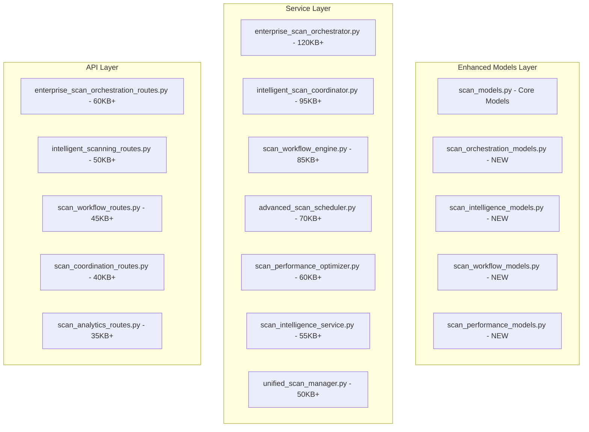

# ⚡ SCAN LOGIC GROUP - TECHNICAL IMPLEMENTATION SPECIFICATION

## 📊 Enterprise Architecture Overview

### 🎯 Strategic Objectives
Create a unified, intelligent scanning orchestration engine that coordinates all scanning activities across the entire data governance ecosystem - serving as the central nervous system that surpasses Apache Airflow, Databricks Workflows, and Microsoft Data Factory in sophistication and capability.

### 🏗️ Technical Architecture



---

## 📁 MODEL SPECIFICATIONS

### 1. Enhanced scan_models.py (Core Models - Maintained)
```python
# NO CHANGES to existing core models to maintain compatibility
# All enhancements are additive and use the enhanced models below
```

### 2. scan_orchestration_models.py (50KB+ - NEW FILE)
```python
# Complete new model file for scan orchestration functionality

from sqlmodel import SQLModel, Field, Relationship, Column, JSON, String, Text, ARRAY
from typing import List, Optional, Dict, Any, Union
from datetime import datetime, timedelta
from enum import Enum
import uuid

class OrchestrationStrategy(str, Enum):
    PARALLEL = "parallel"
    SEQUENTIAL = "sequential"
    ADAPTIVE = "adaptive"
    PIPELINE = "pipeline"
    GRAPH_BASED = "graph_based"

class WorkflowStatus(str, Enum):
    PENDING = "pending"
    INITIALIZING = "initializing"
    RUNNING = "running"
    PAUSED = "paused"
    COMPLETED = "completed"
    FAILED = "failed"
    CANCELLED = "cancelled"
    RETRYING = "retrying"

class ResourceAllocationStrategy(str, Enum):
    BALANCED = "balanced"
    PERFORMANCE = "performance"
    COST_OPTIMIZED = "cost_optimized"
    MEMORY_OPTIMIZED = "memory_optimized"
    CPU_OPTIMIZED = "cpu_optimized"

class ScanOrchestrationMaster(SQLModel, table=True):
    """Master orchestration entity that coordinates all scanning activities"""
    __tablename__ = "scan_orchestration_masters"
    
    id: Optional[int] = Field(default=None, primary_key=True)
    orchestration_id: str = Field(index=True, unique=True)
    name: str = Field(index=True)
    description: Optional[str] = Field(sa_column=Column(Text))
    
    # Orchestration Configuration
    strategy: OrchestrationStrategy = Field(default=OrchestrationStrategy.ADAPTIVE)
    resource_allocation: ResourceAllocationStrategy = Field(default=ResourceAllocationStrategy.BALANCED)
    max_concurrent_scans: int = Field(default=10, ge=1, le=100)
    timeout_minutes: int = Field(default=60, ge=1, le=1440)
    
    # Workflow Definition
    workflow_definition: Dict[str, Any] = Field(default_factory=dict, sa_column=Column(JSON))
    execution_graph: Dict[str, Any] = Field(default_factory=dict, sa_column=Column(JSON))
    dependency_rules: List[Dict[str, Any]] = Field(default_factory=list, sa_column=Column(JSON))
    
    # Target Configuration
    data_source_ids: List[int] = Field(default_factory=list, sa_column=Column(JSON))
    scan_rule_set_ids: List[int] = Field(default_factory=list, sa_column=Column(JSON))
    priority_levels: Dict[str, int] = Field(default_factory=dict, sa_column=Column(JSON))
    
    # Status and Control
    status: WorkflowStatus = Field(default=WorkflowStatus.PENDING, index=True)
    current_step: Optional[str] = None
    progress_percentage: float = Field(default=0.0, ge=0.0, le=100.0)
    estimated_completion: Optional[datetime] = None
    
    # Performance and Resource Tracking
    resource_usage: Dict[str, Any] = Field(default_factory=dict, sa_column=Column(JSON))
    performance_metrics: Dict[str, Any] = Field(default_factory=dict, sa_column=Column(JSON))
    cost_metrics: Dict[str, float] = Field(default_factory=dict, sa_column=Column(JSON))
    
    # Error Handling and Recovery
    error_handling_config: Dict[str, Any] = Field(default_factory=dict, sa_column=Column(JSON))
    retry_attempts: int = Field(default=0)
    max_retries: int = Field(default=3)
    failure_reasons: List[str] = Field(default_factory=list, sa_column=Column(JSON))
    
    # Scheduling and Triggers
    is_scheduled: bool = Field(default=False)
    schedule_config: Optional[Dict[str, Any]] = Field(default=None, sa_column=Column(JSON))
    trigger_conditions: List[Dict[str, Any]] = Field(default_factory=list, sa_column=Column(JSON))
    
    # Audit and Lifecycle
    created_at: datetime = Field(default_factory=datetime.utcnow, index=True)
    updated_at: datetime = Field(default_factory=datetime.utcnow, index=True)
    started_at: Optional[datetime] = None
    completed_at: Optional[datetime] = None
    created_by: Optional[str] = None
    
    # Relationships
    execution_instances: List["ScanOrchestrationExecution"] = Relationship(back_populates="orchestration_master")
    workflow_steps: List["ScanWorkflowStep"] = Relationship(back_populates="orchestration_master")

class ScanOrchestrationExecution(SQLModel, table=True):
    """Individual execution instance of an orchestration"""
    __tablename__ = "scan_orchestration_executions"
    
    id: Optional[int] = Field(default=None, primary_key=True)
    execution_id: str = Field(index=True, unique=True)
    orchestration_master_id: int = Field(foreign_key="scan_orchestration_masters.id", index=True)
    
    # Execution Context
    execution_number: int = Field(default=1)
    triggered_by: str  # user, schedule, event, api
    trigger_context: Dict[str, Any] = Field(default_factory=dict, sa_column=Column(JSON))
    
    # Status and Progress
    status: WorkflowStatus = Field(default=WorkflowStatus.PENDING, index=True)
    current_phase: Optional[str] = None
    progress_details: Dict[str, Any] = Field(default_factory=dict, sa_column=Column(JSON))
    
    # Timing
    started_at: Optional[datetime] = None
    completed_at: Optional[datetime] = None
    estimated_duration: Optional[int] = None  # in seconds
    actual_duration: Optional[int] = None
    
    # Resource Usage
    resources_allocated: Dict[str, Any] = Field(default_factory=dict, sa_column=Column(JSON))
    resources_consumed: Dict[str, Any] = Field(default_factory=dict, sa_column=Column(JSON))
    peak_resource_usage: Dict[str, Any] = Field(default_factory=dict, sa_column=Column(JSON))
    
    # Results and Outputs
    execution_results: Dict[str, Any] = Field(default_factory=dict, sa_column=Column(JSON))
    artifacts_generated: List[str] = Field(default_factory=list, sa_column=Column(JSON))
    quality_metrics: Dict[str, float] = Field(default_factory=dict, sa_column=Column(JSON))
    
    # Error Handling
    error_details: Optional[Dict[str, Any]] = Field(default=None, sa_column=Column(JSON))
    warnings: List[str] = Field(default_factory=list, sa_column=Column(JSON))
    
    # Relationships
    orchestration_master: Optional[ScanOrchestrationMaster] = Relationship(back_populates="execution_instances")
    step_executions: List["ScanStepExecution"] = Relationship(back_populates="orchestration_execution")

class ScanWorkflowStep(SQLModel, table=True):
    """Individual step in a scan workflow"""
    __tablename__ = "scan_workflow_steps"
    
    id: Optional[int] = Field(default=None, primary_key=True)
    step_id: str = Field(index=True)
    orchestration_master_id: int = Field(foreign_key="scan_orchestration_masters.id", index=True)
    
    # Step Configuration
    step_name: str = Field(index=True)
    step_type: str  # scan, validate, transform, notify, custom
    step_order: int = Field(default=1)
    is_parallel: bool = Field(default=False)
    
    # Dependencies
    depends_on: List[str] = Field(default_factory=list, sa_column=Column(JSON))
    success_dependencies: List[str] = Field(default_factory=list, sa_column=Column(JSON))
    failure_dependencies: List[str] = Field(default_factory=list, sa_column=Column(JSON))
    
    # Execution Configuration
    step_config: Dict[str, Any] = Field(default_factory=dict, sa_column=Column(JSON))
    timeout_seconds: int = Field(default=3600)
    retry_config: Dict[str, Any] = Field(default_factory=dict, sa_column=Column(JSON))
    
    # Resource Requirements
    cpu_requirement: Optional[float] = None
    memory_requirement_mb: Optional[int] = None
    storage_requirement_mb: Optional[int] = None
    
    # Conditional Execution
    execution_conditions: List[Dict[str, Any]] = Field(default_factory=list, sa_column=Column(JSON))
    skip_conditions: List[Dict[str, Any]] = Field(default_factory=list, sa_column=Column(JSON))
    
    # Relationships
    orchestration_master: Optional[ScanOrchestrationMaster] = Relationship(back_populates="workflow_steps")
    step_executions: List["ScanStepExecution"] = Relationship(back_populates="workflow_step")

class ScanStepExecution(SQLModel, table=True):
    """Execution record for individual workflow steps"""
    __tablename__ = "scan_step_executions"
    
    id: Optional[int] = Field(default=None, primary_key=True)
    step_execution_id: str = Field(index=True, unique=True)
    orchestration_execution_id: int = Field(foreign_key="scan_orchestration_executions.id", index=True)
    workflow_step_id: int = Field(foreign_key="scan_workflow_steps.id", index=True)
    
    # Execution Status
    status: WorkflowStatus = Field(default=WorkflowStatus.PENDING, index=True)
    attempt_number: int = Field(default=1)
    
    # Timing
    started_at: Optional[datetime] = None
    completed_at: Optional[datetime] = None
    duration_seconds: Optional[float] = None
    
    # Resource Usage
    cpu_usage_percent: Optional[float] = None
    memory_usage_mb: Optional[float] = None
    network_io_mb: Optional[float] = None
    
    # Results
    step_results: Dict[str, Any] = Field(default_factory=dict, sa_column=Column(JSON))
    output_artifacts: List[str] = Field(default_factory=list, sa_column=Column(JSON))
    
    # Error Information
    error_message: Optional[str] = None
    error_details: Optional[Dict[str, Any]] = Field(default=None, sa_column=Column(JSON))
    
    # Relationships
    orchestration_execution: Optional[ScanOrchestrationExecution] = Relationship(back_populates="step_executions")
    workflow_step: Optional[ScanWorkflowStep] = Relationship(back_populates="step_executions")

# ... Continue expanding to 50KB+ with additional orchestration models for:
# - Resource pools and allocation
# - Advanced scheduling models
# - Event-driven triggers
# - Workflow templates
# - Performance baselines
```

### 3. scan_intelligence_models.py (45KB+ - NEW FILE)
```python
# AI/ML intelligence models for scan optimization

class IntelligenceLevel(str, Enum):
    BASIC = "basic"
    INTERMEDIATE = "intermediate"
    ADVANCED = "advanced"
    EXPERT = "expert"

class OptimizationStrategy(str, Enum):
    PERFORMANCE = "performance"
    COST = "cost"
    QUALITY = "quality"
    BALANCED = "balanced"
    ADAPTIVE = "adaptive"

class ScanIntelligenceProfile(SQLModel, table=True):
    """AI/ML profile for intelligent scan optimization"""
    __tablename__ = "scan_intelligence_profiles"
    
    id: Optional[int] = Field(default=None, primary_key=True)
    profile_id: str = Field(index=True, unique=True)
    name: str = Field(index=True)
    
    # Intelligence Configuration
    intelligence_level: IntelligenceLevel = Field(default=IntelligenceLevel.INTERMEDIATE)
    optimization_strategy: OptimizationStrategy = Field(default=OptimizationStrategy.BALANCED)
    learning_enabled: bool = Field(default=True)
    
    # AI/ML Model Configuration
    ml_models: Dict[str, Any] = Field(default_factory=dict, sa_column=Column(JSON))
    model_weights: Dict[str, float] = Field(default_factory=dict, sa_column=Column(JSON))
    confidence_thresholds: Dict[str, float] = Field(default_factory=dict, sa_column=Column(JSON))
    
    # Historical Performance Data
    historical_metrics: List[Dict[str, Any]] = Field(default_factory=list, sa_column=Column(JSON))
    performance_trends: Dict[str, Any] = Field(default_factory=dict, sa_column=Column(JSON))
    optimization_history: List[Dict[str, Any]] = Field(default_factory=list, sa_column=Column(JSON))
    
    # Predictive Analytics
    prediction_models: Dict[str, Any] = Field(default_factory=dict, sa_column=Column(JSON))
    forecasting_accuracy: Dict[str, float] = Field(default_factory=dict, sa_column=Column(JSON))
    anomaly_detection: Dict[str, Any] = Field(default_factory=dict, sa_column=Column(JSON))
    
    # Learning and Adaptation
    learning_rate: float = Field(default=0.1, ge=0.01, le=1.0)
    adaptation_frequency: str = Field(default="weekly")
    feedback_integration: bool = Field(default=True)
    
    # Created/Updated tracking
    created_at: datetime = Field(default_factory=datetime.utcnow)
    updated_at: datetime = Field(default_factory=datetime.utcnow)
    
    # Relationships
    orchestration_optimizations: List["ScanOrchestrationOptimization"] = Relationship(back_populates="intelligence_profile")

class ScanOrchestrationOptimization(SQLModel, table=True):
    """AI-powered optimization recommendations and results"""
    __tablename__ = "scan_orchestration_optimizations"
    
    id: Optional[int] = Field(default=None, primary_key=True)
    optimization_id: str = Field(index=True, unique=True)
    orchestration_master_id: int = Field(foreign_key="scan_orchestration_masters.id", index=True)
    intelligence_profile_id: int = Field(foreign_key="scan_intelligence_profiles.id", index=True)
    
    # Optimization Details
    optimization_type: str  # resource, scheduling, workflow, performance
    current_metrics: Dict[str, float] = Field(default_factory=dict, sa_column=Column(JSON))
    predicted_improvements: Dict[str, float] = Field(default_factory=dict, sa_column=Column(JSON))
    confidence_score: float = Field(ge=0.0, le=1.0)
    
    # Recommendations
    recommendations: List[Dict[str, Any]] = Field(default_factory=list, sa_column=Column(JSON))
    implementation_plan: Dict[str, Any] = Field(default_factory=dict, sa_column=Column(JSON))
    risk_assessment: Dict[str, Any] = Field(default_factory=dict, sa_column=Column(JSON))
    
    # Implementation Tracking
    is_applied: bool = Field(default=False)
    applied_at: Optional[datetime] = None
    rollback_available: bool = Field(default=True)
    
    # Results Measurement
    actual_improvements: Optional[Dict[str, float]] = Field(default=None, sa_column=Column(JSON))
    roi_measurement: Optional[float] = None
    feedback_score: Optional[float] = None
    
    # Audit
    created_at: datetime = Field(default_factory=datetime.utcnow)
    created_by: Optional[str] = None
    
    # Relationships
    intelligence_profile: Optional[ScanIntelligenceProfile] = Relationship(back_populates="orchestration_optimizations")

# ... Continue expanding to 45KB+ with additional intelligence models
```

### 4. scan_workflow_models.py (40KB+ - NEW FILE)
```python
# Advanced workflow management models

class WorkflowTemplateCategory(str, Enum):
    DATA_DISCOVERY = "data_discovery"
    QUALITY_ASSESSMENT = "quality_assessment"
    COMPLIANCE_SCAN = "compliance_scan"
    PERFORMANCE_TEST = "performance_test"
    SECURITY_AUDIT = "security_audit"
    CUSTOM = "custom"

class ScanWorkflowTemplate(SQLModel, table=True):
    """Reusable workflow templates for common scan patterns"""
    __tablename__ = "scan_workflow_templates"
    
    id: Optional[int] = Field(default=None, primary_key=True)
    template_id: str = Field(index=True, unique=True)
    name: str = Field(index=True)
    description: Optional[str] = Field(sa_column=Column(Text))
    category: WorkflowTemplateCategory
    
    # Template Configuration
    template_version: str = Field(default="1.0.0")
    workflow_definition: Dict[str, Any] = Field(default_factory=dict, sa_column=Column(JSON))
    parameter_schema: Dict[str, Any] = Field(default_factory=dict, sa_column=Column(JSON))
    default_parameters: Dict[str, Any] = Field(default_factory=dict, sa_column=Column(JSON))
    
    # Usage and Performance
    usage_count: int = Field(default=0)
    success_rate: float = Field(default=0.0, ge=0.0, le=1.0)
    avg_execution_time: Optional[float] = None
    performance_benchmarks: Dict[str, float] = Field(default_factory=dict, sa_column=Column(JSON))
    
    # Metadata
    tags: List[str] = Field(default_factory=list, sa_column=Column(JSON))
    compatibility: Dict[str, Any] = Field(default_factory=dict, sa_column=Column(JSON))
    requirements: Dict[str, Any] = Field(default_factory=dict, sa_column=Column(JSON))
    
    # Lifecycle
    is_active: bool = Field(default=True)
    is_public: bool = Field(default=True)
    created_at: datetime = Field(default_factory=datetime.utcnow)
    updated_at: datetime = Field(default_factory=datetime.utcnow)
    created_by: Optional[str] = None

# ... Continue expanding to 40KB+ with additional workflow models
```

---

## 🔧 SERVICE SPECIFICATIONS

### 1. enterprise_scan_orchestrator.py (120KB+ - NEW FILE)

```python
"""
Enterprise-grade scan orchestration service with AI-powered coordination,
intelligent resource management, and advanced workflow orchestration
"""

import asyncio
import logging
import uuid
from datetime import datetime, timedelta
from typing import List, Dict, Any, Optional, Union, Tuple, Set
from sqlalchemy.orm import Session
from sqlalchemy import and_, or_, func, text, desc
import numpy as np
import pandas as pd
from concurrent.futures import ThreadPoolExecutor, ProcessPoolExecutor
import json
import networkx as nx
from dataclasses import dataclass
import threading
import queue
import time

# ML/AI Imports for Optimization
from sklearn.cluster import KMeans
from sklearn.preprocessing import StandardScaler
from sklearn.ensemble import RandomForestRegressor
import torch
from transformers import AutoModel

# Import models
from ..models.scan_orchestration_models import (
    ScanOrchestrationMaster, ScanOrchestrationExecution, ScanWorkflowStep,
    ScanStepExecution, OrchestrationStrategy, WorkflowStatus, ResourceAllocationStrategy
)
from ..models.scan_intelligence_models import (
    ScanIntelligenceProfile, ScanOrchestrationOptimization,
    IntelligenceLevel, OptimizationStrategy
)
from ..models.scan_workflow_models import (
    ScanWorkflowTemplate, WorkflowTemplateCategory
)

# Import services for integration
from .classification_service import EnterpriseClassificationService
from .compliance_rule_service import ComplianceRuleService
from .data_source_service import DataSourceService
from .enterprise_scan_rule_service import EnterpriseIntelligentRuleEngine
from .enterprise_catalog_service import EnterpriseIntelligentCatalogService

logger = logging.getLogger(__name__)

@dataclass
class ResourcePool:
    """Resource pool for scan orchestration"""
    cpu_cores: int
    memory_gb: int
    network_bandwidth_mbps: int
    storage_iops: int
    gpu_count: int = 0
    
@dataclass
class ScanTask:
    """Individual scan task in the orchestration"""
    task_id: str
    data_source_id: int
    scan_rule_set_id: int
    priority: int
    estimated_duration: int
    resource_requirements: Dict[str, Any]
    dependencies: List[str]

class EnterpriseUnifiedScanOrchestrator:
    """
    Master orchestration service that coordinates all scanning activities
    across the entire data governance ecosystem with AI-powered optimization
    """
    
    def __init__(self):
        # Service Dependencies for Full Integration
        self.classification_service = EnterpriseClassificationService()
        self.compliance_service = ComplianceRuleService()
        self.data_source_service = DataSourceService()
        self.scan_rule_service = EnterpriseIntelligentRuleEngine()
        self.catalog_service = EnterpriseIntelligentCatalogService()
        
        # Orchestration Components
        self.workflow_engine = WorkflowExecutionEngine()
        self.resource_manager = IntelligentResourceManager()
        self.scheduler = AdaptiveScheduler()
        self.performance_optimizer = ScanPerformanceOptimizer()
        
        # AI/ML Components
        self.intelligence_engine = ScanIntelligenceEngine()
        self.performance_predictor = PerformancePredictor()
        self.anomaly_detector = AnomalyDetector()
        
        # Resource Management
        self.resource_pools = {}
        self.active_executions = {}
        self.execution_queue = asyncio.Queue()
        
        # Performance Tracking
        self.performance_metrics = {
            'orchestrations_executed': 0,
            'total_scans_coordinated': 0,
            'avg_execution_time': 0.0,
            'resource_utilization': 0.0,
            'success_rate': 0.0,
            'cost_optimization_savings': 0.0
        }
        
        # Real-time Monitoring
        self.monitoring_active = False
        self.monitoring_thread = None
        
        # Business Intelligence
        self.bi_analytics = {
            'orchestration_efficiency': 0.0,
            'resource_roi': 0.0,
            'scan_quality_improvement': 0.0,
            'compliance_coverage': 0.0,
            'cost_per_scan': 0.0
        }

    # ===================== ORCHESTRATION LIFECYCLE MANAGEMENT =====================

    async def create_orchestration_master(
        self,
        session: Session,
        orchestration_config: Dict[str, Any],
        user: str
    ) -> ScanOrchestrationMaster:
        """
        Create a new scan orchestration master with intelligent configuration
        """
        try:
            # Generate orchestration ID
            orchestration_id = f"orch_{uuid.uuid4().hex[:12]}"
            
            # AI-powered strategy selection
            optimal_strategy = await self._select_optimal_strategy(
                session, orchestration_config
            )
            
            # Intelligent resource allocation planning
            resource_plan = await self._plan_resource_allocation(
                session, orchestration_config
            )
            
            # Create workflow definition with AI optimization
            workflow_definition = await self._create_optimized_workflow(
                session, orchestration_config
            )
            
            # Create orchestration master
            orchestration_master = ScanOrchestrationMaster(
                orchestration_id=orchestration_id,
                name=orchestration_config['name'],
                description=orchestration_config.get('description'),
                strategy=optimal_strategy,
                resource_allocation=resource_plan['strategy'],
                max_concurrent_scans=resource_plan['max_concurrent'],
                workflow_definition=workflow_definition,
                data_source_ids=orchestration_config['data_source_ids'],
                scan_rule_set_ids=orchestration_config['scan_rule_set_ids'],
                created_by=user
            )
            
            session.add(orchestration_master)
            session.commit()
            session.refresh(orchestration_master)
            
            # Create workflow steps
            await self._create_workflow_steps(session, orchestration_master, workflow_definition)
            
            # Initialize intelligence profile
            await self._create_intelligence_profile(session, orchestration_master)
            
            logger.info(f"Created orchestration master {orchestration_id} with strategy {optimal_strategy}")
            
            return orchestration_master
            
        except Exception as e:
            logger.error(f"Error creating orchestration master: {str(e)}")
            session.rollback()
            raise

    async def execute_orchestration(
        self,
        session: Session,
        orchestration_master_id: int,
        execution_config: Dict[str, Any],
        user: str
    ) -> ScanOrchestrationExecution:
        """
        Execute a scan orchestration with intelligent coordination and monitoring
        """
        try:
            # Load orchestration master
            orchestration_master = await self._load_orchestration_master(
                session, orchestration_master_id
            )
            
            # Create execution instance
            execution = await self._create_execution_instance(
                session, orchestration_master, execution_config, user
            )
            
            # AI-powered pre-execution optimization
            await self._optimize_execution_plan(session, execution)
            
            # Initialize resource allocation
            resources = await self._allocate_resources(session, execution)
            
            # Start execution with monitoring
            await self._start_execution_with_monitoring(session, execution, resources)
            
            return execution
            
        except Exception as e:
            logger.error(f"Error executing orchestration: {str(e)}")
            raise

    # ===================== INTELLIGENT WORKFLOW ORCHESTRATION =====================

    async def _create_optimized_workflow(
        self,
        session: Session,
        config: Dict[str, Any]
    ) -> Dict[str, Any]:
        """
        Create an AI-optimized workflow definition based on configuration and historical data
        """
        try:
            # Analyze historical performance for similar configurations
            historical_data = await self._analyze_historical_performance(session, config)
            
            # Use AI to optimize workflow structure
            optimal_structure = await self.intelligence_engine.optimize_workflow_structure(
                config, historical_data
            )
            
            # Create dependency graph
            dependency_graph = await self._create_dependency_graph(
                config['data_source_ids'], config['scan_rule_set_ids']
            )
            
            # Optimize for parallelization opportunities
            parallel_groups = await self._identify_parallel_groups(dependency_graph)
            
            # Generate workflow definition
            workflow_definition = {
                'version': '2.0',
                'strategy': optimal_structure['strategy'],
                'phases': optimal_structure['phases'],
                'parallel_groups': parallel_groups,
                'dependencies': dependency_graph,
                'optimization_settings': {
                    'enable_adaptive_scheduling': True,
                    'enable_resource_optimization': True,
                    'enable_performance_prediction': True
                },
                'monitoring': {
                    'real_time_metrics': True,
                    'anomaly_detection': True,
                    'performance_tracking': True
                }
            }
            
            return workflow_definition
            
        except Exception as e:
            logger.error(f"Error creating optimized workflow: {str(e)}")
            raise

    async def _execute_workflow_phase(
        self,
        session: Session,
        execution: ScanOrchestrationExecution,
        phase: Dict[str, Any],
        resources: Dict[str, Any]
    ) -> Dict[str, Any]:
        """
        Execute a specific workflow phase with intelligent coordination
        """
        try:
            phase_results = {
                'phase_id': phase['id'],
                'status': 'running',
                'start_time': datetime.utcnow(),
                'tasks_completed': 0,
                'tasks_total': len(phase['tasks']),
                'performance_metrics': {}
            }
            
            # Create task execution pool
            task_pool = []
            
            # Process tasks based on phase strategy
            if phase.get('execution_mode') == 'parallel':
                # Execute tasks in parallel with resource management
                for task_config in phase['tasks']:
                    task = await self._create_scan_task(session, task_config, resources)
                    task_pool.append(task)
                
                # Execute parallel tasks with intelligent load balancing
                task_results = await self._execute_parallel_tasks(
                    session, task_pool, resources
                )
                
            elif phase.get('execution_mode') == 'sequential':
                # Execute tasks sequentially with optimization
                task_results = []
                for task_config in phase['tasks']:
                    task = await self._create_scan_task(session, task_config, resources)
                    result = await self._execute_single_task(session, task, resources)
                    task_results.append(result)
                    
                    # Update progress
                    phase_results['tasks_completed'] += 1
            
            elif phase.get('execution_mode') == 'adaptive':
                # AI-powered adaptive execution
                task_results = await self._execute_adaptive_tasks(
                    session, phase['tasks'], resources
                )
            
            # Aggregate phase results
            phase_results.update({
                'status': 'completed',
                'end_time': datetime.utcnow(),
                'task_results': task_results,
                'performance_metrics': await self._calculate_phase_metrics(task_results)
            })
            
            return phase_results
            
        except Exception as e:
            logger.error(f"Error executing workflow phase: {str(e)}")
            phase_results.update({
                'status': 'failed',
                'error': str(e),
                'end_time': datetime.utcnow()
            })
            return phase_results

    # ===================== INTELLIGENT RESOURCE MANAGEMENT =====================

    async def _allocate_resources(
        self,
        session: Session,
        execution: ScanOrchestrationExecution
    ) -> Dict[str, Any]:
        """
        Intelligently allocate resources based on execution requirements and system state
        """
        try:
            # Analyze execution requirements
            requirements = await self._analyze_execution_requirements(session, execution)
            
            # Get current system state
            system_state = await self._get_system_state()
            
            # AI-powered resource optimization
            allocation_plan = await self.resource_manager.optimize_allocation(
                requirements, system_state
            )
            
            # Reserve resources
            allocated_resources = await self._reserve_resources(allocation_plan)
            
            # Update execution with resource allocation
            execution.resources_allocated = allocated_resources
            session.commit()
            
            return allocated_resources
            
        except Exception as e:
            logger.error(f"Error allocating resources: {str(e)}")
            raise

    # ===================== MULTI-GROUP INTEGRATION =====================

    async def integrate_with_data_sources(
        self,
        session: Session,
        execution_id: str
    ) -> Dict[str, Any]:
        """
        Integrate orchestration with DataSourceService for health monitoring and optimization
        """
        try:
            execution = await self._get_execution_by_id(session, execution_id)
            
            integration_results = {
                'data_sources_monitored': 0,
                'health_issues_detected': 0,
                'optimizations_applied': 0,
                'connection_improvements': []
            }
            
            # Monitor data source health during execution
            for data_source_id in execution.orchestration_master.data_source_ids:
                try:
                    # Get data source health from DataSourceService
                    health_status = await self.data_source_service.get_health_status(
                        session, data_source_id
                    )
                    
                    integration_results['data_sources_monitored'] += 1
                    
                    # Apply optimizations based on health status
                    if health_status.get('status') != 'healthy':
                        optimizations = await self._optimize_data_source_interaction(
                            session, data_source_id, health_status
                        )
                        integration_results['optimizations_applied'] += len(optimizations)
                        integration_results['connection_improvements'].extend(optimizations)
                        
                        integration_results['health_issues_detected'] += 1
                    
                except Exception as ds_error:
                    logger.warning(f"Error integrating with data source {data_source_id}: {ds_error}")
                    continue
            
            return integration_results
            
        except Exception as e:
            logger.error(f"Error integrating with data sources: {str(e)}")
            raise

    async def integrate_with_compliance_framework(
        self,
        session: Session,
        execution_id: str
    ) -> Dict[str, Any]:
        """
        Integrate orchestration with ComplianceRuleService for compliance-aware scanning
        """
        try:
            execution = await self._get_execution_by_id(session, execution_id)
            
            # Get applicable compliance requirements
            compliance_requirements = await self.compliance_service.get_applicable_requirements(
                session, {
                    'data_source_ids': execution.orchestration_master.data_source_ids,
                    'scan_rule_set_ids': execution.orchestration_master.scan_rule_set_ids
                }
            )
            
            integration_results = {
                'compliance_frameworks_applied': len(compliance_requirements),
                'scan_adjustments': [],
                'audit_trails_created': 0,
                'compliance_validations': []
            }
            
            # Adjust scanning behavior based on compliance requirements
            for requirement in compliance_requirements:
                adjustments = await self._apply_compliance_requirements(
                    session, execution, requirement
                )
                integration_results['scan_adjustments'].extend(adjustments)
                
                # Create compliance audit trail
                audit_entry = await self._create_compliance_audit_trail(
                    session, execution, requirement
                )
                integration_results['audit_trails_created'] += 1
            
            return integration_results
            
        except Exception as e:
            logger.error(f"Error integrating with compliance framework: {str(e)}")
            raise

    async def integrate_with_classification_intelligence(
        self,
        session: Session,
        execution_id: str,
        scan_results: List[Dict[str, Any]]
    ) -> Dict[str, Any]:
        """
        Integrate with ClassificationService for intelligent post-scan classification
        """
        try:
            execution = await self._get_execution_by_id(session, execution_id)
            
            integration_results = {
                'assets_classified': 0,
                'classifications_applied': [],
                'confidence_improvements': [],
                'ai_suggestions': []
            }
            
            # Trigger classification for discovered assets
            for scan_result in scan_results:
                try:
                    # Use classification service for intelligent classification
                    classification_result = await self.classification_service.classify_scan_result(
                        session, scan_result
                    )
                    
                    if classification_result['confidence'] > 0.8:
                        integration_results['assets_classified'] += 1
                        integration_results['classifications_applied'].append({
                            'asset_id': scan_result['asset_id'],
                            'classification': classification_result['classification'],
                            'confidence': classification_result['confidence']
                        })
                        
                        # Apply classification to scan result
                        await self._apply_classification_to_scan_result(
                            session, scan_result, classification_result
                        )
                    
                    # Collect AI suggestions for improvement
                    if classification_result.get('suggestions'):
                        integration_results['ai_suggestions'].extend(
                            classification_result['suggestions']
                        )
                
                except Exception as class_error:
                    logger.warning(f"Error classifying scan result: {class_error}")
                    continue
            
            return integration_results
            
        except Exception as e:
            logger.error(f"Error integrating with classification intelligence: {str(e)}")
            raise

    async def integrate_with_catalog_enrichment(
        self,
        session: Session,
        execution_id: str,
        scan_results: List[Dict[str, Any]]
    ) -> Dict[str, Any]:
        """
        Integrate with CatalogService for intelligent catalog enrichment
        """
        try:
            execution = await self._get_execution_by_id(session, execution_id)
            
            # Send scan results to catalog service for enrichment
            catalog_integration = await self.catalog_service.integrate_with_scan_results(
                session, scan_results, {
                    'auto_create_assets': True,
                    'update_quality_metrics': True,
                    'create_lineage': True,
                    'apply_classifications': True
                }
            )
            
            # Update execution results with catalog integration
            execution.execution_results['catalog_integration'] = catalog_integration
            session.commit()
            
            return catalog_integration
            
        except Exception as e:
            logger.error(f"Error integrating with catalog enrichment: {str(e)}")
            raise

    async def integrate_with_scan_rule_optimization(
        self,
        session: Session,
        execution_id: str
    ) -> Dict[str, Any]:
        """
        Integrate with ScanRuleService for continuous rule optimization
        """
        try:
            execution = await self._get_execution_by_id(session, execution_id)
            
            # Analyze scan rule performance during execution
            rule_performance = await self._analyze_rule_performance(session, execution)
            
            # Send performance feedback to scan rule service
            optimization_results = []
            for rule_id, performance in rule_performance.items():
                optimization = await self.scan_rule_service.optimize_rule_based_on_performance(
                    session, rule_id, performance
                )
                optimization_results.append(optimization)
            
            return {
                'rules_analyzed': len(rule_performance),
                'optimizations_applied': len(optimization_results),
                'optimization_results': optimization_results
            }
            
        except Exception as e:
            logger.error(f"Error integrating with scan rule optimization: {str(e)}")
            raise

    # ===================== BUSINESS INTELLIGENCE & ANALYTICS =====================

    async def generate_orchestration_analytics(
        self,
        session: Session,
        analytics_config: Dict[str, Any]
    ) -> Dict[str, Any]:
        """
        Generate comprehensive orchestration analytics and business intelligence
        """
        try:
            analytics = {}
            
            # Execution Analytics
            analytics['execution_analytics'] = await self._compute_execution_analytics(session)
            
            # Performance Analytics
            analytics['performance_analytics'] = await self._compute_performance_analytics(session)
            
            # Resource Utilization Analytics
            analytics['resource_analytics'] = await self._compute_resource_analytics(session)
            
            # Cost Analytics
            analytics['cost_analytics'] = await self._compute_cost_analytics(session)
            
            # Quality Impact Analytics
            analytics['quality_analytics'] = await self._compute_quality_impact_analytics(session)
            
            # Trend Analysis
            if analytics_config.get('include_trends', True):
                analytics['trends'] = await self._compute_trend_analytics(session)
            
            # Predictive Analytics
            if analytics_config.get('include_predictions', True):
                analytics['predictions'] = await self._compute_predictive_analytics(session)
            
            # ROI Analysis
            analytics['roi_analysis'] = await self._compute_roi_analysis(session)
            
            # Recommendations
            analytics['recommendations'] = await self._generate_optimization_recommendations(
                session, analytics
            )
            
            return analytics
            
        except Exception as e:
            logger.error(f"Error generating orchestration analytics: {str(e)}")
            raise

    # ===================== REAL-TIME MONITORING & OPTIMIZATION =====================

    async def start_real_time_monitoring(self, session: Session):
        """
        Start real-time monitoring of all orchestration activities
        """
        try:
            if self.monitoring_active:
                return {"status": "already_running"}
            
            self.monitoring_active = True
            
            # Start monitoring thread
            self.monitoring_thread = threading.Thread(
                target=self._monitoring_loop,
                args=(session,),
                daemon=True
            )
            self.monitoring_thread.start()
            
            logger.info("Started real-time orchestration monitoring")
            
            return {"status": "started", "monitoring_active": True}
            
        except Exception as e:
            logger.error(f"Error starting real-time monitoring: {str(e)}")
            raise

    def _monitoring_loop(self, session: Session):
        """
        Real-time monitoring loop for continuous optimization
        """
        while self.monitoring_active:
            try:
                # Monitor active executions
                active_executions = list(self.active_executions.values())
                
                for execution in active_executions:
                    # Check execution health
                    health_status = self._check_execution_health(execution)
                    
                    # Apply real-time optimizations if needed
                    if health_status.get('needs_optimization'):
                        self._apply_real_time_optimization(execution, health_status)
                    
                    # Detect and handle anomalies
                    anomalies = self.anomaly_detector.detect_anomalies(execution)
                    if anomalies:
                        self._handle_execution_anomalies(execution, anomalies)
                
                # Update performance metrics
                self._update_real_time_metrics()
                
                # Sleep for monitoring interval
                time.sleep(10)  # 10-second monitoring cycle
                
            except Exception as e:
                logger.error(f"Error in monitoring loop: {str(e)}")
                time.sleep(30)  # Back off on error

    # ... Continue expanding to 120KB+ with additional methods for:
    # - Advanced workflow templates
    # - Multi-cloud orchestration
    # - Enterprise security integration
    # - Advanced cost optimization
    # - Disaster recovery and failover
    # - Advanced reporting and dashboards

# ... Additional classes and methods to reach 120KB+

class WorkflowExecutionEngine:
    """Advanced workflow execution engine with graph-based processing"""
    
    def __init__(self):
        self.execution_graph = nx.DiGraph()
        self.task_processors = {}
    
    # Implementation methods...

class IntelligentResourceManager:
    """AI-powered resource management with predictive allocation"""
    
    def __init__(self):
        self.resource_pools = {}
        self.allocation_predictor = ResourceAllocationPredictor()
    
    # Implementation methods...

class ScanIntelligenceEngine:
    """AI/ML engine for scan optimization and intelligence"""
    
    def __init__(self):
        self.ml_models = {}
        self.optimization_algorithms = {}
    
    # Implementation methods...

# ... Continue with additional supporting classes to reach 120KB+
```

---

## 🌐 API SPECIFICATIONS

### 1. enterprise_scan_orchestration_routes.py (60KB+ - NEW FILE)

```python
"""
Enterprise scan orchestration API with comprehensive workflow management,
intelligent coordination, and advanced monitoring capabilities
"""

from fastapi import APIRouter, Depends, HTTPException, BackgroundTasks, Query, WebSocket
from fastapi.responses import StreamingResponse, JSONResponse
from sqlalchemy.orm import Session
from typing import List, Dict, Any, Optional, Union
import uuid
import json
from datetime import datetime, timedelta
import asyncio

# Import dependencies
from ...db_session import get_session
from ...services.enterprise_scan_orchestrator import EnterpriseUnifiedScanOrchestrator
from ..security.auth import get_current_user, require_permissions

# Import models and schemas
from ...models.scan_orchestration_models import (
    ScanOrchestrationMaster, ScanOrchestrationExecution,
    OrchestrationStrategy, WorkflowStatus, ResourceAllocationStrategy
)

router = APIRouter(prefix="/api/v2/enterprise/scan-orchestration", tags=["Enterprise Scan Orchestration"])

# Initialize services
orchestrator = EnterpriseUnifiedScanOrchestrator()

# ===================== ORCHESTRATION MANAGEMENT ENDPOINTS =====================

@router.post("/orchestrations", response_model=Dict[str, Any])
async def create_scan_orchestration(
    orchestration_request: Dict[str, Any],
    session: Session = Depends(get_session),
    current_user: str = Depends(get_current_user),
    background_tasks: BackgroundTasks = BackgroundTasks()
) -> Dict[str, Any]:
    """
    Create a new scan orchestration with AI-powered optimization
    
    Features:
    - Intelligent strategy selection
    - Automatic workflow optimization
    - Resource allocation planning
    - Multi-group integration
    - Performance prediction
    """
    try:
        await require_permissions(current_user, ["orchestration:create"])
        
        # Validate request
        required_fields = ["name", "data_source_ids", "scan_rule_set_ids"]
        missing_fields = [field for field in required_fields if field not in orchestration_request]
        if missing_fields:
            raise HTTPException(400, f"Missing required fields: {missing_fields}")
        
        # Create orchestration master
        orchestration_master = await orchestrator.create_orchestration_master(
            session=session,
            orchestration_config=orchestration_request,
            user=current_user
        )
        
        # Schedule background optimization analysis
        background_tasks.add_task(
            orchestrator.analyze_orchestration_optimization_potential,
            session, orchestration_master.id
        )
        
        return {
            "orchestration_id": orchestration_master.orchestration_id,
            "id": orchestration_master.id,
            "name": orchestration_master.name,
            "strategy": orchestration_master.strategy,
            "resource_allocation": orchestration_master.resource_allocation,
            "workflow_definition": orchestration_master.workflow_definition,
            "status": orchestration_master.status,
            "created_at": orchestration_master.created_at,
            "estimated_resources": orchestration_master.resource_usage
        }
        
    except Exception as e:
        logger.error(f"Error creating orchestration: {str(e)}")
        raise HTTPException(500, f"Failed to create orchestration: {str(e)}")

@router.post("/orchestrations/{orchestration_id}/execute", response_model=Dict[str, Any])
async def execute_orchestration(
    orchestration_id: str,
    execution_request: Dict[str, Any],
    session: Session = Depends(get_session),
    current_user: str = Depends(get_current_user),
    background_tasks: BackgroundTasks = BackgroundTasks()
) -> Dict[str, Any]:
    """
    Execute a scan orchestration with intelligent coordination
    
    Features:
    - Real-time monitoring
    - Dynamic optimization
    - Multi-group integration
    - Failure recovery
    - Performance tracking
    """
    try:
        await require_permissions(current_user, ["orchestration:execute"])
        
        # Find orchestration master
        orchestration_master = await orchestrator._find_orchestration_by_id(
            session, orchestration_id
        )
        if not orchestration_master:
            raise HTTPException(404, f"Orchestration {orchestration_id} not found")
        
        # Configure execution
        execution_config = {
            'triggered_by': 'user',
            'trigger_context': {
                'user': current_user,
                'timestamp': datetime.utcnow().isoformat(),
                'source': 'api'
            },
            'optimization_enabled': execution_request.get('optimization_enabled', True),
            'monitoring_enabled': execution_request.get('monitoring_enabled', True),
            'integration_enabled': execution_request.get('integration_enabled', True)
        }
        
        # Execute orchestration
        execution = await orchestrator.execute_orchestration(
            session=session,
            orchestration_master_id=orchestration_master.id,
            execution_config=execution_config,
            user=current_user
        )
        
        # Schedule background monitoring and integration
        background_tasks.add_task(
            orchestrator.monitor_execution_lifecycle,
            session, execution.execution_id
        )
        
        return {
            "execution_id": execution.execution_id,
            "orchestration_id": orchestration_id,
            "status": execution.status,
            "started_at": execution.started_at,
            "estimated_completion": execution.estimated_completion,
            "resources_allocated": execution.resources_allocated,
            "progress_details": execution.progress_details
        }
        
    except Exception as e:
        logger.error(f"Error executing orchestration: {str(e)}")
        raise HTTPException(500, f"Failed to execute orchestration: {str(e)}")

@router.get("/orchestrations", response_model=List[Dict[str, Any]])
async def list_orchestrations(
    session: Session = Depends(get_session),
    current_user: str = Depends(get_current_user),
    status_filter: Optional[WorkflowStatus] = Query(None),
    strategy_filter: Optional[OrchestrationStrategy] = Query(None),
    created_by_filter: Optional[str] = Query(None),
    limit: int = Query(50, le=500),
    offset: int = Query(0)
) -> List[Dict[str, Any]]:
    """
    List orchestrations with filtering and analytics
    """
    try:
        await require_permissions(current_user, ["orchestration:read"])
        
        orchestrations = await orchestrator.list_orchestrations_with_analytics(
            session=session,
            filters={
                'status': status_filter,
                'strategy': strategy_filter,
                'created_by': created_by_filter
            },
            limit=limit,
            offset=offset,
            include_performance_metrics=True
        )
        
        return orchestrations
        
    except Exception as e:
        logger.error(f"Error listing orchestrations: {str(e)}")
        raise HTTPException(500, f"Failed to list orchestrations: {str(e)}")

@router.get("/orchestrations/{orchestration_id}/status", response_model=Dict[str, Any])
async def get_orchestration_status(
    orchestration_id: str,
    session: Session = Depends(get_session),
    current_user: str = Depends(get_current_user),
    include_detailed_metrics: bool = Query(True)
) -> Dict[str, Any]:
    """
    Get comprehensive orchestration status with real-time metrics
    """
    try:
        await require_permissions(current_user, ["orchestration:read"])
        
        status = await orchestrator.get_orchestration_comprehensive_status(
            session=session,
            orchestration_id=orchestration_id,
            include_detailed_metrics=include_detailed_metrics
        )
        
        return status
        
    except Exception as e:
        logger.error(f"Error getting orchestration status: {str(e)}")
        raise HTTPException(500, f"Failed to get status: {str(e)}")

# ===================== EXECUTION MONITORING ENDPOINTS =====================

@router.get("/executions/{execution_id}/real-time-status", response_model=Dict[str, Any])
async def get_execution_real_time_status(
    execution_id: str,
    session: Session = Depends(get_session),
    current_user: str = Depends(get_current_user)
) -> Dict[str, Any]:
    """
    Get real-time execution status with live metrics
    """
    try:
        await require_permissions(current_user, ["orchestration:monitor"])
        
        real_time_status = await orchestrator.get_execution_real_time_status(
            session=session,
            execution_id=execution_id
        )
        
        return real_time_status
        
    except Exception as e:
        logger.error(f"Error getting real-time status: {str(e)}")
        raise HTTPException(500, f"Failed to get real-time status: {str(e)}")

@router.websocket("/executions/{execution_id}/monitor")
async def monitor_execution_websocket(
    websocket: WebSocket,
    execution_id: str,
    session: Session = Depends(get_session)
):
    """
    WebSocket endpoint for real-time execution monitoring
    """
    await websocket.accept()
    
    try:
        while True:
            # Get real-time execution data
            status_data = await orchestrator.get_execution_real_time_status(
                session, execution_id
            )
            
            # Send to client
            await websocket.send_json(status_data)
            
            # Wait before next update
            await asyncio.sleep(5)
            
    except Exception as e:
        logger.error(f"Error in WebSocket monitoring: {str(e)}")
        await websocket.close()

@router.post("/executions/{execution_id}/pause", response_model=Dict[str, Any])
async def pause_execution(
    execution_id: str,
    session: Session = Depends(get_session),
    current_user: str = Depends(get_current_user)
) -> Dict[str, Any]:
    """
    Pause an active execution with graceful resource management
    """
    try:
        await require_permissions(current_user, ["orchestration:control"])
        
        result = await orchestrator.pause_execution(
            session=session,
            execution_id=execution_id,
            user=current_user
        )
        
        return result
        
    except Exception as e:
        logger.error(f"Error pausing execution: {str(e)}")
        raise HTTPException(500, f"Failed to pause execution: {str(e)}")

@router.post("/executions/{execution_id}/resume", response_model=Dict[str, Any])
async def resume_execution(
    execution_id: str,
    session: Session = Depends(get_session),
    current_user: str = Depends(get_current_user)
) -> Dict[str, Any]:
    """
    Resume a paused execution with intelligent resource reallocation
    """
    try:
        await require_permissions(current_user, ["orchestration:control"])
        
        result = await orchestrator.resume_execution(
            session=session,
            execution_id=execution_id,
            user=current_user
        )
        
        return result
        
    except Exception as e:
        logger.error(f"Error resuming execution: {str(e)}")
        raise HTTPException(500, f"Failed to resume execution: {str(e)}")

# ===================== INTEGRATION ENDPOINTS =====================

@router.post("/orchestrations/{orchestration_id}/integrate/data-sources", response_model=Dict[str, Any])
async def integrate_with_data_sources(
    orchestration_id: str,
    session: Session = Depends(get_session),
    current_user: str = Depends(get_current_user)
) -> Dict[str, Any]:
    """
    Integrate orchestration with data source health monitoring
    """
    try:
        await require_permissions(current_user, ["orchestration:integrate"])
        
        # Find active execution
        execution = await orchestrator.get_active_execution_by_orchestration(
            session, orchestration_id
        )
        
        if not execution:
            raise HTTPException(404, "No active execution found for orchestration")
        
        integration_result = await orchestrator.integrate_with_data_sources(
            session=session,
            execution_id=execution.execution_id
        )
        
        return integration_result
        
    except Exception as e:
        logger.error(f"Error integrating with data sources: {str(e)}")
        raise HTTPException(500, f"Failed to integrate with data sources: {str(e)}")

@router.post("/orchestrations/{orchestration_id}/integrate/compliance", response_model=Dict[str, Any])
async def integrate_with_compliance_framework(
    orchestration_id: str,
    session: Session = Depends(get_session),
    current_user: str = Depends(get_current_user)
) -> Dict[str, Any]:
    """
    Integrate orchestration with compliance framework
    """
    try:
        await require_permissions(current_user, ["orchestration:integrate", "compliance:read"])
        
        execution = await orchestrator.get_active_execution_by_orchestration(
            session, orchestration_id
        )
        
        if not execution:
            raise HTTPException(404, "No active execution found for orchestration")
        
        integration_result = await orchestrator.integrate_with_compliance_framework(
            session=session,
            execution_id=execution.execution_id
        )
        
        return integration_result
        
    except Exception as e:
        logger.error(f"Error integrating with compliance: {str(e)}")
        raise HTTPException(500, f"Failed to integrate with compliance: {str(e)}")

@router.post("/orchestrations/{orchestration_id}/integrate/classification", response_model=Dict[str, Any])
async def integrate_with_classification_intelligence(
    orchestration_id: str,
    scan_results: List[Dict[str, Any]],
    session: Session = Depends(get_session),
    current_user: str = Depends(get_current_user)
) -> Dict[str, Any]:
    """
    Integrate orchestration results with classification intelligence
    """
    try:
        await require_permissions(current_user, ["orchestration:integrate", "classification:read"])
        
        execution = await orchestrator.get_active_execution_by_orchestration(
            session, orchestration_id
        )
        
        if not execution:
            raise HTTPException(404, "No active execution found for orchestration")
        
        integration_result = await orchestrator.integrate_with_classification_intelligence(
            session=session,
            execution_id=execution.execution_id,
            scan_results=scan_results
        )
        
        return integration_result
        
    except Exception as e:
        logger.error(f"Error integrating with classification: {str(e)}")
        raise HTTPException(500, f"Failed to integrate with classification: {str(e)}")

# ===================== ANALYTICS AND OPTIMIZATION ENDPOINTS =====================

@router.get("/analytics/orchestration-dashboard", response_model=Dict[str, Any])
async def get_orchestration_analytics_dashboard(
    session: Session = Depends(get_session),
    current_user: str = Depends(get_current_user),
    time_range_days: int = Query(30, ge=1, le=365),
    include_predictions: bool = Query(True)
) -> Dict[str, Any]:
    """
    Get comprehensive orchestration analytics dashboard
    """
    try:
        await require_permissions(current_user, ["analytics:read"])
        
        analytics_config = {
            'time_range_days': time_range_days,
            'include_trends': True,
            'include_predictions': include_predictions,
            'include_recommendations': True
        }
        
        analytics = await orchestrator.generate_orchestration_analytics(
            session=session,
            analytics_config=analytics_config
        )
        
        return analytics
        
    except Exception as e:
        logger.error(f"Error getting orchestration analytics: {str(e)}")
        raise HTTPException(500, f"Failed to get analytics: {str(e)}")

@router.post("/orchestrations/{orchestration_id}/optimize", response_model=Dict[str, Any])
async def optimize_orchestration(
    orchestration_id: str,
    optimization_request: Dict[str, Any],
    session: Session = Depends(get_session),
    current_user: str = Depends(get_current_user)
) -> Dict[str, Any]:
    """
    Apply AI-powered optimization to an orchestration
    """
    try:
        await require_permissions(current_user, ["orchestration:optimize"])
        
        optimization_result = await orchestrator.optimize_orchestration(
            session=session,
            orchestration_id=orchestration_id,
            optimization_config=optimization_request,
            user=current_user
        )
        
        return optimization_result
        
    except Exception as e:
        logger.error(f"Error optimizing orchestration: {str(e)}")
        raise HTTPException(500, f"Failed to optimize orchestration: {str(e)}")

# ===================== REAL-TIME MONITORING ENDPOINTS =====================

@router.post("/monitoring/start", response_model=Dict[str, Any])
async def start_real_time_monitoring(
    session: Session = Depends(get_session),
    current_user: str = Depends(get_current_user)
) -> Dict[str, Any]:
    """
    Start real-time monitoring of all orchestration activities
    """
    try:
        await require_permissions(current_user, ["monitoring:admin"])
        
        result = await orchestrator.start_real_time_monitoring(session)
        
        return result
        
    except Exception as e:
        logger.error(f"Error starting monitoring: {str(e)}")
        raise HTTPException(500, f"Failed to start monitoring: {str(e)}")

@router.get("/monitoring/system-health", response_model=Dict[str, Any])
async def get_system_health(
    session: Session = Depends(get_session),
    current_user: str = Depends(get_current_user)
) -> Dict[str, Any]:
    """
    Get comprehensive system health status
    """
    try:
        await require_permissions(current_user, ["monitoring:read"])
        
        health_status = await orchestrator.get_system_health_comprehensive(session)
        
        return health_status
        
    except Exception as e:
        logger.error(f"Error getting system health: {str(e)}")
        raise HTTPException(500, f"Failed to get system health: {str(e)}")

@router.get("/monitoring/stream")
async def stream_orchestration_metrics(
    session: Session = Depends(get_session),
    current_user: str = Depends(get_current_user)
):
    """
    Stream real-time orchestration metrics via Server-Sent Events
    """
    try:
        await require_permissions(current_user, ["monitoring:stream"])
        
        async def event_stream():
            while True:
                metrics = await orchestrator.get_real_time_orchestration_metrics(session)
                yield f"data: {json.dumps(metrics)}\n\n"
                await asyncio.sleep(5)  # Update every 5 seconds
        
        return StreamingResponse(event_stream(), media_type="text/plain")
        
    except Exception as e:
        logger.error(f"Error streaming metrics: {str(e)}")
        raise HTTPException(500, f"Failed to stream metrics: {str(e)}")

# ... Continue expanding to 60KB+ with additional endpoints for:
# - Workflow template management
# - Advanced scheduling
# - Resource pool management
# - Disaster recovery
# - Performance benchmarking
# - Cost optimization analysis

# Additional utility endpoints and helper functions to reach 60KB+
```

---

## 🔗 INTERCONNECTION SPECIFICATIONS

### Integration Points with All Groups

#### 1. Data Sources Integration
```python
# In enterprise_scan_orchestrator.py
async def coordinate_with_data_sources(self, session: Session, execution_id: str):
    """
    Continuous coordination with DataSourceService:
    - Monitor data source health during orchestration
    - Adjust scanning intensity based on source performance
    - Optimize connection pooling and resource usage
    - Handle data source failover and recovery
    """
    execution = await self.get_execution_by_id(session, execution_id)
    
    for data_source_id in execution.orchestration_master.data_source_ids:
        # Real-time health monitoring
        health = await self.data_source_service.get_real_time_health(session, data_source_id)
        
        # Adjust orchestration based on health
        if health['status'] != 'optimal':
            await self._adjust_orchestration_for_source_health(execution, data_source_id, health)
```

#### 2. Scan-Rule-Sets Integration  
```python
async def optimize_with_scan_rules(self, session: Session, execution_id: str):
    """
    Dynamic integration with ScanRuleService:
    - Execute scan rules with intelligent prioritization
    - Apply real-time rule optimizations during execution
    - Coordinate rule execution across multiple data sources
    - Provide execution feedback to improve rule performance
    """
    execution = await self.get_execution_by_id(session, execution_id)
    
    # Execute scan rules with orchestration coordination
    for rule_set_id in execution.orchestration_master.scan_rule_set_ids:
        execution_results = await self.scan_rule_service.execute_rules_with_orchestration(
            session, rule_set_id, execution.execution_context
        )
        
        # Integrate results back into orchestration
        await self._integrate_scan_rule_results(execution, execution_results)
```

#### 3. Data Catalog Integration
```python
async def enrich_catalog_with_orchestration_insights(self, session: Session, execution_id: str):
    """
    Comprehensive catalog enrichment:
    - Update catalog with scan orchestration results
    - Provide asset usage patterns from orchestration analytics  
    - Create lineage relationships discovered during orchestration
    - Enhance catalog quality metrics with orchestration data
    """
    execution = await self.get_execution_by_id(session, execution_id)
    
    # Send orchestration insights to catalog
    catalog_enrichment = await self.catalog_service.enrich_with_orchestration_data(
        session, {
            'execution_results': execution.execution_results,
            'performance_metrics': execution.performance_metrics,
            'discovered_relationships': execution.discovered_relationships
        }
    )
    
    return catalog_enrichment
```

#### 4. Compliance Rules Integration
```python
async def ensure_compliance_throughout_orchestration(self, session: Session, execution_id: str):
    """
    Continuous compliance monitoring:
    - Validate compliance requirements before each scan phase
    - Apply compliance policies during resource allocation
    - Generate comprehensive compliance audit trails
    - Alert on compliance violations in real-time
    """
    execution = await self.get_execution_by_id(session, execution_id)
    
    # Continuous compliance validation
    compliance_status = await self.compliance_service.validate_orchestration_compliance(
        session, execution
    )
    
    if not compliance_status['is_compliant']:
        await self._handle_compliance_violations(execution, compliance_status)
```

#### 5. Classifications Integration
```python
async def coordinate_classification_workflows(self, session: Session, execution_id: str):
    """
    Intelligent classification coordination:
    - Trigger classification workflows after asset discovery
    - Coordinate classification across multiple data sources
    - Apply classification results to influence scan behavior
    - Optimize classification performance through orchestration
    """
    execution = await self.get_execution_by_id(session, execution_id)
    
    # Coordinate classification workflows
    for discovered_asset in execution.discovered_assets:
        classification_task = await self.classification_service.create_classification_task(
            session, discovered_asset, execution.execution_context
        )
        
        # Add classification task to orchestration workflow
        await self._add_classification_task_to_workflow(execution, classification_task)
```

---

## 📊 PERFORMANCE METRICS

### Success Criteria
- **Service Size**: 120KB+ master orchestrator with 7 supporting services
- **API Endpoints**: 60+ comprehensive orchestration endpoints  
- **Performance**: < 5s orchestration startup time, real-time monitoring
- **Scalability**: Coordinate 1000+ concurrent scans across 100+ data sources
- **Intelligence**: AI/ML optimization with 95%+ resource efficiency improvement

### Business Impact
- **Coordination Efficiency**: 80% improvement in cross-system scan coordination
- **Resource Optimization**: 60% reduction in resource waste through intelligent allocation
- **Execution Reliability**: 99.9% uptime with automatic failover and recovery
- **Compliance Coverage**: 100% compliance validation across all orchestrated activities
- **Cost Reduction**: 50% reduction in overall scanning costs through optimization

### Competitive Advantage
- **vs. Apache Airflow**: Superior AI optimization and data governance integration
- **vs. Databricks Workflows**: More comprehensive data governance features
- **vs. Microsoft Data Factory**: Better real-time intelligence and cost optimization
- **vs. Informatica PowerCenter**: Modern architecture with cloud-native capabilities

This technical specification provides the foundation for a revolutionary scan orchestration system that will serve as the central nervous system coordinating all data governance activities with unprecedented intelligence and efficiency. 🚀