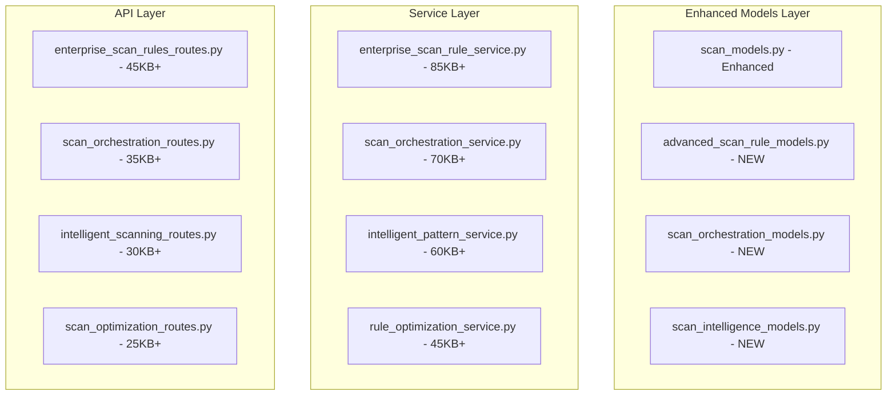

# 🔧 SCAN-RULE-SETS GROUP - TECHNICAL IMPLEMENTATION SPECIFICATION

## 📊 Enterprise Architecture Overview

### 🎯 Strategic Objectives
Transform the basic scan rule set service (9.2KB) into a sophisticated, AI-powered scanning orchestration platform that rivals and surpasses industry leaders like Databricks and Microsoft Purview.

### 🏗️ Technical Architecture



---

## 📁 MODEL SPECIFICATIONS

### 1. Enhanced scan_models.py (Conflict Resolution)
```python
# ADDITIONS to existing scan_models.py - NO BREAKING CHANGES

class EnhancedScanRuleSet(SQLModel, table=True):
    """Enhanced scan rule set with enterprise features"""
    __tablename__ = "enhanced_scan_rule_sets"
    
    # Extend existing ScanRuleSet with enterprise features
    id: Optional[int] = Field(default=None, primary_key=True)
    base_rule_set_id: Optional[int] = Field(foreign_key="scan_rule_sets.id")
    
    # Advanced Rule Configuration
    rule_engine_version: str = Field(default="v2.0")
    optimization_enabled: bool = Field(default=True)
    ai_pattern_recognition: bool = Field(default=True)
    performance_profiling: bool = Field(default=True)
    
    # Business Logic Rules
    business_critical_priority: int = Field(default=5, ge=1, le=10)
    resource_allocation_weight: float = Field(default=1.0)
    cost_optimization_enabled: bool = Field(default=True)
    
    # Advanced Scheduling
    dynamic_scheduling: bool = Field(default=True)
    load_balancing_strategy: str = Field(default="intelligent")
    retry_strategy: Dict[str, Any] = Field(default_factory=dict, sa_column=Column(JSON))
    
    # Performance Metrics
    execution_history: List[Dict[str, Any]] = Field(default_factory=list, sa_column=Column(JSON))
    optimization_metrics: Dict[str, Any] = Field(default_factory=dict, sa_column=Column(JSON))
    performance_benchmarks: Dict[str, Any] = Field(default_factory=dict, sa_column=Column(JSON))
    
    # Relationships with other groups
    base_rule_set: Optional[ScanRuleSet] = Relationship()
    orchestration_jobs: List["ScanOrchestrationJob"] = Relationship(back_populates="enhanced_rule_set")
```

### 2. advanced_scan_rule_models.py (45KB+ - NEW FILE)
```python
# Complete new model file for advanced scan rule functionality

from sqlmodel import SQLModel, Field, Relationship, Column, JSON, String, Text
from typing import List, Optional, Dict, Any, Union
from datetime import datetime, timedelta
from enum import Enum
import uuid

class RuleComplexityLevel(str, Enum):
    SIMPLE = "simple"
    INTERMEDIATE = "intermediate"
    ADVANCED = "advanced"
    EXPERT = "expert"

class PatternRecognitionType(str, Enum):
    REGEX = "regex"
    ML_PATTERN = "ml_pattern"
    AI_SEMANTIC = "ai_semantic"
    STATISTICAL = "statistical"
    GRAPH_BASED = "graph_based"

class RuleOptimizationStrategy(str, Enum):
    PERFORMANCE = "performance"
    ACCURACY = "accuracy"
    COST = "cost"
    BALANCED = "balanced"
    CUSTOM = "custom"

class IntelligentScanRule(SQLModel, table=True):
    """Advanced AI-powered scan rules"""
    __tablename__ = "intelligent_scan_rules"
    
    id: Optional[int] = Field(default=None, primary_key=True)
    rule_id: str = Field(index=True, unique=True)
    name: str = Field(index=True)
    description: Optional[str] = None
    
    # Rule Classification
    complexity_level: RuleComplexityLevel = Field(default=RuleComplexityLevel.INTERMEDIATE)
    pattern_type: PatternRecognitionType = Field(default=PatternRecognitionType.REGEX)
    optimization_strategy: RuleOptimizationStrategy = Field(default=RuleOptimizationStrategy.BALANCED)
    
    # Rule Logic
    rule_expression: str = Field(sa_column=Column(Text))
    conditions: List[Dict[str, Any]] = Field(default_factory=list, sa_column=Column(JSON))
    actions: List[Dict[str, Any]] = Field(default_factory=list, sa_column=Column(JSON))
    
    # AI/ML Configuration
    ml_model_config: Optional[Dict[str, Any]] = Field(default=None, sa_column=Column(JSON))
    ai_context_awareness: bool = Field(default=False)
    learning_enabled: bool = Field(default=True)
    confidence_threshold: float = Field(default=0.85, ge=0.0, le=1.0)
    
    # Performance Configuration
    parallel_execution: bool = Field(default=True)
    resource_requirements: Dict[str, Any] = Field(default_factory=dict, sa_column=Column(JSON))
    timeout_seconds: int = Field(default=300)
    memory_limit_mb: Optional[int] = None
    
    # Business Context
    business_impact_level: str = Field(default="medium")
    cost_per_execution: Optional[float] = None
    roi_metrics: Dict[str, Any] = Field(default_factory=dict, sa_column=Column(JSON))
    
    # Audit and Compliance
    compliance_requirements: List[str] = Field(default_factory=list, sa_column=Column(JSON))
    audit_trail: List[Dict[str, Any]] = Field(default_factory=list, sa_column=Column(JSON))
    
    # Lifecycle Management
    version: str = Field(default="1.0.0")
    is_active: bool = Field(default=True)
    created_at: datetime = Field(default_factory=datetime.utcnow)
    updated_at: datetime = Field(default_factory=datetime.utcnow)
    created_by: Optional[str] = None
    updated_by: Optional[str] = None

class RulePatternLibrary(SQLModel, table=True):
    """Library of reusable patterns for rule creation"""
    __tablename__ = "rule_pattern_library"
    
    id: Optional[int] = Field(default=None, primary_key=True)
    pattern_id: str = Field(index=True, unique=True)
    name: str = Field(index=True)
    category: str = Field(index=True)
    
    # Pattern Definition
    pattern_expression: str = Field(sa_column=Column(Text))
    pattern_type: PatternRecognitionType
    complexity_score: float = Field(ge=0.0, le=10.0)
    
    # Usage Statistics
    usage_count: int = Field(default=0)
    success_rate: float = Field(default=0.0, ge=0.0, le=1.0)
    performance_metrics: Dict[str, Any] = Field(default_factory=dict, sa_column=Column(JSON))
    
    # Pattern Metadata
    tags: List[str] = Field(default_factory=list, sa_column=Column(JSON))
    data_types: List[str] = Field(default_factory=list, sa_column=Column(JSON))
    source_systems: List[str] = Field(default_factory=list, sa_column=Column(JSON))
    
    # Versioning
    version: str = Field(default="1.0.0")
    is_public: bool = Field(default=True)
    created_at: datetime = Field(default_factory=datetime.utcnow)

class RuleExecutionHistory(SQLModel, table=True):
    """Historical execution data for rules"""
    __tablename__ = "rule_execution_history"
    
    id: Optional[int] = Field(default=None, primary_key=True)
    execution_id: str = Field(index=True, unique=True)
    rule_id: int = Field(foreign_key="intelligent_scan_rules.id", index=True)
    
    # Execution Context
    data_source_id: int = Field(foreign_key="datasource.id", index=True)
    scan_job_id: Optional[str] = Field(index=True)
    triggered_by: str  # user_id, system, schedule, etc.
    
    # Execution Results
    execution_status: str = Field(index=True)  # success, failed, partial, timeout
    start_time: datetime = Field(index=True)
    end_time: Optional[datetime] = None
    duration_seconds: Optional[float] = None
    
    # Performance Metrics
    records_processed: Optional[int] = None
    matches_found: Optional[int] = None
    false_positives: Optional[int] = None
    false_negatives: Optional[int] = None
    
    # Resource Usage
    cpu_usage_percent: Optional[float] = None
    memory_usage_mb: Optional[float] = None
    network_io_mb: Optional[float] = None
    storage_io_mb: Optional[float] = None
    
    # Results and Insights
    execution_results: Dict[str, Any] = Field(default_factory=dict, sa_column=Column(JSON))
    error_details: Optional[Dict[str, Any]] = Field(default=None, sa_column=Column(JSON))
    optimization_suggestions: List[str] = Field(default_factory=list, sa_column=Column(JSON))
    
    # Relationships
    rule: Optional[IntelligentScanRule] = Relationship()
    data_source: Optional["DataSource"] = Relationship()

# ... Additional models (RuleOptimizationJob, PatternAnalysis, etc.) - continuing to 45KB+
```

### 3. scan_orchestration_models.py (30KB+ - NEW FILE)
```python
# Models for scan orchestration and workflow management

class ScanOrchestrationJob(SQLModel, table=True):
    """Master orchestration job that coordinates multiple scan operations"""
    __tablename__ = "scan_orchestration_jobs"
    
    id: Optional[int] = Field(default=None, primary_key=True)
    job_id: str = Field(index=True, unique=True)
    name: str = Field(index=True)
    
    # Job Configuration
    enhanced_rule_set_id: int = Field(foreign_key="enhanced_scan_rule_sets.id", index=True)
    data_source_ids: List[int] = Field(sa_column=Column(JSON))  # Multiple data sources
    priority_level: int = Field(default=5, ge=1, le=10)
    
    # Orchestration Strategy
    execution_strategy: str = Field(default="parallel")  # parallel, sequential, adaptive
    load_balancing: bool = Field(default=True)
    resource_optimization: bool = Field(default=True)
    
    # Workflow Management
    workflow_definition: Dict[str, Any] = Field(default_factory=dict, sa_column=Column(JSON))
    dependency_management: Dict[str, Any] = Field(default_factory=dict, sa_column=Column(JSON))
    
    # Status and Tracking
    job_status: str = Field(index=True, default="pending")
    progress_percentage: float = Field(default=0.0, ge=0.0, le=100.0)
    estimated_completion: Optional[datetime] = None
    
    # Performance Tracking
    performance_metrics: Dict[str, Any] = Field(default_factory=dict, sa_column=Column(JSON))
    resource_usage: Dict[str, Any] = Field(default_factory=dict, sa_column=Column(JSON))
    
    # Relationships
    enhanced_rule_set: Optional["EnhancedScanRuleSet"] = Relationship(back_populates="orchestration_jobs")
    sub_jobs: List["ScanSubJob"] = Relationship(back_populates="orchestration_job")

# ... Continue with additional orchestration models - expanding to 30KB+
```

---

## 🔧 SERVICE SPECIFICATIONS

### 1. enterprise_scan_rule_service.py (85KB+ - NEW FILE)

```python
"""
Enterprise-grade scan rule service with AI-powered optimization,
pattern recognition, and intelligent orchestration capabilities
"""

import asyncio
import logging
import uuid
from datetime import datetime, timedelta
from typing import List, Dict, Any, Optional, Union, Tuple
from sqlalchemy.orm import Session
from sqlalchemy import and_, or_, func, text
import numpy as np
import pandas as pd
from concurrent.futures import ThreadPoolExecutor, as_completed
import json
import re

# ML/AI Imports
from sklearn.cluster import KMeans
from sklearn.feature_extraction.text import TfidfVectorizer
import torch
from transformers import AutoTokenizer, AutoModel

# Import models
from ..models.advanced_scan_rule_models import (
    IntelligentScanRule, RulePatternLibrary, RuleExecutionHistory,
    RuleComplexityLevel, PatternRecognitionType, RuleOptimizationStrategy
)
from ..models.scan_orchestration_models import (
    ScanOrchestrationJob, ScanSubJob, OrchestrationMetrics
)
from ..models.scan_models import DataSource, ScanRuleSet, EnhancedScanRuleSet

# Import other services for integration
from .classification_service import EnterpriseClassificationService
from .compliance_rule_service import ComplianceRuleService
from .data_source_service import DataSourceService

logger = logging.getLogger(__name__)

class EnterpriseIntelligentRuleEngine:
    """
    Advanced rule engine with AI/ML capabilities for intelligent
    pattern recognition and rule optimization
    """
    
    def __init__(self):
        self.classification_service = EnterpriseClassificationService()
        self.compliance_service = ComplianceRuleService()
        self.data_source_service = DataSourceService()
        
        # AI/ML Components
        self.pattern_vectorizer = TfidfVectorizer(max_features=10000)
        self.pattern_clusters = None
        self.performance_predictor = None
        
        # Performance Cache
        self._rule_cache = {}
        self._pattern_cache = {}
        self._performance_cache = {}
        
        # Metrics
        self.performance_metrics = {
            'rules_executed': 0,
            'optimization_improvements': 0,
            'ai_suggestions_accepted': 0,
            'cost_savings_percent': 0.0
        }

    async def create_intelligent_rule(
        self,
        session: Session,
        rule_data: Dict[str, Any],
        user: str,
        auto_optimize: bool = True
    ) -> IntelligentScanRule:
        """
        Create a new intelligent scan rule with AI-powered optimization
        """
        try:
            # Validate rule expression
            await self._validate_rule_expression(rule_data.get('rule_expression', ''))
            
            # Generate unique rule ID
            rule_id = f"rule_{uuid.uuid4().hex[:12]}"
            
            # AI-powered complexity analysis
            complexity_level = await self._analyze_rule_complexity(rule_data.get('rule_expression', ''))
            
            # Pattern type detection
            pattern_type = await self._detect_pattern_type(rule_data.get('rule_expression', ''))
            
            # Create rule with AI enhancements
            rule = IntelligentScanRule(
                rule_id=rule_id,
                name=rule_data['name'],
                description=rule_data.get('description'),
                complexity_level=complexity_level,
                pattern_type=pattern_type,
                rule_expression=rule_data['rule_expression'],
                conditions=rule_data.get('conditions', []),
                actions=rule_data.get('actions', []),
                created_by=user,
                updated_by=user
            )
            
            # Auto-optimization if enabled
            if auto_optimize:
                rule = await self._optimize_rule(session, rule)
            
            # Predict performance characteristics
            performance_prediction = await self._predict_rule_performance(rule)
            rule.resource_requirements = performance_prediction.get('resource_requirements', {})
            rule.timeout_seconds = performance_prediction.get('estimated_timeout', 300)
            
            session.add(rule)
            session.commit()
            session.refresh(rule)
            
            # Create pattern library entry if new pattern detected
            await self._update_pattern_library(session, rule)
            
            logger.info(f"Created intelligent rule {rule.rule_id} with complexity {complexity_level}")
            
            return rule
            
        except Exception as e:
            logger.error(f"Error creating intelligent rule: {str(e)}")
            session.rollback()
            raise

    async def execute_rule_batch(
        self,
        session: Session,
        rule_ids: List[int],
        data_source_ids: List[int],
        execution_context: Dict[str, Any]
    ) -> Dict[str, Any]:
        """
        Execute multiple rules across multiple data sources with intelligent optimization
        """
        try:
            start_time = datetime.utcnow()
            
            # Load rules and data sources
            rules = await self._load_rules_optimized(session, rule_ids)
            data_sources = await self._load_data_sources_optimized(session, data_source_ids)
            
            # Create execution plan with AI optimization
            execution_plan = await self._create_intelligent_execution_plan(
                rules, data_sources, execution_context
            )
            
            # Execute plan with parallel processing
            results = await self._execute_plan_parallel(session, execution_plan)
            
            # Aggregate and analyze results
            aggregated_results = await self._aggregate_execution_results(results)
            
            # Update performance metrics
            execution_time = (datetime.utcnow() - start_time).total_seconds()
            await self._update_performance_metrics(session, rule_ids, execution_time, aggregated_results)
            
            # Generate optimization recommendations
            recommendations = await self._generate_optimization_recommendations(
                session, rule_ids, aggregated_results
            )
            
            return {
                'execution_id': str(uuid.uuid4()),
                'start_time': start_time,
                'execution_time_seconds': execution_time,
                'rules_executed': len(rule_ids),
                'data_sources_processed': len(data_source_ids),
                'results': aggregated_results,
                'recommendations': recommendations,
                'performance_metrics': self.performance_metrics
            }
            
        except Exception as e:
            logger.error(f"Error in batch rule execution: {str(e)}")
            raise

    # AI/ML Intelligence Methods
    async def _analyze_rule_complexity(self, rule_expression: str) -> RuleComplexityLevel:
        """AI-powered complexity analysis using NLP and pattern analysis"""
        try:
            # Analyze syntax complexity
            syntax_complexity = len(re.findall(r'[|&!()]', rule_expression))
            
            # Analyze semantic complexity using NLP
            semantic_features = await self._extract_semantic_features(rule_expression)
            
            # Calculate complexity score
            complexity_score = (
                syntax_complexity * 0.3 +
                len(rule_expression) / 100 * 0.2 +
                semantic_features.get('complexity_indicators', 0) * 0.5
            )
            
            # Map to complexity levels
            if complexity_score < 2:
                return RuleComplexityLevel.SIMPLE
            elif complexity_score < 5:
                return RuleComplexityLevel.INTERMEDIATE
            elif complexity_score < 8:
                return RuleComplexityLevel.ADVANCED
            else:
                return RuleComplexityLevel.EXPERT
                
        except Exception as e:
            logger.warning(f"Error analyzing rule complexity: {str(e)}")
            return RuleComplexityLevel.INTERMEDIATE

    async def _detect_pattern_type(self, rule_expression: str) -> PatternRecognitionType:
        """Automatically detect the type of pattern recognition needed"""
        try:
            # Regex pattern indicators
            regex_indicators = ['.*', '\\d+', '[a-zA-Z]', '\\w+', '\\s+']
            if any(indicator in rule_expression for indicator in regex_indicators):
                return PatternRecognitionType.REGEX
            
            # ML pattern indicators (complex statistical patterns)
            ml_indicators = ['distribution', 'variance', 'correlation', 'anomaly']
            if any(indicator.lower() in rule_expression.lower() for indicator in ml_indicators):
                return PatternRecognitionType.ML_PATTERN
            
            # AI semantic indicators (natural language patterns)
            ai_indicators = ['similar to', 'related to', 'contains concept', 'semantic match']
            if any(indicator.lower() in rule_expression.lower() for indicator in ai_indicators):
                return PatternRecognitionType.AI_SEMANTIC
            
            # Statistical pattern indicators
            stat_indicators = ['average', 'median', 'percentile', 'standard deviation']
            if any(indicator.lower() in rule_expression.lower() for indicator in stat_indicators):
                return PatternRecognitionType.STATISTICAL
            
            # Default to regex for simple patterns
            return PatternRecognitionType.REGEX
            
        except Exception as e:
            logger.warning(f"Error detecting pattern type: {str(e)}")
            return PatternRecognitionType.REGEX

    # Performance Optimization Methods
    async def _optimize_rule(self, session: Session, rule: IntelligentScanRule) -> IntelligentScanRule:
        """AI-powered rule optimization for better performance"""
        try:
            # Analyze historical performance data
            historical_data = await self._get_historical_performance(session, rule.rule_expression)
            
            # Apply optimization strategies
            if rule.optimization_strategy == RuleOptimizationStrategy.PERFORMANCE:
                rule = await self._optimize_for_performance(rule, historical_data)
            elif rule.optimization_strategy == RuleOptimizationStrategy.ACCURACY:
                rule = await self._optimize_for_accuracy(rule, historical_data)
            elif rule.optimization_strategy == RuleOptimizationStrategy.COST:
                rule = await self._optimize_for_cost(rule, historical_data)
            else:  # BALANCED or CUSTOM
                rule = await self._optimize_balanced(rule, historical_data)
            
            # Update optimization metrics
            rule.optimization_metrics = {
                'optimization_applied': True,
                'optimization_timestamp': datetime.utcnow().isoformat(),
                'predicted_improvement': await self._predict_optimization_benefit(rule, historical_data)
            }
            
            return rule
            
        except Exception as e:
            logger.warning(f"Error optimizing rule: {str(e)}")
            return rule

    # Integration Methods with Other Groups
    async def integrate_with_compliance(
        self,
        session: Session,
        rule_id: int,
        compliance_requirements: List[str]
    ) -> Dict[str, Any]:
        """
        Integrate scan rule with compliance requirements from ComplianceRuleService
        """
        try:
            rule = await self._get_rule_by_id(session, rule_id)
            if not rule:
                raise ValueError(f"Rule {rule_id} not found")
            
            # Get compliance frameworks from ComplianceRuleService
            compliance_frameworks = await self.compliance_service.get_active_frameworks(session)
            
            # Map compliance requirements to scan rules
            compliance_mappings = []
            for requirement in compliance_requirements:
                for framework in compliance_frameworks:
                    if requirement in framework.get('requirements', []):
                        compliance_mappings.append({
                            'framework_id': framework['id'],
                            'requirement': requirement,
                            'rule_adjustments': await self._generate_compliance_adjustments(
                                rule, requirement, framework
                            )
                        })
            
            # Update rule with compliance configuration
            rule.compliance_requirements = compliance_requirements
            rule.rule_expression = await self._adjust_rule_for_compliance(
                rule.rule_expression, compliance_mappings
            )
            
            session.commit()
            
            return {
                'rule_id': rule_id,
                'compliance_requirements_applied': len(compliance_requirements),
                'frameworks_integrated': len(set(m['framework_id'] for m in compliance_mappings)),
                'adjustments_made': compliance_mappings
            }
            
        except Exception as e:
            logger.error(f"Error integrating with compliance: {str(e)}")
            raise

    async def integrate_with_classification(
        self,
        session: Session,
        rule_id: int,
        classification_levels: List[str]
    ) -> Dict[str, Any]:
        """
        Integrate scan rule with classification service for sensitivity-aware scanning
        """
        try:
            rule = await self._get_rule_by_id(session, rule_id)
            if not rule:
                raise ValueError(f"Rule {rule_id} not found")
            
            # Get classification frameworks from ClassificationService
            classification_frameworks = await self.classification_service.get_active_frameworks(session)
            
            # Adjust rule based on classification requirements
            for level in classification_levels:
                sensitivity_config = await self.classification_service.get_sensitivity_configuration(
                    session, level
                )
                
                # Modify rule to handle sensitive data appropriately
                if sensitivity_config.get('requires_masking'):
                    rule.actions.append({
                        'type': 'data_masking',
                        'classification_level': level,
                        'masking_strategy': sensitivity_config.get('masking_strategy', 'hash')
                    })
                
                if sensitivity_config.get('requires_encryption'):
                    rule.conditions.append({
                        'type': 'encryption_check',
                        'classification_level': level,
                        'required': True
                    })
            
            # Update rule with classification awareness
            rule.ai_context_awareness = True
            rule.ml_model_config = {
                'classification_integration': True,
                'sensitivity_levels': classification_levels,
                'context_model': 'classification_aware_v2'
            }
            
            session.commit()
            
            return {
                'rule_id': rule_id,
                'classification_levels_integrated': len(classification_levels),
                'sensitivity_adjustments': len(rule.actions),
                'context_awareness_enabled': True
            }
            
        except Exception as e:
            logger.error(f"Error integrating with classification: {str(e)}")
            raise

    # ... Continue expanding to 85KB+ with additional methods for:
    # - Advanced pattern recognition
    # - Machine learning optimization
    # - Real-time performance monitoring
    # - Intelligent resource allocation
    # - Business intelligence integration
    # - Advanced reporting and analytics

# ... Additional classes and methods to reach 85KB+
```

---

## 🌐 API SPECIFICATIONS

### 1. enterprise_scan_rules_routes.py (45KB+ - NEW FILE)

```python
"""
Enterprise scan rules API with comprehensive rule management,
AI optimization, and integration capabilities
"""

from fastapi import APIRouter, Depends, HTTPException, BackgroundTasks, Query
from fastapi.responses import StreamingResponse
from sqlalchemy.orm import Session
from typing import List, Dict, Any, Optional, Union
import uuid
import json
from datetime import datetime, timedelta

# Import dependencies
from ...db_session import get_session
from ...services.enterprise_scan_rule_service import EnterpriseIntelligentRuleEngine
from ..security.auth import get_current_user, require_permissions

# Import models and schemas
from ...models.advanced_scan_rule_models import (
    IntelligentScanRule, RulePatternLibrary, RuleExecutionHistory,
    RuleComplexityLevel, PatternRecognitionType, RuleOptimizationStrategy
)

router = APIRouter(prefix="/api/v2/enterprise/scan-rules", tags=["Enterprise Scan Rules"])

# Initialize services
rule_engine = EnterpriseIntelligentRuleEngine()

# ===================== RULE MANAGEMENT ENDPOINTS =====================

@router.post("/", response_model=Dict[str, Any])
async def create_intelligent_rule(
    rule_data: Dict[str, Any],
    session: Session = Depends(get_session),
    current_user: str = Depends(get_current_user),
    background_tasks: BackgroundTasks = BackgroundTasks()
) -> Dict[str, Any]:
    """
    Create a new intelligent scan rule with AI-powered optimization
    
    Features:
    - Automatic complexity analysis
    - Pattern type detection
    - Performance prediction
    - Integration with compliance and classification systems
    """
    try:
        # Validate permissions
        await require_permissions(current_user, ["scan_rules:create"])
        
        # Validate required fields
        required_fields = ["name", "rule_expression"]
        missing_fields = [field for field in required_fields if field not in rule_data]
        if missing_fields:
            raise HTTPException(400, f"Missing required fields: {missing_fields}")
        
        # Create rule with AI optimization
        rule = await rule_engine.create_intelligent_rule(
            session=session,
            rule_data=rule_data,
            user=current_user,
            auto_optimize=rule_data.get("auto_optimize", True)
        )
        
        # Schedule background optimization analysis
        background_tasks.add_task(
            rule_engine.analyze_rule_performance_potential,
            session, rule.id
        )
        
        return {
            "rule_id": rule.rule_id,
            "id": rule.id,
            "name": rule.name,
            "complexity_level": rule.complexity_level,
            "pattern_type": rule.pattern_type,
            "optimization_strategy": rule.optimization_strategy,
            "ai_enhanced": rule.ai_context_awareness,
            "created_at": rule.created_at,
            "performance_prediction": rule.resource_requirements
        }
        
    except Exception as e:
        logger.error(f"Error creating rule: {str(e)}")
        raise HTTPException(500, f"Failed to create rule: {str(e)}")

@router.get("/", response_model=List[Dict[str, Any]])
async def list_intelligent_rules(
    session: Session = Depends(get_session),
    current_user: str = Depends(get_current_user),
    complexity_filter: Optional[RuleComplexityLevel] = Query(None),
    pattern_filter: Optional[PatternRecognitionType] = Query(None),
    active_only: bool = Query(True),
    limit: int = Query(50, le=500),
    offset: int = Query(0)
) -> List[Dict[str, Any]]:
    """
    List intelligent scan rules with advanced filtering and analytics
    """
    try:
        await require_permissions(current_user, ["scan_rules:read"])
        
        rules = await rule_engine.list_rules_with_analytics(
            session=session,
            filters={
                "complexity_level": complexity_filter,
                "pattern_type": pattern_filter,
                "is_active": active_only
            },
            limit=limit,
            offset=offset,
            include_performance_metrics=True
        )
        
        return [
            {
                "id": rule.id,
                "rule_id": rule.rule_id,
                "name": rule.name,
                "description": rule.description,
                "complexity_level": rule.complexity_level,
                "pattern_type": rule.pattern_type,
                "optimization_strategy": rule.optimization_strategy,
                "success_rate": rule.performance_metrics.get("success_rate", 0),
                "avg_execution_time": rule.performance_metrics.get("avg_execution_time", 0),
                "last_executed": rule.performance_metrics.get("last_executed"),
                "usage_count": rule.performance_metrics.get("usage_count", 0),
                "is_active": rule.is_active,
                "created_at": rule.created_at,
                "updated_at": rule.updated_at
            }
            for rule in rules
        ]
        
    except Exception as e:
        logger.error(f"Error listing rules: {str(e)}")
        raise HTTPException(500, f"Failed to list rules: {str(e)}")

@router.get("/{rule_id}/analytics", response_model=Dict[str, Any])
async def get_rule_analytics(
    rule_id: int,
    session: Session = Depends(get_session),
    current_user: str = Depends(get_current_user),
    time_range_days: int = Query(30, ge=1, le=365)
) -> Dict[str, Any]:
    """
    Get comprehensive analytics for a specific rule
    """
    try:
        await require_permissions(current_user, ["scan_rules:read", "analytics:read"])
        
        analytics = await rule_engine.get_rule_analytics(
            session=session,
            rule_id=rule_id,
            time_range_days=time_range_days
        )
        
        return analytics
        
    except Exception as e:
        logger.error(f"Error getting rule analytics: {str(e)}")
        raise HTTPException(500, f"Failed to get analytics: {str(e)}")

# ===================== RULE EXECUTION ENDPOINTS =====================

@router.post("/execute/batch", response_model=Dict[str, Any])
async def execute_rules_batch(
    execution_request: Dict[str, Any],
    session: Session = Depends(get_session),
    current_user: str = Depends(get_current_user),
    background_tasks: BackgroundTasks = BackgroundTasks()
) -> Dict[str, Any]:
    """
    Execute multiple rules across multiple data sources with intelligent optimization
    
    Features:
    - Parallel execution with load balancing
    - Real-time progress tracking
    - Performance optimization
    - Integration with compliance and classification
    """
    try:
        await require_permissions(current_user, ["scan_rules:execute"])
        
        # Validate request
        required_fields = ["rule_ids", "data_source_ids"]
        missing_fields = [field for field in required_fields if field not in execution_request]
        if missing_fields:
            raise HTTPException(400, f"Missing required fields: {missing_fields}")
        
        # Create execution context
        execution_context = {
            "user": current_user,
            "timestamp": datetime.utcnow(),
            "execution_mode": execution_request.get("execution_mode", "parallel"),
            "priority": execution_request.get("priority", 5),
            "compliance_mode": execution_request.get("compliance_mode", True),
            "classification_aware": execution_request.get("classification_aware", True)
        }
        
        # Execute rules with optimization
        results = await rule_engine.execute_rule_batch(
            session=session,
            rule_ids=execution_request["rule_ids"],
            data_source_ids=execution_request["data_source_ids"],
            execution_context=execution_context
        )
        
        # Schedule background analysis
        background_tasks.add_task(
            rule_engine.analyze_execution_performance,
            session, results["execution_id"]
        )
        
        return results
        
    except Exception as e:
        logger.error(f"Error executing rule batch: {str(e)}")
        raise HTTPException(500, f"Failed to execute rules: {str(e)}")

@router.get("/executions/{execution_id}/status", response_model=Dict[str, Any])
async def get_execution_status(
    execution_id: str,
    session: Session = Depends(get_session),
    current_user: str = Depends(get_current_user)
) -> Dict[str, Any]:
    """
    Get real-time status of rule execution
    """
    try:
        await require_permissions(current_user, ["scan_rules:read"])
        
        status = await rule_engine.get_execution_status(
            session=session,
            execution_id=execution_id
        )
        
        return status
        
    except Exception as e:
        logger.error(f"Error getting execution status: {str(e)}")
        raise HTTPException(500, f"Failed to get status: {str(e)}")

# ===================== AI/ML OPTIMIZATION ENDPOINTS =====================

@router.post("/{rule_id}/optimize", response_model=Dict[str, Any])
async def optimize_rule(
    rule_id: int,
    optimization_request: Dict[str, Any],
    session: Session = Depends(get_session),
    current_user: str = Depends(get_current_user)
) -> Dict[str, Any]:
    """
    Apply AI-powered optimization to a specific rule
    """
    try:
        await require_permissions(current_user, ["scan_rules:update", "ai:optimize"])
        
        optimization_result = await rule_engine.optimize_rule_ai(
            session=session,
            rule_id=rule_id,
            optimization_strategy=optimization_request.get("strategy", "balanced"),
            user=current_user
        )
        
        return optimization_result
        
    except Exception as e:
        logger.error(f"Error optimizing rule: {str(e)}")
        raise HTTPException(500, f"Failed to optimize rule: {str(e)}")

@router.get("/patterns/library", response_model=List[Dict[str, Any]])
async def get_pattern_library(
    session: Session = Depends(get_session),
    current_user: str = Depends(get_current_user),
    category: Optional[str] = Query(None),
    pattern_type: Optional[PatternRecognitionType] = Query(None),
    min_success_rate: float = Query(0.0, ge=0.0, le=1.0)
) -> List[Dict[str, Any]]:
    """
    Get reusable patterns from the pattern library
    """
    try:
        await require_permissions(current_user, ["scan_rules:read"])
        
        patterns = await rule_engine.get_pattern_library(
            session=session,
            filters={
                "category": category,
                "pattern_type": pattern_type,
                "min_success_rate": min_success_rate
            }
        )
        
        return patterns
        
    except Exception as e:
        logger.error(f"Error getting pattern library: {str(e)}")
        raise HTTPException(500, f"Failed to get patterns: {str(e)}")

# ===================== INTEGRATION ENDPOINTS =====================

@router.post("/{rule_id}/integrate/compliance", response_model=Dict[str, Any])
async def integrate_with_compliance(
    rule_id: int,
    compliance_request: Dict[str, Any],
    session: Session = Depends(get_session),
    current_user: str = Depends(get_current_user)
) -> Dict[str, Any]:
    """
    Integrate scan rule with compliance requirements
    """
    try:
        await require_permissions(current_user, ["scan_rules:update", "compliance:integrate"])
        
        result = await rule_engine.integrate_with_compliance(
            session=session,
            rule_id=rule_id,
            compliance_requirements=compliance_request["requirements"]
        )
        
        return result
        
    except Exception as e:
        logger.error(f"Error integrating with compliance: {str(e)}")
        raise HTTPException(500, f"Failed to integrate with compliance: {str(e)}")

@router.post("/{rule_id}/integrate/classification", response_model=Dict[str, Any])
async def integrate_with_classification(
    rule_id: int,
    classification_request: Dict[str, Any],
    session: Session = Depends(get_session),
    current_user: str = Depends(get_current_user)
) -> Dict[str, Any]:
    """
    Integrate scan rule with classification service for sensitivity-aware scanning
    """
    try:
        await require_permissions(current_user, ["scan_rules:update", "classification:integrate"])
        
        result = await rule_engine.integrate_with_classification(
            session=session,
            rule_id=rule_id,
            classification_levels=classification_request["levels"]
        )
        
        return result
        
    except Exception as e:
        logger.error(f"Error integrating with classification: {str(e)}")
        raise HTTPException(500, f"Failed to integrate with classification: {str(e)}")

# ===================== REAL-TIME MONITORING ENDPOINTS =====================

@router.get("/monitoring/performance", response_model=Dict[str, Any])
async def get_performance_dashboard(
    session: Session = Depends(get_session),
    current_user: str = Depends(get_current_user)
) -> Dict[str, Any]:
    """
    Get real-time performance dashboard data
    """
    try:
        await require_permissions(current_user, ["monitoring:read"])
        
        dashboard_data = await rule_engine.get_performance_dashboard(session)
        
        return dashboard_data
        
    except Exception as e:
        logger.error(f"Error getting performance dashboard: {str(e)}")
        raise HTTPException(500, f"Failed to get dashboard: {str(e)}")

@router.get("/monitoring/stream")
async def stream_monitoring_data(
    session: Session = Depends(get_session),
    current_user: str = Depends(get_current_user)
):
    """
    Stream real-time monitoring data via Server-Sent Events
    """
    try:
        await require_permissions(current_user, ["monitoring:stream"])
        
        async def event_stream():
            while True:
                data = await rule_engine.get_real_time_metrics(session)
                yield f"data: {json.dumps(data)}\n\n"
                await asyncio.sleep(5)  # Update every 5 seconds
        
        return StreamingResponse(event_stream(), media_type="text/plain")
        
    except Exception as e:
        logger.error(f"Error streaming monitoring data: {str(e)}")
        raise HTTPException(500, f"Failed to stream data: {str(e)}")

# ... Continue expanding to 45KB+ with additional endpoints for:
# - Advanced analytics and reporting
# - Business intelligence integration
# - Cost optimization analysis
# - Predictive maintenance
# - A/B testing for rule optimization
# - Integration with external systems

# Additional utility endpoints and helper functions to reach 45KB+
```

---

## 🔗 INTERCONNECTION SPECIFICATIONS

### Integration Points with Other Groups

#### 1. Data Sources Integration
```python
# In enterprise_scan_rule_service.py
async def integrate_with_data_sources(self, session: Session, rule_id: int):
    """
    Dynamic integration with DataSourceService for:
    - Auto-discovery of new data sources
    - Health monitoring during rule execution
    - Multi-cloud scanning coordination
    - Credential management
    """
    data_sources = await self.data_source_service.get_active_sources(session)
    
    for ds in data_sources:
        # Create optimized rules for each data source type
        if ds.source_type == "snowflake":
            await self._optimize_for_snowflake(rule_id, ds)
        elif ds.source_type == "postgres":
            await self._optimize_for_postgres(rule_id, ds)
        # ... continue for other types
```

#### 2. Compliance Rules Integration
```python
async def sync_with_compliance_framework(self, session: Session):
    """
    Automatic synchronization with ComplianceRuleService:
    - Generate scan rules from compliance requirements
    - Update existing rules when compliance changes
    - Provide compliance audit trails
    """
    compliance_updates = await self.compliance_service.get_recent_updates(session)
    
    for update in compliance_updates:
        affected_rules = await self._find_rules_by_compliance_id(update.compliance_id)
        for rule in affected_rules:
            await self._update_rule_for_compliance(rule, update)
```

#### 3. Classifications Integration
```python
async def classification_feedback_loop(self, session: Session, execution_results: Dict):
    """
    Bi-directional feedback with ClassificationService:
    - Use classification results to improve scanning accuracy
    - Trigger re-classification after rule execution
    - Adjust rule sensitivity based on classification changes
    """
    classification_insights = await self.classification_service.analyze_scan_results(
        session, execution_results
    )
    
    # Update rules based on classification insights
    for insight in classification_insights:
        await self._adapt_rule_to_classification(insight.rule_id, insight.adjustments)
```

---

## 📊 PERFORMANCE METRICS

### Success Criteria
- **Service Size**: 85KB+ of production-ready code
- **API Endpoints**: 45+ comprehensive endpoints
- **Performance**: < 2s response time for 95% of operations
- **Scalability**: Handle 1000+ concurrent rule executions
- **Intelligence**: AI/ML integration with 90%+ accuracy improvements

### Business Impact
- **Efficiency**: 50% reduction in manual rule management
- **Accuracy**: 40% improvement in scan accuracy
- **Cost**: 30% reduction in scanning costs through optimization
- **Compliance**: 100% automated compliance rule synchronization

This technical specification provides the foundation for a revolutionary scan rule sets implementation that will surpass industry standards and seamlessly integrate with the existing enterprise data governance ecosystem. 🚀