# 📦 DataWave Enterprise - Advanced Package Architecture Diagram

## 🏗️ System Overview
**True UML Package Diagram** - Hierarchical package structure with proper UML notation, dependency relationships, and architectural layers following enterprise software design patterns.

## 📋 Package Hierarchy & Architecture

This diagram represents the actual package structure with proper UML package notation, showing containment, dependencies, and architectural boundaries.

```mermaid
%%{init: {
  'theme': 'base',
  'themeVariables': {
    'primaryColor': '#ffffff',
    'primaryTextColor': '#000000',
    'primaryBorderColor': '#000000',
    'lineColor': '#666666',
    'secondaryColor': '#f8f9fa',
    'tertiaryColor': '#e9ecef',
    'background': '#ffffff',
    'mainBkg': '#ffffff',
    'secondBkg': '#f8f9fa'
  }
}}%%

graph TB
    %% Root Package
    subgraph ROOT["📦 com.datawave.enterprise"]
        
        %% Presentation Layer Packages
        subgraph PRESENTATION["📱 presentation"]
            subgraph UI["🎨 ui"]
                UI_CORE["core<br/>├─ components<br/>├─ layouts<br/>├─ themes<br/>└─ hooks"]:::uiPackage
                UI_DASH["dashboard<br/>├─ widgets<br/>├─ charts<br/>├─ analytics<br/>└─ reports"]:::uiPackage
                UI_FORMS["forms<br/>├─ builders<br/>├─ validators<br/>├─ controls<br/>└─ templates"]:::uiPackage
            end
            
            subgraph WEB["🌐 web"]
                WEB_API["api<br/>├─ controllers<br/>├─ middleware<br/>├─ filters<br/>└─ interceptors"]:::webPackage
                WEB_AUTH["auth<br/>├─ jwt<br/>├─ oauth<br/>├─ saml<br/>└─ ldap"]:::webPackage
                WEB_SECURITY["security<br/>├─ cors<br/>├─ csrf<br/>├─ headers<br/>└─ validation"]:::webPackage
            end
        end
        
        %% Application Layer Packages
        subgraph APPLICATION["🏗️ application"]
            subgraph SERVICES["⚙️ services"]
                SVC_DATASOURCE["datasource<br/>├─ connection<br/>├─ discovery<br/>├─ health<br/>└─ edge"]:::servicePackage
                SVC_CATALOG["catalog<br/>├─ assets<br/>├─ lineage<br/>├─ search<br/>└─ quality"]:::servicePackage
                SVC_CLASSIFICATION["classification<br/>├─ ml<br/>├─ patterns<br/>├─ rules<br/>└─ learning"]:::servicePackage
                SVC_GOVERNANCE["governance<br/>├─ policies<br/>├─ compliance<br/>├─ risk<br/>└─ audit"]:::servicePackage
            end
            
            subgraph WORKFLOWS["🔄 workflows"]
                WF_SCAN["scan<br/>├─ orchestration<br/>├─ execution<br/>├─ monitoring<br/>└─ scheduling"]:::workflowPackage
                WF_RULES["rules<br/>├─ engine<br/>├─ builder<br/>├─ templates<br/>└─ marketplace"]:::workflowPackage
                WF_PIPELINE["pipeline<br/>├─ etl<br/>├─ streaming<br/>├─ batch<br/>└─ realtime"]:::workflowPackage
            end
        end
        
        %% Domain Layer Packages
        subgraph DOMAIN["🎯 domain"]
            subgraph ENTITIES["📋 entities"]
                ENT_DATA["data<br/>├─ Asset<br/>├─ Schema<br/>├─ Lineage<br/>└─ Quality"]:::entityPackage
                ENT_GOVERNANCE["governance<br/>├─ Policy<br/>├─ Rule<br/>├─ Compliance<br/>└─ Risk"]:::entityPackage
                ENT_SECURITY["security<br/>├─ User<br/>├─ Role<br/>├─ Permission<br/>└─ Audit"]:::entityPackage
            end
            
            subgraph REPOSITORIES["🗃️ repositories"]
                REPO_DATA["data<br/>├─ AssetRepository<br/>├─ SchemaRepository<br/>├─ LineageRepository<br/>└─ QualityRepository"]:::repoPackage
                REPO_GOVERNANCE["governance<br/>├─ PolicyRepository<br/>├─ RuleRepository<br/>├─ ComplianceRepository<br/>└─ RiskRepository"]:::repoPackage
                REPO_SECURITY["security<br/>├─ UserRepository<br/>├─ RoleRepository<br/>├─ PermissionRepository<br/>└─ AuditRepository"]:::repoPackage
            end
        end
        
        %% Infrastructure Layer Packages
        subgraph INFRASTRUCTURE["🔧 infrastructure"]
            subgraph PERSISTENCE["💾 persistence"]
                PERSIST_SQL["sql<br/>├─ postgresql<br/>├─ migrations<br/>├─ connections<br/>└─ transactions"]:::persistPackage
                PERSIST_NOSQL["nosql<br/>├─ mongodb<br/>├─ elasticsearch<br/>├─ redis<br/>└─ cache"]:::persistPackage
                PERSIST_SEARCH["search<br/>├─ indexing<br/>├─ queries<br/>├─ aggregations<br/>└─ analytics"]:::persistPackage
            end
            
            subgraph MESSAGING["📨 messaging"]
                MSG_QUEUE["queue<br/>├─ kafka<br/>├─ rabbitmq<br/>├─ producers<br/>└─ consumers"]:::messagePackage
                MSG_EVENTS["events<br/>├─ publishers<br/>├─ subscribers<br/>├─ handlers<br/>└─ sagas"]:::messagePackage
                MSG_NOTIFICATIONS["notifications<br/>├─ email<br/>├─ sms<br/>├─ webhooks<br/>└─ alerts"]:::messagePackage
            end
            
            subgraph EXTERNAL["🌐 external"]
                EXT_APIS["apis<br/>├─ rest<br/>├─ graphql<br/>├─ grpc<br/>└─ soap"]:::externalPackage
                EXT_INTEGRATIONS["integrations<br/>├─ databases<br/>├─ clouds<br/>├─ saas<br/>└─ legacy"]:::externalPackage
                EXT_MONITORING["monitoring<br/>├─ metrics<br/>├─ logging<br/>├─ tracing<br/>└─ health"]:::externalPackage
            end
        end
        
        %% Cross-Cutting Concerns
        subgraph SHARED["🔗 shared"]
            subgraph COMMON["📚 common"]
                COMMON_UTILS["utils<br/>├─ helpers<br/>├─ converters<br/>├─ validators<br/>└─ formatters"]:::commonPackage
                COMMON_EXCEPTIONS["exceptions<br/>├─ business<br/>├─ technical<br/>├─ validation<br/>└─ security"]:::commonPackage
                COMMON_CONSTANTS["constants<br/>├─ enums<br/>├─ configs<br/>├─ messages<br/>└─ patterns"]:::commonPackage
            end
            
            subgraph AI_ML["🤖 ai"]
                AI_MODELS["models<br/>├─ transformers<br/>├─ classifiers<br/>├─ nlp<br/>└─ predictive"]:::aiPackage
                AI_TRAINING["training<br/>├─ datasets<br/>├─ pipelines<br/>├─ evaluation<br/>└─ deployment"]:::aiPackage
                AI_INFERENCE["inference<br/>├─ serving<br/>├─ batch<br/>├─ streaming<br/>└─ edge"]:::aiPackage
            end
        end
    end
    
    %% Package Dependencies (<<import>> relationships)
    
    %% Presentation Layer Dependencies
    UI_CORE -.->|<<import>>| WEB_API
    UI_DASH -.->|<<import>>| SVC_CATALOG
    UI_FORMS -.->|<<import>>| SVC_CLASSIFICATION
    
    WEB_API -.->|<<import>>| WEB_AUTH
    WEB_API -.->|<<import>>| WEB_SECURITY
    WEB_AUTH -.->|<<import>>| ENT_SECURITY
    
    %% Application Layer Dependencies
    SVC_DATASOURCE -.->|<<import>>| REPO_DATA
    SVC_CATALOG -.->|<<import>>| REPO_DATA
    SVC_CLASSIFICATION -.->|<<import>>| AI_MODELS
    SVC_GOVERNANCE -.->|<<import>>| REPO_GOVERNANCE
    
    WF_SCAN -.->|<<import>>| SVC_DATASOURCE
    WF_RULES -.->|<<import>>| SVC_GOVERNANCE
    WF_PIPELINE -.->|<<import>>| MSG_QUEUE
    
    %% Domain Layer Dependencies
    ENT_DATA -.->|<<import>>| COMMON_UTILS
    ENT_GOVERNANCE -.->|<<import>>| COMMON_EXCEPTIONS
    ENT_SECURITY -.->|<<import>>| COMMON_CONSTANTS
    
    REPO_DATA -.->|<<import>>| PERSIST_SQL
    REPO_GOVERNANCE -.->|<<import>>| PERSIST_NOSQL
    REPO_SECURITY -.->|<<import>>| PERSIST_SEARCH
    
    %% Infrastructure Dependencies
    PERSIST_SQL -.->|<<import>>| EXT_MONITORING
    PERSIST_NOSQL -.->|<<import>>| EXT_MONITORING
    MSG_QUEUE -.->|<<import>>| EXT_MONITORING
    
    EXT_APIS -.->|<<import>>| EXT_INTEGRATIONS
    EXT_INTEGRATIONS -.->|<<import>>| EXT_MONITORING
    
    %% AI/ML Dependencies
    AI_MODELS -.->|<<import>>| AI_TRAINING
    AI_TRAINING -.->|<<import>>| AI_INFERENCE
    AI_INFERENCE -.->|<<import>>| PERSIST_NOSQL
    
    %% Cross-Layer Dependencies
    SVC_CLASSIFICATION -.->|<<import>>| AI_MODELS
    WF_SCAN -.->|<<import>>| AI_INFERENCE
    SVC_CATALOG -.->|<<import>>| MSG_EVENTS
    
    %% Package Styling with Professional Colors
    
    %% UI Layer (Blue Tones)
    classDef uiPackage fill:#e3f2fd,stroke:#1976d2,stroke-width:2px,color:#000000,font-weight:bold
    classDef webPackage fill:#e8eaf6,stroke:#3f51b5,stroke-width:2px,color:#000000,font-weight:bold
    
    %% Application Layer (Green Tones)
    classDef servicePackage fill:#e8f5e8,stroke:#2e7d32,stroke-width:2px,color:#000000,font-weight:bold
    classDef workflowPackage fill:#f1f8e9,stroke:#388e3c,stroke-width:2px,color:#000000,font-weight:bold
    
    %% Domain Layer (Orange Tones)
    classDef entityPackage fill:#fff3e0,stroke:#f57c00,stroke-width:2px,color:#000000,font-weight:bold
    classDef repoPackage fill:#fce4ec,stroke:#c2185b,stroke-width:2px,color:#000000,font-weight:bold
    
    %% Infrastructure Layer (Purple/Gray Tones)
    classDef persistPackage fill:#f3e5f5,stroke:#7b1fa2,stroke-width:2px,color:#000000,font-weight:bold
    classDef messagePackage fill:#e1f5fe,stroke:#0277bd,stroke-width:2px,color:#000000,font-weight:bold
    classDef externalPackage fill:#e0f2f1,stroke:#00695c,stroke-width:2px,color:#000000,font-weight:bold
    
    %% Shared Layer (Yellow/Teal Tones)
    classDef commonPackage fill:#fffde7,stroke:#f9a825,stroke-width:2px,color:#000000,font-weight:bold
    classDef aiPackage fill:#f3e5f5,stroke:#6a1b9a,stroke-width:2px,color:#000000,font-weight:bold
```

## 🏗️ Package Architecture Analysis

### **📱 Presentation Layer**
**Purpose**: User interface and API gateway components
- **ui**: Frontend components, layouts, and user interactions
- **web**: API controllers, authentication, and security middleware

### **🏗️ Application Layer** 
**Purpose**: Business logic orchestration and workflow management
- **services**: Core business services for data management and governance
- **workflows**: Process orchestration, rule execution, and pipeline management

### **🎯 Domain Layer**
**Purpose**: Business entities and domain logic
- **entities**: Core business objects and domain models
- **repositories**: Data access abstractions and persistence interfaces

### **🔧 Infrastructure Layer**
**Purpose**: Technical implementation and external integrations
- **persistence**: Database connections and data storage implementations
- **messaging**: Event handling, queues, and notification systems
- **external**: Third-party integrations and monitoring

### **🔗 Shared Layer**
**Purpose**: Cross-cutting concerns and reusable components
- **common**: Utilities, exceptions, and shared constants
- **ai**: Machine learning models, training, and inference engines

## 📊 Dependency Principles

### **Dependency Direction**
- **Inward Dependencies**: Higher layers depend on lower layers
- **Interface Segregation**: Dependencies through well-defined interfaces
- **Dependency Inversion**: Abstractions don't depend on details

### **Package Relationships**
- **<<import>>**: Package import dependencies
- **Containment**: Hierarchical package structure
- **Layered Architecture**: Clear separation of concerns

### **Design Patterns**
- **Domain-Driven Design**: Clear domain boundaries
- **Hexagonal Architecture**: Ports and adapters pattern
- **Clean Architecture**: Dependency rule enforcement
- **Microservices**: Service-oriented package organization

## 🎯 Architecture Benefits

### **Maintainability**
- Clear package boundaries and responsibilities
- Loose coupling between layers
- High cohesion within packages

### **Scalability**
- Independent package deployment
- Horizontal scaling capabilities
- Service-oriented architecture

### **Testability**
- Isolated package testing
- Dependency injection support
- Mock-friendly interfaces

### **Extensibility**
- Plugin architecture support
- New package integration
- Feature toggle capabilities

This package diagram follows **enterprise software architecture principles** with proper UML notation, clear hierarchical structure, and professional dependency management patterns.
