# 📦 DataWave Enterprise - 7-Layer Microservices Architecture

## 🏗️ Complete 7-Layer Package Hierarchy
**Advanced Enterprise Architecture** - Comprehensive 7-layer microservices architecture with detailed package structure, cross-module integration, and orchestration hub.

## 📊 7-Layer Architecture Overview

```mermaid
%%{init: {
  'theme': 'base',
  'themeVariables': {
    'primaryColor': '#ffffff',
    'primaryTextColor': '#000000',
    'primaryBorderColor': '#000000',
    'lineColor': '#333333',
    'secondaryColor': '#f8f9fa',
    'tertiaryColor': '#e9ecef',
    'background': '#ffffff',
    'mainBkg': '#ffffff',
    'secondBkg': '#f8f9fa'
  }
}}%%

    flowchart TB
        %% Root System Package
        subgraph ROOT["🏢 DataWave Enterprise Platform"]

            %% Layer 1: Presentation Layer
            subgraph LAYER1["🌐 Layer 1: Presentation"]
                direction TB
                PKG_UI["📱 User Interface<br/>┌─────────────────┐<br/>│ 🌐 Web Frontend  │<br/>│ 📱 Mobile Apps   │<br/>│ 💻 Desktop Apps  │<br/>│ 🎨 UI Components │<br/>└─────────────────┘"]:::layer1

                PKG_API["🚪 API Gateway<br/>┌─────────────────┐<br/>│ 🔐 Authentication│<br/>│ ⚡ Rate Limiting │<br/>│ ✅ Validation   │<br/>│ 🌉 Routing      │<br/>└─────────────────┘"]:::layer1
            end

            %% Layer 2: API Gateway Layer
            subgraph LAYER2["🚪 Layer 2: API Gateway"]
                direction TB
                PKG_KONG["🛡️ Kong Gateway<br/>┌─────────────────┐<br/>│ 🔐 OAuth 2.0    │<br/>│ 👥 RBAC System  │<br/>│ ⚡ Rate Limiting │<br/>│ 📊 API Monitoring│<br/>└─────────────────┘"]:::layer2

                PKG_SECURITY["🔒 Security<br/>┌─────────────────┐<br/>│ 🔑 JWT Tokens   │<br/>│ 🛡️ CORS/CSRF    │<br/>│ 📋 Request Filter│<br/>│ 🔍 Threat Detect │<br/>└─────────────────┘"]:::layer2
            end

            %% Layer 3: Business Logic Layer
            subgraph LAYER3["🏗️ Layer 3: Business Logic"]
                direction LR
                PKG_CORE["⚙️ Core Services<br/>┌─────────────────┐<br/>│ 🗄️ Data Sources  │<br/>│ 📚 Data Catalog  │<br/>│ 🏷️ Classification│<br/>│ ⚖️ Governance   │<br/>└─────────────────┘"]:::layer3

                PKG_WORKFLOWS["🔄 Workflows<br/>┌─────────────────┐<br/>│ 🔍 Scan Engine  │<br/>│ 📋 Rules Engine │<br/>│ 🚀 Pipelines    │<br/>│ 📊 Analytics    │<br/>└─────────────────┘"]:::layer3
            end

            %% Layer 4: Edge Computing Layer
            subgraph LAYER4["🌐 Layer 4: Edge Computing"]
                direction TB
                PKG_EDGE["⚡ Edge Nodes<br/>┌─────────────────┐<br/>│ 🏢 On-Premises  │<br/>│ ☁️ Cloud Edge    │<br/>│ 🤖 AI Inference │<br/>│ 🔄 Local Caching│<br/>└─────────────────┘"]:::layer4

                PKG_DISTRIBUTED["📡 Distributed<br/>┌─────────────────┐<br/>│ 🔀 Load Balance  │<br/>│ 📊 Local Metrics │<br/>│ 🔄 Sync Manager │<br/>│ 💾 Edge Storage │<br/>└─────────────────┘"]:::layer4
            end

            %% Layer 5: Data Access Layer
            subgraph LAYER5["💾 Layer 5: Data Access"]
                direction LR
                PKG_DATABASES["🗄️ Databases<br/>┌─────────────────┐<br/>│ 🐘 PostgreSQL   │<br/>│ 🍃 MongoDB      │<br/>│ ⚡ Redis Cache  │<br/>│ 🔍 Elasticsearch│<br/>└─────────────────┘"]:::layer5

                PKG_STREAMING["📨 Streaming<br/>┌─────────────────┐<br/>│ 📬 Kafka Queue  │<br/>│ 🌊 Event Stream │<br/>│ 📡 Message Bus  │<br/>│ 🔄 Data Pipeline│<br/>└─────────────────┘"]:::layer5
            end

            %% Layer 6: Infrastructure Layer
            subgraph LAYER6["☸️ Layer 6: Infrastructure"]
                direction TB
                PKG_K8S["☸️ Kubernetes<br/>┌─────────────────┐<br/>│ 🐳 Container Mgmt│<br/>│ ⚖️ Load Balance │<br/>│ 🔄 Auto Scaling │<br/>│ 📊 Resource Mgmt│<br/>└─────────────────┘"]:::layer6

                PKG_MONITORING["📊 Monitoring<br/>┌─────────────────┐<br/>│ 📈 Prometheus   │<br/>│ 📋 Grafana      │<br/>│ 🚨 Alert Manager│<br/>│ 📊 Metrics      │<br/>└─────────────────┘"]:::layer6
            end

            %% Layer 7: External Integration Layer
            subgraph LAYER7["🌍 Layer 7: External Integration"]
                direction LR
                PKG_CLOUD["☁️ Cloud Services<br/>┌─────────────────┐<br/>│ ☁️ AWS/Azure    │<br/>│ 🔌 Cloud APIs   │<br/>│ 💾 Cloud Storage│<br/>│ 🔄 Cloud Sync   │<br/>└─────────────────┘"]:::layer7

                PKG_THIRD_PARTY["🔗 Third-Party<br/>┌─────────────────┐<br/>│ 📧 Slack/Email  │<br/>│ 📊 Tableau      │<br/>│ 🏢 Enterprise   │<br/>│ 🔌 Legacy Sys   │<br/>└─────────────────┘"]:::layer7
            end

            %% Orchestration Hub
            subgraph RACINE["🎯 Racine Main Manager"]
                direction TB
                PKG_ORCHESTRATOR["🎼 Master Orchestrator<br/>┌─────────────────┐<br/>│ 🎯 Workflow Mgmt │<br/>│ 🤖 AI Assistant  │<br/>│ 📊 Performance   │<br/>│ 🔄 Coordination  │<br/>└─────────────────┘"]:::orchestrator

                PKG_COORDINATOR["⚙️ System Coordinator<br/>┌─────────────────┐<br/>│ 📡 Event Process │<br/>│ 🔄 Resource Alloc│<br/>│ 📈 Real-time Mon │<br/>│ 🎛️ Control Panel │<br/>└─────────────────┘"]:::orchestrator
            end
        end

        %% 7-Layer Dependencies
        PKG_UI -.->|requests| PKG_API
        PKG_API -.->|routes to| PKG_KONG
        PKG_KONG -.->|secures| PKG_SECURITY
        PKG_SECURITY -.->|calls| PKG_CORE
        PKG_CORE -.->|orchestrates| PKG_WORKFLOWS
        PKG_WORKFLOWS -.->|processes via| PKG_EDGE
        PKG_EDGE -.->|stores in| PKG_DATABASES
        PKG_DATABASES -.->|streams via| PKG_STREAMING
        PKG_STREAMING -.->|managed by| PKG_K8S
        PKG_K8S -.->|monitored by| PKG_MONITORING
        PKG_MONITORING -.->|integrates| PKG_CLOUD
        PKG_CLOUD -.->|connects to| PKG_THIRD_PARTY

        %% Cross-layer orchestration
        PKG_ORCHESTRATOR -.->|orchestrates| PKG_UI
        PKG_ORCHESTRATOR -.->|orchestrates| PKG_API
        PKG_ORCHESTRATOR -.->|orchestrates| PKG_CORE
        PKG_ORCHESTRATOR -.->|orchestrates| PKG_EDGE
        PKG_ORCHESTRATOR -.->|orchestrates| PKG_DATABASES
        PKG_ORCHESTRATOR -.->|orchestrates| PKG_K8S
        PKG_ORCHESTRATOR -.->|orchestrates| PKG_CLOUD

        PKG_COORDINATOR -.->|coordinates| PKG_SECURITY
        PKG_COORDINATOR -.->|coordinates| PKG_WORKFLOWS
        PKG_COORDINATOR -.->|coordinates| PKG_STREAMING
        PKG_COORDINATOR -.->|coordinates| PKG_MONITORING
        PKG_COORDINATOR -.->|coordinates| PKG_THIRD_PARTY

        %% Advanced 7-Layer Styling

        %% Layer 1: Presentation - Blue Gradient
        classDef layer1 fill:#e3f2fd,stroke:#1976d2,stroke-width:3px,color:#000000,font-weight:bold

        %% Layer 2: API Gateway - Light Blue
        classDef layer2 fill:#bbdefb,stroke:#0d47a1,stroke-width:3px,color:#000000,font-weight:bold

        %% Layer 3: Business Logic - Green Gradient
        classDef layer3 fill:#e8f5e8,stroke:#2e7d32,stroke-width:3px,color:#000000,font-weight:bold

        %% Layer 4: Edge Computing - Orange Gradient
        classDef layer4 fill:#fff3e0,stroke:#f57c00,stroke-width:3px,color:#000000,font-weight:bold

        %% Layer 5: Data Access - Purple Gradient
        classDef layer5 fill:#f3e5f5,stroke:#7b1fa2,stroke-width:3px,color:#000000,font-weight:bold

        %% Layer 6: Infrastructure - Teal Gradient
        classDef layer6 fill:#e0f2f1,stroke:#00695c,stroke-width:3px,color:#000000,font-weight:bold

        %% Layer 7: External Integration - Pink Gradient
        classDef layer7 fill:#fce4ec,stroke:#c2185b,stroke-width:3px,color:#000000,font-weight:bold

        %% Orchestrator - Gold Gradient
        classDef orchestrator fill:#fff8e1,stroke:#f57f17,stroke-width:4px,color:#000000,font-weight:bold
```

## 🏗️ 7-Layer Architecture Analysis

### **🌐 Layer 1: Presentation Layer**
**Purpose**: Modern user interfaces and communication
- **UI Package**: React frontend, mobile apps, desktop applications
- **API Gateway**: Request routing, authentication, rate limiting

### **🚪 Layer 2: API Gateway Layer**
**Purpose**: API management and security enforcement
- **Kong Gateway**: OAuth 2.0, RBAC, rate limiting, monitoring
- **Security**: JWT tokens, CORS/CSRF protection, threat detection

### **🏗️ Layer 3: Business Logic Layer**
**Purpose**: Core business functionality and microservices
- **Core Services**: Data sources, catalog, classification, governance
- **Workflows**: Scan engine, rules engine, pipelines, analytics

### **🌐 Layer 4: Edge Computing Layer**
**Purpose**: Distributed processing and edge intelligence
- **Edge Nodes**: On-premises and cloud edge processing
- **Distributed**: Load balancing, local metrics, sync management

### **💾 Layer 5: Data Access Layer**
**Purpose**: Data storage, persistence, and retrieval systems
- **Databases**: PostgreSQL, MongoDB, Redis, Elasticsearch
- **Streaming**: Kafka queues, event streams, message buses

### **☸️ Layer 6: Infrastructure Layer**
**Purpose**: Platform management, monitoring, and DevOps
- **Kubernetes**: Container management, load balancing, auto-scaling
- **Monitoring**: Prometheus metrics, Grafana dashboards, alerts

### **🌍 Layer 7: External Integration Layer**
**Purpose**: Third-party services and cloud provider integration
- **Cloud Services**: AWS, Azure, GCP integration and APIs
- **Third-Party**: Slack, Tableau, enterprise systems connectivity

### **🎯 Racine Main Manager**
**Purpose**: Ultimate orchestration and coordination hub
- **Master Orchestrator**: Cross-system workflow management and AI assistance
- **System Coordinator**: Real-time event processing and resource allocation

## 📊 Advanced Integration Features

### **🔄 Cross-Layer Communication**
- **API Gateway**: Secure communication between layers
- **Event Streaming**: Real-time data flow across all layers
- **Service Mesh**: Intelligent request routing and load balancing

### **🤖 AI-Powered Intelligence**
- **Edge AI**: Local inference and decision-making
- **Central AI**: Cross-layer learning and optimization
- **Predictive Analytics**: System-wide performance prediction

### **🔒 Security Integration**
- **Layered Security**: Defense in depth across all layers
- **Zero Trust**: Authentication and authorization at every layer
- **Audit Trail**: Comprehensive logging and compliance monitoring

### **📈 Scalability Features**
- **Horizontal Scaling**: Independent scaling of each layer
- **Auto-scaling**: Dynamic resource allocation based on demand
- **Load Distribution**: Intelligent traffic management

## 🎯 Architecture Benefits

### **🏢 Enterprise-Grade Features**
- **99.99% Uptime**: High availability across all layers
- **Fault Isolation**: Layer-specific failure containment
- **Independent Deployment**: Each layer can be deployed separately
- **Technology Diversity**: Best-of-breed solutions per layer

### **🔄 Interoperability**
- **RESTful APIs**: Standardized communication protocols
- **Event-Driven**: Asynchronous processing capabilities
- **Message Queues**: Reliable cross-layer messaging
- **Service Discovery**: Dynamic service registration

### **📊 Monitoring & Observability**
- **Real-time Metrics**: Live performance monitoring
- **Distributed Tracing**: End-to-end request tracking
- **Alert Management**: Intelligent alerting and notification
- **Performance Analytics**: System-wide optimization insights

This 7-layer architecture provides **enterprise-grade scalability, security, and performance** with comprehensive cross-layer integration and AI-powered orchestration.
