# 📦 DataWave Enterprise Data Governance - Advanced Package Architecture

## 🏗️ System Overview
**Enterprise-Grade Package Structure** - Comprehensive modular architecture with layered dependencies, microservices design patterns, and advanced integration capabilities for scalable data governance.

## 📋 Package Hierarchy & Dependencies

This advanced package diagram illustrates the complete system architecture with structured layers, dependency flows, and integration patterns using modern UML package notation.

```mermaid
%%{init: {
  'theme': 'base',
  'themeVariables': {
    'primaryColor': '#ffffff',
    'primaryTextColor': '#000000',
    'primaryBorderColor': '#000000',
    'lineColor': '#333333',
    'secondaryColor': '#f8f9fa',
    'tertiaryColor': '#e9ecef',
    'background': '#ffffff',
    'mainBkg': '#ffffff',
    'secondBkg': '#f8f9fa'
  }
}}%%

flowchart TB
    %% System Boundary
    subgraph PLATFORM["🏢 DataWave Enterprise Platform"]
        subgraph "🌐 Frontend Package"
            UI_PKG[UI Package<br/>React + TypeScript<br/>Material-UI Components]:::frontend
            DASH_PKG[Dashboard Package<br/>Analytics + Charts<br/>Real-time Visualization]:::frontend
            FORM_PKG[Form Package<br/>Data Entry + Validation<br/>User Input Components]:::frontend
            CHART_PKG[Chart Package<br/>D3.js + Chart.js<br/>Data Visualization]:::frontend
        end
        
        subgraph "🚪 API Gateway Package"
            GATEWAY_PKG[Gateway Package<br/>FastAPI + Middleware<br/>Request Processing]:::gateway
            AUTH_PKG[Auth Package<br/>JWT + OAuth 2.0<br/>Authentication Logic]:::gateway
            VALID_PKG[Validation Package<br/>Pydantic Models<br/>Data Validation]:::gateway
            RATE_PKG[Rate Limiting Package<br/>Circuit Breaker<br/>Request Throttling]:::gateway
        end
        
        subgraph "🏗️ Core Services Package"
            subgraph "🗄️ Data Source Package"
                DS_CONN_PKG[Connection Package<br/>Database Drivers<br/>Connection Pooling]:::datasource
                DS_DISC_PKG[Discovery Package<br/>Schema Discovery<br/>Metadata Extraction]:::datasource
                DS_HEALTH_PKG[Health Package<br/>Monitoring + Metrics<br/>Performance Tracking]:::datasource
                DS_EDGE_PKG[Edge Package<br/>Edge Computing<br/>Distributed Processing]:::datasource
            end
            
            subgraph "📚 Catalog Package"
                CAT_ASSET_PKG[Asset Package<br/>Asset Management<br/>Lifecycle Control]:::catalog
                CAT_LINEAGE_PKG[Lineage Package<br/>Data Flow Mapping<br/>Dependency Tracking]:::catalog
                CAT_SEARCH_PKG[Search Package<br/>Semantic Search<br/>AI-Powered Queries]:::catalog
                CAT_QUALITY_PKG[Quality Package<br/>Quality Rules<br/>Assessment Engine]:::catalog
                CAT_GLOSSARY_PKG[Glossary Package<br/>Business Terms<br/>Semantic Mapping]:::catalog
            end
            
            subgraph "🏷️ Classification Package"
                CLASS_ML_PKG[ML Package<br/>Scikit-learn + PyTorch<br/>Automated Classification]:::classification
                CLASS_PATTERN_PKG[Pattern Package<br/>Regex + NLP<br/>Pattern Recognition]:::classification
                CLASS_RULES_PKG[Rules Package<br/>Custom Rules<br/>Business Logic]:::classification
                CLASS_LEARN_PKG[Learning Package<br/>Continuous Learning<br/>Model Improvement]:::classification
            end
            
            subgraph "📋 Rule Sets Package"
                RULE_TEMPLATE_PKG[Template Package<br/>Pre-built Rules<br/>Compliance Frameworks]:::rules
                RULE_BUILDER_PKG[Builder Package<br/>Visual Editor<br/>Drag & Drop Interface]:::rules
                RULE_VERSION_PKG[Version Package<br/>Rule History<br/>Change Tracking]:::rules
                RULE_MARKET_PKG[Marketplace Package<br/>Shared Rules<br/>Community Features]:::rules
            end
            
            subgraph "🔍 Scan Logic Package"
                SCAN_WORKFLOW_PKG[Workflow Package<br/>Multi-stage Execution<br/>Conditional Logic]:::scan
                SCAN_ORCH_PKG[Orchestration Package<br/>Distributed Coordination<br/>Resource Management]:::scan
                SCAN_RESOURCE_PKG[Resource Package<br/>CPU + Memory<br/>Dynamic Allocation]:::scan
                SCAN_MONITOR_PKG[Monitor Package<br/>Progress Tracking<br/>Performance Metrics]:::scan
            end
            
            subgraph "⚖️ Compliance Package"
                COMP_FRAMEWORK_PKG[Framework Package<br/>GDPR + HIPAA + SOX<br/>Policy Templates]:::compliance
                COMP_MONITOR_PKG[Monitor Package<br/>Real-time Checking<br/>Violation Detection]:::compliance
                COMP_REPORT_PKG[Report Package<br/>Executive Dashboards<br/>Audit Reports]:::compliance
                COMP_RISK_PKG[Risk Package<br/>AI-Powered Risk<br/>Mitigation Strategies]:::compliance
            end
            
            subgraph "👥 RBAC Package"
                RBAC_USER_PKG[User Package<br/>User Lifecycle<br/>Profile Management]:::rbac
                RBAC_ROLE_PKG[Role Package<br/>Role Definition<br/>Permission Assignment]:::rbac
                RBAC_PERM_PKG[Permission Package<br/>Granular Permissions<br/>Resource Scoping]:::rbac
                RBAC_AUDIT_PKG[Audit Package<br/>Activity Tracking<br/>Compliance Logging]:::rbac
            end
        end
        
        subgraph "🤖 AI/ML Package"
            AI_TRANSFORMER_PKG[Transformer Package<br/>Hugging Face<br/>NLP Processing]:::ai
            AI_ML_PKG[ML Package<br/>Scikit-learn<br/>Classification]:::ai
            AI_NLP_PKG[NLP Package<br/>SpaCy + NLTK<br/>Text Analysis]:::ai
            AI_PREDICT_PKG[Prediction Package<br/>Time Series<br/>Forecasting]:::ai
        end
        
        subgraph "💾 Data Package"
            PG_PKG[PostgreSQL Package<br/>Primary Database<br/>ACID Transactions]:::postgres
            REDIS_PKG[Redis Package<br/>Cache + Session<br/>High Performance]:::redis
            MONGO_PKG[MongoDB Package<br/>Document Store<br/>Flexible Schema]:::mongodb
            ES_PKG[Elasticsearch Package<br/>Search Index<br/>Full-Text Search]:::elasticsearch
        end
        
        subgraph "🔧 Infrastructure Package"
            DOCKER_PKG[Docker Package<br/>Containerization<br/>Microservices]:::docker
            K8S_PKG[Kubernetes Package<br/>Orchestration<br/>Auto Scaling]:::kubernetes
            MONITOR_PKG[Monitoring Package<br/>Prometheus + Grafana<br/>Observability]:::monitoring
            LOG_PKG[Logging Package<br/>ELK Stack<br/>Centralized Logs]:::logging
        end
        
        subgraph "🛡️ Security Package"
            ENCRYPT_PKG[Encryption Package<br/>End-to-End<br/>Data Protection]:::security
            SECRET_PKG[Secret Package<br/>Key Management<br/>Vault Integration]:::security
            NETWORK_PKG[Network Package<br/>VNet Support<br/>Network Isolation]:::security
            AUDIT_PKG[Audit Package<br/>Compliance Logging<br/>Regulatory Adherence]:::security
        end
    end
    
    %% Frontend Package Dependencies
    UI_PKG --> DASH_PKG
    UI_PKG --> FORM_PKG
    UI_PKG --> CHART_PKG
    
    %% API Gateway Package Dependencies
    GATEWAY_PKG --> AUTH_PKG
    GATEWAY_PKG --> VALID_PKG
    GATEWAY_PKG --> RATE_PKG
    
    %% Data Source Package Dependencies
    DS_CONN_PKG --> DS_DISC_PKG
    DS_DISC_PKG --> DS_HEALTH_PKG
    DS_HEALTH_PKG --> DS_EDGE_PKG
    
    %% Catalog Package Dependencies
    CAT_ASSET_PKG --> CAT_LINEAGE_PKG
    CAT_ASSET_PKG --> CAT_SEARCH_PKG
    CAT_ASSET_PKG --> CAT_QUALITY_PKG
    CAT_ASSET_PKG --> CAT_GLOSSARY_PKG
    
    %% Classification Package Dependencies
    CLASS_ML_PKG --> CLASS_PATTERN_PKG
    CLASS_PATTERN_PKG --> CLASS_RULES_PKG
    CLASS_RULES_PKG --> CLASS_LEARN_PKG
    
    %% Rule Sets Package Dependencies
    RULE_TEMPLATE_PKG --> RULE_BUILDER_PKG
    RULE_BUILDER_PKG --> RULE_VERSION_PKG
    RULE_VERSION_PKG --> RULE_MARKET_PKG
    
    %% Scan Logic Package Dependencies
    SCAN_WORKFLOW_PKG --> SCAN_ORCH_PKG
    SCAN_ORCH_PKG --> SCAN_RESOURCE_PKG
    SCAN_RESOURCE_PKG --> SCAN_MONITOR_PKG
    
    %% Compliance Package Dependencies
    COMP_FRAMEWORK_PKG --> COMP_MONITOR_PKG
    COMP_MONITOR_PKG --> COMP_REPORT_PKG
    COMP_REPORT_PKG --> COMP_RISK_PKG
    
    %% RBAC Package Dependencies
    RBAC_USER_PKG --> RBAC_ROLE_PKG
    RBAC_ROLE_PKG --> RBAC_PERM_PKG
    RBAC_PERM_PKG --> RBAC_AUDIT_PKG
    
    %% AI/ML Package Dependencies
    AI_TRANSFORMER_PKG --> AI_ML_PKG
    AI_ML_PKG --> AI_NLP_PKG
    AI_NLP_PKG --> AI_PREDICT_PKG
    
    %% Cross-Package Dependencies
    DS_EDGE_PKG --> CAT_ASSET_PKG
    CAT_ASSET_PKG --> CLASS_ML_PKG
    CLASS_ML_PKG --> RULE_TEMPLATE_PKG
    RULE_TEMPLATE_PKG --> SCAN_WORKFLOW_PKG
    SCAN_WORKFLOW_PKG --> COMP_MONITOR_PKG
    COMP_MONITOR_PKG --> RBAC_AUDIT_PKG
    
    %% AI/ML Integration Dependencies
    DS_DISC_PKG --> AI_TRANSFORMER_PKG
    CAT_SEARCH_PKG --> AI_NLP_PKG
    CLASS_ML_PKG --> AI_ML_PKG
    SCAN_ORCH_PKG --> AI_PREDICT_PKG
    
    %% Data Package Dependencies
    DS_CONN_PKG --> PG_PKG
    CAT_ASSET_PKG --> PG_PKG
    CLASS_ML_PKG --> PG_PKG
    RULE_TEMPLATE_PKG --> PG_PKG
    SCAN_WORKFLOW_PKG --> PG_PKG
    COMP_FRAMEWORK_PKG --> PG_PKG
    RBAC_USER_PKG --> PG_PKG
    
    %% Caching Dependencies
    DS_CONN_PKG --> REDIS_PKG
    CAT_ASSET_PKG --> REDIS_PKG
    SCAN_WORKFLOW_PKG --> REDIS_PKG
    
    %% Document Store Dependencies
    DS_CONN_PKG --> MONGO_PKG
    CAT_ASSET_PKG --> MONGO_PKG
    
    %% Search Dependencies
    CAT_SEARCH_PKG --> ES_PKG
    CLASS_PATTERN_PKG --> ES_PKG
    
    %% Infrastructure Dependencies
    DOCKER_PKG --> K8S_PKG
    MONITOR_PKG --> K8S_PKG
    LOG_PKG --> K8S_PKG
    
    %% Security Dependencies
    ENCRYPT_PKG --> SECRET_PKG
    SECRET_PKG --> NETWORK_PKG
    NETWORK_PKG --> AUDIT_PKG
    
    %% Styling
    classDef frontend fill:#e1f5fe,stroke:#01579b,stroke-width:2px,color:#000
    classDef gateway fill:#f3e5f5,stroke:#4a148c,stroke-width:2px,color:#000
    classDef datasource fill:#e0f2f1,stroke:#004d40,stroke-width:2px,color:#000
    classDef catalog fill:#f1f8e9,stroke:#33691e,stroke-width:2px,color:#000
    classDef classification fill:#fff8e1,stroke:#f57f17,stroke-width:2px,color:#000
    classDef rules fill:#e3f2fd,stroke:#0d47a1,stroke-width:2px,color:#000
    classDef scan fill:#f9fbe7,stroke:#827717,stroke-width:2px,color:#000
    classDef compliance fill:#fce4ec,stroke:#c2185b,stroke-width:2px,color:#000
    classDef rbac fill:#e8eaf6,stroke:#283593,stroke-width:2px,color:#000
    classDef ai fill:#f3e5f5,stroke:#4a148c,stroke-width:2px,color:#000
    classDef postgres fill:#336791,stroke:#ffffff,stroke-width:2px,color:#ffffff
    classDef redis fill:#dc382d,stroke:#ffffff,stroke-width:2px,color:#ffffff
    classDef mongodb fill:#4db33d,stroke:#ffffff,stroke-width:2px,color:#ffffff
    classDef elasticsearch fill:#f7df1e,stroke:#000000,stroke-width:2px,color:#000000
    classDef docker fill:#2496ed,stroke:#ffffff,stroke-width:2px,color:#ffffff
    classDef kubernetes fill:#326ce5,stroke:#ffffff,stroke-width:2px,color:#ffffff
    classDef monitoring fill:#e6522c,stroke:#ffffff,stroke-width:2px,color:#ffffff
    classDef logging fill:#ff6b35,stroke:#ffffff,stroke-width:2px,color:#ffffff
    classDef security fill:#f44336,stroke:#ffffff,stroke-width:2px,color:#ffffff
```

## Package Architecture Description

### Frontend Package Structure
- **UI Package**: Core React components with TypeScript and Material-UI
- **Dashboard Package**: Real-time analytics and interactive visualizations
- **Form Package**: Data entry components with validation logic
- **Chart Package**: Advanced data visualization using D3.js and Chart.js

### API Gateway Package Structure
- **Gateway Package**: FastAPI-based request routing and middleware
- **Auth Package**: JWT and OAuth 2.0 authentication logic
- **Validation Package**: Pydantic model-based data validation
- **Rate Limiting Package**: Circuit breaker and request throttling

### Core Services Package Structure

#### Data Source Package
- **Connection Package**: Database drivers and connection pooling
- **Discovery Package**: Schema discovery and metadata extraction
- **Health Package**: Monitoring, metrics, and performance tracking
- **Edge Package**: Edge computing and distributed processing

#### Catalog Package
- **Asset Package**: Asset management and lifecycle control
- **Lineage Package**: Data flow mapping and dependency tracking
- **Search Package**: Semantic search with AI-powered queries
- **Quality Package**: Quality rules and assessment engine
- **Glossary Package**: Business terms and semantic mapping

#### Classification Package
- **ML Package**: Scikit-learn and PyTorch for automated classification
- **Pattern Package**: Regex and NLP for pattern recognition
- **Rules Package**: Custom rules and business logic
- **Learning Package**: Continuous learning and model improvement

#### Rule Sets Package
- **Template Package**: Pre-built rules for compliance frameworks
- **Builder Package**: Visual editor with drag-and-drop interface
- **Version Package**: Rule history and change tracking
- **Marketplace Package**: Shared rules and community features

#### Scan Logic Package
- **Workflow Package**: Multi-stage execution with conditional logic
- **Orchestration Package**: Distributed coordination and resource management
- **Resource Package**: CPU and memory dynamic allocation
- **Monitor Package**: Progress tracking and performance metrics

#### Compliance Package
- **Framework Package**: GDPR, HIPAA, SOX policy templates
- **Monitor Package**: Real-time compliance checking and violation detection
- **Report Package**: Executive dashboards and audit reports
- **Risk Package**: AI-powered risk scoring and mitigation strategies

#### RBAC Package
- **User Package**: User lifecycle and profile management
- **Role Package**: Role definition and permission assignment
- **Permission Package**: Granular permissions with resource scoping
- **Audit Package**: Activity tracking and compliance logging

### AI/ML Package Structure
- **Transformer Package**: Hugging Face models for NLP processing
- **ML Package**: Scikit-learn for classification and prediction
- **NLP Package**: SpaCy and NLTK for text analysis
- **Prediction Package**: Time series forecasting and predictive analytics

### Data Package Structure
- **PostgreSQL Package**: Primary database with ACID transactions
- **Redis Package**: High-performance caching and session storage
- **MongoDB Package**: Document store for flexible schema data
- **Elasticsearch Package**: Full-text search and indexing engine

### Infrastructure Package Structure
- **Docker Package**: Containerization and microservices deployment
- **Kubernetes Package**: Orchestration and auto-scaling
- **Monitoring Package**: Prometheus and Grafana for observability
- **Logging Package**: ELK stack for centralized logging

### Security Package Structure
- **Encryption Package**: End-to-end data protection
- **Secret Package**: Key management and vault integration
- **Network Package**: VNet support and network isolation
- **Audit Package**: Compliance logging and regulatory adherence

## Dependency Management

### Internal Dependencies
- **Hierarchical Structure**: Clear parent-child relationships
- **Loose Coupling**: Minimal dependencies between packages
- **Interface Segregation**: Well-defined interfaces between packages
- **Dependency Inversion**: High-level packages don't depend on low-level packages

### External Dependencies
- **Third-Party Libraries**: Managed through package managers
- **Version Control**: Semantic versioning for all dependencies
- **Security Updates**: Regular updates for security patches
- **License Compliance**: All dependencies are properly licensed

### Package Communication
- **API Contracts**: Well-defined interfaces between packages
- **Event-Driven**: Asynchronous communication through events
- **Message Queues**: Kafka for reliable message delivery
- **Service Discovery**: Dynamic service discovery and registration