# DataWave Enterprise Data Governance - Sequence Diagram

## Advanced Interaction Flows and Process Orchestration

This diagram shows the detailed sequence of interactions between components during key business processes in the DataWave platform.

```mermaid
%%{init: {
  'theme': 'base',
  'themeVariables': {
    'primaryColor': '#0066cc',
    'primaryTextColor': '#ffffff',
    'primaryBorderColor': '#004499',
    'lineColor': '#0066cc',
    'secondaryColor': '#3399ff',
    'tertiaryColor': '#009966',
    'background': '#f8f9fa',
    'mainBkg': '#ffffff',
    'secondBkg': '#f0f8ff',
    'tertiaryBkg': '#e6f7ff'
  }
}}%%

sequenceDiagram
    participant User as 👤 User
    participant Frontend as 🖥️ React Frontend
    participant Gateway as 🚪 API Gateway
    participant Auth as 🔐 Auth Service
    participant RBAC as 👥 RBAC Service
    participant DS as 🗄️ Data Source Service
    participant Edge as 🌐 Edge Computing
    participant Catalog as 📚 Catalog Service
    participant Classify as 🏷️ Classification Service
    participant Rules as 📋 Rule Sets Service
    participant Scan as 🔍 Scan Logic Service
    participant Compliance as ⚖️ Compliance Service
    participant AI as 🤖 AI/ML Service
    participant DB as 💾 PostgreSQL
    participant Cache as ⚡ Redis Cache
    participant Queue as 📨 Kafka Queue
    participant Monitor as 📊 Monitoring Service
    
    Note over User,Monitor: Data Source Discovery and Classification Process
    
    User->>Frontend: 📱 Request Data Source Discovery
    Frontend->>Gateway: 📡 POST /api/v1/data-sources/discover
    Gateway->>Auth: 🔐 Validate JWT Token
    Auth-->>Gateway: ✅ Token Valid
    Gateway->>RBAC: 🛡️ Check Data Source Access Permission
    RBAC-->>Gateway: ✅ Permission Granted
    Gateway->>DS: 🗄️ Process Discovery Request
    
    DS->>Edge: 🚀 Deploy Edge Connector
    Edge->>Edge: 🔌 Connect to Data Source
    Edge->>Edge: 🔍 Discover Schema
    Edge->>Edge: 📊 Extract Metadata
    Edge->>Queue: 📨 Send Discovery Event
    Queue->>Catalog: 📨 Process Discovery Event
    
    Catalog->>Classify: 🏷️ Request Data Classification
    Classify->>AI: 🤖 ML Classification Request
    AI->>AI: 🧠 Process with ML Models
    AI-->>Classify: ✅ Classification Results
    Classify->>Rules: 📋 Apply Classification Rules
    Rules-->>Classify: ✅ Rules Applied
    Classify->>DB: 💾 Store Classification Results
    Classify->>Cache: ⚡ Cache Classification Results
    Classify-->>Catalog: ✅ Classification Complete
    
    Catalog->>DB: 💾 Store Asset Metadata
    Catalog->>Cache: ⚡ Cache Asset Data
    Catalog-->>DS: ✅ Asset Registered
    
    DS->>Scan: 🔍 Trigger Compliance Scan
    Scan->>Compliance: ⚖️ Check Compliance Rules
    Compliance->>RBAC: 📝 Log Compliance Check
    RBAC->>DB: 💾 Store Audit Log
    Compliance-->>Scan: ✅ Compliance Status
    Scan->>DB: 💾 Store Scan Results
    Scan->>Cache: ⚡ Cache Scan Results
    Scan-->>DS: ✅ Scan Complete
    
    DS->>Monitor: 📊 Send Metrics
    Monitor->>DB: 💾 Store Performance Data
    DS-->>Gateway: 📡 Discovery Complete
    Gateway-->>Frontend: 📡 API Response
    Frontend-->>User: 🖥️ Display Discovery Results
    
    Note over User,Monitor: Real-time Data Processing Pipeline
    
    User->>Frontend: 🔄 Request Real-time Updates
    Frontend->>Gateway: 📡 WebSocket Connection
    Gateway->>Queue: 📨 Subscribe to Events
    Queue->>Frontend: 📨 Real-time Updates
    Frontend-->>User: 🔄 Live Data Updates
    
    Note over Edge,AI: Edge Computing Intelligence
    
    Edge->>AI: 🧠 Local AI Processing
    AI-->>Edge: ✅ Local Classification
    Edge->>Queue: 📨 Send Processed Data
    Queue->>Catalog: 📨 Update Catalog
    Catalog->>Cache: ⚡ Update Cache
    Cache-->>Frontend: ⚡ Real-time Cache Update
    
    Note over User,Monitor: Advanced Workflow Execution
    
    User->>Frontend: 🔄 Start Scan Workflow
    Frontend->>Gateway: 📡 POST /api/v1/scan/workflow/execute
    Gateway->>Auth: 🔐 Validate Token
    Auth-->>Gateway: ✅ Token Valid
    Gateway->>RBAC: 🛡️ Check Scan Permission
    RBAC-->>Gateway: ✅ Permission Granted
    Gateway->>Scan: 🔍 Execute Workflow
    
    Scan->>Scan: 📋 Initialize Workflow Stages
    Scan->>DS: 🗄️ Request Data Source Access
    DS-->>Scan: ✅ Data Source Available
    Scan->>Rules: 📋 Load Scan Rules
    Rules-->>Scan: ✅ Rules Loaded
    Scan->>Compliance: ⚖️ Initialize Compliance Check
    Compliance-->>Scan: ✅ Compliance Ready
    
    loop For Each Workflow Stage
        Scan->>Scan: 🚀 Execute Stage
        Scan->>DS: 🗄️ Process Data Source
        DS->>Edge: 🌐 Deploy Edge Processing
        Edge->>AI: 🤖 Local AI Processing
        AI-->>Edge: ✅ Processing Complete
        Edge-->>DS: ✅ Edge Processing Complete
        DS-->>Scan: ✅ Stage Complete
        Scan->>Compliance: ⚖️ Check Stage Compliance
        Compliance-->>Scan: ✅ Compliance Status
        Scan->>DB: 💾 Store Stage Results
        Scan->>Cache: ⚡ Cache Stage Results
        Scan->>Monitor: 📊 Send Stage Metrics
    end
    
    Scan->>Compliance: ⚖️ Generate Final Report
    Compliance->>RBAC: 📝 Log Final Audit
    RBAC->>DB: 💾 Store Final Audit
    Compliance-->>Scan: ✅ Final Report Ready
    Scan->>DB: 💾 Store Workflow Results
    Scan->>Cache: ⚡ Cache Workflow Results
    Scan-->>Gateway: 📡 Workflow Complete
    Gateway-->>Frontend: 📡 Workflow Results
    Frontend-->>User: 🖥️ Display Workflow Results
    
    Note over User,Monitor: Error Handling and Recovery
    
    alt Error in Edge Processing
        Edge->>Edge: ❌ Processing Error
        Edge->>Queue: 📨 Send Error Event
        Queue->>Monitor: 📊 Error Notification
        Monitor->>DB: 💾 Log Error
        Monitor->>Scan: 🔄 Retry Request
        Scan->>Edge: 🔄 Retry Processing
        Edge-->>Scan: ✅ Retry Successful
    end
    
    alt Error in Classification
        Classify->>Classify: ❌ Classification Error
        Classify->>AI: 🤖 Fallback ML Model
        AI-->>Classify: ✅ Fallback Results
        Classify->>DB: 💾 Store Fallback Results
        Classify-->>Catalog: ✅ Classification Complete
    end
    
    alt Error in Compliance Check
        Compliance->>Compliance: ❌ Compliance Error
        Compliance->>RBAC: 📝 Log Compliance Error
        RBAC->>DB: 💾 Store Error Log
        Compliance->>Scan: 🔄 Request Retry
        Scan-->>Compliance: ✅ Retry Approved
        Compliance-->>Scan: ✅ Compliance Complete
    end
    
    Note over User,Monitor: Performance Monitoring and Optimization
    
    Monitor->>DS: 📊 Collect Data Source Metrics
    DS-->>Monitor: 📊 Data Source Performance
    Monitor->>Catalog: 📊 Collect Catalog Metrics
    Catalog-->>Monitor: 📊 Catalog Performance
    Monitor->>Scan: 📊 Collect Scan Metrics
    Scan-->>Monitor: 📊 Scan Performance
    Monitor->>DB: 💾 Store Performance Data
    Monitor->>Cache: ⚡ Update Performance Cache
    
    Monitor->>AI: 📊 Collect AI Metrics
    AI-->>Monitor: 📊 AI Performance
    Monitor->>Queue: 📊 Collect Queue Metrics
    Queue-->>Monitor: 📊 Queue Performance
    
    Monitor->>Frontend: 📊 Send Performance Dashboard
    Frontend-->>User: 📊 Display Performance Metrics
```

## Sequence Diagram Description

### Data Source Discovery and Classification Process

#### 1. User Request Initiation
- **User Action**: Requests data source discovery through the frontend
- **Frontend Processing**: Sends API request to gateway with authentication
- **Gateway Validation**: Validates JWT token and checks permissions
- **RBAC Authorization**: Verifies user has data source access permissions

#### 2. Edge Computing Deployment
- **Edge Connector Deployment**: Data Source Service deploys edge connector
- **Local Connection**: Edge connector establishes connection to data source
- **Schema Discovery**: Automated schema discovery and metadata extraction
- **Event Streaming**: Discovery results sent to message queue for processing

#### 3. Catalog and Classification Processing
- **Asset Registration**: Catalog Service processes discovery events
- **ML Classification**: AI/ML Service performs automated classification
- **Rule Application**: Classification rules are applied to results
- **Data Persistence**: Results stored in database and cached for performance

#### 4. Compliance and Audit
- **Compliance Scanning**: Scan Logic Service triggers compliance checks
- **Audit Logging**: RBAC Service logs all compliance activities
- **Result Storage**: Scan results stored with full audit trail
- **Performance Monitoring**: Metrics collected and stored for analysis

### Real-time Data Processing Pipeline

#### 1. WebSocket Connection
- **Real-time Updates**: User requests live data updates
- **Event Subscription**: Frontend subscribes to relevant event streams
- **Live Data Flow**: Real-time data pushed to frontend via WebSocket

#### 2. Edge Computing Intelligence
- **Local AI Processing**: Edge nodes perform local AI classification
- **Cloud Synchronization**: Processed data sent to cloud for catalog updates
- **Cache Updates**: Real-time cache updates for immediate user feedback

### Advanced Workflow Execution

#### 1. Workflow Initialization
- **Workflow Request**: User initiates complex scan workflow
- **Permission Validation**: Multi-level permission checking
- **Resource Allocation**: Dynamic resource allocation for workflow execution

#### 2. Multi-stage Execution
- **Stage Processing**: Each workflow stage executed sequentially
- **Edge Processing**: Data processing performed at edge nodes
- **AI Integration**: Local AI processing for each stage
- **Compliance Checking**: Real-time compliance validation

#### 3. Result Aggregation
- **Final Report Generation**: Comprehensive compliance report creation
- **Audit Trail**: Complete audit logging for regulatory compliance
- **Performance Metrics**: Detailed performance data collection

### Error Handling and Recovery

#### 1. Edge Processing Errors
- **Error Detection**: Automatic error detection in edge processing
- **Event Notification**: Error events sent to monitoring system
- **Retry Logic**: Automatic retry with exponential backoff
- **Fallback Mechanisms**: Alternative processing paths when primary fails

#### 2. Classification Errors
- **Fallback Models**: Alternative ML models for classification
- **Error Logging**: Comprehensive error logging and tracking
- **Recovery Procedures**: Automatic recovery and result correction

#### 3. Compliance Errors
- **Error Logging**: Detailed compliance error logging
- **Retry Mechanisms**: Intelligent retry logic for compliance checks
- **Audit Trail**: Complete audit trail for error resolution

### Performance Monitoring and Optimization

#### 1. Metrics Collection
- **Service Metrics**: Performance data from all services
- **AI Metrics**: AI/ML model performance tracking
- **Queue Metrics**: Message queue performance monitoring
- **Database Metrics**: Database performance and optimization

#### 2. Real-time Dashboard
- **Performance Visualization**: Real-time performance dashboards
- **User Feedback**: Immediate user feedback on system performance
- **Optimization Insights**: AI-driven optimization recommendations

## Key Design Patterns

### Event-Driven Architecture
- **Message Queues**: Kafka for reliable event streaming
- **Event Sourcing**: Complete event history for audit and recovery
- **CQRS**: Command Query Responsibility Segregation for scalability

### Circuit Breaker Pattern
- **Fault Tolerance**: Automatic failure detection and recovery
- **Service Isolation**: Prevents cascade failures
- **Graceful Degradation**: System continues operating with reduced functionality

### Retry Pattern
- **Exponential Backoff**: Intelligent retry timing
- **Dead Letter Queues**: Failed message handling
- **Circuit Breaker Integration**: Coordinated retry and circuit breaker logic

### Observer Pattern
- **Real-time Updates**: WebSocket-based live updates
- **Event Notification**: Automatic notification of system changes
- **Performance Monitoring**: Real-time performance tracking

### Command Pattern
- **Workflow Execution**: Encapsulated workflow commands
- **Undo/Redo**: Workflow rollback capabilities
- **Audit Trail**: Complete command history for compliance
