# DataWave – Enterprise Global Sequence Diagram (Comprehensive)

## 🚀 Advanced End-to-End Data Governance Workflow

This comprehensive sequence diagram illustrates the complete enterprise data governance lifecycle from initial user interaction through edge discovery, AI-powered classification, compliance validation, and real-time monitoring across hybrid cloud environments.

```mermaid
%%{init: {
  'theme': 'base',
  'themeVariables': {
    'primaryColor': '#0066cc',
    'primaryTextColor': '#ffffff',
    'primaryBorderColor': '#004499',
    'lineColor': '#0066cc',
    'secondaryColor': '#3399ff',
    'tertiaryColor': '#009966',
    'background': '#f8f9fa',
    'mainBkg': '#ffffff',
    'secondBkg': '#f0f8ff',
    'tertiaryBkg': '#e6f7ff',
    'actorBkg': '#e1f5fe',
    'actorBorder': '#0277bd',
    'actorTextColor': '#000000',
    'actorLineColor': '#0277bd',
    'signalColor': '#0066cc',
    'signalTextColor': '#000000',
    'labelBoxBkgColor': '#ffffff',
    'labelBoxBorderColor': '#0066cc',
    'labelTextColor': '#000000',
    'loopTextColor': '#000000',
    'noteBorderColor': '#ff6b35',
    'noteBkgColor': '#fff8e1',
    'noteTextColor': '#000000',
    'activationBorderColor': '#0066cc',
    'activationBkgColor': '#e3f2fd',
    'sequenceNumberColor': '#ffffff'
  },
  'sequence': {
    'mirrorActors': false,
    'rightAngles': true,
    'wrap': true,
    'width': 200,
    'height': 80,
    'boxMargin': 15,
    'boxTextMargin': 8,
    'noteMargin': 15,
    'messageMargin': 50,
    'actorMargin': 80,
    'diagramMarginX': 100,
    'diagramMarginY': 50,
    'actorFontSize': '18px',
    'actorFontFamily': 'Arial, sans-serif',
    'actorFontWeight': 'bold',
    'noteFontSize': '16px',
    'noteFontFamily': 'Arial, sans-serif',
    'noteFontWeight': 'normal',
    'messageFontSize': '14px',
    'messageFontFamily': 'Arial, sans-serif',
    'messageFontWeight': 'normal'
  }
}}%%
sequenceDiagram
    autonumber
    
    %% Core User Interface Layer
    participant User as 👤 End User
    participant UI as 🖥️ React Frontend
    participant PWA as 📱 Mobile PWA
    participant API as 🌐 API Client
    
    %% Gateway & Security Layer
    participant LB as ⚖️ Load Balancer
    participant WAF as 🛡️ Web Firewall
    participant GW as 🚪 API Gateway
    participant AUTH as 🔐 OAuth Service
    participant MFA as 🔑 MFA Provider
    participant RBAC as 👥 RBAC Engine
    participant AUDIT as 📋 Audit Logger
    
    %% Core Orchestration Layer
    participant RACINE as 🧭 Master Orchestrator
    participant WF as 🔄 Workflow Engine
    participant SCHED as ⏰ Job Scheduler
    participant QUOTA as 📊 Resource Manager
    participant CIRCUIT as ⚡ Circuit Breaker
    
    %% Data Management Layer
    participant DS as 🗄️ Data Source Manager
    participant EDGE1 as 🌐 Edge Node (MySQL)
    participant EDGE2 as 🌐 Edge Node (PostgreSQL)
    participant EDGEN as 🌐 Edge Node (MongoDB)
    participant CONN as 🔌 Connection Pool
    participant VALID as ✅ Data Validator
    
    %% Catalog & Discovery Layer
    participant CAT as 📚 Data Catalog
    participant SCHEMA as 🏗️ Schema Registry
    participant LINEAGE as 🔗 Data Lineage
    participant PROFILE as 📊 Data Profiler
    participant QUALITY as 🎯 Quality Engine
    participant META as 📝 Metadata Store
    
    %% AI/ML & Classification Layer
    participant CLS as 🏷️ Classification Engine
    participant AI as 🤖 AI/ML Service
    participant NLP as 💬 NLP Processor
    participant PATTERN as 🔍 Pattern Detector
    participant ANOMALY as ⚠️ Anomaly Detector
    participant MODEL as 🧠 Model Registry
    
    %% Rule & Policy Layer
    participant RSET as 📋 Rule Sets Manager
    participant POLICY as 📜 Policy Engine
    participant TEMPLATE as 📄 Template Manager
    participant VERSION as 🔄 Version Control
    participant APPROVAL as ✅ Approval Workflow
    
    %% Scanning & Processing Layer
    participant SCAN as 🔍 Scan Orchestrator
    participant WORKER as 👷 Scan Workers
    participant BATCH as 📦 Batch Processor
    participant STREAM as 🌊 Stream Processor
    participant TRANSFORM as 🔄 Data Transformer
    
    %% Compliance & Governance Layer
    participant COMP as ⚖️ Compliance Engine
    participant PRIVACY as 🔒 Privacy Controller
    participant RETENTION as 📅 Retention Manager
    participant ENCRYPT as 🔐 Encryption Service
    participant MASK as 🎭 Data Masking
    participant GDPR as 🇪🇺 GDPR Controller
    
    %% Infrastructure & Monitoring Layer
    participant Q as 📨 Event Bus (Kafka)
    participant C as ⚡ Redis Cache
    participant DB as 💾 PostgreSQL
    participant MONGO as 🍃 MongoDB
    participant ES as 🔍 Elasticsearch
    participant S3 as 🪣 Object Storage
    
    %% Monitoring & Observability Layer
    participant MON as 📊 Prometheus
    participant GRAF as 📈 Grafana
    participant LOG as 📝 ELK Stack
    participant TRACE as 🔍 Jaeger
    participant ALERT as 🚨 Alert Manager
    participant HEALTH as ❤️ Health Checker
    
    %% External Integration Layer
    participant WEBHOOK as 🔗 Webhook Handler
    participant EXTERNAL as 🌐 External APIs
    participant NOTIFY as 📧 Notification Service
    participant BACKUP as 💾 Backup Service

    Note over User,BACKUP: 🚀 Enterprise Data Governance: Authentication → Discovery → Classification → Compliance → Monitoring

    %% ===== PHASE 1: USER AUTHENTICATION & AUTHORIZATION =====
    rect rgb(240, 248, 255)
        Note over User,AUDIT: Phase 1: Multi-Factor Authentication & Authorization
        
        User->>UI: 1. Login with credentials
        UI->>LB: 2. Route to API Gateway
        LB->>WAF: 3. Security filtering
        WAF->>GW: 4. Clean request
        
        GW->>AUTH: 5. OAuth2 authentication
        AUTH->>MFA: 6. Request MFA verification
        MFA->>User: 7. Send MFA challenge (SMS/Email/App)
        User->>MFA: 8. Provide MFA token
        MFA-->>AUTH: 9. MFA verified
        AUTH-->>GW: 10. JWT token + refresh token
        
        GW->>RBAC: 11. Check permissions (resource, action, context)
        RBAC->>AUDIT: 12. Log access attempt
        AUDIT->>DB: 13. Store audit record
        RBAC-->>GW: 14. Permission granted + user attributes
        
        GW->>HEALTH: 15. Health check services
        HEALTH-->>GW: 16. All systems operational
    end

    %% ===== PHASE 2: REQUEST ORCHESTRATION & CACHING =====
    rect rgb(248, 255, 248)
        Note over GW,CIRCUIT: Phase 2: Request Orchestration & Intelligent Caching
        
        par Orchestration Planning
            GW->>RACINE: 17. Request execution plan
            RACINE->>QUOTA: 18. Check resource quotas
            QUOTA-->>RACINE: 19. Quota available
            RACINE->>SCHED: 20. Schedule workflow
            SCHED-->>RACINE: 21. Scheduled (priority, timing)
            RACINE-->>GW: 22. Execution plan (targets, QoS, stages)
        and Circuit Breaker Protection
            GW->>CIRCUIT: 23. Check service health
            CIRCUIT-->>GW: 24. All circuits closed (healthy)
        and Cache Optimization
            GW->>C: 25. Lookup cached results
            alt Cache Hit
                C-->>GW: 26. Cached composite view
                GW->>TRACE: 27. Log cache hit trace
                GW-->>UI: 28. Return cached response
                UI-->>User: 29. Display cached governance data
                Note over User,C: Fast path completed - cached response
            else Cache Miss
                Note over GW,C: 30. Cache miss - continue to source
                C-->>GW: 31. Cache miss notification
            end
        end
    end

    %% ===== PHASE 3: EDGE DISCOVERY & DATA SOURCE CONNECTION =====
    rect rgb(255, 248, 240)
        Note over DS,VALID: Phase 3: Multi-Edge Discovery & Data Source Validation
        
        par Edge Node Activation
            GW->>DS: 32. Activate edge discovery
            DS->>EDGE1: 33. Connect to MySQL edge
            EDGE1->>CONN: 34. Establish connection pool
            CONN-->>EDGE1: 35. Pool ready (10 connections)
            EDGE1-->>DS: 36. MySQL edge online
            
            DS->>EDGE2: 37. Connect to PostgreSQL edge
            EDGE2->>CONN: 38. Establish connection pool
            CONN-->>EDGE2: 39. Pool ready (15 connections)
            EDGE2-->>DS: 40. PostgreSQL edge online
            
            DS->>EDGEN: 41. Connect to MongoDB edge
            EDGEN->>CONN: 42. Establish connection pool
            CONN-->>EDGEN: 43. Pool ready (8 connections)
            EDGEN-->>DS: 44. MongoDB edge online
        and Data Validation
            DS->>VALID: 45. Validate data sources
            VALID->>EDGE1: 46. Test MySQL connectivity
            EDGE1-->>VALID: 47. Connection OK + schema count
            VALID->>EDGE2: 48. Test PostgreSQL connectivity
            EDGE2-->>VALID: 49. Connection OK + table count
            VALID->>EDGEN: 50. Test MongoDB connectivity
            EDGEN-->>VALID: 51. Connection OK + collection count
            VALID-->>DS: 52. All sources validated
        and Event Streaming
            DS->>Q: 53. Emit discovery events
            Q->>LOG: 54. Log discovery events
            Q->>MON: 55. Update discovery metrics
        end
    end

    %% ===== PHASE 4: CATALOG INGESTION & METADATA MANAGEMENT =====
    rect rgb(255, 240, 255)
        Note over CAT,META: Phase 4: Advanced Catalog Management & Metadata Processing
        
        par Metadata Ingestion
            Q->>CAT: 56. Process discovery events
            CAT->>SCHEMA: 57. Register schemas
            SCHEMA->>VERSION: 58. Version control schemas
            VERSION-->>SCHEMA: 59. Schema versioned
            SCHEMA-->>CAT: 60. Schema registered
            
            CAT->>LINEAGE: 61. Build data lineage
            LINEAGE->>DB: 62. Store lineage graph
            LINEAGE-->>CAT: 63. Lineage mapped
            
            CAT->>PROFILE: 64. Profile data quality
            PROFILE->>QUALITY: 65. Analyze quality metrics
            QUALITY->>DB: 66. Store quality scores
            QUALITY-->>PROFILE: 67. Quality analyzed
            PROFILE-->>CAT: 68. Profiling complete
        and Metadata Storage
            CAT->>META: 69. Store metadata
            META->>DB: 70. Persist metadata
            META->>ES: 71. Index for search
            ES-->>META: 72. Indexed successfully
            META-->>CAT: 73. Metadata stored
        and Cache Warming
            CAT->>C: 74. Warm metadata cache
            C-->>CAT: 75. Cache warmed
        end
    end

    %% ===== PHASE 5: AI-POWERED CLASSIFICATION & PATTERN DETECTION =====
    rect rgb(240, 255, 255)
        Note over CLS,MODEL: Phase 5: Advanced AI Classification & Pattern Recognition
        
        par Classification Processing
            CAT->>CLS: 76. Request data classification
            CLS->>MODEL: 77. Load classification models
            MODEL-->>CLS: 78. Models loaded (v2.1.3)
            
            CLS->>AI: 79. Classify data elements
            AI->>NLP: 80. Process text fields
            NLP-->>AI: 81. NLP results + confidence
            AI->>PATTERN: 82. Detect data patterns
            PATTERN-->>AI: 83. Pattern matches found
            AI-->>CLS: 84. Classification results + confidence scores
            
            CLS->>ANOMALY: 85. Detect anomalies
            ANOMALY-->>CLS: 86. Anomaly report
        and Results Storage
            CLS->>DB: 87. Persist classification results
            CLS->>ES: 88. Index classifications
            CLS->>C: 89. Cache classification labels
            CLS->>Q: 90. Emit classification events
        end
    end

    %% ===== PHASE 6: RULE MANAGEMENT & POLICY ENFORCEMENT =====
    rect rgb(255, 255, 240)
        Note over RSET,APPROVAL: Phase 6: Dynamic Rule Management & Policy Enforcement
        
        par Rule Resolution
            CAT->>RSET: 91. Resolve applicable rule sets
            RSET->>POLICY: 92. Load policy definitions
            POLICY->>TEMPLATE: 93. Apply rule templates
            TEMPLATE->>VERSION: 94. Get template version
            VERSION-->>TEMPLATE: 95. Template v3.2.1
            TEMPLATE-->>POLICY: 96. Template applied
            POLICY-->>RSET: 97. Policy rules loaded
            
            RSET->>APPROVAL: 98. Check approval status
            APPROVAL-->>RSET: 99. Rules approved
            RSET-->>CAT: 100. Rule set resolved (v3.2.1)
        end
    end

    par Edge discovery
        GW->>DS: Activate edge connector
        DS->>Q: Emit discovery events
    and Catalog ingestion
        Q->>CAT: Ingest metadata
        CAT->>DB: Upsert assets/lineage
        CAT->>C: Warm cache
    and Classification
        CAT->>CLS: Request classification
        CLS->>AI: Infer labels
        AI-->>CLS: Labels + confidence
        CLS->>DB: Persist results
        CLS->>C: Cache labels
    end

    par Rule resolution & scan
        CAT->>RSET: Resolve rule set
        RSET-->>CAT: Rule set (ver)
        GW->>SCAN: Execute workflow
        SCAN->>RACINE: Allocate resources
        RACINE-->>SCAN: Window + quotas
    end

    loop For each target (schema/table/collection)
        par Validate
            SCAN->>DS: Validate access/scope
            DS-->>SCAN: OK + stats
        and Process
            SCAN->>DS: Extract metrics/samples
            DS-->>SCAN: Payload
        and Analyze
            SCAN->>AI: Patterns/anomalies
            AI-->>SCAN: Findings
        and Enrich
            SCAN->>CAT: Update quality/lineage
            CAT-->>SCAN: Ack
        end
        SCAN->>DB: Persist stage
        SCAN->>C: Update cache
    end

    par Compliance & audit
        SCAN->>COMP: Evaluate frameworks
        COMP->>RBAC: Audit (actor, resource)
        RBAC->>DB: Persist audit log
        COMP->>DB: Store report
        COMP->>Q: Notify events
        Q->>UI: Push WS/SSE
    end

    alt Optimize runtime
        MON->>RACINE: Hotspot detected
        RACINE->>SCAN: Adjust strategy
        SCAN-->>RACINE: Ack
    else Stable
        Note over RACINE,SCAN: Steady state
    end

    UI->>GW: Fetch final composite
    GW->>C: Read‑through cache
    C-->>GW: Materialized view
    GW-->>UI: Governed response
    UI-->>User: Live catalog + labels + compliance
```

