# 📊 DataWave Enterprise Data Governance - Use Case Diagram

## 🎯 System Overview
**DataWave Enterprise Data Governance Platform** - Comprehensive data management, compliance, and analytics system with AI-powered capabilities for enterprise-grade data governance.

## 👥 System Actors & Use Cases

This UML use case diagram illustrates the complete system functionality, actor interactions, and business processes for the DataWave platform.

```mermaid
%%{init: {
  'theme': 'base',
  'themeVariables': {
    'primaryColor': '#ffffff',
    'primaryTextColor': '#000000',
    'primaryBorderColor': '#000000',
    'lineColor': '#333333',
    'secondaryColor': '#f8f9fa',
    'tertiaryColor': '#e9ecef',
    'background': '#ffffff',
    'mainBkg': '#ffffff',
    'secondBkg': '#f8f9fa'
  }
}}%%

flowchart TB
    %% System Boundary
    subgraph SYSTEM["🏢 DataWave Enterprise Data Governance Platform"]
        %% Core Use Cases organized by functional domains
        
        subgraph DS["📊 Data Source Management"]
            UC1((Connect<br/>Data Source))
            UC2((Discover<br/>Schema))
            UC3((Monitor<br/>Health))
            UC4((Configure<br/>Settings))
            UC5((Deploy Edge<br/>Computing))
        end
        
        subgraph CAT["📚 Data Catalog"]
            UC6((Browse<br/>Assets))
            UC7((Search<br/>Data))
            UC8((View<br/>Lineage))
            UC9((Assess<br/>Quality))
            UC10((Manage<br/>Glossary))
            UC11((Annotate<br/>Assets))
        end
        
        subgraph CLASS["🏷️ Classification"]
            UC12((Auto<br/>Classify))
            UC13((Manual<br/>Classify))
            UC14((Manage<br/>Rules))
            UC15((Validate<br/>Results))
            UC16((Learn<br/>Patterns))
        end
        
        subgraph RULES["📋 Scan Rules"]
            UC17((Create<br/>Rules))
            UC18((Use<br/>Templates))
            UC19((Version<br/>Control))
            UC20((Validate<br/>Rules))
            UC21((Deploy<br/>Rules))
        end
        
        subgraph SCAN["🔍 Scan Logic"]
            UC22((Execute<br/>Scan))
            UC23((Schedule<br/>Scans))
            UC24((Monitor<br/>Progress))
            UC25((Orchestrate<br/>Workflows))
            UC26((Optimize<br/>Performance))
        end
        
        subgraph COMP["⚖️ Compliance"]
            UC27((Manage<br/>Frameworks))
            UC28((Monitor<br/>Compliance))
            UC29((Generate<br/>Reports))
            UC30((Assess<br/>Risk))
            UC31((Remediate<br/>Issues))
        end
        
        subgraph RBAC["🔐 Access Control"]
            UC32((Manage<br/>Users))
            UC33((Manage<br/>Roles))
            UC34((Manage<br/>Permissions))
            UC35((Audit<br/>Access))
            UC36((Request<br/>Access))
        end
        
        subgraph AI["🤖 AI/ML"]
            UC37((AI<br/>Classification))
            UC38((AI<br/>Search))
            UC39((Predictive<br/>Analytics))
            UC40((AI<br/>Optimization))
            UC41((Continuous<br/>Learning))
        end
        
        subgraph ANALYTICS["📊 Analytics"]
            UC42((View<br/>Dashboard))
            UC43((Generate<br/>Reports))
            UC44((Export<br/>Data))
            UC45((Analyze<br/>Trends))
            UC46((Set<br/>Alerts))
        end
        
        subgraph SYS["🔧 System Admin"]
            UC47((Configure<br/>System))
            UC48((Monitor<br/>System))
            UC49((Backup &<br/>Restore))
            UC50((Manage<br/>Security))
            UC51((Scale<br/>System))
        end
    end
    
    %% External Actors
    ADMIN[👨‍💼<br/>Data<br/>Administrator]
    STEWARD[👩‍💼<br/>Data<br/>Steward]
    ANALYST[👨‍🔬<br/>Data<br/>Analyst]
    COMPLIANCE[👩‍⚖️<br/>Compliance<br/>Officer]
    BUSINESS[👤<br/>Business<br/>User]
    SYSADMIN[👨‍🔧<br/>System<br/>Administrator]
    DEVELOPER[👨‍💻<br/>Developer]
    AUDITOR[👩‍📊<br/>Auditor]
    
    %% Actor-Use Case Relationships (Color-coded by Actor Type)
    
    %% Data Administrator (Blue connections)
    ADMIN -.->|manages| UC1
    ADMIN -.->|configures| UC4
    ADMIN -.->|administers| UC32
    ADMIN -.->|defines| UC33
    ADMIN -.->|controls| UC47
    
    %% Data Steward (Green connections)
    STEWARD -.->|curates| UC6
    STEWARD -.->|enriches| UC11
    STEWARD -.->|classifies| UC13
    STEWARD -.->|validates| UC15
    STEWARD -.->|assesses| UC9
    STEWARD -.->|maintains| UC10
    
    %% Data Analyst (Orange connections)
    ANALYST -.->|explores| UC6
    ANALYST -.->|queries| UC7
    ANALYST -.->|analyzes| UC42
    ANALYST -.->|creates| UC43
    ANALYST -.->|extracts| UC44
    ANALYST -.->|studies| UC45
    
    %% Compliance Officer (Red connections)
    COMPLIANCE -.->|governs| UC27
    COMPLIANCE -.->|oversees| UC28
    COMPLIANCE -.->|audits| UC29
    COMPLIANCE -.->|evaluates| UC30
    COMPLIANCE -.->|resolves| UC31
    COMPLIANCE -.->|reviews| UC35
    
    %% Business User (Purple connections)
    BUSINESS -.->|accesses| UC6
    BUSINESS -.->|finds| UC7
    BUSINESS -.->|views| UC42
    BUSINESS -.->|requests| UC36
    
    %% System Administrator (Teal connections)
    SYSADMIN -.->|maintains| UC47
    SYSADMIN -.->|monitors| UC48
    SYSADMIN -.->|protects| UC49
    SYSADMIN -.->|secures| UC50
    SYSADMIN -.->|scales| UC51
    SYSADMIN -.->|tracks| UC3
    
    %% Developer (Yellow connections)
    DEVELOPER -.->|integrates| UC1
    DEVELOPER -.->|executes| UC22
    DEVELOPER -.->|implements| UC37
    DEVELOPER -.->|exports| UC44
    
    %% Auditor (Indigo connections)
    AUDITOR -.->|audits| UC35
    AUDITOR -.->|reports| UC29
    AUDITOR -.->|analyzes| UC43
    AUDITOR -.->|inspects| UC48
    
    %% Include Relationships (<<include>>)
    UC1 -.->|<<include>>| UC35
    UC6 -.->|<<include>>| UC35
    UC22 -.->|<<include>>| UC35
    UC27 -.->|<<include>>| UC35
    UC42 -.->|<<include>>| UC35
    
    UC12 -.->|<<include>>| UC37
    UC7 -.->|<<include>>| UC38
    UC45 -.->|<<include>>| UC39
    UC26 -.->|<<include>>| UC40
    
    UC43 -.->|<<include>>| UC35
    UC29 -.->|<<include>>| UC35
    
    %% Extend Relationships (<<extend>>)
    UC5 -.->|<<extend>>| UC1
    UC16 -.->|<<extend>>| UC12
    UC19 -.->|<<extend>>| UC17
    UC25 -.->|<<extend>>| UC22
    UC31 -.->|<<extend>>| UC28
    UC46 -.->|<<extend>>| UC45
    UC41 -.->|<<extend>>| UC37
    
    %% Sequential Dependencies (workflow)
    UC1 ==> UC2
    UC2 ==> UC12
    UC12 ==> UC6
    UC6 ==> UC8
    UC8 ==> UC9
    
    UC17 ==> UC20
    UC20 ==> UC21
    UC21 ==> UC22
    UC22 ==> UC24
    UC24 ==> UC28
    UC28 ==> UC29
    
    UC42 ==> UC43
    UC43 ==> UC44
    
    %% Styling with Colors
    
    %% Data Source Management (Light Blue)
    classDef datasource fill:#e3f2fd,stroke:#1976d2,stroke-width:2px,color:#000000
    
    %% Data Catalog (Light Green)
    classDef catalog fill:#e8f5e8,stroke:#388e3c,stroke-width:2px,color:#000000
    
    %% Classification (Light Orange)
    classDef classification fill:#fff3e0,stroke:#f57c00,stroke-width:2px,color:#000000
    
    %% Scan Rules (Light Purple)
    classDef rules fill:#f3e5f5,stroke:#7b1fa2,stroke-width:2px,color:#000000
    
    %% Scan Logic (Light Yellow)
    classDef scan fill:#fffde7,stroke:#f9a825,stroke-width:2px,color:#000000
    
    %% Compliance (Light Red)
    classDef compliance fill:#fce4ec,stroke:#c2185b,stroke-width:2px,color:#000000
    
    %% RBAC (Light Indigo)
    classDef rbac fill:#e8eaf6,stroke:#3f51b5,stroke-width:2px,color:#000000
    
    %% AI/ML (Light Deep Purple)
    classDef ai fill:#f3e5f5,stroke:#4a148c,stroke-width:2px,color:#000000
    
    %% Analytics (Light Cyan)
    classDef analytics fill:#e0f7fa,stroke:#00838f,stroke-width:2px,color:#000000
    
    %% System Admin (Light Teal)
    classDef system fill:#e0f2f1,stroke:#00695c,stroke-width:2px,color:#000000
    
    %% Actors (Distinct Colors)
    classDef admin fill:#bbdefb,stroke:#1976d2,stroke-width:3px,color:#000000
    classDef steward fill:#c8e6c9,stroke:#388e3c,stroke-width:3px,color:#000000
    classDef analyst fill:#ffe0b2,stroke:#f57c00,stroke-width:3px,color:#000000
    classDef complianceActor fill:#f8bbd9,stroke:#c2185b,stroke-width:3px,color:#000000
    classDef business fill:#e1bee7,stroke:#7b1fa2,stroke-width:3px,color:#000000
    classDef sysadmin fill:#b2dfdb,stroke:#00695c,stroke-width:3px,color:#000000
    classDef developer fill:#fff9c4,stroke:#f9a825,stroke-width:3px,color:#000000
    classDef auditor fill:#c5cae9,stroke:#3f51b5,stroke-width:3px,color:#000000
    
    %% Apply Use Case Styles
    class UC1,UC2,UC3,UC4,UC5 datasource
    class UC6,UC7,UC8,UC9,UC10,UC11 catalog
    class UC12,UC13,UC14,UC15,UC16 classification
    class UC17,UC18,UC19,UC20,UC21 rules
    class UC22,UC23,UC24,UC25,UC26 scan
    class UC27,UC28,UC29,UC30,UC31 compliance
    class UC32,UC33,UC34,UC35,UC36 rbac
    class UC37,UC38,UC39,UC40,UC41 ai
    class UC42,UC43,UC44,UC45,UC46 analytics
    class UC47,UC48,UC49,UC50,UC51 system
    
    %% Apply Actor Styles
    class ADMIN admin
    class STEWARD steward
    class ANALYST analyst
    class COMPLIANCE complianceActor
    class BUSINESS business
    class SYSADMIN sysadmin
    class DEVELOPER developer
    class AUDITOR auditor
```

## Use Case Architecture Description

### Actor Roles and Responsibilities

#### Data Administrator
- **Primary Role**: System configuration and user management
- **Key Responsibilities**: Data source configuration, user role management, system settings
- **Use Cases**: Connect data sources, configure system settings, manage users and roles

#### Data Steward
- **Primary Role**: Data quality and governance oversight
- **Key Responsibilities**: Data annotation, quality assessment, business glossary management
- **Use Cases**: Browse and annotate assets, validate classifications, manage business terms

#### Data Analyst
- **Primary Role**: Data analysis and reporting
- **Key Responsibilities**: Data exploration, report generation, trend analysis
- **Use Cases**: Search and browse data, generate reports, analyze trends

#### Compliance Officer
- **Primary Role**: Regulatory compliance and risk management
- **Key Responsibilities**: Compliance monitoring, risk assessment, audit reporting
- **Use Cases**: Manage compliance frameworks, monitor violations, generate audit reports

#### Business User
- **Primary Role**: Data consumption and self-service analytics
- **Key Responsibilities**: Data discovery, self-service reporting, access requests
- **Use Cases**: Browse data assets, search for information, request access

#### System Administrator
- **Primary Role**: Infrastructure and security management
- **Key Responsibilities**: System monitoring, backup management, security policies
- **Use Cases**: Configure system settings, monitor health, manage security

#### Developer
- **Primary Role**: API integration and system customization
- **Key Responsibilities**: API development, system integration, custom workflows
- **Use Cases**: Connect data sources, execute scans, integrate AI capabilities

#### Auditor
- **Primary Role**: Compliance review and risk assessment
- **Key Responsibilities**: Audit trail review, compliance verification, risk evaluation
- **Use Cases**: Review audit logs, generate compliance reports, assess risks

### Core Use Case Categories

#### Data Source Management
- **Connect Data Source**: Establish connections to various database types
- **Discover Schema**: Automated schema discovery and metadata extraction
- **Monitor Health**: Real-time health monitoring and performance tracking
- **Configure Settings**: Connection pooling, security, and performance settings
- **Deploy Edge Computing**: Local processing and distributed intelligence

#### Data Catalog Management
- **Browse Assets**: Asset discovery and exploration
- **Semantic Search**: Natural language search with AI capabilities
- **View Lineage**: Data flow mapping and dependency analysis
- **Assess Quality**: Data quality scoring and rule validation
- **Manage Glossary**: Business terminology and semantic mapping
- **Annotate Assets**: Metadata enhancement and tag management

#### Data Classification
- **Auto Classify**: ML-based automated classification
- **Manual Classify**: User-driven classification and rule overrides
- **Manage Rules**: Rule creation and pattern definition
- **Continuous Learning**: Model training and accuracy improvement
- **Validate Classification**: Quality assurance and review processes

#### Scan Rule Sets
- **Create Rules**: Visual rule builder and editor
- **Use Templates**: Pre-built rules for compliance frameworks
- **Version Control**: Rule history and change tracking
- **Rule Marketplace**: Shared rules and community features
- **Validate Rules**: Rule testing and syntax checking
- **Deploy Rules**: Rule activation and production deployment

#### Scan Logic & Workflows
- **Execute Scan**: Multi-stage workflow execution
- **Schedule Scans**: Cron-based scheduling and recurring scans
- **Monitor Progress**: Real-time tracking and performance metrics
- **Orchestrate Workflows**: Distributed coordination and resource management
- **Optimize Performance**: Resource allocation and efficiency tuning

#### Compliance Management
- **Manage Frameworks**: GDPR, HIPAA, SOX policy templates
- **Monitor Compliance**: Real-time checking and violation detection
- **Generate Reports**: Executive dashboards and audit reports
- **Assess Risk**: AI-powered risk scoring and mitigation strategies
- **Remediate Issues**: Violation resolution and corrective actions

#### Access Control & Security
- **Manage Users**: User lifecycle and profile management
- **Manage Roles**: Role definition and permission assignment
- **Manage Permissions**: Granular permissions and resource scoping
- **Audit Access**: Activity tracking and compliance logging
- **Access Requests**: Permission requests and approval workflows

#### AI/ML Capabilities
- **AI Classification**: Machine learning and automated processing
- **AI Search**: Natural language and semantic understanding
- **Predictive Analytics**: Forecasting and trend analysis
- **AI Optimization**: Performance tuning and resource allocation
- **Continuous Learning**: Model training and accuracy improvement

#### Analytics & Reporting
- **View Dashboard**: Real-time analytics and interactive charts
- **Generate Reports**: Custom and scheduled reports
- **Export Data**: Data export and format conversion
- **Trend Analysis**: Historical data and pattern recognition
- **Set Alerts**: Threshold monitoring and notification management

#### System Administration
- **Configure System**: System settings and parameter tuning
- **Monitor System**: Health monitoring and performance tracking
- **Backup & Restore**: Data backup and disaster recovery
- **Manage Security**: Security policies and threat detection
- **Scale System**: Resource scaling and load management

### Use Case Relationships and Dependencies

#### Sequential Dependencies
- **Data Source Connection** → **Schema Discovery** → **Auto Classification** → **Catalog Browsing**
- **Rule Creation** → **Rule Validation** → **Rule Deployment** → **Scan Execution**
- **Scan Execution** → **Progress Monitoring** → **Compliance Monitoring** → **Report Generation**

#### Parallel Processing
- **AI Classification** and **Manual Classification** can run simultaneously
- **Compliance Monitoring** and **Quality Assessment** operate in parallel
- **Multiple Scan Workflows** can execute concurrently

#### Integration Points
- **AI/ML Capabilities** integrate with all major use cases
- **Access Control** applies to all user interactions
- **Audit Logging** tracks all system activities
- **Performance Monitoring** covers all operational use cases

### Business Value and Outcomes

#### Operational Efficiency
- **Automated Processing**: Reduces manual effort through AI/ML automation
- **Real-time Monitoring**: Provides immediate insights and alerts
- **Self-Service Capabilities**: Empowers business users with data access

#### Compliance and Risk Management
- **Regulatory Compliance**: Ensures adherence to GDPR, HIPAA, SOX requirements
- **Risk Assessment**: Proactive risk identification and mitigation
- **Audit Trail**: Complete activity logging for regulatory compliance

#### Data Quality and Governance
- **Data Discovery**: Comprehensive data asset cataloging
- **Quality Management**: Automated quality assessment and improvement
- **Lineage Tracking**: Complete data flow visibility and impact analysis

#### Performance and Scalability
- **Edge Computing**: Distributed processing for improved performance
- **Resource Optimization**: Intelligent resource allocation and scaling
- **Caching Strategy**: Multi-level caching for optimal performance
