# DataWave Enterprise Data Governance - State Diagram

## Advanced System State Transitions and Lifecycle Management

This diagram shows the detailed state transitions and lifecycle management for key system components in the DataWave platform.

```mermaid
---
config:
  theme: redux
  themeVariables:
    primaryColor: '#0066cc'
    primaryTextColor: '#004499'
    primaryBorderColor: '#004499'
    lineColor: '#0066cc'
    secondaryColor: '#3399ff'
    tertiaryColor: '#009966'
    background: '#f8f9fa'
    mainBkg: '#ffffff'
    secondBkg: '#f0f8ff'
---
stateDiagram
  direction TB
  classDef system fill:#e3f2fd,stroke:#1976d2,stroke-width:2px,color:#000;
  classDef datasource fill:#e0f2f1,stroke:#004d40,stroke-width:2px,color:#000;
  classDef asset fill:#f1f8e9,stroke:#33691e,stroke-width:2px,color:#000;
  classDef scan fill:#f9fbe7,stroke:#827717,stroke-width:2px,color:#000;
  classDef compliance fill:#fce4ec,stroke:#c2185b,stroke-width:2px,color:#000;
  classDef user fill:#e8eaf6,stroke:#283593,stroke-width:2px,color:#000;
  classDef ai fill:#f3e5f5,stroke:#4a148c,stroke-width:2px,color:#000;
  classDef error fill:#ffebee,stroke:#c62828,stroke-width:2px,color:#000;
  state Init {
    direction TB
    Initializing --> DatabaseConnecting:Connect to Database
    DatabaseConnecting --> DatabaseConnected:Connection Success
    DatabaseConnecting --> DatabaseError:Connection Failed
    DatabaseError --> DatabaseConnecting:Retry Connection
    DatabaseError --> SystemError:Max Retries Exceeded
    DatabaseConnected --> ServicesStarting:Start Core Services
    ServicesStarting --> ServicesStarted:All Services Ready
    ServicesStarting --> ServiceError:Service Startup Failed
    ServiceError --> ServicesStarting:Retry Service Start
    EdgeError
  }
  state DataSource {
    direction TB
    EdgeDeploying --> EdgeDeployed:Edge Deployment Complete
    [*] --> DataSourceCreated:Create Data Source
    DataSourceCreated --> ConnectionTesting:Test Connection
    ConnectionTesting --> ConnectionSuccess:Connection Valid
    ConnectionTesting --> ConnectionFailed:Connection Invalid
    ConnectionFailed --> ConnectionTesting:Retry Connection
    ConnectionFailed --> DataSourceError:Max Retries Exceeded
    ConnectionSuccess --> SchemaDiscovering:Discover Schema
    SchemaDiscovering --> SchemaDiscovered:Schema Discovery Complete
    SchemaDiscovering --> DiscoveryError:Discovery Failed
    DiscoveryError --> SchemaDiscovering:Retry Discovery
    DiscoveryError --> DataSourceError:Max Retries Exceeded
    SchemaDiscovered --> EdgeDeploying:Deploy Edge Connector
    EdgeDeploying --> EdgeDeployed:Edge Deployed
    EdgeDeployed --> DataSourceActive:Data Source Active
    DataSourceActive --> DataSourceMonitoring:Monitor Health
    DataSourceMonitoring --> DataSourceActive:Health OK
    DataSourceMonitoring --> DataSourceDegraded:Health Degraded
    DataSourceDegraded --> DataSourceRecovering:Attempt Recovery
    DataSourceRecovering --> DataSourceActive:Recovery Success
    DataSourceRecovering --> DataSourceError:Recovery Failed
    DataSourceActive --> DataSourcePaused:Pause Data Source
    DataSourcePaused --> DataSourceActive:Resume Data Source
    DataSourceActive --> DataSourceStopped:Stop Data Source
    DataSourceStopped --> DataSourceActive:Restart Data Source
    DataSourceError --> DataSourceStopped:Stop Failed Source
    EdgeDeploying
    EdgeDeployed
[*]    DataSourceCreated
    ConnectionTesting
    ConnectionSuccess
    ConnectionFailed
    DataSourceError
    SchemaDiscovering
    SchemaDiscovered
    DiscoveryError
    DataSourceActive
    DataSourceMonitoring
    DataSourceDegraded
    DataSourceRecovering
    DataSourcePaused
    DataSourceStopped
  }
  state Asset {
    direction TB
    [*] --> AssetDiscovered:Asset Discovered
    AssetDiscovered --> AssetClassifying:Start Classification
    AssetClassifying --> ClassificationComplete:Classification Done
    AssetClassifying --> ClassificationError:Classification Failed
    ClassificationError --> AssetClassifying:Retry Classification
    ClassificationComplete --> AssetValidating:Validate Classification
    AssetValidating --> AssetValidated:Validation Success
    AssetValidating --> AssetReclassifying:Validation Failed
    AssetReclassifying --> AssetClassifying:Reclassify Asset
    AssetValidated --> AssetCataloging:Add to Catalog
    AssetCataloging --> AssetCataloged:Catalog Entry Created
    AssetCataloged --> AssetActive:Asset Active
    AssetActive --> AssetUpdating:Update Asset
    AssetUpdating --> AssetActive:Update Complete
    AssetActive --> AssetArchiving:Archive Asset
    AssetArchiving --> AssetArchived:Asset Archived
    AssetArchived --> AssetActive:Restore Asset
    AssetActive --> AssetDeleting:Delete Asset
    AssetDeleting --> AssetDeleted:Asset Deleted
    AssetDeleted --> [*]:Remove from System
[*]    AssetDiscovered
    AssetClassifying
    ClassificationComplete
    ClassificationError
    AssetValidating
    AssetValidated
    AssetReclassifying
    AssetCataloging
    AssetCataloged
    AssetActive
    AssetUpdating
    AssetArchiving
    AssetArchived
    AssetDeleting
    AssetDeleted
[*]  }
  state ScanWorkflow {
    direction TB
    [*] --> WorkflowCreated:Create Workflow
    WorkflowCreated --> WorkflowValidating:Validate Workflow
    WorkflowValidating --> WorkflowValid:Validation Success
    WorkflowValidating --> WorkflowInvalid:Validation Failed
    WorkflowInvalid --> WorkflowEditing:Edit Workflow
    WorkflowEditing --> WorkflowValidating:Revalidate Workflow
    WorkflowValid --> WorkflowScheduled:Schedule Workflow
    WorkflowScheduled --> WorkflowQueued:Queue for Execution
    WorkflowQueued --> WorkflowRunning:Start Execution
    WorkflowRunning --> StageExecuting:Execute Stage
    StageExecuting --> StageCompleted:Stage Complete
    StageExecuting --> StageFailed:Stage Failed
    StageFailed --> StageRetrying:Retry Stage
    StageRetrying --> StageExecuting:Retry Execution
    StageRetrying --> StageSkipped:Skip Stage
    StageSkipped --> StageExecuting:Next Stage
    StageCompleted --> WorkflowRunning:Next Stage
    WorkflowRunning --> WorkflowCompleted:All Stages Complete
    WorkflowRunning --> WorkflowFailed:Workflow Failed
    WorkflowFailed --> WorkflowRetrying:Retry Workflow
    WorkflowRetrying --> WorkflowRunning:Retry Execution
    WorkflowRetrying --> WorkflowCancelled:Cancel Workflow
    WorkflowCompleted --> WorkflowReporting:Generate Report
    WorkflowReporting --> WorkflowFinished:Workflow Finished
    WorkflowCancelled --> WorkflowFinished:Workflow Cancelled
    WorkflowFinished --> WorkflowScheduled:Schedule Next Run
    WorkflowFinished --> [*]:Workflow Complete
[*]    WorkflowCreated
    WorkflowValidating
    WorkflowValid
    WorkflowInvalid
    WorkflowEditing
    WorkflowScheduled
    WorkflowQueued
    WorkflowRunning
    StageExecuting
    StageCompleted
    StageFailed
    StageRetrying
    StageSkipped
    WorkflowCompleted
    WorkflowFailed
    WorkflowRetrying
    WorkflowCancelled
    WorkflowReporting
    WorkflowFinished
[*]  }
  state Compliance {
    direction TB
    [*] --> ComplianceActive:Start Monitoring
    ComplianceActive --> RuleEvaluating:Evaluate Rules
    RuleEvaluating --> RuleCompliant:Rule Compliant
    RuleEvaluating --> RuleViolated:Rule Violated
    RuleViolated --> ViolationLogging:Log Violation
    ViolationLogging --> ViolationNotifying:Notify Stakeholders
    ViolationNotifying --> ViolationTracking:Track Violation
    ViolationTracking --> ViolationResolving:Resolve Violation
    ViolationResolving --> ViolationResolved:Violation Resolved
    ViolationResolved --> ComplianceActive:Continue Monitoring
    RuleCompliant --> ComplianceActive:Continue Monitoring
    ComplianceActive --> CompliancePaused:Pause Monitoring
    CompliancePaused --> ComplianceActive:Resume Monitoring
    ComplianceActive --> ComplianceStopped:Stop Monitoring
    ComplianceStopped --> [*]:Monitoring Complete
[*]    ComplianceActive
    RuleEvaluating
    RuleCompliant
    RuleViolated
    ViolationLogging
    ViolationNotifying
    ViolationTracking
    ViolationResolving
    ViolationResolved
    CompliancePaused
    ComplianceStopped
[*]  }
  state UserSession {
    direction TB
    [*] --> UserLoggingIn:User Login
    UserLoggingIn --> AuthenticationChecking:Check Credentials
    AuthenticationChecking --> AuthenticationSuccess:Credentials Valid
    AuthenticationChecking --> AuthenticationFailed:Credentials Invalid
    AuthenticationFailed --> UserLoggingIn:Retry Login
    AuthenticationFailed --> SessionExpired:Max Attempts Exceeded
    AuthenticationSuccess --> AuthorizationChecking:Check Permissions
    AuthorizationChecking --> AuthorizationSuccess:Permissions Valid
    AuthorizationChecking --> AuthorizationFailed:Permissions Invalid
    AuthorizationFailed --> SessionExpired:Access Denied
    AuthorizationSuccess --> SessionActive:Session Active
    SessionActive --> SessionIdle:User Inactive
    SessionIdle --> SessionActive:User Activity
    SessionIdle --> SessionExpired:Timeout
    SessionActive --> SessionRefreshing:Refresh Token
    SessionRefreshing --> SessionActive:Token Refreshed
    SessionRefreshing --> SessionExpired:Refresh Failed
    SessionActive --> UserLoggingOut:User Logout
    UserLoggingOut --> SessionExpired:Logout Complete
    SessionExpired --> [*]:Session Ended
[*]    UserLoggingIn
    AuthenticationChecking
    AuthenticationSuccess
    AuthenticationFailed
    SessionExpired
    AuthorizationChecking
    AuthorizationSuccess
    AuthorizationFailed
    SessionActive
    SessionIdle
    SessionRefreshing
    UserLoggingOut
[*]  }
  state AIModel {
    direction TB
    [*] --> ModelTraining:Start Training
    ModelTraining --> ModelValidating:Validate Model
    ModelValidating --> ModelValid:Validation Success
    ModelValidating --> ModelInvalid:Validation Failed
    ModelInvalid --> ModelRetraining:Retrain Model
    ModelRetraining --> ModelTraining:Continue Training
    ModelValid --> ModelDeploying:Deploy Model
    ModelDeploying --> ModelDeployed:Model Deployed
    ModelDeployed --> ModelActive:Model Active
    ModelActive --> ModelPredicting:Make Predictions
    ModelPredicting --> ModelActive:Prediction Complete
    ModelActive --> ModelMonitoring:Monitor Performance
    ModelMonitoring --> ModelActive:Performance OK
    ModelMonitoring --> ModelDegraded:Performance Degraded
    ModelDegraded --> ModelRetraining:Retrain Model
    ModelRetraining --> ModelTraining:Continue Training
    ModelActive --> ModelUpdating:Update Model
    ModelUpdating --> ModelActive:Update Complete
    ModelActive --> ModelRetiring:Retire Model
    ModelRetiring --> ModelRetired:Model Retired
    ModelRetired --> [*]:Model Removed
[*]    ModelTraining
    ModelValidating
    ModelValid
    ModelInvalid
    ModelRetraining
    ModelDeploying
    ModelDeployed
    ModelActive
    ModelPredicting
    ModelMonitoring
    ModelDegraded
    ModelUpdating
    ModelRetiring
    ModelRetired
[*]  }
  state ErrorHandling {
    direction TB
    [*] --> ErrorDetected:Error Detected
    ErrorDetected --> ErrorClassifying:Classify Error
    ErrorClassifying --> ErrorRecoverable:Recoverable Error
    ErrorClassifying --> ErrorCritical:Critical Error
    ErrorRecoverable --> ErrorRecovering:Attempt Recovery
    ErrorRecovering --> ErrorRecovered:Recovery Success
    ErrorRecovering --> ErrorCritical:Recovery Failed
    ErrorRecovered --> SystemReady:System Ready
    ErrorCritical --> ErrorEscalating:Escalate Error
    ErrorEscalating --> ErrorNotifying:Notify Administrators
    ErrorNotifying --> ErrorInvestigating:Investigate Error
    ErrorInvestigating --> ErrorResolving:Resolve Error
    ErrorResolving --> ErrorResolved:Error Resolved
    ErrorResolved --> SystemReady:System Ready
    ErrorCritical --> SystemShutdown:Shutdown System
    SystemShutdown --> [*]:System Down
[*]    ErrorDetected
    ErrorClassifying
    ErrorRecoverable
    ErrorCritical
    ErrorRecovering
    ErrorRecovered
    SystemReady
    ErrorEscalating
    ErrorNotifying
    ErrorInvestigating
    ErrorResolving
    ErrorResolved
    SystemShutdown
[*]  }
  [*] --> Initializing:System Startup
  ServicesStarted --> EdgeDeploying:Deploy Edge Connectors
  EdgeDeploying --> EdgeError:Edge Deployment Failed
  EdgeError --> EdgeDeploying:Retry Edge Deployment
  EdgeDeployed --> SystemReady:System Ready
  SystemReady --> DataSource:Data Source Operations
  SystemReady --> Asset:Asset Management
  SystemReady --> ScanWorkflow:Workflow Execution
  SystemReady --> Compliance:Compliance Monitoring
  SystemReady --> UserSession:User Authentication
  SystemReady --> AIModel:AI/ML Operations
  DataSource --> Asset:Asset Discovery
  Asset --> ScanWorkflow:Trigger Scan
  ScanWorkflow --> Compliance:Compliance Check
  Compliance --> Asset:Update Asset Status
  SystemError --> ErrorHandling:Handle Error
  ErrorHandling --> SystemReady:Error Resolved
  ErrorHandling --> SystemShutdown:<br>
  Init:System Initialization
  DataSource:Data Source Lifecycle
  Asset:Data Asset Lifecycle
  ScanWorkflow:Scan Workflow Lifecycle
  Compliance:Compliance Monitoring
  UserSession:User Session Lifecycle
  AIModel:AI/ML Model Lifecycle
  ErrorHandling:System Error Handling
  style ConnectionTesting fill:#FFFFFF
  style ConnectionSuccess color:#424242
  style ConnectionFailed fill:#FFFFFF,color:#424242
  style SchemaDiscovering color:#000000

```

## State Diagram Description

### System Initialization States

#### Initializing
- **Purpose**: System startup and initialization
- **Triggers**: System boot, service restart
- **Actions**: Load configuration, initialize services
- **Transitions**: Database connection, service startup

#### DatabaseConnecting
- **Purpose**: Establish database connections
- **Triggers**: System initialization
- **Actions**: Connect to PostgreSQL, Redis, MongoDB
- **Transitions**: Connection success/failure, retry logic

#### ServicesStarting
- **Purpose**: Start core microservices
- **Triggers**: Database connection established
- **Actions**: Initialize all service components
- **Transitions**: Service startup success/failure

#### EdgeDeploying
- **Purpose**: Deploy edge computing connectors
- **Triggers**: Core services started
- **Actions**: Deploy edge connectors to data sources
- **Transitions**: Edge deployment success/failure

### Data Source Lifecycle States

#### DataSourceCreated
- **Purpose**: New data source configuration
- **Triggers**: User creates data source
- **Actions**: Validate configuration, store settings
- **Transitions**: Connection testing

#### ConnectionTesting
- **Purpose**: Validate data source connectivity
- **Triggers**: Data source creation
- **Actions**: Test database connection, validate credentials
- **Transitions**: Connection success/failure, retry logic

#### SchemaDiscovering
- **Purpose**: Extract metadata from data source
- **Triggers**: Connection established
- **Actions**: Discover tables, columns, relationships
- **Transitions**: Discovery success/failure

#### DataSourceActive
- **Purpose**: Data source operational
- **Triggers**: Schema discovery complete
- **Actions**: Monitor health, process requests
- **Transitions**: Health monitoring, pause/stop operations

### Data Asset Lifecycle States

#### AssetDiscovered
- **Purpose**: New asset detected
- **Triggers**: Schema discovery, manual addition
- **Actions**: Create asset record, initialize metadata
- **Transitions**: Classification process

#### AssetClassifying
- **Purpose**: Automated classification
- **Triggers**: Asset discovery
- **Actions**: Apply ML models, pattern matching
- **Transitions**: Classification complete/failure

#### AssetValidated
- **Purpose**: Classification verified
- **Triggers**: Classification complete
- **Actions**: Validate classification results
- **Transitions**: Catalog entry creation

#### AssetActive
- **Purpose**: Asset operational
- **Triggers**: Validation complete
- **Actions**: Serve requests, update metadata
- **Transitions**: Updates, archiving, deletion

### Scan Workflow Lifecycle States

#### WorkflowCreated
- **Purpose**: New workflow definition
- **Triggers**: User creates workflow
- **Actions**: Store workflow definition
- **Transitions**: Workflow validation

#### WorkflowValidating
- **Purpose**: Validate workflow definition
- **Triggers**: Workflow creation
- **Actions**: Check syntax, validate dependencies
- **Transitions**: Validation success/failure

#### WorkflowRunning
- **Purpose**: Workflow execution
- **Triggers**: Scheduled execution, manual trigger
- **Actions**: Execute workflow stages
- **Transitions**: Stage execution, completion, failure

#### StageExecuting
- **Purpose**: Individual stage execution
- **Triggers**: Workflow running
- **Actions**: Execute stage tasks
- **Transitions**: Stage completion/failure, retry logic

### Compliance Monitoring States

#### ComplianceActive
- **Purpose**: Active compliance monitoring
- **Triggers**: System startup, monitoring enable
- **Actions**: Evaluate compliance rules
- **Transitions**: Rule evaluation

#### RuleEvaluating
- **Purpose**: Evaluate specific compliance rules
- **Triggers**: Compliance monitoring
- **Actions**: Check rule conditions, assess compliance
- **Transitions**: Rule compliant/violated

#### ViolationTracking
- **Purpose**: Track compliance violations
- **Triggers**: Rule violation detected
- **Actions**: Log violation, notify stakeholders
- **Transitions**: Violation resolution

### User Session Lifecycle States

#### UserLoggingIn
- **Purpose**: User authentication
- **Triggers**: User login request
- **Actions**: Validate credentials
- **Transitions**: Authentication success/failure

#### SessionActive
- **Purpose**: Active user session
- **Triggers**: Authentication success
- **Actions**: Process user requests
- **Transitions**: Session idle, logout, refresh

#### SessionExpired
- **Purpose**: Session termination
- **Triggers**: Timeout, logout, security breach
- **Actions**: Clean up session data
- **Transitions**: Session end

### AI/ML Model Lifecycle States

#### ModelTraining
- **Purpose**: Train ML models
- **Triggers**: New model, retraining request
- **Actions**: Train model with data
- **Transitions**: Model validation

#### ModelDeployed
- **Purpose**: Model in production
- **Triggers**: Model validation success
- **Actions**: Serve predictions
- **Transitions**: Model monitoring, updates

#### ModelMonitoring
- **Purpose**: Monitor model performance
- **Triggers**: Model deployment
- **Actions**: Track accuracy, performance metrics
- **Transitions**: Performance OK/degraded

### Error Handling States

#### ErrorDetected
- **Purpose**: Error identification
- **Triggers**: System error, exception
- **Actions**: Log error, classify severity
- **Transitions**: Error classification

#### ErrorRecovering
- **Purpose**: Attempt error recovery
- **Triggers**: Recoverable error detected
- **Actions**: Execute recovery procedures
- **Transitions**: Recovery success/failure

#### ErrorEscalating
- **Purpose**: Escalate critical errors
- **Triggers**: Critical error detected
- **Actions**: Notify administrators, trigger alerts
- **Transitions**: Error investigation

## Key Design Patterns

### State Machine Pattern
- **Implementation**: Each component has defined states and transitions
- **Benefits**: Clear state management, predictable behavior
- **Use Cases**: Workflow execution, error handling, lifecycle management

### Retry Pattern
- **Implementation**: Automatic retry with exponential backoff
- **Benefits**: Fault tolerance, improved reliability
- **Use Cases**: Database connections, service calls, error recovery

### Circuit Breaker Pattern
- **Implementation**: Prevent cascade failures
- **Benefits**: System stability, graceful degradation
- **Use Cases**: External service calls, database operations

### Observer Pattern
- **Implementation**: State change notifications
- **Benefits**: Loose coupling, real-time updates
- **Use Cases**: Monitoring, alerting, user notifications

### Command Pattern
- **Implementation**: Encapsulated state transitions
- **Benefits**: Undo/redo capabilities, audit trail
- **Use Cases**: Workflow execution, user actions
