# DataWave Enterprise Data Governance - Activity Diagram

## Advanced Business Process Flows and Workflow Orchestration

This diagram shows the detailed business process flows and workflow orchestration for key business processes in the DataWave platform.

```mermaid
---
config:
  theme: redux
  themeVariables:
    primaryColor: '#0066cc'
    primaryTextColor: '#004499'
    primaryBorderColor: '#004499'
    lineColor: '#0066cc'
    secondaryColor: '#3399ff'
    tertiaryColor: '#009966'
    background: '#f8f9fa'
    mainBkg: '#ffffff'
    secondBkg: '#f0f8ff'
---
flowchart TD
    Start([🚀 Start]) --> Auth{🔐 User Authentication}
    Auth -->|Success| CheckPerms{🛡️ Check Permissions}
    Auth -->|Failed| AuthError[❌ Authentication Error]
    AuthError --> RetryAuth{🔄 Retry Authentication}
    RetryAuth -->|Yes| Auth
    RetryAuth -->|No| End([🏁 End])
    CheckPerms -->|Authorized| SelectProcess{📋 Select Process}
    CheckPerms -->|Unauthorized| AccessDenied[🚫 Access Denied]
    AccessDenied --> End
    SelectProcess -->|Data Discovery| DataDiscovery[🔍 Data Discovery Process]
    SelectProcess -->|Data Classification| DataClassification[🏷️ Data Classification Process]
    SelectProcess -->|Compliance Scan| ComplianceScan[⚖️ Compliance Scan Process]
    SelectProcess -->|Workflow Execution| WorkflowExec[🔧 Workflow Execution Process]
    SelectProcess -->|Report Generation| ReportGen[📊 Report Generation Process]
    DataDiscovery --> ConnectDS[🔌 Connect to Data Source]
    ConnectDS --> TestConn{✅ Connection Test}
    TestConn -->|Success| DeployEdge[🌐 Deploy Edge Connector]
    TestConn -->|Failed| ConnError[❌ Connection Error]
    ConnError --> RetryConn{🔄 Retry Connection}
    RetryConn -->|Yes| ConnectDS
    RetryConn -->|No| End
    DeployEdge --> DiscoverSchema[📊 Discover Schema]
    DiscoverSchema --> ExtractMetadata[📋 Extract Metadata]
    ExtractMetadata --> ClassifyData[🤖 AI Classification]
    ClassifyData --> ValidateClassification{✅ Validate Classification}
    ValidateClassification -->|Valid| StoreAsset[💾 Store Asset in Catalog]
    ValidateClassification -->|Invalid| Reclassify[🔄 Reclassify Data]
    Reclassify --> ClassifyData
    StoreAsset --> UpdateLineage[🔗 Update Data Lineage]
    UpdateLineage --> NotifyUsers[📢 Notify Users]
    NotifyUsers --> DataDiscoveryComplete[✅ Data Discovery Complete]
    DataClassification --> LoadRules[📋 Load Classification Rules]
    LoadRules --> SelectAsset[🎯 Select Data Asset]
    SelectAsset --> ApplyML[🤖 Apply ML Models]
    ApplyML --> ApplyPatterns[🔍 Apply Pattern Matching]
    ApplyPatterns --> ApplyCustomRules[⚙️ Apply Custom Rules]
    ApplyCustomRules --> CalculateConfidence[📊 Calculate Confidence Score]
    CalculateConfidence --> CheckThreshold{📈 Check Confidence Threshold}
    CheckThreshold -->|Above Threshold| StoreClassification[💾 Store Classification]
    CheckThreshold -->|Below Threshold| ManualReview[👤 Manual Review Required]
    ManualReview --> StoreClassification
    StoreClassification --> UpdateAsset[🔄 Update Asset Metadata]
    UpdateAsset --> TriggerScan[🔍 Trigger Compliance Scan]
    TriggerScan --> DataClassificationComplete[✅ Data Classification Complete]
    ComplianceScan --> LoadFrameworks[📚 Load Compliance Frameworks]
    LoadFrameworks --> SelectRules[📋 Select Compliance Rules]
    SelectRules --> ExecuteScan[🔍 Execute Scan Workflow]
    ExecuteScan --> CheckCompliance{✅ Check Compliance}
    CheckCompliance -->|Compliant| LogCompliant[📝 Log Compliant Status]
    CheckCompliance -->|Violation| LogViolation[⚠️ Log Violation]
    LogViolation --> NotifyStakeholders[📢 Notify Stakeholders]
    NotifyStakeholders --> CreateRemediation[🔧 Create Remediation Plan]
    CreateRemediation --> TrackRemediation[📊 Track Remediation Progress]
    LogCompliant --> UpdateCompliance[🔄 Update Compliance Status]
    TrackRemediation --> UpdateCompliance
    UpdateCompliance --> GenerateReport[📊 Generate Compliance Report]
    GenerateReport --> ComplianceScanComplete[✅ Compliance Scan Complete]
    WorkflowExec --> LoadWorkflow[📋 Load Workflow Definition]
    LoadWorkflow --> ValidateWorkflow{✅ Validate Workflow}
    ValidateWorkflow -->|Valid| AllocateResources[⚙️ Allocate Resources]
    ValidateWorkflow -->|Invalid| FixWorkflow[🔧 Fix Workflow Definition]
    FixWorkflow --> LoadWorkflow
    AllocateResources --> ExecuteStages[🚀 Execute Workflow Stages]
    ExecuteStages --> StageLoop{🔄 For Each Stage}
    StageLoop -->|Next Stage| ExecuteStage[⚡ Execute Current Stage]
    ExecuteStage --> CheckStageResult{✅ Check Stage Result}
    CheckStageResult -->|Success| NextStage[➡️ Move to Next Stage]
    CheckStageResult -->|Failed| RetryStage{🔄 Retry Stage}
    RetryStage -->|Yes| ExecuteStage
    RetryStage -->|No| SkipStage[⏭️ Skip Stage]
    NextStage --> StageLoop
    SkipStage --> StageLoop
    StageLoop -->|All Stages Complete| CollectResults[📊 Collect Results]
    CollectResults --> CleanupResources[🧹 Cleanup Resources]
    CleanupResources --> WorkflowExecComplete[✅ Workflow Execution Complete]
    ReportGen --> SelectReportType[📋 Select Report Type]
    SelectReportType --> GatherData[📊 Gather Data]
    GatherData --> ProcessData[🔄 Process Data]
    ProcessData --> GenerateCharts[📈 Generate Charts]
    GenerateCharts --> FormatReport[📄 Format Report]
    FormatReport --> ExportReport[💾 Export Report]
    ExportReport --> DistributeReport[📤 Distribute Report]
    DistributeReport --> ReportGenComplete[✅ Report Generation Complete]
    DataDiscoveryComplete --> LogActivity[📝 Log Activity]
    DataClassificationComplete --> LogActivity
    ComplianceScanComplete --> LogActivity
    WorkflowExecComplete --> LogActivity
    ReportGenComplete --> LogActivity
    LogActivity --> UpdateMetrics[📊 Update Performance Metrics]
    UpdateMetrics --> SendNotifications[📢 Send Notifications]
    SendNotifications --> End
    DataDiscoveryComplete --> ErrorCheck{❓ Check for Errors}
    DataClassificationComplete --> ErrorCheck
    ComplianceScanComplete --> ErrorCheck
    WorkflowExecComplete --> ErrorCheck
    ReportGenComplete --> ErrorCheck
    ErrorCheck -->|Errors Found| HandleErrors[🔧 Handle Errors]
    ErrorCheck -->|No Errors| LogActivity
    HandleErrors --> RetryProcess{🔄 Retry Process}
    RetryProcess -->|Yes| SelectProcess
    RetryProcess -->|No| LogActivity
    subgraph "🔄 Parallel Processing"
        Parallel1[⚡ Process 1]
        Parallel2[⚡ Process 2]
        Parallel3[⚡ Process 3]
        ParallelSync[🔄 Synchronize Results]
    end
    ExecuteStages --> Parallel1
    ExecuteStages --> Parallel2
    ExecuteStages --> Parallel3
    Parallel1 --> ParallelSync
    Parallel2 --> ParallelSync
    Parallel3 --> ParallelSync
    ParallelSync --> CollectResults
    subgraph "🤔 Decision Points"
        Decision1{📊 Data Quality Check}
        Decision2{🔒 Security Validation}
        Decision3{⚖️ Compliance Check}
        Decision4{📈 Performance Check}
    end
    ExtractMetadata --> Decision1
    Decision1 -->|Pass| ClassifyData
    Decision1 -->|Fail| DataQualityIssue[⚠️ Data Quality Issue]
    DataQualityIssue --> FixDataQuality[🔧 Fix Data Quality]
    FixDataQuality --> ExtractMetadata
    StoreAsset --> Decision2
    Decision2 -->|Pass| UpdateLineage
    Decision2 -->|Fail| SecurityIssue[🔒 Security Issue]
    SecurityIssue --> FixSecurity[🔧 Fix Security Issue]
    FixSecurity --> StoreAsset
    ExecuteScan --> Decision3
    Decision3 -->|Pass| LogCompliant
    Decision3 -->|Fail| LogViolation
    CollectResults --> Decision4
    Decision4 -->|Pass| CleanupResources
    Decision4 -->|Fail| PerformanceIssue[⚠️ Performance Issue]
    PerformanceIssue --> OptimizePerformance[🔧 Opttext ccimize Performance]
    OptimizePerformance --> CollectResults
    classDef startEnd fill:#e8f5e8,stroke:#2e7d32,stroke-width:3px,color:#000
    classDef process fill:#e3f2fd,stroke:#1565c0,stroke-width:2px,color:#000
    classDef decision fill:#fff3e0,stroke:#f57c00,stroke-width:2px,color:#000
    classDef error fill:#ffebee,stroke:#c62828,stroke-width:2px,color:#000
    classDef success fill:#e8f5e8,stroke:#388e3c,stroke-width:2px,color:#000
    classDef parallel fill:#f3e5f5,stroke:#7b1fa2,stroke-width:2px,color:#000
    classDef data fill:#e0f2f1,stroke:#00695c,stroke-width:2px,color:#000
    classDef compliance fill:#fce4ec,stroke:#c2185b,stroke-width:2px,color:#000
    classDef workflow fill:#f9fbe7,stroke:#827717,stroke-width:2px,color:#000
    classDef report fill:#e1f5fe,stroke:#0277bd,stroke-width:2px,color:#000

```

## Activity Diagram Description

### Main Process Flow

#### 1. Authentication and Authorization
- **User Authentication**: JWT token validation with OAuth 2.0
- **Permission Checking**: RBAC-based access control validation
- **Error Handling**: Retry logic for authentication failures
- **Access Control**: Granular permission validation

#### 2. Process Selection
- **Data Discovery**: Automated data source discovery and cataloging
- **Data Classification**: ML-based data classification and tagging
- **Compliance Scan**: Regulatory compliance checking and reporting
- **Workflow Execution**: Multi-stage workflow orchestration
- **Report Generation**: Custom and scheduled report creation

### Data Discovery Process

#### 1. Data Source Connection
- **Connection Testing**: Validate database connectivity
- **Edge Deployment**: Deploy edge computing connectors
- **Error Handling**: Retry logic with exponential backoff
- **Health Monitoring**: Real-time connection health tracking

#### 2. Schema Discovery and Classification
- **Schema Discovery**: Automated metadata extraction
- **AI Classification**: Machine learning-based data classification
- **Validation**: Classification result validation
- **Reclassification**: Automatic reclassification for invalid results

#### 3. Catalog Management
- **Asset Storage**: Store discovered assets in catalog
- **Lineage Update**: Update data lineage relationships
- **User Notification**: Notify users of new assets
- **Quality Assurance**: Data quality validation

### Data Classification Process

#### 1. Rule Application
- **Rule Loading**: Load classification rules and patterns
- **ML Models**: Apply machine learning models
- **Pattern Matching**: Apply regex and NLP patterns
- **Custom Rules**: Apply business-specific rules

#### 2. Confidence Calculation
- **Confidence Scoring**: Calculate classification confidence
- **Threshold Checking**: Validate against confidence thresholds
- **Manual Review**: Human review for low-confidence results
- **Result Storage**: Store classification results

#### 3. Asset Update
- **Metadata Update**: Update asset metadata with classification
- **Scan Triggering**: Trigger compliance scans
- **Audit Logging**: Log all classification activities

### Compliance Scan Process

#### 1. Framework Management
- **Framework Loading**: Load compliance frameworks (GDPR, HIPAA, SOX)
- **Rule Selection**: Select applicable compliance rules
- **Scan Execution**: Execute compliance scan workflow

#### 2. Compliance Checking
- **Compliance Validation**: Check data against compliance rules
- **Violation Logging**: Log compliance violations
- **Stakeholder Notification**: Notify relevant stakeholders
- **Remediation Planning**: Create remediation plans

#### 3. Reporting and Tracking
- **Status Update**: Update compliance status
- **Report Generation**: Generate compliance reports
- **Progress Tracking**: Track remediation progress

### Workflow Execution Process

#### 1. Workflow Preparation
- **Definition Loading**: Load workflow definition
- **Validation**: Validate workflow syntax and dependencies
- **Resource Allocation**: Allocate required resources
- **Error Handling**: Fix workflow definition errors

#### 2. Stage Execution
- **Sequential Execution**: Execute workflow stages in order
- **Parallel Processing**: Execute independent stages in parallel
- **Error Handling**: Retry failed stages with backoff
- **Stage Skipping**: Skip failed stages if configured

#### 3. Result Collection
- **Result Aggregation**: Collect results from all stages
- **Resource Cleanup**: Clean up allocated resources
- **Performance Metrics**: Update performance metrics

### Report Generation Process

#### 1. Data Preparation
- **Report Type Selection**: Select report type and format
- **Data Gathering**: Collect required data from various sources
- **Data Processing**: Process and transform data
- **Chart Generation**: Create visualizations and charts

#### 2. Report Creation
- **Formatting**: Format report with templates
- **Export**: Export report in various formats
- **Distribution**: Distribute report to stakeholders
- **Scheduling**: Schedule recurring reports

### Parallel Processing

#### 1. Concurrent Execution
- **Process 1**: Data source processing
- **Process 2**: Classification processing
- **Process 3**: Compliance checking
- **Synchronization**: Synchronize results from parallel processes

#### 2. Resource Management
- **Resource Allocation**: Allocate resources for parallel processes
- **Load Balancing**: Balance load across parallel processes
- **Error Handling**: Handle errors in parallel processes
- **Result Aggregation**: Aggregate results from parallel processes

### Decision Points

#### 1. Data Quality Check
- **Quality Validation**: Validate data quality metrics
- **Issue Detection**: Detect data quality issues
- **Automatic Fixing**: Attempt to fix data quality issues
- **Manual Intervention**: Escalate to manual review

#### 2. Security Validation
- **Security Check**: Validate security policies
- **Access Control**: Check access permissions
- **Encryption**: Validate data encryption
- **Audit Trail**: Ensure audit trail compliance

#### 3. Compliance Check
- **Regulatory Compliance**: Check regulatory requirements
- **Policy Validation**: Validate against policies
- **Risk Assessment**: Assess compliance risks
- **Violation Handling**: Handle compliance violations

#### 4. Performance Check
- **Performance Metrics**: Check performance metrics
- **Resource Usage**: Monitor resource utilization
- **Optimization**: Optimize performance bottlenecks
- **Scaling**: Scale resources if needed

### Error Handling and Recovery

#### 1. Error Detection
- **Error Classification**: Classify errors by type and severity
- **Error Logging**: Log all errors with context
- **Error Notification**: Notify relevant stakeholders
- **Error Escalation**: Escalate critical errors

#### 2. Recovery Procedures
- **Automatic Recovery**: Attempt automatic recovery
- **Retry Logic**: Implement retry logic with backoff
- **Fallback Procedures**: Execute fallback procedures
- **Manual Intervention**: Escalate to manual intervention

#### 3. Process Continuation
- **Error Recovery**: Recover from errors and continue
- **Process Restart**: Restart failed processes
- **State Restoration**: Restore process state
- **Result Validation**: Validate recovery results

## Key Design Patterns

### Workflow Pattern
- **Implementation**: Multi-stage workflow execution
- **Benefits**: Complex process orchestration, error handling
- **Use Cases**: Data processing, compliance scanning, report generation

### Retry Pattern
- **Implementation**: Exponential backoff retry logic
- **Benefits**: Fault tolerance, improved reliability
- **Use Cases**: Database connections, API calls, file operations

### Circuit Breaker Pattern
- **Implementation**: Prevent cascade failures
- **Benefits**: System stability, graceful degradation
- **Use Cases**: External service calls, database operations

### Observer Pattern
- **Implementation**: Event-driven process updates
- **Benefits**: Loose coupling, real-time updates
- **Use Cases**: Progress tracking, status updates, notifications

### Command Pattern
- **Implementation**: Encapsulated process commands
- **Benefits**: Undo/redo capabilities, audit trail
- **Use Cases**: Workflow execution, user actions, system operations
