# DataSource Module - Central Class Diagram

```mermaid
---
config:
  theme: neutral
  layout: dagre
---
classDiagram
direction TB
    class DataSource {
	    +int id
	    +str name
	    +DataSourceType source_type
	    +DataSourceLocation location
	    +str host
	    +int port
	    +str username
	    +str password_secret
	    +CloudProvider cloud_provider
	    +Dict cloud_config
	    +DataSourceStatus status
	    +Environment environment
	    +Criticality criticality
	    +DataClassification data_classification
	    +List~str~ tags
	    +str owner
	    +str team
	    +int organization_id
	    +str racine_orchestrator_id
	    +bool backup_enabled
	    +bool monitoring_enabled
	    +bool encryption_enabled
	    +ScanFrequency scan_frequency
	    +int health_score
	    +int compliance_score
	    +int entity_count
	    +float size_gb
	    +datetime created_at
	    +datetime updated_at
	    +str created_by
	    +str updated_by
	    +get_connection_uri() str
	    +validate_connection() bool
	    +update_health_metrics() void
	    +sync_with_racine() void
    }
    class Scan {
	    +int id
	    +str scan_id
	    +str name
	    +str description
	    +int data_source_id
	    +int scan_rule_set_id
	    +ScanStatus status
	    +str error_message
	    +datetime started_at
	    +datetime completed_at
	    +str created_by
	    +execute() bool
	    +pause() void
	    +resume() void
	    +cancel() void
    }
    class ScanResult {
	    +int id
	    +int scan_id
	    +str schema_name
	    +str table_name
	    +str column_name
	    +str object_type
	    +List~str~ classification_labels
	    +str sensitivity_level
	    +List compliance_issues
	    +str data_type
	    +bool nullable
	    +Dict scan_metadata
	    +classify_data() void
	    +validate_compliance() bool
	    +enrich_catalog() void
    }
    class ScanRuleSet {
	    +int id
	    +str name
	    +str description
	    +int data_source_id
	    +List~str~ include_schemas
	    +List~str~ exclude_schemas
	    +List~str~ include_tables
	    +List~str~ exclude_tables
	    +bool sample_data
	    +int sample_size
	    +apply_rules() List~ScanResult~
	    +validate_rules() bool
	    +optimize_performance() void
    }
    class ScanOrchestrationJob {
	    +int id
	    +str orchestration_id
	    +str name
	    +ScanOrchestrationStrategy strategy
	    +ScanOrchestrationStatus status
	    +ScanPriority priority
	    +int enhanced_rule_set_id
	    +str racine_orchestrator_id
	    +List~int~ target_data_sources
	    +int max_concurrent_scans
	    +Dict resource_requirements
	    +float progress_percentage
	    +int scans_completed
	    +int scans_failed
	    +str created_by
	    +start_orchestration() bool
	    +monitor_progress() Dict
	    +optimize_resources() void
    }
    class IntelligentScanRule {
	    +int id
	    +str rule_id
	    +str name
	    +str display_name
	    +str description
	    +int enhanced_rule_set_id
	    +str racine_orchestrator_id
	    +RuleComplexityLevel complexity_level
	    +PatternRecognitionType pattern_type
	    +str rule_expression
	    +List conditions
	    +List actions
	    +Dict ml_model_config
	    +bool ai_context_awareness
	    +bool learning_enabled
	    +float confidence_threshold
	    +float accuracy_score
	    +float execution_success_rate
	    +int total_executions
	    +execute_rule() RuleExecutionResult
	    +optimize_performance() void
	    +learn_from_feedback() void
    }
    class ClassificationRule {
	    +int id
	    +int framework_id
	    +str name
	    +str description
	    +ClassificationRuleType rule_type
	    +str pattern
	    +SensitivityLevel sensitivity_level
	    +float confidence_threshold
	    +bool is_active
	    +int priority
	    +ClassificationScope scope
	    +str racine_orchestrator_id
	    +int execution_count
	    +int success_count
	    +datetime last_executed
	    +classify_data() ClassificationResult
	    +validate_pattern() bool
	    +update_metrics() void
    }
    class ClassificationResult {
	    +int id
	    +str uuid
	    +str entity_type
	    +str entity_id
	    +int rule_id
	    +SensitivityLevel sensitivity_level
	    +ClassificationMethod method
	    +float confidence_score
	    +int data_source_id
	    +int scan_id
	    +int scan_result_id
	    +bool is_validated
	    +str validation_status
	    +datetime effective_date
	    +apply_to_catalog() void
	    +trigger_compliance_check() void
	    +propagate_to_children() void
    }
    class ComplianceRequirement {
	    +int id
	    +int organization_id
	    +int data_source_id
	    +ComplianceFramework framework
	    +str requirement_id
	    +str title
	    +str description
	    +str category
	    +ComplianceStatus status
	    +float compliance_percentage
	    +datetime last_assessed
	    +str assessor
	    +str risk_level
	    +str remediation_plan
	    +datetime remediation_deadline
	    +assess_compliance() ComplianceStatus
	    +generate_report() ComplianceReport
	    +track_remediation() void
    }
    class ComplianceValidation {
	    +int id
	    +int data_source_id
	    +int requirement_id
	    +str validation_type
	    +str validation_method
	    +str validation_status
	    +float validation_score
	    +int passed_checks
	    +int failed_checks
	    +List validation_details
	    +List error_messages
	    +datetime created_at
	    +str validated_by
	    +execute_validation() bool
	    +generate_remediation_plan() List~str~
	    +notify_stakeholders() void
    }
    class CatalogItem {
	    +int id
	    +str name
	    +CatalogItemType type
	    +str description
	    +str schema_name
	    +str table_name
	    +str column_name
	    +DataClassification classification
	    +str owner
	    +str steward
	    +float quality_score
	    +float popularity_score
	    +str data_type
	    +int size_bytes
	    +int row_count
	    +int query_count
	    +int user_count
	    +int data_source_id
	    +int organization_id
	    +datetime created_at
	    +enrich_metadata() void
	    +update_lineage() void
	    +calculate_quality_score() float
    }
    class DataLineage {
	    +int id
	    +int source_item_id
	    +int target_item_id
	    +str lineage_type
	    +str transformation_logic
	    +float confidence_score
	    +datetime created_at
	    +str created_by
	    +trace_upstream() List~CatalogItem~
	    +trace_downstream() List~CatalogItem~
	    +validate_lineage() bool
    }
    class DataSourcePermission {
	    +int id
	    +int data_source_id
	    +str user_id
	    +str role_id
	    +PermissionType permission_type
	    +AccessLevel access_level
	    +str granted_by
	    +datetime granted_at
	    +datetime expires_at
	    +Dict conditions
	    +validate_access() bool
	    +check_expiry() bool
	    +log_access_attempt() void
    }
    class AccessLog {
	    +int id
	    +int data_source_id
	    +str user_id
	    +str action
	    +str resource
	    +str result
	    +str ip_address
	    +str user_agent
	    +str session_id
	    +Dict access_metadata
	    +datetime created_at
	    +analyze_patterns() Dict
	    +detect_anomalies() List~str~
	    +generate_audit_report() str
    }
    class User {
	    +int id
	    +str email
	    +str hashed_password
	    +bool is_active
	    +bool is_verified
	    +str role
	    +str first_name
	    +str last_name
	    +str department
	    +int organization_id
	    +datetime last_login
	    +authenticate() bool
	    +check_permissions() List~str~
	    +get_accessible_data_sources() List~DataSource~
    }
    class RacineOrchestrationMaster {
	    +str id
	    +str name
	    +str description
	    +str orchestration_type
	    +OrchestrationStatus status
	    +OrchestrationPriority priority
	    +List~str~ connected_groups
	    +Dict group_configurations
	    +Dict cross_group_dependencies
	    +Dict performance_metrics
	    +SystemHealthStatus health_status
	    +Dict resource_allocation
	    +int total_executions
	    +int successful_executions
	    +int failed_executions
	    +int created_by
	    +datetime created_at
	    +orchestrate_cross_group_workflow() bool
	    +monitor_system_health() SystemHealthStatus
	    +optimize_resource_allocation() void
	    +coordinate_group_operations() void
    }
    class Organization {
	    +int id
	    +str name
	    +str description
	    +str organization_type
	    +bool is_active
	    +Dict settings
	    +Dict compliance_requirements
	    +datetime created_at
	    +manage_data_sources() List~DataSource~
	    +enforce_policies() void
	    +generate_compliance_report() str
    }
    %% Core DataSource relationships (1:many)
    DataSource "1" --> "0..*" Scan : manages scans
    DataSource "1" --> "0..*" ScanRuleSet : defines scan rules
    DataSource "1" --> "0..*" ScanResult : produces scan results
    DataSource "1" --> "0..*" CatalogItem : catalogs assets
    DataSource "1" --> "0..*" DataSourcePermission : controls access
    DataSource "1" --> "0..*" AccessLog : logs access attempts
    
    %% Scan workflow relationships (1:many)
    Scan "1" --> "0..*" ScanResult : generates results
    Scan "0..*" --> "1" ScanRuleSet : uses rule set
    ScanOrchestrationJob "1" --> "0..*" Scan : orchestrates scans
    
    %% Rule and classification relationships (1:many)
    ScanRuleSet "1" --> "0..*" IntelligentScanRule : contains intelligent rules
    ClassificationRule "1" --> "0..*" ClassificationResult : produces classifications
    
    %% Cross-module dependencies (directional, no loops)
    ClassificationResult "0..*" --> "1" DataSource : classifies data from
    ClassificationResult "0..*" --> "1" ScanResult : classifies scan results
    CatalogItem "0..*" --> "1" DataSource : catalogs data from
    DataLineage "0..*" --> "1" CatalogItem : traces lineage
    
    %% Compliance relationships (1:many)
    ComplianceRequirement "1" --> "0..*" ComplianceValidation : validates requirement
    ComplianceValidation "0..*" --> "1" DataSource : validates data source
    
    %% Permission and access relationships (many:1)
    DataSourcePermission "0..*" --> "1" DataSource : permissions for
    DataSourcePermission "0..*" --> "1" User : granted to user
    AccessLog "0..*" --> "1" DataSource : logs access to
    AccessLog "0..*" --> "1" User : logs user access
    
    %% Organization relationships (1:many)
    Organization "1" --> "0..*" DataSource : owns data sources
    Organization "1" --> "0..*" User : has users
    Organization "1" --> "0..*" CatalogItem : owns catalog items
    Organization "1" --> "0..*" ComplianceRequirement : has compliance requirements
    User "0..*" --> "1" Organization : belongs to
    
    %% Racine Orchestrator relationships (central coordinator)
    RacineOrchestrationMaster "1" --> "0..*" DataSource : orchestrates data sources
    RacineOrchestrationMaster "1" --> "0..*" IntelligentScanRule : manages scan rules
    RacineOrchestrationMaster "1" --> "0..*" ClassificationRule : manages classifications
    RacineOrchestrationMaster "1" --> "0..*" ScanOrchestrationJob : orchestrates scan jobs
    ScanOrchestrationJob "0..*" --> "1" RacineOrchestrationMaster : managed by racine
    IntelligentScanRule "0..*" --> "1" RacineOrchestrationMaster : orchestrated by racine
    ClassificationRule "0..*" --> "1" RacineOrchestrationMaster : orchestrated by racine
    RacineOrchestrationMaster "0..*" --> "1" User : created by user

```

## DataSource Module - Central Analysis

### Core Responsibilities
The **DataSource** module serves as the foundational hub for the entire data governance system, managing:

1. **Connection Management**: Database connections, cloud configurations, SSL settings
2. **Metadata Discovery**: Schema discovery, table/column metadata extraction  
3. **Health Monitoring**: Connection health, performance metrics, uptime tracking
4. **Security Integration**: Encryption, access control, audit logging
5. **Multi-tenant Support**: Organization-level data source management
6. **Cross-Group Orchestration**: Integration with all 7 core modules

### Key Integration Points

#### 1. **Scan Logic Module** (High Cohesion)
- DataSource triggers and manages scan operations
- Provides connection details for scan execution
- Receives scan results and performance metrics
- Coordinates with ScanOrchestrationJob for complex workflows

#### 2. **Scan Rule Sets Module** (High Cohesion)
- DataSource-specific rule configurations
- Rule execution context and parameters
- Performance optimization based on data source characteristics
- Intelligent rule adaptation using AI/ML models

#### 3. **Classification Module** (Medium Cohesion)
- Provides data samples for classification algorithms
- Receives classification results and sensitivity labels
- Integrates with classification workflows
- Supports pattern recognition and ML model training

#### 4. **Compliance Module** (Medium Cohesion)
- Enforces compliance requirements per data source
- Validates regulatory compliance (GDPR, HIPAA, SOX, etc.)
- Generates compliance reports and audit trails
- Manages remediation workflows

#### 5. **Catalog Module** (High Cohesion)
- Populates catalog with discovered metadata
- Maintains data lineage relationships
- Updates quality scores and popularity metrics
- Provides business context and glossary terms

#### 6. **RBAC System** (High Cohesion - Security Wrapper)
- Enforces access control policies
- Manages user permissions and role assignments
- Logs all access attempts and operations
- Provides security context for all operations

#### 7. **Racine Orchestrator** (Central Management)
- Coordinates cross-module workflows
- Manages resource allocation and optimization
- Provides system-wide health monitoring
- Orchestrates complex data governance operations

### Architecture Principles

1. **High Cohesion**: Each module has focused, well-defined responsibilities
2. **Low Coupling**: Minimal dependencies between modules, clean interfaces
3. **No Circular Dependencies**: Clear hierarchical relationships
4. **Scalable Design**: Support for enterprise-scale deployments
5. **Security-First**: RBAC system wraps all operations
6. **AI-Enhanced**: Intelligent optimization and pattern recognition
7. **Compliance-Ready**: Built-in regulatory compliance support

### Performance Characteristics

- **Connection Pooling**: Optimized database connection management
- **Async Operations**: Non-blocking I/O for better scalability  
- **Resource Monitoring**: Real-time performance metrics
- **Auto-scaling**: Dynamic resource allocation based on load
- **Caching**: Intelligent metadata and result caching
- **Load Balancing**: Distributed processing across multiple instances

This architecture ensures that the DataSource module can effectively serve as the central hub while maintaining clean separation of concerns and optimal performance across all integrated modules.