# DataWave Enterprise Data Governance - Class Diagram

## Advanced Object-Oriented Design and Relationships

This diagram shows the detailed class structure of the DataWave platform with all core classes, their relationships, and inheritance hierarchies.

```mermaid
%%{init: {
  'theme': 'base',
  'themeVariables': {
    'primaryColor': '#0066cc',
    'primaryTextColor': '#004499',
    'primaryBorderColor': '#004499',
    'lineColor': '#0066cc',
    'secondaryColor': '#3399ff',
    'tertiaryColor': '#009966',
    'background': '#f8f9fa',
    'mainBkg': '#ffffff',
    'secondBkg': '#f0f8ff',
    'tertiaryBkg': '#e6f7ff'
  }
}}%%

classDiagram
    %% Base Classes
    class BaseModel {
        <<abstract>>
        +id: UUID
        +created_at: DateTime
        +updated_at: DateTime
        +deleted_at: Optional[DateTime]
        +created_by: UUID
        +updated_by: UUID
        +version: int
        +is_active: bool
        +metadata: JSON
        +validate()
        +save()
        +delete()
        +soft_delete()
        +restore()
    }
    
    class BaseService {
        <<abstract>>
        +db_session: Session
        +cache: Redis
        +logger: Logger
        +metrics: MetricsCollector
        +validate_permissions()
        +audit_log()
        +handle_error()
        +retry_operation()
    }
    
    class BaseRepository {
        <<abstract>>
        +model: Type[BaseModel]
        +db_session: Session
        +create()
        +read()
        +update()
        +delete()
        +search()
        +filter()
        +paginate()
    }
    
    %% Data Source Classes
    class DataSource {
        +name: str
        +type: DataSourceType
        +connection_string: str
        +credentials: EncryptedCredentials
        +configuration: DataSourceConfig
        +health_status: HealthStatus
        +last_health_check: DateTime
        +connection_pool: ConnectionPool
        +edge_enabled: bool
        +discovery_enabled: bool
        +scan_schedule: CronExpression
        +tags: List[str]
        +metadata: JSON
        +connect()
        +disconnect()
        +test_connection()
        +get_schema()
        +execute_query()
        +health_check()
    }
    
    class DataSourceType {
        <<enumeration>>
        MYSQL
        POSTGRESQL
        MONGODB
        SNOWFLAKE
        S3
        REDIS
        ELASTICSEARCH
        KAFKA
        CUSTOM
    }
    
    class ConnectionPool {
        +max_connections: int
        +min_connections: int
        +current_connections: int
        +idle_connections: int
        +active_connections: int
        +connection_timeout: int
        +idle_timeout: int
        +max_lifetime: int
        +acquire_connection()
        +release_connection()
        +close_all()
        +get_stats()
    }
    
    class EdgeConnector {
        +data_source_id: UUID
        +node_id: str
        +status: EdgeStatus
        +last_sync: DateTime
        +local_cache: LocalCache
        +ai_processor: LocalAIProcessor
        +deploy()
        +sync_data()
        +process_locally()
        +send_to_cloud()
        +health_check()
    }
    
    %% Catalog Classes
    class DataAsset {
        +name: str
        +type: AssetType
        +description: str
        +data_source_id: UUID
        +schema_info: SchemaInfo
        +quality_score: float
        +sensitivity_level: SensitivityLevel
        +classification: Classification
        +tags: List[str]
        +metadata: JSON
        +lineage: DataLineage
        +usage_metrics: UsageMetrics
        +get_lineage()
        +update_quality()
        +add_tag()
        +remove_tag()
        +get_usage_stats()
    }
    
    class AssetType {
        <<enumeration>>
        TABLE
        VIEW
        STORED_PROCEDURE
        FUNCTION
        DATASET
        FILE
        STREAM
        API
        REPORT
        DASHBOARD
        MODEL
        PIPELINE
    }
    
    class DataLineage {
        +source_asset_id: UUID
        +target_asset_id: UUID
        +lineage_type: LineageType
        +transformation: Transformation
        +confidence_score: float
        +created_at: DateTime
        +updated_at: DateTime
        +get_upstream()
        +get_downstream()
        +add_transformation()
        +update_confidence()
    }
    
    class BusinessGlossary {
        +term: str
        +definition: str
        +category: str
        +synonyms: List[str]
        +related_terms: List[str]
        +steward: str
        +approval_status: ApprovalStatus
        +version: int
        +add_synonym()
        +add_related_term()
        +approve()
        +reject()
    }
    
    %% Classification Classes
    class ClassificationRule {
        +name: str
        +description: str
        +pattern: str
        +rule_type: RuleType
        +confidence_threshold: float
        +is_active: bool
        +created_by: UUID
        +version: int
        +apply_rule()
        +validate_pattern()
        +update_confidence()
        +activate()
        +deactivate()
    }
    
    class RuleType {
        <<enumeration>>
        REGEX
        NLP
        ML_MODEL
        CUSTOM_FUNCTION
        BUSINESS_RULE
    }
    
    class ClassificationResult {
        +asset_id: UUID
        +rule_id: UUID
        +classification: str
        +confidence_score: float
        +matched_pattern: str
        +context: str
        +created_at: DateTime
        +get_confidence()
        +update_classification()
        +add_context()
    }
    
    class MLModel {
        +name: str
        +type: ModelType
        +version: str
        +accuracy: float
        +training_data: str
        +model_path: str
        +is_active: bool
        +last_trained: DateTime
        +predict()
        +train()
        +evaluate()
        +update_model()
    }
    
    %% Scan Logic Classes
    class ScanWorkflow {
        +name: str
        +description: str
        +stages: List[WorkflowStage]
        +triggers: List[WorkflowTrigger]
        +conditions: List[WorkflowCondition]
        +approvals: List[WorkflowApproval]
        +is_active: bool
        +execute()
        +pause()
        +resume()
        +cancel()
        +get_status()
    }
    
    class WorkflowStage {
        +name: str
        +type: StageType
        +order: int
        +tasks: List[WorkflowTask]
        +conditions: List[WorkflowCondition]
        +timeout: int
        +retry_count: int
        +execute()
        +skip()
        +retry()
        +complete()
    }
    
    class WorkflowTask {
        +name: str
        +type: TaskType
        +service: str
        +endpoint: str
        +parameters: JSON
        +timeout: int
        +retry_count: int
        +execute()
        +validate()
        +rollback()
    }
    
    class ScanOrchestrator {
        +workflow_id: UUID
        +status: OrchestrationStatus
        +started_at: DateTime
        +completed_at: DateTime
        +resource_allocation: ResourceAllocation
        +execution_plan: ExecutionPlan
        +orchestrate()
        +allocate_resources()
        +monitor_progress()
        +handle_failure()
    }
    
    %% Compliance Classes
    class ComplianceFramework {
        +name: str
        +type: FrameworkType
        +version: str
        +description: str
        +rules: List[ComplianceRule]
        +requirements: List[Requirement]
        +is_active: bool
        +validate_compliance()
        +generate_report()
        +update_rules()
    }
    
    class FrameworkType {
        <<enumeration>>
        GDPR
        HIPAA
        SOX
        PCI_DSS
        ISO_27001
        CUSTOM
    }
    
    class ComplianceRule {
        +name: str
        +description: str
        +rule_type: ComplianceRuleType
        +severity: SeverityLevel
        +framework_id: UUID
        +conditions: List[RuleCondition]
        +actions: List[RuleAction]
        +evaluate()
        +apply_action()
        +log_violation()
    }
    
    class ComplianceReport {
        +framework_id: UUID
        +report_type: ReportType
        +period_start: DateTime
        +period_end: DateTime
        +violations: List[Violation]
        +recommendations: List[Recommendation]
        +compliance_score: float
        +generate()
        +export()
        +schedule()
    }
    
    %% RBAC Classes
    class User {
        +username: str
        +email: str
        +first_name: str
        +last_name: str
        +is_active: bool
        +last_login: DateTime
        +preferences: UserPreferences
        +roles: List[Role]
        +groups: List[Group]
        +permissions: List[Permission]
        +authenticate()
        +authorize()
        +update_profile()
        +change_password()
    }
    
    class Role {
        +name: str
        +description: str
        +permissions: List[Permission]
        +inherited_roles: List[Role]
        +is_system_role: bool
        +assign_permission()
        +remove_permission()
        +inherit_role()
        +check_permission()
    }
    
    class Permission {
        +name: str
        +resource: str
        +action: str
        +conditions: List[PermissionCondition]
        +is_granted: bool
        +expires_at: DateTime
        +check_condition()
        +grant()
        +revoke()
    }
    
    class AccessRequest {
        +user_id: UUID
        +resource: str
        +action: str
        +justification: str
        +status: RequestStatus
        +requested_at: DateTime
        +approved_at: DateTime
        +approved_by: UUID
        +submit()
        +approve()
        +reject()
        +escalate()
    }
    
    %% AI/ML Classes
    class AIProcessor {
        <<abstract>>
        +model_name: str
        +version: str
        +accuracy: float
        +process()
        +predict()
        +train()
        +evaluate()
    }
    
    class NLPProcessor {
        +spacy_model: str
        +nltk_data: str
        +custom_models: List[str]
        +process_text()
        +extract_entities()
        +classify_sentiment()
        +generate_embeddings()
    }
    
    class MLClassifier {
        +algorithm: str
        +features: List[str]
        +model_path: str
        +accuracy: float
        +classify()
        +train()
        +predict_proba()
        +feature_importance()
    }
    
    class TransformerModel {
        +model_name: str
        +tokenizer: str
        +max_length: int
        +batch_size: int
        +encode()
        +decode()
        +generate()
        +fine_tune()
    }
    
    %% Relationships
    BaseModel <|-- DataSource
    BaseModel <|-- DataAsset
    BaseModel <|-- ClassificationRule
    BaseModel <|-- ScanWorkflow
    BaseModel <|-- ComplianceFramework
    BaseModel <|-- User
    BaseModel <|-- Role
    BaseModel <|-- Permission
    
    BaseService <|-- DataSourceService
    BaseService <|-- CatalogService
    BaseService <|-- ClassificationService
    BaseService <|-- ScanService
    BaseService <|-- ComplianceService
    BaseService <|-- RBACService
    
    BaseRepository <|-- DataSourceRepository
    BaseRepository <|-- AssetRepository
    BaseRepository <|-- ClassificationRepository
    BaseRepository <|-- ScanRepository
    BaseRepository <|-- ComplianceRepository
    BaseRepository <|-- UserRepository
    
    DataSource "1" --> "0..*" DataAsset
    DataSource "1" --> "0..*" EdgeConnector
    DataSource "1" --> "1" ConnectionPool
    
    DataAsset "1" --> "0..*" DataLineage
    DataAsset "1" --> "0..*" ClassificationResult
    DataAsset "1" --> "0..*" BusinessGlossary
    
    ClassificationRule "1" --> "0..*" ClassificationResult
    MLModel "1" --> "0..*" ClassificationResult
    
    ScanWorkflow "1" --> "0..*" WorkflowStage
    WorkflowStage "1" --> "0..*" WorkflowTask
    ScanWorkflow "1" --> "1" ScanOrchestrator
    
    ComplianceFramework "1" --> "0..*" ComplianceRule
    ComplianceRule "1" --> "0..*" ComplianceReport
    
    User "1" --> "0..*" Role
    Role "1" --> "0..*" Permission
    User "1" --> "0..*" AccessRequest
    
    AIProcessor <|-- NLPProcessor
    AIProcessor <|-- MLClassifier
    AIProcessor <|-- TransformerModel
    
    %% Styling
    classDef abstract fill:#f9f9f9,stroke:#333,stroke-width:2px,stroke-dasharray: 5 5
    classDef enumeration fill:#e1f5fe,stroke:#01579b,stroke-width:2px
    classDef datasource fill:#e0f2f1,stroke:#004d40,stroke-width:2px
    classDef catalog fill:#f1f8e9,stroke:#33691e,stroke-width:2px
    classDef classification fill:#fff8e1,stroke:#f57f17,stroke-width:2px
    classDef scan fill:#f9fbe7,stroke:#827717,stroke-width:2px
    classDef compliance fill:#fce4ec,stroke:#c2185b,stroke-width:2px
    classDef rbac fill:#e8eaf6,stroke:#283593,stroke-width:2px
    classDef ai fill:#f3e5f5,stroke:#4a148c,stroke-width:2px
```

## Class Architecture Description

### Base Classes

#### BaseModel
- **Purpose**: Abstract base class for all domain models
- **Features**: Common fields (ID, timestamps, versioning, soft delete)
- **Methods**: CRUD operations, validation, audit logging
- **Inheritance**: All domain models inherit from BaseModel

#### BaseService
- **Purpose**: Abstract base class for all business logic services
- **Features**: Database session, caching, logging, metrics
- **Methods**: Permission validation, audit logging, error handling
- **Inheritance**: All service classes inherit from BaseService

#### BaseRepository
- **Purpose**: Abstract base class for all data access repositories
- **Features**: Common CRUD operations, pagination, filtering
- **Methods**: Database operations, query building, result mapping
- **Inheritance**: All repository classes inherit from BaseRepository

### Data Source Classes

#### DataSource
- **Purpose**: Represents a data source connection and configuration
- **Key Features**: Connection management, health monitoring, edge computing
- **Relationships**: One-to-many with DataAsset, one-to-one with ConnectionPool
- **Methods**: Connection operations, health checks, schema discovery

#### ConnectionPool
- **Purpose**: Manages database connection pooling for performance
- **Key Features**: Connection lifecycle, pool statistics, timeout management
- **Methods**: Connection acquisition/release, pool monitoring
- **Integration**: Used by DataSource for efficient connection management

#### EdgeConnector
- **Purpose**: Represents edge computing nodes for distributed processing
- **Key Features**: Local processing, AI capabilities, cloud synchronization
- **Methods**: Edge deployment, local processing, cloud sync
- **Integration**: Deployed by DataSource for edge computing

### Catalog Classes

#### DataAsset
- **Purpose**: Represents a data asset in the catalog
- **Key Features**: Asset metadata, quality scoring, lineage tracking
- **Relationships**: Many-to-one with DataSource, one-to-many with DataLineage
- **Methods**: Lineage operations, quality updates, tag management

#### DataLineage
- **Purpose**: Tracks data flow and dependencies between assets
- **Key Features**: Upstream/downstream tracking, transformation logging
- **Methods**: Lineage traversal, confidence scoring, transformation tracking
- **Integration**: Used by DataAsset for comprehensive lineage

#### BusinessGlossary
- **Purpose**: Manages business terminology and definitions
- **Key Features**: Term management, synonyms, related terms, approval workflow
- **Methods**: Term operations, approval process, relationship management
- **Integration**: Linked to DataAsset for semantic understanding

### Classification Classes

#### ClassificationRule
- **Purpose**: Defines rules for automated data classification
- **Key Features**: Pattern matching, confidence thresholds, versioning
- **Relationships**: One-to-many with ClassificationResult
- **Methods**: Rule application, pattern validation, confidence updates

#### ClassificationResult
- **Purpose**: Stores results of classification operations
- **Key Features**: Classification outcomes, confidence scores, context
- **Relationships**: Many-to-one with ClassificationRule and DataAsset
- **Methods**: Result management, confidence tracking, context updates

#### MLModel
- **Purpose**: Represents machine learning models for classification
- **Key Features**: Model metadata, accuracy tracking, version management
- **Methods**: Prediction, training, evaluation, model updates
- **Integration**: Used by ClassificationService for ML-based classification

### Scan Logic Classes

#### ScanWorkflow
- **Purpose**: Defines multi-stage scan execution workflows
- **Key Features**: Stage management, trigger handling, approval workflows
- **Relationships**: One-to-many with WorkflowStage, one-to-one with ScanOrchestrator
- **Methods**: Workflow execution, stage management, status tracking

#### WorkflowStage
- **Purpose**: Represents individual stages in a scan workflow
- **Key Features**: Task management, conditional execution, timeout handling
- **Relationships**: Many-to-one with ScanWorkflow, one-to-many with WorkflowTask
- **Methods**: Stage execution, task coordination, error handling

#### WorkflowTask
- **Purpose**: Represents individual tasks within workflow stages
- **Key Features**: Service integration, parameter management, retry logic
- **Methods**: Task execution, validation, rollback operations
- **Integration**: Executed by WorkflowStage for workflow processing

### Compliance Classes

#### ComplianceFramework
- **Purpose**: Represents compliance frameworks (GDPR, HIPAA, SOX, etc.)
- **Key Features**: Rule management, requirement tracking, reporting
- **Relationships**: One-to-many with ComplianceRule
- **Methods**: Compliance validation, report generation, rule updates

#### ComplianceRule
- **Purpose**: Defines specific compliance rules within frameworks
- **Key Features**: Rule conditions, severity levels, action definitions
- **Relationships**: Many-to-one with ComplianceFramework
- **Methods**: Rule evaluation, violation logging, action execution

#### ComplianceReport
- **Purpose**: Generates compliance reports and assessments
- **Key Features**: Violation tracking, recommendation generation, scoring
- **Methods**: Report generation, export functionality, scheduling
- **Integration**: Generated by ComplianceFramework for reporting

### RBAC Classes

#### User
- **Purpose**: Represents system users and their profiles
- **Key Features**: Authentication, authorization, preferences, role management
- **Relationships**: Many-to-many with Role and Group, one-to-many with AccessRequest
- **Methods**: Authentication, authorization, profile management

#### Role
- **Purpose**: Defines user roles and their permissions
- **Key Features**: Permission management, role inheritance, system roles
- **Relationships**: Many-to-many with User and Permission
- **Methods**: Permission assignment, role inheritance, access checking

#### Permission
- **Purpose**: Represents granular permissions for resource access
- **Key Features**: Resource scoping, action definitions, conditional access
- **Relationships**: Many-to-many with Role
- **Methods**: Permission checking, condition evaluation, access control

### AI/ML Classes

#### AIProcessor
- **Purpose**: Abstract base class for AI/ML processing components
- **Key Features**: Model management, accuracy tracking, processing interface
- **Methods**: Processing, prediction, training, evaluation
- **Inheritance**: Base class for all AI/ML processors

#### NLPProcessor
- **Purpose**: Natural language processing capabilities
- **Key Features**: Text processing, entity extraction, sentiment analysis
- **Methods**: Text processing, entity recognition, embedding generation
- **Integration**: Used by ClassificationService for text analysis

#### MLClassifier
- **Purpose**: Machine learning classification capabilities
- **Key Features**: Algorithm management, feature engineering, model training
- **Methods**: Classification, training, probability prediction
- **Integration**: Used by ClassificationService for ML-based classification

#### TransformerModel
- **Purpose**: Transformer-based language models
- **Key Features**: Tokenization, encoding/decoding, fine-tuning
- **Methods**: Text encoding, generation, model fine-tuning
- **Integration**: Used by AIProcessor for advanced NLP tasks

## Design Patterns

### Repository Pattern
- **Implementation**: BaseRepository and concrete repository classes
- **Purpose**: Encapsulates data access logic and provides a uniform interface
- **Benefits**: Separation of concerns, testability, maintainability

### Service Layer Pattern
- **Implementation**: BaseService and concrete service classes
- **Purpose**: Encapsulates business logic and coordinates between repositories
- **Benefits**: Business logic centralization, transaction management

### Factory Pattern
- **Implementation**: Service factories for creating service instances
- **Purpose**: Centralizes object creation and provides flexibility
- **Benefits**: Loose coupling, easy testing, configuration management

### Observer Pattern
- **Implementation**: Event-driven architecture with message queues
- **Purpose**: Decouples components and enables reactive programming
- **Benefits**: Scalability, maintainability, real-time processing

### Strategy Pattern
- **Implementation**: Different classification strategies and processing algorithms
- **Purpose**: Encapsulates algorithms and makes them interchangeable
- **Benefits**: Flexibility, extensibility, algorithm selection
