# DataWave Enterprise Data Governance - 7 Core Modules Class Architecture

## Fort Cohésion & Faible Couplage: Masterpiece Engineering Design

This diagram represents the architectural excellence of the DataWave platform with 7 core base modules, demonstrating strong cohesion within groups and loose coupling between modules through centralized orchestration.

```mermaid
%%{init: {
  'theme': 'base',
  'themeVariables': {
    'primaryColor': '#0066cc',
    'primaryTextColor': '#004499',
    'primaryBorderColor': '#004499',
    'lineColor': '#0066cc',
    'secondaryColor': '#3399ff',
    'tertiaryColor': '#009966',
    'background': '#f8f9fa',
    'mainBkg': '#ffffff',
    'secondBkg': '#f0f8ff',
    'tertiaryBkg': '#e6f7ff'
  }
}}%%

classDiagram
    %% ==================== CENTRAL ORCHESTRATION HUB ====================
    class EnterpriseIntegrationService {
        <<Central Orchestrator>>
        +integration_id: UUID
        +coordination_engine: CoordinationEngine
        +event_bus: EventBus
        +health_monitor: HealthMonitor
        +metrics_collector: MetricsCollector
        +orchestrate_system()
        +coordinate_modules()
        +manage_events()
        +monitor_health()
    }
    
    %% ==================== MODULE 1: DATA SOURCE MANAGEMENT ====================
    class DataSourceService {
        <<Module 1: Data Sources>>
        +service_id: UUID
        +connection_manager: ConnectionManager
        +discovery_engine: DiscoveryEngine
        +health_monitor: HealthMonitor
        +edge_deployer: EdgeDeployer
        +manage_connections()
        +discover_schemas()
        +deploy_edge_nodes()
        +monitor_health()
    }
    
    class DataSource {
        +source_id: UUID
        +source_type: DataSourceType
        +connection_config: ConnectionConfig
        +health_status: HealthStatus
        +edge_enabled: bool
        +connect()
        +disconnect()
        +test_connection()
    }
    
    class EdgeComputingNode {
        +node_id: UUID
        +data_source_id: UUID
        +local_ai: LocalAIProcessor
        +edge_cache: EdgeCache
        +process_locally()
        +sync_with_cloud()
    }
    
    class ConnectionPool {
        +pool_id: UUID
        +max_connections: int
        +current_connections: int
        +acquire_connection()
        +release_connection()
    }
    
    %% ==================== MODULE 2: DATA CATALOG SYSTEM ====================
    class EnterpriseCatalogService {
        <<Module 2: Data Catalog>>
        +service_id: UUID
        +asset_manager: AssetManager
        +lineage_tracker: LineageTracker
        +search_engine: SearchEngine
        +quality_assessor: QualityAssessor
        +manage_assets()
        +track_lineage()
        +search_catalog()
        +assess_quality()
    }
    
    class IntelligentDataAsset {
        +asset_id: UUID
        +asset_type: AssetType
        +ai_classification: AIClassification
        +semantic_metadata: SemanticMetadata
        +quality_profile: QualityProfile
        +classify_intelligently()
        +build_metadata()
    }
    
    class EnterpriseDataLineage {
        +lineage_id: UUID
        +source_asset: UUID
        +target_asset: UUID
        +transformation_logic: TransformationLogic
        +confidence_score: float
        +trace_lineage()
        +analyze_impact()
    }
    
    class DataQualityAssessment {
        +assessment_id: UUID
        +quality_rules: List[QualityRule]
        +quality_metrics: QualityMetrics
        +quality_score: float
        +assess_quality()
        +detect_anomalies()
    }
    
    %% ==================== MODULE 3: CLASSIFICATION SYSTEM ====================
    class ClassificationService {
        <<Module 3: Classification>>
        +service_id: UUID
        +ml_engine: MLEngine
        +pattern_matcher: PatternMatcher
        +rule_engine: RuleEngine
        +confidence_calculator: ConfidenceCalculator
        +classify_data()
        +train_models()
        +apply_rules()
    }
    
    class MLClassificationEngine {
        +engine_id: UUID
        +ml_models: List[MLModel]
        +classification_rules: List[ClassificationRule]
        +pattern_matchers: List[PatternMatcher]
        +classify_data()
        +train_models()
    }
    
    class ClassificationRule {
        +rule_id: UUID
        +rule_name: str
        +pattern: str
        +rule_type: RuleType
        +confidence_threshold: float
        +apply_rule()
        +validate_pattern()
    }
    
    class ClassificationResult {
        +result_id: UUID
        +asset_id: UUID
        +classification: str
        +confidence_score: float
        +matched_patterns: List[Pattern]
        +store_result()
    }
    
    %% ==================== MODULE 4: SCAN RULE SETS ====================
    class EnterpriseScanRuleService {
        <<Module 4: Scan Rule Sets>>
        +service_id: UUID
        +rule_manager: RuleManager
        +template_engine: TemplateEngine
        +version_controller: VersionController
        +marketplace_manager: MarketplaceManager
        +manage_rules()
        +create_templates()
        +version_control()
    }
    
    class EnhancedScanRuleSet {
        +rule_set_id: UUID
        +rule_templates: List[RuleTemplate]
        +rule_versions: List[RuleVersion]
        +rule_marketplace: RuleMarketplace
        +create_rules()
        +version_control()
    }
    
    class IntelligentScanRule {
        +rule_id: UUID
        +rule_logic: RuleLogic
        +execution_engine: ExecutionEngine
        +performance_optimizer: PerformanceOptimizer
        +execute_rule()
        +optimize_performance()
    }
    
    class RuleTemplate {
        +template_id: UUID
        +template_name: str
        +template_category: TemplateCategory
        +template_content: TemplateContent
        +create_from_template()
        +customize_template()
    }
    
    %% ==================== MODULE 5: SCAN LOGIC SYSTEM ====================
    class UnifiedScanOrchestrator {
        <<Module 5: Scan Logic>>
        +orchestrator_id: UUID
        +workflow_engine: WorkflowEngine
        +resource_allocator: ResourceAllocator
        +execution_monitor: ExecutionMonitor
        +performance_optimizer: PerformanceOptimizer
        +orchestrate_workflows()
        +allocate_resources()
        +monitor_execution()
    }
    
    class ScanWorkflow {
        +workflow_id: UUID
        +workflow_name: str
        +stages: List[WorkflowStage]
        +triggers: List[WorkflowTrigger]
        +conditions: List[WorkflowCondition]
        +execute()
        +pause()
        +resume()
    }
    
    class WorkflowStage {
        +stage_id: UUID
        +stage_name: str
        +stage_type: StageType
        +tasks: List[WorkflowTask]
        +conditions: List[WorkflowCondition]
        +execute()
        +skip()
        +retry()
    }
    
    class WorkflowTask {
        +task_id: UUID
        +task_name: str
        +task_type: TaskType
        +service: str
        +endpoint: str
        +parameters: JSON
        +execute()
        +validate()
    }
    
    %% ==================== MODULE 6: COMPLIANCE SYSTEM ====================
    class ComplianceService {
        <<Module 6: Compliance>>
        +service_id: UUID
        +framework_manager: FrameworkManager
        +rule_engine: RuleEngine
        +audit_manager: AuditManager
        +report_generator: ReportGenerator
        +manage_frameworks()
        +enforce_rules()
        +conduct_audits()
    }
    
    class ComplianceFramework {
        +framework_id: UUID
        +framework_name: str
        +framework_type: FrameworkType
        +compliance_rules: List[ComplianceRule]
        +requirements: List[Requirement]
        +validate_compliance()
        +generate_report()
    }
    
    class ComplianceRule {
        +rule_id: UUID
        +rule_name: str
        +rule_type: ComplianceRuleType
        +severity: SeverityLevel
        +framework_id: UUID
        +evaluate()
        +apply_action()
    }
    
    class ComplianceReport {
        +report_id: UUID
        +framework_id: UUID
        +report_type: ReportType
        +violations: List[Violation]
        +recommendations: List[Recommendation]
        +compliance_score: float
        +generate()
    }
    
    %% ==================== MODULE 7: RBAC/ACCESS CONTROL ====================
    class RBACService {
        <<Module 7: RBAC/Access Control>>
        +service_id: UUID
        +user_manager: UserManager
        +role_manager: RoleManager
        +permission_manager: PermissionManager
        +audit_logger: AuditLogger
        +manage_users()
        +manage_roles()
        +manage_permissions()
    }
    
    class User {
        +user_id: UUID
        +username: str
        +email: str
        +is_active: bool
        +roles: List[Role]
        +groups: List[Group]
        +authenticate()
        +authorize()
    }
    
    class Role {
        +role_id: UUID
        +role_name: str
        +description: str
        +permissions: List[Permission]
        +inherited_roles: List[Role]
        +assign_permission()
        +check_permission()
    }
    
    class Permission {
        +permission_id: UUID
        +permission_name: str
        +resource: str
        +action: str
        +conditions: List[PermissionCondition]
        +check_condition()
        +grant()
    }
    
    %% ==================== RELATIONSHIPS WITH CARDINALITIES ====================
    %% Central Orchestration Hub connects to all modules (1-to-1 relationships)
    EnterpriseIntegrationService --> DataSourceService : "orchestrates"
    EnterpriseIntegrationService --> EnterpriseCatalogService : "coordinates"
    EnterpriseIntegrationService --> ClassificationService : "manages"
    EnterpriseIntegrationService --> EnterpriseScanRuleService : "directs"
    EnterpriseIntegrationService --> UnifiedScanOrchestrator : "controls"
    EnterpriseIntegrationService --> ComplianceService : "governs"
    EnterpriseIntegrationService --> RBACService : "secures"
    
    %% Module 1: Data Source Management - Internal Cohesion (1-to-many relationships)
    DataSourceService --> DataSource : "manages"
    DataSourceService --> EdgeComputingNode : "deploys"
    DataSourceService --> ConnectionPool : "controls"
    DataSource --> EdgeComputingNode : "has"
    DataSource --> ConnectionPool : "uses"
    
    %% Module 2: Data Catalog System - Internal Cohesion (1-to-many relationships)
    EnterpriseCatalogService --> IntelligentDataAsset : "manages"
    EnterpriseCatalogService --> EnterpriseDataLineage : "tracks"
    EnterpriseCatalogService --> DataQualityAssessment : "assesses"
    IntelligentDataAsset --> EnterpriseDataLineage : "tracks"
    IntelligentDataAsset --> DataQualityAssessment : "assesses"
    
    %% Module 3: Classification System - Internal Cohesion (1-to-many relationships)
    ClassificationService --> MLClassificationEngine : "uses"
    ClassificationService --> ClassificationRule : "applies"
    ClassificationService --> ClassificationResult : "generates"
    MLClassificationEngine --> ClassificationRule : "uses"
    MLClassificationEngine --> ClassificationResult : "produces"
    ClassificationRule --> ClassificationResult : "generates"
    
    %% Module 4: Scan Rule Sets - Internal Cohesion (1-to-many relationships)
    EnterpriseScanRuleService --> EnhancedScanRuleSet : "manages"
    EnterpriseScanRuleService --> IntelligentScanRule : "controls"
    EnterpriseScanRuleService --> RuleTemplate : "creates"
    EnhancedScanRuleSet --> IntelligentScanRule : "contains"
    EnhancedScanRuleSet --> RuleTemplate : "uses"
    
    %% Module 5: Scan Logic System - Internal Cohesion (1-to-many relationships)
    UnifiedScanOrchestrator --> ScanWorkflow : "orchestrates"
    UnifiedScanOrchestrator --> WorkflowStage : "manages"
    UnifiedScanOrchestrator --> WorkflowTask : "executes"
    ScanWorkflow --> WorkflowStage : "contains"
    WorkflowStage --> WorkflowTask : "includes"
    
    %% Module 6: Compliance System - Internal Cohesion (1-to-many relationships)
    ComplianceService --> ComplianceFramework : "manages"
    ComplianceService --> ComplianceRule : "enforces"
    ComplianceService --> ComplianceReport : "generates"
    ComplianceFramework --> ComplianceRule : "contains"
    ComplianceRule --> ComplianceReport : "generates"
    
    %% Module 7: RBAC/Access Control - Internal Cohesion (many-to-many relationships)
    RBACService --> User : "manages"
    RBACService --> Role : "controls"
    RBACService --> Permission : "administers"
    User --> Role : "has"
    Role --> Permission : "grants"
    
    %% Cross-Module Integration (Unidirectional Flow - No Loops) (1-to-1 relationships)
    DataSourceService --> EnterpriseCatalogService : "provides_data"
    EnterpriseCatalogService --> ClassificationService : "requests_classification"
    ClassificationService --> EnterpriseScanRuleService : "applies_rules"
    EnterpriseScanRuleService --> UnifiedScanOrchestrator : "triggers_scans"
    UnifiedScanOrchestrator --> ComplianceService : "validates_compliance"
    ComplianceService --> RBACService : "enforces_access"
    RBACService --> EnterpriseIntegrationService : "reports_status"
    
    %% ==================== STYLING WITH COLORS AND GROUPING ====================
    classDef orchestration fill:#1a237e,stroke:#ffffff,stroke-width:4px,color:#ffffff
    classDef module1 fill:#2e7d32,stroke:#ffffff,stroke-width:3px,color:#ffffff
    classDef module2 fill:#388e3c,stroke:#ffffff,stroke-width:3px,color:#ffffff
    classDef module3 fill:#f57c00,stroke:#ffffff,stroke-width:3px,color:#ffffff
    classDef module4 fill:#ff6f00,stroke:#ffffff,stroke-width:3px,color:#ffffff
    classDef module5 fill:#d84315,stroke:#ffffff,stroke-width:3px,color:#ffffff
    classDef module6 fill:#c2185b,stroke:#ffffff,stroke-width:3px,color:#ffffff
    classDef module7 fill:#7b1fa2,stroke:#ffffff,stroke-width:3px,color:#ffffff
    

```



## Enterprise 7-Module Architecture Description

### 🏗️ **Central Orchestration Hub**

#### **EnterpriseIntegrationService** - The System Conductor
- **Purpose**: Central coordination point for all 7 modules
- **Architectural Role**: Prevents circular dependencies and ensures loose coupling
- **Key Capabilities**: System orchestration, event coordination, health monitoring
- **Why Essential**: Single point of control for all module interactions

### 🎯 **7 Core Base Modules with Fort Cohésion**

#### **Module 1: Data Source Management** 🗄️
- **Primary Service**: `DataSourceService`
- **Core Models**: `DataSource`, `EdgeComputingNode`, `ConnectionPool`
- **Cohesion**: All models work together for universal database connectivity
- **Responsibilities**: Connection management, edge computing, schema discovery

#### **Module 2: Data Catalog System** 📚
- **Primary Service**: `EnterpriseCatalogService`
- **Core Models**: `IntelligentDataAsset`, `EnterpriseDataLineage`, `DataQualityAssessment`
- **Cohesion**: All models work together for intelligent asset management
- **Responsibilities**: Asset cataloging, lineage tracking, quality assessment

#### **Module 3: Classification System** 🏷️
- **Primary Service**: `ClassificationService`
- **Core Models**: `MLClassificationEngine`, `ClassificationRule`, `ClassificationResult`
- **Cohesion**: All models work together for automated data classification
- **Responsibilities**: ML classification, pattern matching, rule application

#### **Module 4: Scan Rule Sets** 📋
- **Primary Service**: `EnterpriseScanRuleService`
- **Core Models**: `EnhancedScanRuleSet`, `IntelligentScanRule`, `RuleTemplate`
- **Cohesion**: All models work together for rule management and templates
- **Responsibilities**: Rule creation, version control, template management

#### **Module 5: Scan Logic System** 🔍
- **Primary Service**: `UnifiedScanOrchestrator`
- **Core Models**: `ScanWorkflow`, `WorkflowStage`, `WorkflowTask`
- **Cohesion**: All models work together for workflow orchestration
- **Responsibilities**: Workflow execution, resource allocation, performance monitoring

#### **Module 6: Compliance System** ⚖️
- **Primary Service**: `ComplianceService`
- **Core Models**: `ComplianceFramework`, `ComplianceRule`, `ComplianceReport`
- **Cohesion**: All models work together for regulatory compliance
- **Responsibilities**: Framework management, rule enforcement, audit reporting

#### **Module 7: RBAC/Access Control** 👥
- **Primary Service**: `RBACService`
- **Core Models**: `User`, `Role`, `Permission`
- **Cohesion**: All models work together for access control
- **Responsibilities**: User management, role assignment, permission control

### 🎨 **Architectural Excellence Principles**

#### **Fort Cohésion (Strong Cohesion)**
- **Within Modules**: Each module contains related models that work together
- **Single Responsibility**: Each model has a focused, clear purpose
- **Internal Consistency**: Models within modules are tightly integrated

#### **Faible Couplage (Loose Coupling)**
- **Between Modules**: All inter-module communication goes through central hub
- **Unidirectional Flow**: No circular dependencies between modules
- **Interface-Based**: Modules communicate through well-defined service interfaces

#### **No Loops Architecture**
- **Centralized Control**: All module interactions controlled by `EnterpriseIntegrationService`
- **Unidirectional Data Flow**: Data flows in one direction through the system
- **Clear Dependencies**: Each module has clear upstream and downstream relationships

### 🚀 **Data Flow Architecture (No Loops)**

```
Data Sources → Catalog → Classification → Rule Sets → Scan Logic → Compliance → RBAC → Integration Hub
```

1. **Data Sources** provide data to **Catalog**
2. **Catalog** requests classification from **Classification**
3. **Classification** applies rules from **Rule Sets**
4. **Rule Sets** trigger scans in **Scan Logic**
5. **Scan Logic** validates compliance with **Compliance**
6. **Compliance** enforces access through **RBAC**
7. **RBAC** reports status to **Integration Hub**

### 🎯 **Why This Architecture is Excellent**

#### **Scalability**
- **Module Independence**: Each module can scale independently
- **Clear Boundaries**: Well-defined interfaces between modules
- **Resource Optimization**: Central orchestration optimizes resource usage

#### **Maintainability**
- **Single Responsibility**: Each module has a clear purpose
- **Loose Coupling**: Changes in one module don't affect others
- **Centralized Control**: Easy to monitor and manage the entire system

#### **Extensibility**
- **Plugin Architecture**: New modules can be added easily
- **Interface-Based**: New implementations can replace existing ones
- **Event-Driven**: Modules can be extended with new event handlers

#### **Reliability**
- **Fault Isolation**: Module failures don't cascade
- **Health Monitoring**: Central monitoring of all modules
- **Graceful Degradation**: System continues operating with reduced functionality

This architecture represents the pinnacle of enterprise software design, demonstrating how complex systems can be built with clear separation of concerns, strong cohesion within modules, and loose coupling between modules through centralized orchestration.
