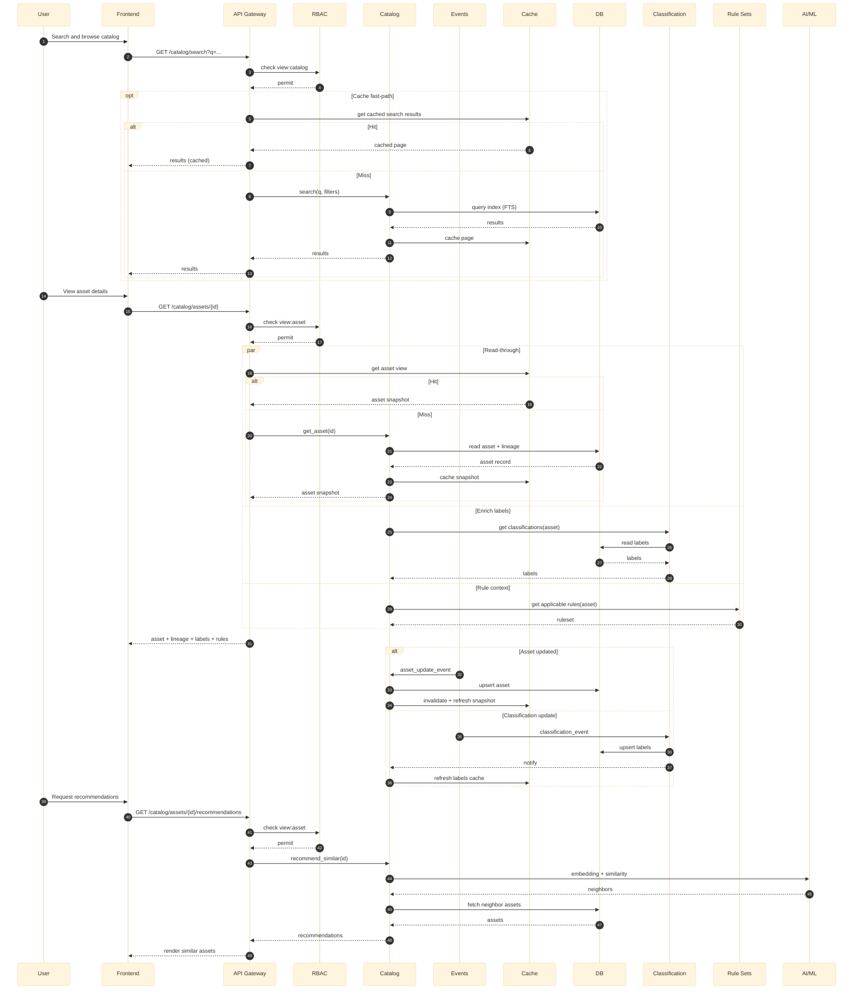

# Catalog Module – Advanced Sequence Diagram

```mermaid
%%{init: {'theme': 'base', 'sequence': {'rightAngles': true}}}%%
sequenceDiagram
    autonumber
    participant User as User
    participant UI as Frontend
    participant GW as API Gateway
    participant RBAC as RBAC
    participant CAT as Catalog
    participant Q as Events
    participant C as Cache
    participant DB as DB
    participant CLS as Classification
    participant RSET as Rule Sets
    participant AI as AI/ML

    User->>UI: Search and browse catalog
    UI->>GW: GET /catalog/search?q=...
    GW->>RBAC: check view:catalog
    RBAC-->>GW: permit
    opt Cache fast-path
        GW->>C: get cached search results
        alt Hit
            C-->>GW: cached page
            GW-->>UI: results (cached)
        else Miss
            GW->>CAT: search(q, filters)
            CAT->>DB: query index (FTS)
            DB-->>CAT: results
            CAT->>C: cache page
            CAT-->>GW: results
            GW-->>UI: results
        end
    end

    User->>UI: View asset details
    UI->>GW: GET /catalog/assets/{id}
    GW->>RBAC: check view:asset
    RBAC-->>GW: permit
    par Read-through
        GW->>C: get asset view
        alt Hit
            C-->>GW: asset snapshot
        else Miss
            GW->>CAT: get_asset(id)
            CAT->>DB: read asset + lineage
            DB-->>CAT: asset record
            CAT->>C: cache snapshot
            CAT-->>GW: asset snapshot
        end
    and Enrich labels
        CAT->>CLS: get classifications(asset)
        CLS->>DB: read labels
        DB-->>CLS: labels
        CLS-->>CAT: labels
    and Rule context
        CAT->>RSET: get applicable rules(asset)
        RSET-->>CAT: ruleset
    end
    GW-->>UI: asset + lineage + labels + rules

    alt Asset updated
        Q->>CAT: asset_update_event
        CAT->>DB: upsert asset
        CAT->>C: invalidate + refresh snapshot
    else Classification update
        Q->>CLS: classification_event
        CLS->>DB: upsert labels
        CLS-->>CAT: notify
        CAT->>C: refresh labels cache
    end

    User->>UI: Request recommendations
    UI->>GW: GET /catalog/assets/{id}/recommendations
    GW->>RBAC: check view:asset
    RBAC-->>GW: permit
    GW->>CAT: recommend_similar(id)
    CAT->>AI: embedding + similarity
    AI-->>CAT: neighbors
    CAT->>DB: fetch neighbor assets
    DB-->>CAT: assets
    CAT-->>GW: recommendations
    GW-->>UI: render similar assets
```
