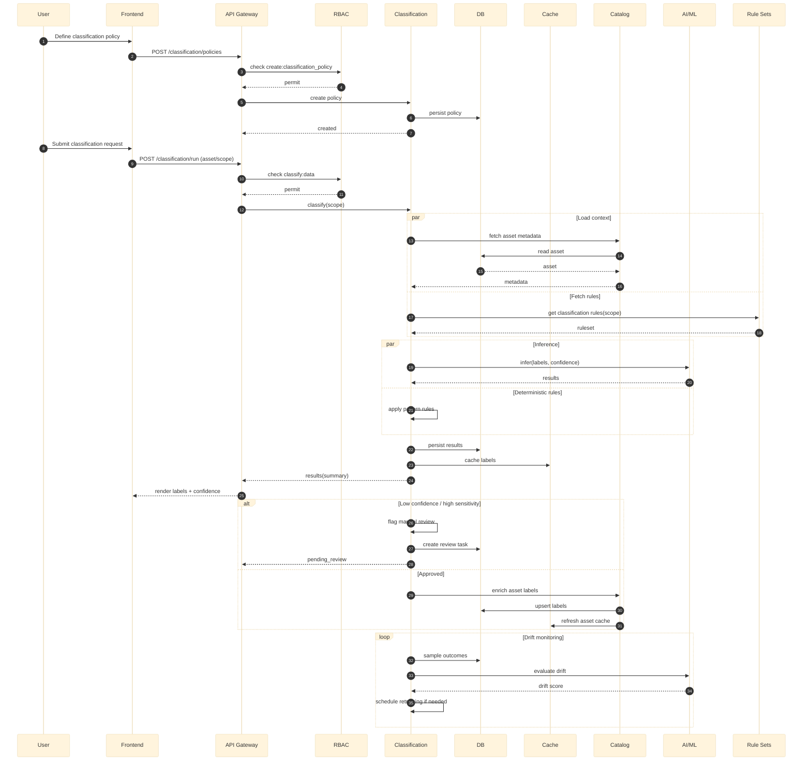

# Classification Module – Advanced Sequence Diagram

```mermaid
%%{init: {'theme': 'base', 'sequence': {'rightAngles': true}}}%%
sequenceDiagram
    autonumber
    participant User as User
    participant UI as Frontend
    participant GW as API Gateway
    participant RBAC as RBAC
    participant CLS as Classification
    participant DB as DB
    participant C as Cache
    participant CAT as Catalog
    participant AI as AI/ML
    participant RSET as Rule Sets

    User->>UI: Define classification policy
    UI->>GW: POST /classification/policies
    GW->>RBAC: check create:classification_policy
    RBAC-->>GW: permit
    GW->>CLS: create policy
    CLS->>DB: persist policy
    CLS-->>GW: created

    User->>UI: Submit classification request
    UI->>GW: POST /classification/run (asset/scope)
    GW->>RBAC: check classify:data
    RBAC-->>GW: permit
    GW->>CLS: classify(scope)
    par Load context
        CLS->>CAT: fetch asset metadata
        CAT->>DB: read asset
        DB-->>CAT: asset
        CAT-->>CLS: metadata
    and Fetch rules
        CLS->>RSET: get classification rules(scope)
        RSET-->>CLS: ruleset
    end

    par Inference
        CLS->>AI: infer(labels, confidence)
        AI-->>CLS: results
    and Deterministic rules
        CLS->>CLS: apply pattern rules
    end
    CLS->>DB: persist results
    CLS->>C: cache labels
    CLS-->>GW: results(summary)
    GW-->>UI: render labels + confidence

    alt Low confidence / high sensitivity
        CLS->>CLS: flag manual review
        CLS->>DB: create review task
        CLS-->>GW: pending_review
    else Approved
        CLS->>CAT: enrich asset labels
        CAT->>DB: upsert labels
        CAT->>C: refresh asset cache
    end

    loop Drift monitoring
        CLS->>DB: sample outcomes
        CLS->>AI: evaluate drift
        AI-->>CLS: drift score
        CLS->>CLS: schedule retraining if needed
    end
```
