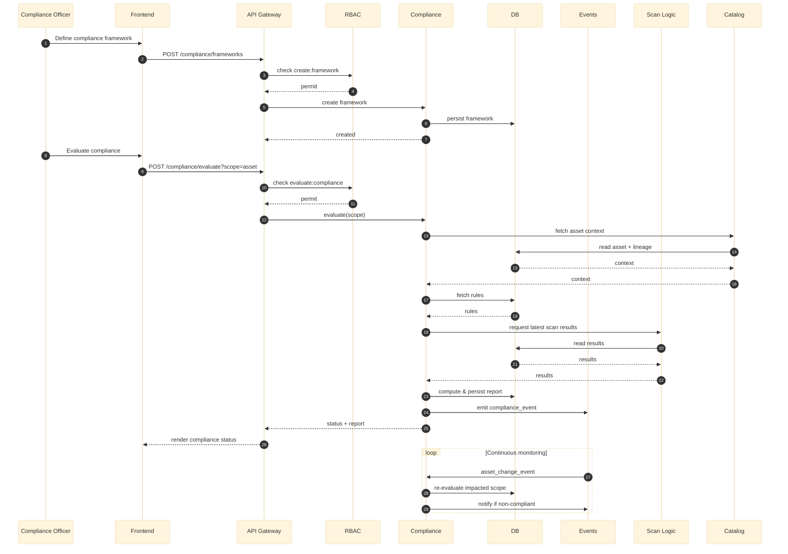

# Compliance Module – Advanced Sequence Diagram

```mermaid
%%{init: {'theme': 'base', 'sequence': {'rightAngles': true}}}%%
sequenceDiagram
    autonumber
    participant Officer as Compliance Officer
    participant UI as Frontend
    participant GW as API Gateway
    participant RBAC as RBAC
    participant COMP as Compliance
    participant DB as DB
    participant Q as Events
    participant SCAN as Scan Logic
    participant CAT as Catalog

    Officer->>UI: Define compliance framework
    UI->>GW: POST /compliance/frameworks
    GW->>RBAC: check create:framework
    RBAC-->>GW: permit
    GW->>COMP: create framework
    COMP->>DB: persist framework
    COMP-->>GW: created

    Officer->>UI: Evaluate compliance
    UI->>GW: POST /compliance/evaluate?scope=asset
    GW->>RBAC: check evaluate:compliance
    RBAC-->>GW: permit
    GW->>COMP: evaluate(scope)
    COMP->>CAT: fetch asset context
    CAT->>DB: read asset + lineage
    DB-->>CAT: context
    CAT-->>COMP: context
    COMP->>DB: fetch rules
    DB-->>COMP: rules
    COMP->>SCAN: request latest scan results
    SCAN->>DB: read results
    DB-->>SCAN: results
    SCAN-->>COMP: results
    COMP->>DB: compute & persist report
    COMP->>Q: emit compliance_event
    COMP-->>GW: status + report
    GW-->>UI: render compliance status

    loop Continuous monitoring
        Q->>COMP: asset_change_event
        COMP->>DB: re-evaluate impacted scope
        COMP->>Q: notify if non-compliant
    end
```
