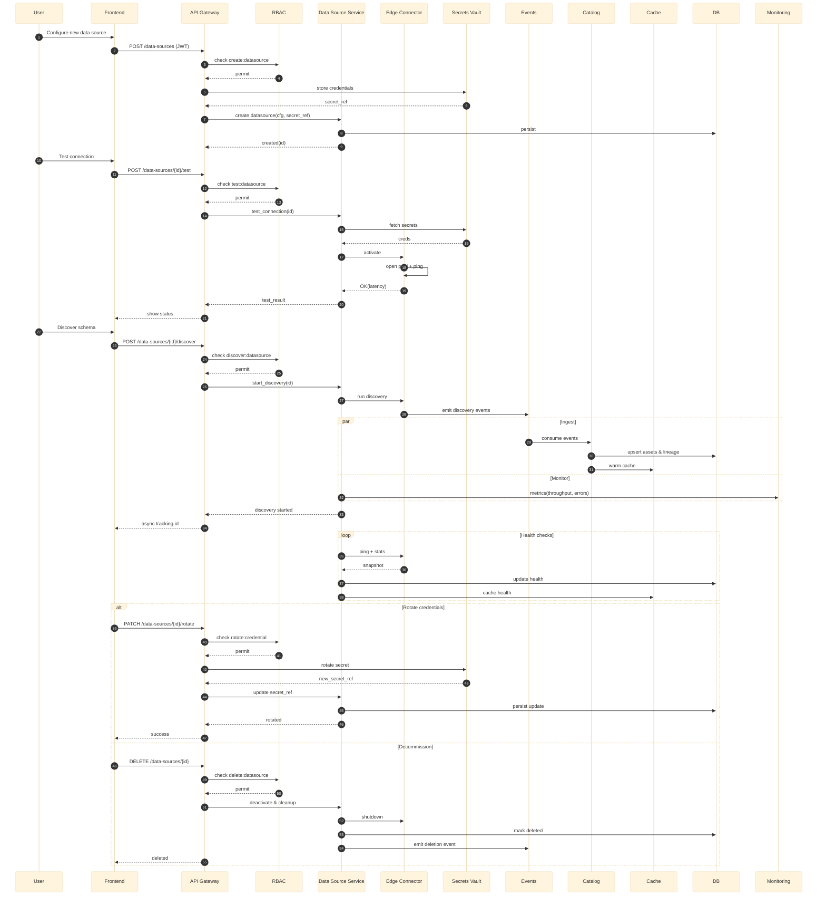

# Data Source Module – Advanced Sequence Diagram

```mermaid
%%{init: {'theme': 'base', 'sequence': {'rightAngles': true}}}%%
sequenceDiagram
    autonumber
    participant User as User
    participant UI as Frontend
    participant GW as API Gateway
    participant RBAC as RBAC
    participant DS as Data Source Service
    participant Edge as Edge Connector
    participant VAULT as Secrets Vault
    participant Q as Events
    participant CAT as Catalog
    participant C as Cache
    participant DB as DB
    participant MON as Monitoring

    User->>UI: Configure new data source
    UI->>GW: POST /data-sources (JWT)
    GW->>RBAC: check create:datasource
    RBAC-->>GW: permit
    GW->>VAULT: store credentials
    VAULT-->>GW: secret_ref
    GW->>DS: create datasource(cfg, secret_ref)
    DS->>DB: persist
    DS-->>GW: created(id)

    User->>UI: Test connection
    UI->>GW: POST /data-sources/{id}/test
    GW->>RBAC: check test:datasource
    RBAC-->>GW: permit
    GW->>DS: test_connection(id)
    DS->>VAULT: fetch secrets
    VAULT-->>DS: creds
    DS->>Edge: activate
    Edge->>Edge: open pool + ping
    Edge-->>DS: OK(latency)
    DS-->>GW: test_result
    GW-->>UI: show status

    User->>UI: Discover schema
    UI->>GW: POST /data-sources/{id}/discover
    GW->>RBAC: check discover:datasource
    RBAC-->>GW: permit
    GW->>DS: start_discovery(id)
    DS->>Edge: run discovery
    Edge->>Q: emit discovery events
    par Ingest
        Q->>CAT: consume events
        CAT->>DB: upsert assets & lineage
        CAT->>C: warm cache
    and Monitor
        DS->>MON: metrics(throughput, errors)
    end
    DS-->>GW: discovery started
    GW-->>UI: async tracking id

    loop Health checks
        DS->>Edge: ping + stats
        Edge-->>DS: snapshot
        DS->>DB: update health
        DS->>C: cache health
    end

    alt Rotate credentials
        UI->>GW: PATCH /data-sources/{id}/rotate
        GW->>RBAC: check rotate:credential
        RBAC-->>GW: permit
        GW->>VAULT: rotate secret
        VAULT-->>GW: new_secret_ref
        GW->>DS: update secret_ref
        DS->>DB: persist update
        DS-->>GW: rotated
        GW-->>UI: success
    else Decommission
        UI->>GW: DELETE /data-sources/{id}
        GW->>RBAC: check delete:datasource
        RBAC-->>GW: permit
        GW->>DS: deactivate & cleanup
        DS->>Edge: shutdown
        DS->>DB: mark deleted
        DS->>Q: emit deletion event
        GW-->>UI: deleted
    end
```
