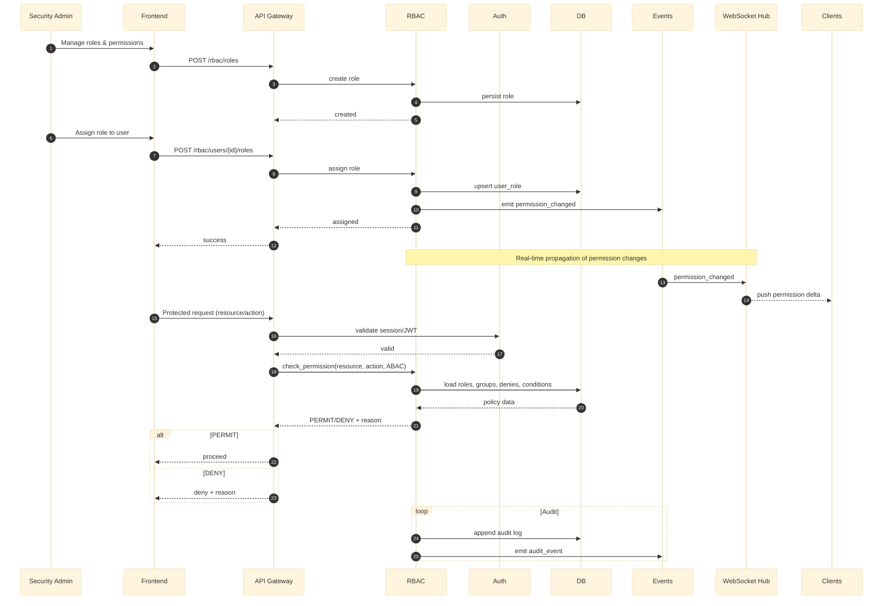

# RBAC Module – Advanced Sequence Diagram

```mermaid
%%{init: {'theme': 'base', 'sequence': {'rightAngles': true}}}%%
sequenceDiagram
    autonumber
    participant Admin as Security Admin
    participant UI as Frontend
    participant GW as API Gateway
    participant RBAC as RBAC
    participant AUTH as Auth
    participant DB as DB
    participant Q as Events
    participant WS as WebSocket Hub

    Admin->>UI: Manage roles & permissions
    UI->>GW: POST /rbac/roles
    GW->>RBAC: create role
    RBAC->>DB: persist role
    RBAC-->>GW: created

    Admin->>UI: Assign role to user
    UI->>GW: POST /rbac/users/{id}/roles
    GW->>RBAC: assign role
    RBAC->>DB: upsert user_role
    RBAC->>Q: emit permission_changed
    RBAC-->>GW: assigned
    GW-->>UI: success

    Note over RBAC,WS: Real-time propagation of permission changes
    Q->>WS: permission_changed
    WS-->>Clients: push permission delta

    UI->>GW: Protected request (resource/action)
    GW->>AUTH: validate session/JWT
    AUTH-->>GW: valid
    GW->>RBAC: check_permission(resource, action, ABAC)
    RBAC->>DB: load roles, groups, denies, conditions
    DB-->>RBAC: policy data
    RBAC-->>GW: PERMIT/DENY + reason
    alt PERMIT
        GW-->>UI: proceed
    else DENY
        GW-->>UI: deny + reason
    end

    loop Audit
        RBAC->>DB: append audit log
        RBAC->>Q: emit audit_event
    end
```
