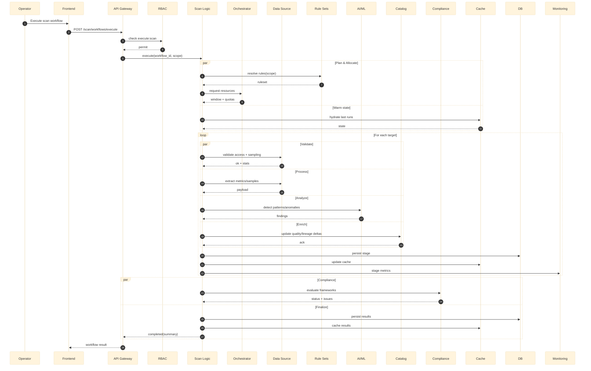

# Scan Logic Module – Advanced Sequence Diagram

```mermaid
%%{init: {'theme': 'base', 'sequence': {'rightAngles': true}}}%%
sequenceDiagram
    autonumber
    participant Operator as Operator
    participant UI as Frontend
    participant GW as API Gateway
    participant RBAC as RBAC
    participant SCAN as Scan Logic
    participant RACINE as Orchestrator
    participant DS as Data Source
    participant RSET as Rule Sets
    participant AI as AI/ML
    participant CAT as Catalog
    participant COMP as Compliance
    participant C as Cache
    participant DB as DB
    participant MON as Monitoring

    Operator->>UI: Execute scan workflow
    UI->>GW: POST /scan/workflows/execute
    GW->>RBAC: check execute:scan
    RBAC-->>GW: permit
    GW->>SCAN: execute(workflow_id, scope)

    par Plan & Allocate
        SCAN->>RSET: resolve rules(scope)
        RSET-->>SCAN: ruleset
        SCAN->>RACINE: request resources
        RACINE-->>SCAN: window + quotas
    and Warm state
        SCAN->>C: hydrate last runs
        C-->>SCAN: state
    end

    loop For each target
        par Validate
            SCAN->>DS: validate access + sampling
            DS-->>SCAN: ok + stats
        and Process
            SCAN->>DS: extract metrics/samples
            DS-->>SCAN: payload
        and Analyze
            SCAN->>AI: detect patterns/anomalies
            AI-->>SCAN: findings
        and Enrich
            SCAN->>CAT: update quality/lineage deltas
            CAT-->>SCAN: ack
        end
        SCAN->>DB: persist stage
        SCAN->>C: update cache
        SCAN->>MON: stage metrics
    end

    par Compliance
        SCAN->>COMP: evaluate frameworks
        COMP-->>SCAN: status + issues
    and Finalize
        SCAN->>DB: persist results
        SCAN->>C: cache results
        SCAN-->>GW: completed(summary)
    end

    GW-->>UI: workflow result
```
