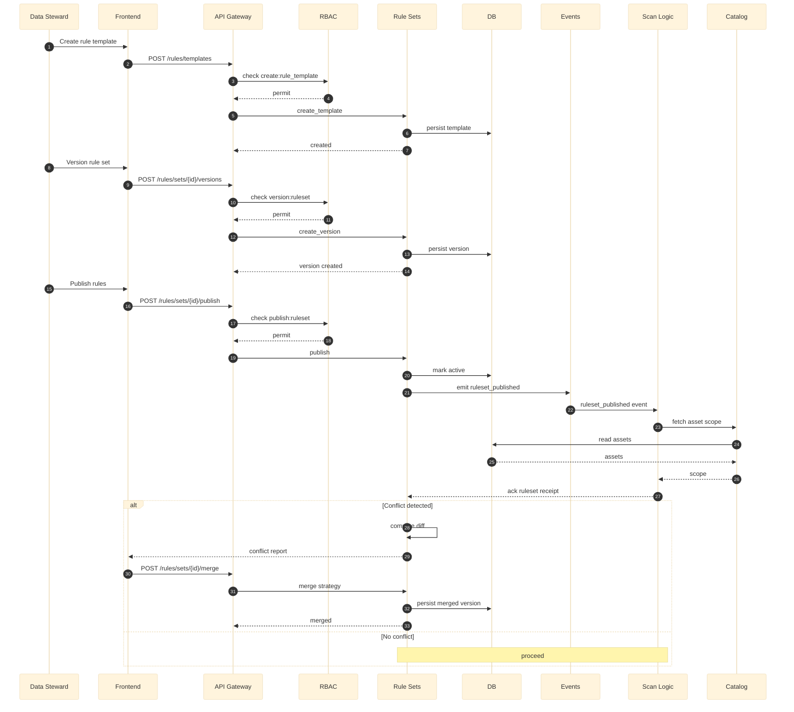

# Scan Rule Sets Module – Advanced Sequence Diagram

```mermaid
%%{init: {'theme': 'base', 'sequence': {'rightAngles': true}}}%%
sequenceDiagram
    autonumber
    participant Steward as Data Steward
    participant UI as Frontend
    participant GW as API Gateway
    participant RBAC as RBAC
    participant RSET as Rule Sets
    participant DB as DB
    participant Q as Events
    participant SCAN as Scan Logic
    participant CAT as Catalog

    Steward->>UI: Create rule template
    UI->>GW: POST /rules/templates
    GW->>RBAC: check create:rule_template
    RBAC-->>GW: permit
    GW->>RSET: create_template
    RSET->>DB: persist template
    RSET-->>GW: created

    Steward->>UI: Version rule set
    UI->>GW: POST /rules/sets/{id}/versions
    GW->>RBAC: check version:ruleset
    RBAC-->>GW: permit
    GW->>RSET: create_version
    RSET->>DB: persist version
    RSET-->>GW: version created

    Steward->>UI: Publish rules
    UI->>GW: POST /rules/sets/{id}/publish
    GW->>RBAC: check publish:ruleset
    RBAC-->>GW: permit
    GW->>RSET: publish
    RSET->>DB: mark active
    RSET->>Q: emit ruleset_published

    Q->>SCAN: ruleset_published event
    SCAN->>CAT: fetch asset scope
    CAT->>DB: read assets
    DB-->>CAT: assets
    CAT-->>SCAN: scope
    SCAN-->>RSET: ack ruleset receipt

    alt Conflict detected
        RSET->>RSET: compute diff
        RSET-->>UI: conflict report
        UI->>GW: POST /rules/sets/{id}/merge
        GW->>RSET: merge strategy
        RSET->>DB: persist merged version
        RSET-->>GW: merged
    else No conflict
        Note over RSET,SCAN: proceed
    end
```
