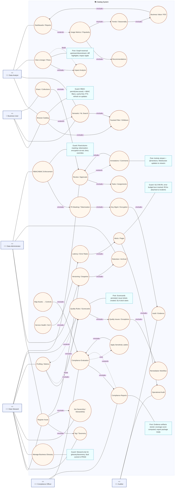

# Use Case – Catalog Module (Enterprise Use Case Layout)

```mermaid
%%{init: {'theme': 'base'}}%%
flowchart LR
    %% ================= Actors (Left Side) =================
    A_STEWARD["<<actor>>\n👩‍💼 Data Steward"]:::actor
    A_ANALYST["<<actor>>\n👨‍🔬 Data Analyst"]:::actor
    A_ADMIN["<<actor>>\n👨‍💼 Data Administrator"]:::actor

    %% ================= Actors (Right Side) =================
    R_BUSINESS["<<actor>>\n👤 Business User"]:::actor
    R_COMPLIANCE["<<actor>>\n👩‍⚖️ Compliance Officer"]:::actor
    R_AUDITOR["<<actor>>\n👩‍📊 Auditor"]:::actor

    %% ================= System Boundary =================
    subgraph SYSTEM["📚 Catalog System"]
    direction TB

      %% -------- Core Use Cases (Ovals) --------
      UC_BROWSE((Browse Catalog)):::uc
      UC_SEMANTIC((Semantic / NL Search)):::uc
      UC_FACETS((Faceted Filter / Drilldown)):::uc
      UC_VIEW_LINEAGE((View Lineage / Flows)):::uc
      UC_IMPACT((Impact Analysis)):::uc

      UC_REGISTER((Register Asset)):::uc
      UC_TAG((Tag / Taxonomy)):::uc
      UC_GLOSSARY((Manage Business Glossary)):::uc
      UC_OWNER((Set Ownership / Stewardship)):::uc
      UC_VERSION((Versioning / Snapshot)):::uc
      UC_RETENTION((Retention / Archival)):::uc

      UC_PROFILE((Profiling / Metrics)):::uc
      UC_QUALITY((Quality Rules / Scorecards)):::uc
      UC_ISSUE((Quality Issues / Exceptions)):::uc
      UC_REMEDY((Remediation Workflow)):::uc

      UC_ANNOTATE((Annotations / Comments)):::uc
      UC_REVIEW((Review / Approvals)):::uc
      UC_TASKS((Tasks / Assignments)):::uc
      UC_SHARE((Share / Collections)):::uc

      UC_USAGE((Usage Metrics / Popularity)):::uc
      UC_RECO((Recommendations)):::uc
      UC_TREND((Trends / Seasonality)):::uc
      UC_BIZVAL((Business Value / ROI)):::uc
      UC_DASH((Dashboards / Reports)):::uc

      UC_RBAC((RBAC/ABAC Enforcement)):::uc
      UC_MASK((PII Masking / Tokenization)):::uc
      UC_KMS((Key Mgmt / Encryption)):::uc
      UC_AUDIT((Audit / Evidence)):::uc

      UC_MAP_CTRL((Map Assets → Controls)):::uc
      UC_COMP_EVAL((Compliance Evaluation)):::uc
      UC_COMP_RPT((Compliance Reports)):::uc
      UC_LABEL((Apply Sensitivity Labels)):::uc

      UC_OBS((Service Health / SLO)):::uc
      UC_LATENCY((Latency / Error Rates)):::uc
      UC_ALERTS((Alerts / Pager)):::uc
      UC_OPS_AUDIT((Operational Audit)):::uc

      %% -------- Includes (solid edges with label) --------
      UC_BROWSE -->|«include»| UC_FACETS
      UC_SEMANTIC -->|«include»| UC_FACETS
      UC_VIEW_LINEAGE -->|«include»| UC_IMPACT

      UC_REGISTER -->|«include»| UC_TAG
      UC_REGISTER -->|«include»| UC_OWNER
      UC_REGISTER -->|«include»| UC_VERSION
      UC_VERSION -->|«include»| UC_RETENTION

      UC_PROFILE -->|«include»| UC_QUALITY
      UC_QUALITY -->|«include»| UC_ISSUE
      UC_ISSUE -->|«include»| UC_REMEDY

      UC_ANNOTATE -->|«include»| UC_REVIEW
      UC_REVIEW -->|«include»| UC_TASKS
      UC_SHARE -->|«include»| UC_REVIEW

      UC_USAGE -->|«include»| UC_RECO
      UC_USAGE -->|«include»| UC_TREND
      UC_TREND -->|«include»| UC_BIZVAL
      UC_BIZVAL -->|«include»| UC_DASH

      UC_RBAC -->|«include»| UC_MASK
      UC_MASK -->|«include»| UC_KMS
      UC_KMS -->|«include»| UC_AUDIT

      UC_MAP_CTRL -->|«include»| UC_COMP_EVAL
      UC_COMP_EVAL -->|«include»| UC_COMP_RPT
      UC_LABEL -->|«include»| UC_COMP_EVAL

      UC_OBS -->|«include»| UC_LATENCY
      UC_LATENCY -->|«include»| UC_ALERTS
      UC_ALERTS -->|«include»| UC_OPS_AUDIT

      %% -------- Extends (dotted edges with label) --------
      UC_BROWSE -.->|«extend»| UC_SEMANTIC
      UC_QUALITY -.->|«extend»| UC_PROFILE
      UC_REVIEW -.->|«extend»| UC_ANNOTATE
      UC_DASH -.->|«extend»| UC_USAGE
      UC_COMP_RPT -.->|«extend»| UC_COMP_EVAL

      %% -------- Guards / Constraints / Notes --------
      G_SEARCH["Guard: RBAC permit(view:asset) + ABAC filters; cache-first; FTS refresh on updates"]:::note
      G_LINEAGE["Post: Graph traversal upstream/downstream; diff highlights; impact ripple"]:::note
      G_CURATE["Guard: Steward-only for glossary/taxonomy; dual control in PROD"]:::note
      G_QUALITY["Post: Scorecards persisted; issue tickets created; SLA clock starts"]:::note
      G_COLLAB["Post: Activity stream + @mentions; WebSocket updates to viewers"]:::note
      G_SEC["Guard: Row/column masking; tokenization; encryption-at-rest; deny overrides"]:::note
      G_COMP["Post: Evidence artifacts stored; coverage score computed; export package ready"]:::note
      G_OBS["Guard: SLO 99.9%; error budget burn tracked; RCAs attached to incidents"]:::note

      UC_BROWSE --- G_SEARCH
      UC_VIEW_LINEAGE --- G_LINEAGE
      UC_GLOSSARY --- G_CURATE
      UC_QUALITY --- G_QUALITY
      UC_ANNOTATE --- G_COLLAB
      UC_RBAC --- G_SEC
      UC_COMP_RPT --- G_COMP
      UC_ALERTS --- G_OBS

    end

    %% ================= Actor Associations (Left → System) =================
    A_STEWARD --- UC_REGISTER
    A_STEWARD --- UC_TAG
    A_STEWARD --- UC_GLOSSARY
    A_STEWARD --- UC_OWNER
    A_STEWARD --- UC_PROFILE
    A_STEWARD --- UC_QUALITY
    A_STEWARD --- UC_REVIEW

    A_ANALYST --- UC_BROWSE
    A_ANALYST --- UC_SEMANTIC
    A_ANALYST --- UC_VIEW_LINEAGE
    A_ANALYST --- UC_DASH

    A_ADMIN --- UC_REGISTER
    A_ADMIN --- UC_VERSION
    A_ADMIN --- UC_RETENTION
    A_ADMIN --- UC_RBAC

    %% ================= Actor Associations (Right → System) =================
    R_BUSINESS --- UC_BROWSE
    R_BUSINESS --- UC_SEMANTIC
    R_BUSINESS --- UC_SHARE

    R_COMPLIANCE --- UC_COMP_EVAL
    R_COMPLIANCE --- UC_COMP_RPT

    R_AUDITOR --- UC_AUDIT
    R_AUDITOR --- UC_OPS_AUDIT

    %% ================= Cross-Module Indicators (stylistic links) =================
    UC_PROFILE -.->|feeds| UC_QUALITY
    UC_VIEW_LINEAGE -.->|feeds| UC_IMPACT
    UC_COMP_EVAL -.->|uses| UC_LABEL

    %% ================= Styles =================
    classDef actor fill:#eef2ff,stroke:#1e3a8a,stroke-width:1.5px
    classDef uc fill:#fff7ed,stroke:#9a3412,stroke-width:1.5px
    classDef note fill:#ecfeff,stroke:#0891b2,stroke-width:1px
```
