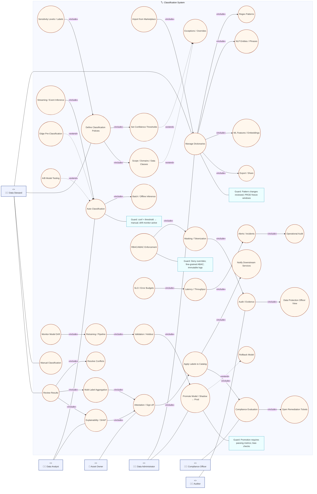

# Use Case – Classification Module (Enterprise Use Case Layout)

```mermaid
%%{init: {'theme': 'base'}}%%
flowchart LR
    %% ================= Actors (Left Side) =================
    A_STEWARD["<<actor>>\n👩‍💼 Data Steward"]:::actor
    A_ADMIN["<<actor>>\n👨‍💼 Data Administrator"]:::actor
    A_ANALYST["<<actor>>\n👨‍🔬 Data Analyst"]:::actor

    %% ================= Actors (Right Side) =================
    R_OWNER["<<actor>>\n👤 Asset Owner"]:::actor
    R_COMP["<<actor>>\n👩‍⚖️ Compliance Officer"]:::actor
    R_AUD["<<actor>>\n👩‍📊 Auditor"]:::actor

    %% ================= System Boundary =================
    subgraph SYSTEM["🏷️ Classification System"]
    direction TB

      %% -------- Dictionaries & Patterns --------
      UC_DICT((Manage Dictionaries)):::uc
      UC_REX((Regex Patterns)):::uc
      UC_NLP((NLP Entities / Phrases)):::uc
      UC_ML((ML Features / Embeddings)):::uc
      UC_IMPORT((Import from Marketplace)):::uc
      UC_EXPORT((Export / Share)):::uc

      %% -------- Policy & Thresholds --------
      UC_POLICY((Define Classification Policies)):::uc
      UC_THRESH((Set Confidence Thresholds)):::uc
      UC_SENS((Sensitivity Levels / Labels)):::uc
      UC_SCOPE((Scope / Domains / Data Classes)):::uc
      UC_EXC((Exceptions / Overrides)):::uc

      %% -------- Inference Pipelines --------
      UC_AUTO((Auto Classification)):::uc
      UC_MAN((Manual Classification)):::uc
      UC_BATCH((Batch / Offline Inference)):::uc
      UC_STREAM((Streaming / Event Inference)):::uc
      UC_EDGE((Edge Pre-Classification)):::uc
      UC_AB((A/B Model Testing)):::uc

      %% -------- Review & Approval --------
      UC_REVIEW((Review Results)):::uc
      UC_CONFLICT((Resolve Conflicts)):::uc
      UC_MULTI((Multi-Label Aggregation)):::uc
      UC_EXPLAIN((Explainability / SHAP)):::uc
      UC_ATTEST((Attestation / Sign-off)):::uc

      %% -------- Model Ops & Quality --------
      UC_DRIFT((Monitor Model Drift)):::uc
      UC_RETRAIN((Retraining / Pipeline)):::uc
      UC_VALIDATE((Validation / Holdout)):::uc
      UC_PROMOTE((Promote Model / Shadow → Prod)):::uc
      UC_ROLLBK((Rollback Model)):::uc

      %% -------- Integration --------
      UC_APPLY((Apply Labels to Catalog)):::uc
      UC_NOTIFY((Notify Downstream Services)):::uc
      UC_COMP_EVAL((Compliance Evaluation)):::uc
      UC_TICKET((Open Remediation Tickets)):::uc

      %% -------- Security & Governance --------
      UC_RBAC((RBAC/ABAC Enforcement)):::uc
      UC_MASK((Masking / Tokenization)):::uc
      UC_AUDIT((Audit / Evidence)):::uc
      UC_DPO((Data Protection Officer View)):::uc

      %% -------- Observability --------
      UC_SLO((SLO / Error Budgets)):::uc
      UC_LAT((Latency / Throughput)):::uc
      UC_ALERTS((Alerts / Incidents)):::uc
      UC_OPSAUD((Operational Audit)):::uc

      %% -------- Includes --------
      UC_DICT -->|«include»| UC_REX
      UC_DICT -->|«include»| UC_NLP
      UC_DICT -->|«include»| UC_ML
      UC_IMPORT -->|«include»| UC_DICT
      UC_DICT -->|«include»| UC_EXPORT

      UC_POLICY -->|«include»| UC_THRESH
      UC_POLICY -->|«include»| UC_SCOPE
      UC_SENS -->|«include»| UC_POLICY

      UC_AUTO -->|«include»| UC_BATCH
      UC_STREAM -->|«include»| UC_AUTO

      UC_REVIEW -->|«include»| UC_CONFLICT
      UC_REVIEW -->|«include»| UC_MULTI
      UC_REVIEW -->|«include»| UC_EXPLAIN
      UC_EXPLAIN -->|«include»| UC_ATTEST
      UC_MULTI -->|«include»| UC_ATTEST

      UC_DRIFT -->|«include»| UC_RETRAIN
      UC_RETRAIN -->|«include»| UC_VALIDATE
      UC_VALIDATE -->|«include»| UC_PROMOTE

      UC_ATTEST -->|«include»| UC_APPLY
      UC_APPLY -->|«include»| UC_NOTIFY
      UC_APPLY -->|«include»| UC_COMP_EVAL
      UC_COMP_EVAL -->|«include»| UC_TICKET

      UC_RBAC -->|«include»| UC_MASK
      UC_MASK -->|«include»| UC_AUDIT
      UC_AUDIT -->|«include»| UC_DPO

      UC_SLO -->|«include»| UC_LAT
      UC_LAT -->|«include»| UC_ALERTS
      UC_ALERTS -->|«include»| UC_OPSAUD

      %% -------- Extends --------
      UC_SCOPE -.->|«extend»| UC_EXC
      UC_THRESH -.->|«extend»| UC_EXC
      UC_EDGE -.->|«extend»| UC_AUTO
      UC_AB -.->|«extend»| UC_AUTO
      UC_PROMOTE -.->|«extend»| UC_ROLLBK

      %% -------- Guards / Notes --------
      G_DICT["Guard: Pattern changes reviewed; PROD freeze windows"]:::note
      G_INFER["Guard: conf < threshold → manual; drift monitor active"]:::note
      G_MOPS["Guard: Promotion requires passing metrics; bias checks"]:::note
      G_SEC["Guard: Deny overrides; fine-grained ABAC; immutable logs"]:::note

      UC_DICT --- G_DICT
      UC_AUTO --- G_INFER
      UC_PROMOTE --- G_MOPS
      UC_RBAC --- G_SEC

    end

    %% ================= Actor Associations (Left → System) =================
    A_STEWARD --- UC_DICT
    A_STEWARD --- UC_POLICY
    A_STEWARD --- UC_MAN
    A_STEWARD --- UC_REVIEW

    A_ADMIN --- UC_DICT
    A_ADMIN --- UC_PROMOTE

    A_ANALYST --- UC_AUTO
    A_ANALYST --- UC_EXPLAIN

    %% ================= Actor Associations (Right → System) =================
    R_OWNER --- UC_ATTEST
    R_COMP --- UC_COMP_EVAL
    R_AUD --- UC_AUDIT

    %% ================= Styles =================
    classDef actor fill:#eef2ff,stroke:#1e3a8a,stroke-width:1.5px
    classDef uc fill:#fff7ed,stroke:#9a3412,stroke-width:1.5px
    classDef note fill:#ecfeff,stroke:#0891b2,stroke-width:1px
```
