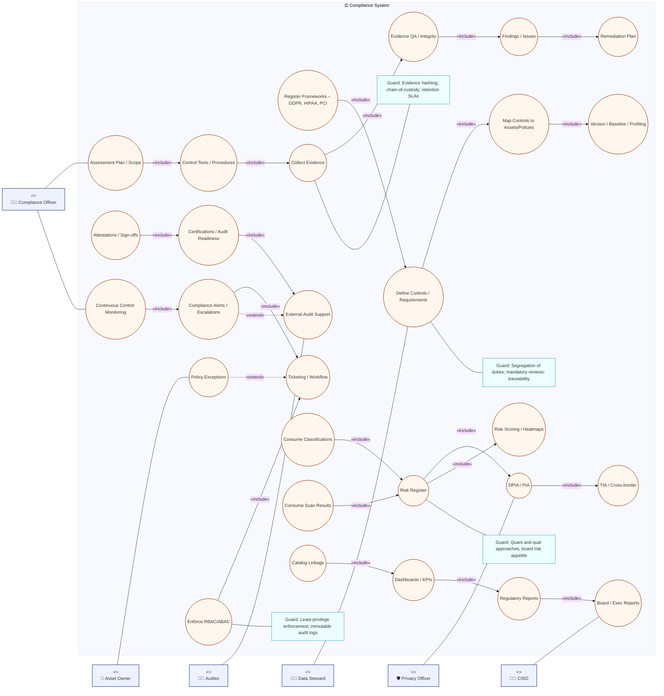

# Use Case – Compliance Module (Enterprise Use Case Layout)

```mermaid
%%{init: {'theme': 'base'}}%%
flowchart LR
    %% ================= Actors (Left Side) =================
    A_COMP["<<actor>>\n👩‍⚖️ Compliance Officer"]:::actor
    A_STEWARD["<<actor>>\n👩‍💼 Data Steward"]:::actor
    A_PRIV["<<actor>>\n🛡️ Privacy Officer"]:::actor

    %% ================= Actors (Right Side) =================
    R_OWNER["<<actor>>\n👤 Asset Owner"]:::actor
    R_AUD["<<actor>>\n👩‍📊 Auditor"]:::actor
    R_CISO["<<actor>>\n🧑‍💼 CISO"]:::actor

    %% ================= System Boundary =================
    subgraph SYSTEM["⚖️ Compliance System"]
    direction TB

      %% -------- Frameworks & Controls --------
      UC_FW((Register Frameworks – GDPR, HIPAA, PCI)):::uc
      UC_CTRL((Define Controls / Requirements)):::uc
      UC_MAP((Map Controls to Assets/Policies)):::uc
      UC_VER((Version / Baseline / Profiling)):::uc

      %% -------- Assessment & Evidence --------
      UC_PLAN((Assessment Plan / Scope)):::uc
      UC_TESTS((Control Tests / Procedures)):::uc
      UC_EVID((Collect Evidence)):::uc
      UC_EVID_QA((Evidence QA / Integrity)):::uc
      UC_FIND((Findings / Issues)):::uc
      UC_REMED((Remediation Plan)):::uc

      %% -------- Risk & Impact --------
      UC_RISK((Risk Register)):::uc
      UC_DPIA((DPIA / PIA)):::uc
      UC_TIAs((TIA / Cross-border)):::uc
      UC_SCORE((Risk Scoring / Heatmaps)):::uc

      %% -------- Attestations & Certifications --------
      UC_ATTEST((Attestations / Sign-offs)):::uc
      UC_CERT((Certifications / Audit Readiness)):::uc
      UC_AUDIT((External Audit Support)):::uc

      %% -------- Monitoring & Automation --------
      UC_MON((Continuous Control Monitoring)):::uc
      UC_ALERTS((Compliance Alerts / Escalations)):::uc
      UC_EXEMPT((Policy Exceptions)):::uc
      UC_TICKETS((Ticketing / Workflow)):::uc

      %% -------- Integration Paths --------
      UC_CLASS((Consume Classifications)):::uc
      UC_SCAN((Consume Scan Results)):::uc
      UC_RBAC((Enforce RBAC/ABAC)):::uc
      UC_CATALOG((Catalog Linkage)):::uc

      %% -------- Reporting --------
      UC_DASH((Dashboards / KPIs)):::uc
      UC_REG((Regulatory Reports)):::uc
      UC_BOARD((Board / Exec Reports)):::uc

      %% -------- Includes --------
      UC_FW -->|«include»| UC_CTRL
      UC_CTRL -->|«include»| UC_MAP
      UC_MAP -->|«include»| UC_VER

      UC_PLAN -->|«include»| UC_TESTS
      UC_TESTS -->|«include»| UC_EVID
      UC_EVID -->|«include»| UC_EVID_QA
      UC_EVID_QA -->|«include»| UC_FIND
      UC_FIND -->|«include»| UC_REMED

      UC_RISK -->|«include»| UC_DPIA
      UC_DPIA -->|«include»| UC_TIAs
      UC_RISK -->|«include»| UC_SCORE

      UC_ATTEST -->|«include»| UC_CERT
      UC_CERT -->|«include»| UC_AUDIT

      UC_MON -->|«include»| UC_ALERTS
      UC_ALERTS -->|«include»| UC_TICKETS

      UC_CLASS -->|«include»| UC_RISK
      UC_SCAN -->|«include»| UC_RISK
      UC_RBAC -->|«include»| UC_TICKETS
      UC_CATALOG -->|«include»| UC_DASH

      UC_DASH -->|«include»| UC_REG
      UC_REG -->|«include»| UC_BOARD

      %% -------- Extends --------
      UC_EXEMPT -.->|«extend»| UC_TICKETS
      UC_ALERTS -.->|«extend»| UC_AUDIT

      %% -------- Guards / Notes --------
      G_CTRL["Guard: Segregation of duties; mandatory reviews; traceability"]:::note
      G_EVID["Guard: Evidence hashing; chain-of-custody; retention SLAs"]:::note
      G_RISK["Guard: Quant and qual approaches; board risk appetite"]:::note
      G_SEC["Guard: Least-privilege enforcement; immutable audit logs"]:::note

      UC_CTRL --- G_CTRL
      UC_EVID --- G_EVID
      UC_RISK --- G_RISK
      UC_RBAC --- G_SEC

    end

    %% ================= Actor Associations (Left → System) =================
    A_COMP --- UC_PLAN
    A_COMP --- UC_MON
    A_STEWARD --- UC_CTRL
    A_PRIV --- UC_DPIA

    %% ================= Actor Associations (Right → System) =================
    R_OWNER --- UC_EXEMPT
    R_AUD --- UC_AUDIT
    R_CISO --- UC_BOARD

    %% ================= Styles =================
    classDef actor fill:#eef2ff,stroke:#1e3a8a,stroke-width:1.5px
    classDef uc fill:#fff7ed,stroke:#9a3412,stroke-width:1.5px
    classDef note fill:#ecfeff,stroke:#0891b2,stroke-width:1px
```
