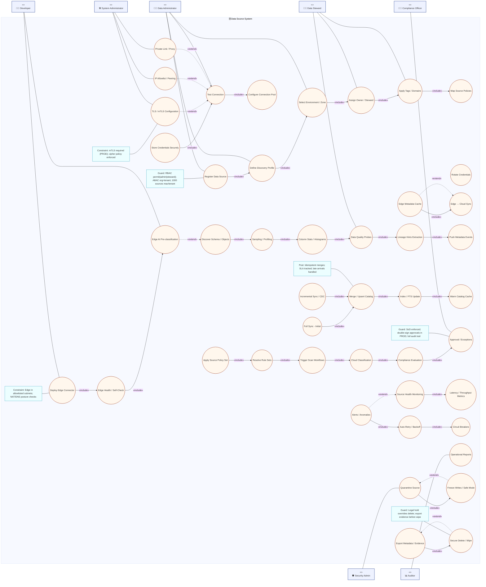

# Use Case – Data Source Module (Enterprise Use Case Layout)

```mermaid
%%{init: {'theme': 'base'}}%%
flowchart LR
    %% ================= Actors (Left Side) =================
    A_ADMIN["<<actor>>\n👨‍💼 Data Administrator"]:::actor
    A_SYS["<<actor>>\n🛠️ System Administrator"]:::actor
    A_DEV["<<actor>>\n👨‍💻 Developer"]:::actor
    A_STEWARD["<<actor>>\n👩‍💼 Data Steward"]:::actor

    %% ================= Actors (Right Side) =================
    R_COMP["<<actor>>\n👩‍⚖️ Compliance Officer"]:::actor
    R_SEC["<<actor>>\n🛡️ Security Admin"]:::actor
    R_AUD["<<actor>>\n📊 Auditor"]:::actor

    %% ================= System Boundary =================
    subgraph SYSTEM["🗄️ Data Source System"]
    direction TB

      %% -------- Onboarding --------
      UC_REGISTER((Register Data Source)):::uc
      UC_PROFILE((Define Discovery Profile)):::uc
      UC_ENV((Select Environment / Zone)):::uc
      UC_OWNER((Assign Owner / Steward)):::uc
      UC_TAGS((Apply Tags / Domains)):::uc
      UC_POLICYMAP((Map Source Policies)):::uc

      %% -------- Connectivity --------
      UC_SECRET((Store Credentials Securely)):::uc
      UC_ROTATE((Rotate Credentials)):::uc
      UC_TLS((TLS / mTLS Configuration)):::uc
      UC_IP((IP Allowlist / Peering)):::uc
      UC_PROXY((Private Link / Proxy)):::uc
      UC_TEST((Test Connection)):::uc
      UC_POOL((Configure Connection Pool)):::uc

      %% -------- Edge & Local Intelligence --------
      UC_EDGE_DEPLOY((Deploy Edge Connector)):::uc
      UC_EDGE_HEALTH((Edge Health / Self-Check)):::uc
      UC_EDGE_AI((Edge AI Pre-classification)):::uc
      UC_EDGE_CACHE((Edge Metadata Cache)):::uc
      UC_EDGE_SYNC((Edge → Cloud Sync)):::uc

      %% -------- Discovery & Profiling --------
      UC_DISCOVER((Discover Schema / Objects)):::uc
      UC_SAMPLE((Sampling / Profiling)):::uc
      UC_STATS((Column Stats / Histograms)):::uc
      UC_DQ((Data Quality Probes)):::uc
      UC_LINEAGE((Lineage Hints Extraction)):::uc
      UC_EVENTS((Push Metadata Events)):::uc

      %% -------- Sync & Ingestion --------
      UC_FULL((Full Sync - Initial)):::uc
      UC_CDC((Incremental Sync / CDC)):::uc
      UC_MERGE((Merge / Upsert Catalog)):::uc
      UC_INDEX((Index / FTS Update)):::uc
      UC_CACHE((Warm Catalog Cache)):::uc

      %% -------- Governance & Orchestration --------
      UC_POLICY((Apply Source Policy Set)):::uc
      UC_RULES((Resolve Rule Sets)):::uc
      UC_SCAN((Trigger Scan Workflows)):::uc
      UC_CLASSIFY((Cloud Classification)):::uc
      UC_COMP((Compliance Evaluation)):::uc
      UC_APPROVE((Approval / Exceptions)):::uc

      %% -------- Observability & Reliability --------
      UC_HEALTH((Source Health Monitoring)):::uc
      UC_METRICS((Latency / Throughput Metrics)):::uc
      UC_ALERTS((Alerts / Anomalies)):::uc
      UC_RETRY((Auto-Retry / Backoff)):::uc
      UC_CIRCUIT((Circuit Breakers)):::uc
      UC_REPORTS((Operational Reports)):::uc

      %% -------- Lifecycle --------
      UC_QUAR((Quarantine Source)):::uc
      UC_FREEZE((Freeze Writes / Safe Mode)):::uc
      UC_EXPORT((Export Metadata / Evidence)):::uc
      UC_DELETE((Secure Delete / Wipe)):::uc

      %% -------- Includes (solid with label) --------
      UC_REGISTER -->|«include»| UC_PROFILE
      UC_PROFILE -->|«include»| UC_ENV
      UC_ENV -->|«include»| UC_OWNER
      UC_OWNER -->|«include»| UC_TAGS
      UC_TAGS -->|«include»| UC_POLICYMAP

      UC_SECRET -->|«include»| UC_TEST
      UC_TEST -->|«include»| UC_POOL

      UC_EDGE_DEPLOY -->|«include»| UC_EDGE_HEALTH
      UC_EDGE_HEALTH -->|«include»| UC_EDGE_AI
      UC_EDGE_CACHE -->|«include»| UC_EDGE_SYNC

      UC_DISCOVER -->|«include»| UC_SAMPLE
      UC_SAMPLE -->|«include»| UC_STATS
      UC_STATS -->|«include»| UC_DQ
      UC_DQ -->|«include»| UC_LINEAGE
      UC_LINEAGE -->|«include»| UC_EVENTS

      UC_FULL -->|«include»| UC_MERGE
      UC_CDC -->|«include»| UC_MERGE
      UC_MERGE -->|«include»| UC_INDEX
      UC_INDEX -->|«include»| UC_CACHE

      UC_POLICY -->|«include»| UC_RULES
      UC_RULES -->|«include»| UC_SCAN
      UC_SCAN -->|«include»| UC_CLASSIFY
      UC_CLASSIFY -->|«include»| UC_COMP
      UC_COMP -->|«include»| UC_APPROVE

      UC_HEALTH -->|«include»| UC_METRICS
      UC_ALERTS -->|«include»| UC_RETRY
      UC_RETRY -->|«include»| UC_CIRCUIT

      UC_QUAR -->|«include»| UC_FREEZE
      UC_EXPORT -->|«include»| UC_DELETE

      %% -------- Extends (dotted with label) --------
      UC_TLS -.->|«extend»| UC_TEST
      UC_IP -.->|«extend»| UC_TEST
      UC_PROXY -.->|«extend»| UC_TEST

      UC_EDGE_AI -.->|«extend»| UC_DISCOVER
      UC_EDGE_CACHE -.->|«extend»| UC_EDGE_SYNC

      UC_ALERTS -.->|«extend»| UC_HEALTH
      UC_FREEZE -.->|«extend»| UC_QUAR
      UC_DELETE -.->|«extend»| UC_EXPORT

      %% -------- Guards / Constraints / Postconditions --------
      G_ONBOARD["Guard: RBAC permit(admin|steward); ABAC org=tenant; 1000 sources max/tenant"]:::note
      G_TLS["Constraint: mTLS required (PROD); cipher policy enforced"]:::note
      G_NET["Constraint: Edge in allowlisted subnets; NAT/DNS posture checks"]:::note
      P_MERGE["Post: Idempotent merges; SLA tracked; late arrivals handled"]:::note
      G_SOD["Guard: SoD enforced; double-sign approvals in PROD; full audit trail"]:::note
      G_EVID["Guard: Legal hold overrides delete; export evidence before wipe"]:::note

      G_ONBOARD --- UC_REGISTER
      G_TLS --- UC_TLS
      G_NET --- UC_EDGE_DEPLOY
      P_MERGE --- UC_MERGE
      G_SOD --- UC_APPROVE
      G_EVID --- UC_DELETE

    end

    %% ================= Actor Associations (Left → System) =================
    A_ADMIN --- UC_REGISTER
    A_ADMIN --- UC_PROFILE
    A_ADMIN --- UC_ENV
    A_ADMIN --- UC_TEST

    A_SYS --- UC_TLS
    A_SYS --- UC_IP
    A_SYS --- UC_PROXY

    A_DEV --- UC_EDGE_DEPLOY
    A_DEV --- UC_EDGE_AI

    A_STEWARD --- UC_OWNER
    A_STEWARD --- UC_TAGS
    A_STEWARD --- UC_DQ

    %% ================= Actor Associations (Right → System) =================
    R_COMP --- UC_APPROVE
    R_SEC --- UC_QUAR
    R_AUD --- UC_REPORTS

    %% ================= Styles =================
    classDef actor fill:#eef2ff,stroke:#1e3a8a,stroke-width:1.5px
    classDef uc fill:#fff7ed,stroke:#9a3412,stroke-width:1.5px
    classDef note fill:#ecfeff,stroke:#0891b2,stroke-width:1px
```
