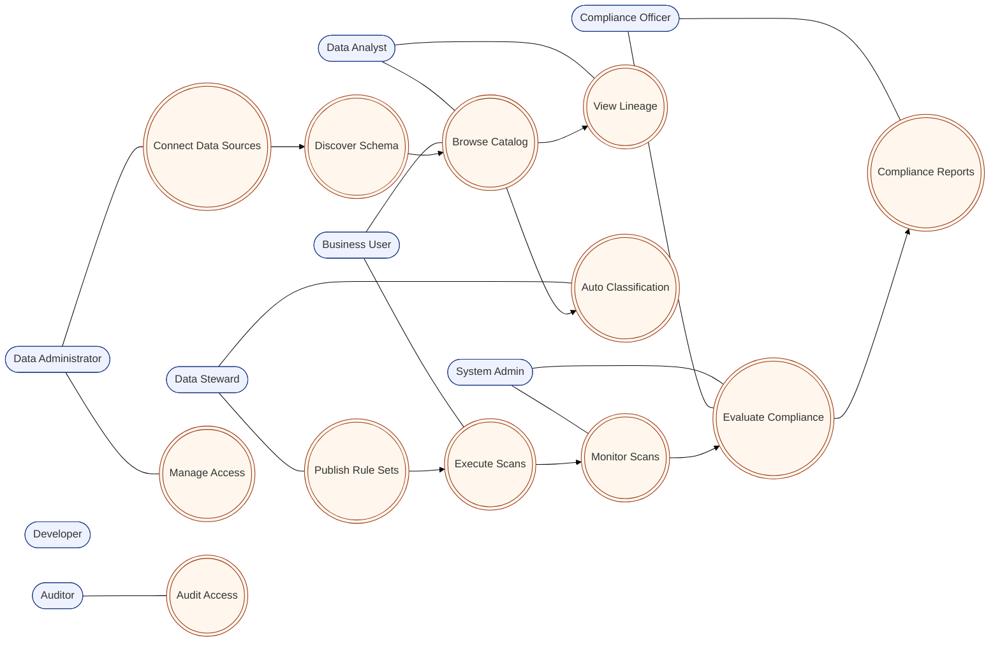

# Global Use Case Diagram – DataWave

```mermaid
%%{init: {'theme': 'base'}}%%
flowchart LR
    %% Actors
    admin(["Data Administrator"]):::actor
    steward(["Data Steward"]):::actor
    analyst(["Data Analyst"]):::actor
    compliance(["Compliance Officer"]):::actor
    business(["Business User"]):::actor
    sys(["System Admin"]):::actor
    dev(["Developer"]):::actor
    auditor(["Auditor"]):::actor

    %% Use cases
    ds_connect(((Connect Data Sources))):::uc
    ds_discover(((Discover Schema))):::uc
    cat_browse(((Browse Catalog))):::uc
    cat_lineage(((View Lineage))):::uc
    class_auto(((Auto Classification))):::uc
    rules_publish(((Publish Rule Sets))):::uc
    scan_exec(((Execute Scans))):::uc
    scan_monitor(((Monitor Scans))):::uc
    comp_eval(((Evaluate Compliance))):::uc
    comp_report(((Compliance Reports))):::uc
    rbac_manage(((Manage Access))):::uc
    rbac_audit(((Audit Access))):::uc

    %% Associations
    admin --- ds_connect
    admin --- rbac_manage
    sys --- scan_monitor
    sys --- comp_eval
    steward --- class_auto
    steward --- rules_publish
    analyst --- cat_browse
    analyst --- cat_lineage
    business --- cat_browse
    business --- scan_exec
    compliance --- comp_eval
    compliance --- comp_report
    auditor --- rbac_audit

    %% Dependencies
    ds_connect --> ds_discover
    ds_discover --> cat_browse
    cat_browse --> cat_lineage
    cat_browse --> class_auto
    rules_publish --> scan_exec
    scan_exec --> scan_monitor
    scan_monitor --> comp_eval
    comp_eval --> comp_report

    classDef actor fill:#eef2ff,stroke:#1e3a8a
    classDef uc fill:#fff7ed,stroke:#9a3412
```
