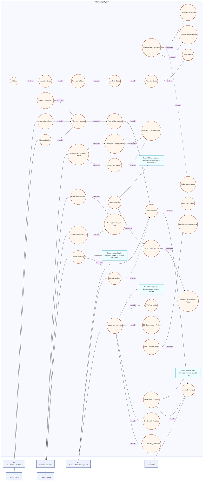

# Use Case – Scan Logic Module (Enterprise Use Case Layout)

```mermaid
%%{init: {'theme': 'base'}}%%
flowchart LR
    %% ================= Actors (Left Side) =================
    A_SRE["<<actor>>\n🛠️ SRE / Platform Engineer"]:::actor
    A_STEWARD["<<actor>>\n👩‍💼 Data Steward"]:::actor
    A_PLANNER["<<actor>>\n📅 Scan Planner"]:::actor

    %% ================= Actors (Right Side) =================
    R_COMP["<<actor>>\n👩‍⚖️ Compliance Officer"]:::actor
    R_OWNER["<<actor>>\n👤 Asset Owner"]:::actor
    R_AUD["<<actor>>\n👩‍📊 Auditor"]:::actor

    %% ================= System Boundary =================
    subgraph SYSTEM["🧠 Scan Logic System"]
    direction TB

      %% -------- Orchestration Strategies --------
      UC_SEQ((Sequential Orchestration)):::uc
      UC_PAR((Parallel Orchestration)):::uc
      UC_ADAPT((Adaptive / Priority-based)):::uc
      UC_RESOPT((Resource-Optimized)):::uc
      UC_BUDGET((Budget / Cost-aware)):::uc

      %% -------- Workflow Engine --------
      UC_INIT((Init Stage)):::uc
      UC_VALID((Validation Stage)):::uc
      UC_PROC((Processing Stage)):::uc
      UC_ANALYZE((Analysis Stage)):::uc
      UC_REPORT((Reporting Stage)):::uc
      UC_CLEAN((Cleanup Stage)):::uc
      UC_APPROVE((Approval / Gates)):::uc

      %% -------- Scheduling & Triggers --------
      UC_CRON((Cron Scheduling)):::uc
      UC_EVENT((Event / Webhook Trigger)):::uc
      UC_DEP((Dependency Triggers / DAG)):::uc
      UC_SLA((SLA / Deadlines)):::uc

      %% -------- Resource Management --------
      UC_CPU((CPU / Memory Allocation)):::uc
      UC_IO((IO / Network Throttling)):::uc
      UC_DB((DB Connections / Pools)):::uc
      UC_RATE((API Rate Limits)):::uc

      %% -------- AI/ML Optimization --------
      UC_SCALE((Dynamic Scaling)):::uc
      UC_PRED((Predict Duration / Cost)):::uc
      UC_RECOVER((Intelligent Error Recovery)):::uc
      UC_TUNE((Adaptive Performance Tuning)):::uc

      %% -------- Execution & Control --------
      UC_START((Start / Pause / Resume / Cancel)):::uc
      UC_RETRY((Retry with Backoff)):::uc
      UC_CHECKPT((Checkpoint / Idempotency)):::uc
      UC_ROLLBK((Rollback / Compensations)):::uc

      %% -------- Integration Paths --------
      UC_RULES((Consume Rule Sets)):::uc
      UC_CLASS((Send to Classification)):::uc
      UC_COMP((Send to Compliance)):::uc
      UC_CATALOG((Enrich Catalog)):::uc

      %% -------- Observability --------
      UC_TELE((Telemetry / Metrics)):::uc
      UC_TRACE((Tracing / Correlation)):::uc
      UC_ALERTS((Alerts / Incidents)):::uc
      UC_COST((Cost / Budget Usage)):::uc

      %% -------- Security & Audit --------
      UC_RBAC((RBAC/ABAC Checks)):::uc
      UC_AUDIT((Audit / Evidence)):::uc

      %% -------- Includes --------
      UC_ADAPT -->|«include»| UC_SEQ
      UC_ADAPT -->|«include»| UC_PAR
      UC_RESOPT -->|«include»| UC_CPU
      UC_RESOPT -->|«include»| UC_IO
      UC_RESOPT -->|«include»| UC_DB
      UC_RESOPT -->|«include»| UC_RATE

      UC_INIT -->|«include»| UC_VALID
      UC_VALID -->|«include»| UC_PROC
      UC_PROC -->|«include»| UC_ANALYZE
      UC_ANALYZE -->|«include»| UC_REPORT
      UC_REPORT -->|«include»| UC_CLEAN

      UC_CRON -->|«include»| UC_SLA
      UC_EVENT -->|«include»| UC_DEP

      UC_SCALE -->|«include»| UC_PRED
      UC_PRED -->|«include»| UC_TUNE

      UC_START -->|«include»| UC_RETRY
      UC_START -->|«include»| UC_CHECKPT
      UC_CHECKPT -->|«include»| UC_ROLLBK

      UC_RULES -->|«include»| UC_DEP
      UC_CLASS -->|«include»| UC_TELE
      UC_COMP -->|«include»| UC_TELE
      UC_CATALOG -->|«include»| UC_TELE

      UC_TELE -->|«include»| UC_TRACE
      UC_TRACE -->|«include»| UC_ALERTS
      UC_ALERTS -->|«include»| UC_AUDIT

      UC_RBAC -->|«include»| UC_AUDIT

      UC_COST -->|«include»| UC_BUDGET

      %% -------- Extends --------
      UC_RETRY -.->|«extend»| UC_ROLLBK
      UC_ADAPT -.->|«extend»| UC_BUDGET
      UC_SLA -.->|«extend»| UC_ALERTS

      %% -------- Guards / Notes --------
      G_SCHED["Guard: No overlapping windows; max concurrency per source"]:::note
      G_RES["Guard: Pool quotas; backpressure; fairness policies"]:::note
      G_AI["Guard: ML suggestions require human override for critical flows"]:::note
      G_SEC["Guard: Enforce least-privilege; immutable audit logs"]:::note

      UC_CRON --- G_SCHED
      UC_RESOPT --- G_RES
      UC_SCALE --- G_AI
      UC_RBAC --- G_SEC

    end

    %% ================= Actor Associations (Left → System) =================
    A_SRE --- UC_RESOPT
    A_SRE --- UC_SLA
    A_SRE --- UC_ALERTS

    A_STEWARD --- UC_RULES
    A_STEWARD --- UC_START

    A_PLANNER --- UC_CRON
    A_PLANNER --- UC_EVENT

    %% ================= Actor Associations (Right → System) =================
    R_COMP --- UC_COMP
    R_OWNER --- UC_CATALOG
    R_AUD --- UC_AUDIT

    %% ================= Styles =================
    classDef actor fill:#eef2ff,stroke:#1e3a8a,stroke-width:1.5px
    classDef uc fill:#fff7ed,stroke:#9a3412,stroke-width:1.5px
    classDef note fill:#ecfeff,stroke:#0891b2,stroke-width:1px
```
