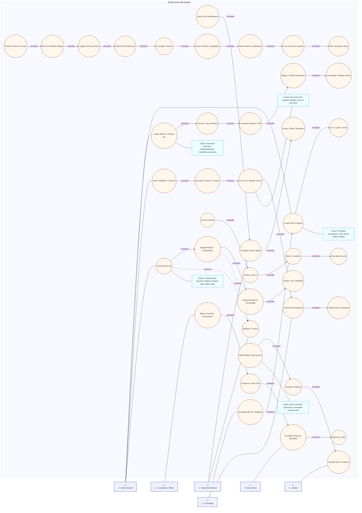

# Use Case – Scan Rule Sets Module (Enterprise Use Case Layout)

```mermaid
%%{init: {'theme': 'base'}}%%
flowchart LR
    %% ================= Actors (Left Side) =================
    A_STEWARD["<<actor>>\n👩‍💼 Data Steward"]:::actor
    A_ADMIN["<<actor>>\n👨‍💼 Data Administrator"]:::actor
    A_DEV["<<actor>>\n👨‍💻 Developer"]:::actor

    %% ================= Actors (Right Side) =================
    R_COMP["<<actor>>\n👩‍⚖️ Compliance Officer"]:::actor
    R_OWNER["<<actor>>\n👤 Asset Owner"]:::actor
    R_AUD["<<actor>>\n👩‍📊 Auditor"]:::actor

    %% ================= System Boundary =================
    subgraph SYSTEM["📋 Scan Rule Sets System"]
    direction TB

      %% -------- Authoring & Templates --------
      UC_TEMPLATE((Create Rule Template)):::uc
      UC_BLOCKS((Reusable Blocks / Snippets)):::uc
      UC_LIBRARY((Template Library Mgmt)):::uc
      UC_IMPORT((Import from Marketplace)):::uc
      UC_EXPORT((Export / Share Templates)):::uc
      UC_LINT((Lint / Syntax Check)):::uc

      %% -------- Versioning & Branching --------
      UC_BRANCH((Create Branch / Feature Set)):::uc
      UC_VERSION((Version / Tag / Release)):::uc
      UC_COMPARE((Compare Versions / Diff)):::uc
      UC_MERGE((Merge / Conflict Resolution)):::uc
      UC_CHANGELOG((Changelog / Release Notes)):::uc

      %% -------- Validation & Testing --------
      UC_STATIC((Static Validation / Schema)):::uc
      UC_SEMANTIC((Semantic Checks / Scopes)):::uc
      UC_DRYRUN((Dry-run on Sample Scope)):::uc
      UC_PERF((Performance Baseline)):::uc
      UC_SAFETY((Safety Nets / Guardrails)):::uc

      %% -------- Rollout & Deployment --------
      UC_PUBLISH((Publish Rule Set)):::uc
      UC_STAGED((Staged Rollout – Canary/Beta)):::uc
      UC_PERCENT((Gradual Rollout by Percentage)):::uc
      UC_REGION((Region / Env Targeting)):::uc
      UC_ROLLBK((Rollback / Freeze)):::uc

      %% -------- Execution Link --------
      UC_RESOLVE((Resolve Rules for Scope)):::uc
      UC_BIND((Bind to Workflow Stages)):::uc
      UC_TRIGGER((Trigger Scans by Rules)):::uc
      UC_TELEM((Collect Rule Telemetry)):::uc

      %% -------- Impact & Analytics --------
      UC_COVER((Coverage / Reach)):::uc
      UC_FP((False Positives / Negatives)):::uc
      UC_BENCH((Benchmarks vs Baselines)):::uc
      UC_COST((Cost / Resource Impact)):::uc
      UC_ROI((ROI / Business Value)):::uc

      %% -------- Compliance & Exceptions --------
      UC_MAP((Map to Controls / Frameworks)):::uc
      UC_EVID((Evidence / Audit Trail)):::uc
      UC_EXC((Exception Request Workflow)):::uc
      UC_APPROVE((Approval / SoD)):::uc

      %% -------- Security & Governance --------
      UC_RBAC((RBAC/ABAC Enforcement)):::uc
      UC_SIGN((Signing / Integrity)):::uc
      UC_AUDIT((Change Audit / Evidence)):::uc

      %% -------- Observability --------
      UC_UP((Service Health)):::uc
      UC_LAT((Latency / Errors)):::uc
      UC_ALERTS((Alerts / Incidents)):::uc
      UC_OPSAUD((Operational Audit)):::uc

      %% -------- Includes --------
      UC_TEMPLATE -->|«include»| UC_LINT
      UC_BLOCKS -->|«include»| UC_TEMPLATE
      UC_IMPORT -->|«include»| UC_LIBRARY
      UC_LIBRARY -->|«include»| UC_EXPORT

      UC_BRANCH -->|«include»| UC_VERSION
      UC_VERSION -->|«include»| UC_COMPARE
      UC_COMPARE -->|«include»| UC_MERGE
      UC_MERGE -->|«include»| UC_CHANGELOG

      UC_STATIC -->|«include»| UC_SEMANTIC
      UC_SEMANTIC -->|«include»| UC_DRYRUN
      UC_DRYRUN -->|«include»| UC_PERF
      UC_PERF -->|«include»| UC_SAFETY

      UC_PUBLISH -->|«include»| UC_STAGED
      UC_STAGED -->|«include»| UC_PERCENT
      UC_PERCENT -->|«include»| UC_REGION

      UC_RESOLVE -->|«include»| UC_BIND
      UC_BIND -->|«include»| UC_TRIGGER
      UC_TRIGGER -->|«include»| UC_TELEM

      UC_TELEM -->|«include»| UC_COVER
      UC_COVER -->|«include»| UC_FP
      UC_FP -->|«include»| UC_BENCH
      UC_BENCH -->|«include»| UC_COST
      UC_COST -->|«include»| UC_ROI

      UC_MAP -->|«include»| UC_EVID
      UC_EVID -->|«include»| UC_EXC
      UC_EXC -->|«include»| UC_APPROVE

      UC_RBAC -->|«include»| UC_SIGN
      UC_SIGN -->|«include»| UC_AUDIT

      UC_UP -->|«include»| UC_LAT
      UC_LAT -->|«include»| UC_ALERTS
      UC_ALERTS -->|«include»| UC_OPSAUD

      %% -------- Extends --------
      UC_PUBLISH -.->|«extend»| UC_ROLLBK
      UC_STAGED -.->|«extend»| UC_ROLLBK

      %% -------- Guards / Notes --------
      G_AUTHOR["Guard: Template namespace; code review before publish"]:::note
      G_VERSION["Guard: Protected branches; CODEOWNERS; mandatory reviewers"]:::note
      G_TEST["Guard: Non-prod only; masked samples; dry-run rate limits"]:::note
      G_ROLL["Guard: Change ticket required; rollback window; blast radius caps"]:::note
      G_SEC["Guard: Deny overrides; signatures; immutable change audit"]:::note

      UC_TEMPLATE --- G_AUTHOR
      UC_BRANCH --- G_VERSION
      UC_DRYRUN --- G_TEST
      UC_PUBLISH --- G_ROLL
      UC_RBAC --- G_SEC

    end

    %% ================= Actor Associations (Left → System) =================
    A_STEWARD --- UC_TEMPLATE
    A_STEWARD --- UC_BRANCH
    A_STEWARD --- UC_STATIC
    A_STEWARD --- UC_PUBLISH

    A_ADMIN --- UC_LIBRARY
    A_ADMIN --- UC_ROLLBK

    A_DEV --- UC_BLOCKS
    A_DEV --- UC_PERF

    %% ================= Actor Associations (Right → System) =================
    R_COMP --- UC_MAP
    R_OWNER --- UC_EXC
    R_AUD --- UC_AUDIT

    %% ================= Styles =================
    classDef actor fill:#eef2ff,stroke:#1e3a8a,stroke-width:1.5px
    classDef uc fill:#fff7ed,stroke:#9a3412,stroke-width:1.5px
    classDef note fill:#ecfeff,stroke:#0891b2,stroke-width:1px
```
