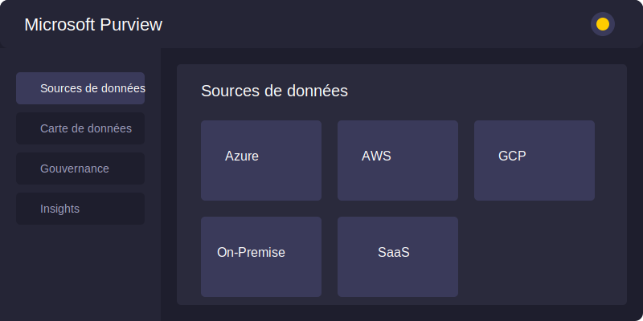

# TailAdmin React - Free React Tailwind Admin Dashboard Template

TailAdmin is a free and open-source admin dashboard template built on **React and Tailwind CSS**, providing developers
with everything they need to create a comprehensive, data-driven back-end,
dashboard, or admin panel solution for upcoming web projects.

With TailAdmin, you get access to all the necessary dashboard UI components, elements, and pages required to build a
feature-rich and complete dashboard or admin panel. Whether you're building dashboard or admin panel for a complex web
application or a simple website, TailAdmin is the perfect solution to help you get up and running quickly.

## Composants similaires à Microsoft Purview en mode sombre

Ce projet contient également des composants React qui imitent l'interface utilisateur de Microsoft Purview, avec la prise en charge du mode sombre.

### Structure des composants Purview

```
src/
├── components/
│   └── ThemeToggle.tsx       # Composant pour basculer entre les thèmes clair et sombre
├── context/
│   └── ThemeContext.tsx      # Contexte React pour gérer l'état du thème
├── pages/
│   ├── datasource/
│   │   └── DataSourceConnectPage.tsx  # Page de connexion des sources de données
│   ├── datamap/
│   │   └── DataMapDesignerPage.tsx    # Page de conception de carte de données
│   └── index.ts              # Exports des composants principaux
├── providers/
│   └── AppThemeProvider.tsx  # Provider combinant ThemeContext et MuiThemeProvider
└── pages/rbac_system/styles/
    ├── AzureTheme.tsx        # Thème clair inspiré d'Azure
    └── AzureDarkTheme.tsx    # Thème sombre inspiré d'Azure
```

### Utilisation des composants Purview

#### Configuration du thème

Pour utiliser le système de thème dans votre application, enveloppez votre composant racine avec `AppThemeProvider` :

```jsx
import { AppThemeProvider } from './pages';

function App() {
  return (
    <AppThemeProvider>
      {/* Votre application ici */}
    </AppThemeProvider>
  );
}
```

#### Ajout du bouton de bascule de thème

Pour permettre aux utilisateurs de basculer entre les thèmes clair et sombre, utilisez le composant `ThemeToggle` :

```jsx
import { ThemeToggle } from './pages';

function Header() {
  return (
    <header>
      <h1>Mon Application</h1>
      <ThemeToggle />
    </header>
  );
}
```

#### Utilisation des pages

Les pages principales peuvent être importées et utilisées dans vos routes :

```jsx
import { DataSourceConnectPage, DataMapDesignerPage } from './pages';
import { Routes, Route } from 'react-router-dom';

function AppRoutes() {
  return (
    <Routes>
      <Route path="/datasources" element={<DataSourceConnectPage />} />
      <Route path="/datamap" element={<DataMapDesignerPage />} />
    </Routes>
  );
}
```

#### Personnalisation des thèmes

Les thèmes sont définis dans les fichiers `AzureTheme.tsx` et `AzureDarkTheme.tsx`. Vous pouvez les modifier pour adapter les couleurs et les styles à votre marque.

#### Dépendances nécessaires

Ces composants utilisent les bibliothèques suivantes :

- React
- Material-UI (MUI)
- React Icons (notamment les icônes Feather via `react-icons/fi`)

Assurez-vous d'installer ces dépendances :

```bash
npm install @mui/material @emotion/react @emotion/styled react-icons
```

ou

```bash
yarn add @mui/material @emotion/react @emotion/styled react-icons
```

### Aperçu du mode sombre

Voici un aperçu des composants inspirés de Microsoft Purview en mode sombre :



### Intégration avec TailAdmin

Un exemple d'intégration des composants Purview dans l'application TailAdmin est disponible dans le fichier `src/examples/PurviewIntegrationExample.tsx`. Cet exemple montre comment :

1. Envelopper l'application avec `AppThemeProvider` pour le support du thème sombre
2. Ajouter le bouton de bascule de thème dans l'en-tête
3. Ajouter les routes pour les pages Purview

Pour utiliser cet exemple, vous pouvez vous inspirer du code pour intégrer les composants Purview dans votre application TailAdmin existante.

### Tests

Des tests unitaires sont disponibles pour les composants principaux :

- `src/components/ThemeToggle.test.tsx` : Teste le fonctionnement du bouton de bascule de thème
- `src/providers/AppThemeProvider.test.tsx` : Teste que le provider de thème fournit le bon thème en fonction du contexte

Pour exécuter les tests :

```bash
npm test
```

ou

```bash
yarn test
```

### Démonstration

Un composant de démonstration est disponible dans le fichier `src/examples/PurviewDemo.tsx`. Ce composant montre les différentes pages Purview dans un environnement de démonstration avec un en-tête simple contenant le bouton de bascule de thème.

Pour utiliser cette démonstration, vous pouvez l'importer dans votre application principale :

```jsx
import PurviewDemo from './examples/PurviewDemo';

function App() {
  return (
    <PurviewDemo />
  );
}
```


## Overview

TailAdmin provides essential UI components and layouts for building feature-rich, data-driven admin dashboards and
control panels. It's built on:

- React 19
- TypeScript
- Tailwind CSS

### Quick Links

- [✨ Visit Website](https://tailadmin.com)
- [📄 Documentation](https://tailadmin.com/docs)
- [⬇️ Download](https://tailadmin.com/download)
- [🖌️ Figma Design File (Community Edition)](https://www.figma.com/community/file/1214477970819985778)
- [⚡ Get PRO Version](https://tailadmin.com/pricing)

### Demos

- [Free Version](https://free-react-demo.tailadmin.com/)
- [Pro Version](https://react-demo.tailadmin.com)

### Other Versions

- [HTML Version](https://github.com/TailAdmin/tailadmin-free-tailwind-dashboard-template)
- [Next.js Version](https://github.com/TailAdmin/free-nextjs-admin-dashboard)
- [Vue.js Version](https://github.com/TailAdmin/vue-tailwind-admin-dashboard)

## Installation

### Prerequisites

To get started with TailAdmin, ensure you have the following prerequisites installed and set up:

- Node.js 18.x or later (recommended to use Node.js 20.x or later)

### Cloning the Repository

Clone the repository using the following command:

```bash
git clone https://github.com/TailAdmin/free-react-tailwind-admin-dashboard.git
```

> Windows Users: place the repository near the root of your drive if you face issues while cloning.

1. Install dependencies:

   ```bash
   npm install
   # or
   yarn install
   ```

   > Use the `--legacy-peer-deps` flag, if you face issues while installing.

2. Start the development server:
   ```bash
   npm run dev
   # or
   yarn dev
   ```

## Components

TailAdmin is a pre-designed starting point for building a web-based dashboard using React.js and Tailwind CSS. The
template includes:

- Sophisticated and accessible sidebar
- Data visualization components
- Prebuilt profile management and 404 page
- Tables and Charts(Line and Bar)
- Authentication forms and input elements
- Alerts, Dropdowns, Modals, Buttons and more
- Can't forget Dark Mode 🕶️

All components are built with React and styled using Tailwind CSS for easy customization.

## Feature Comparison

### Free Version

- 1 Unique Dashboard
- 30+ dashboard components
- 50+ UI elements
- Basic Figma design files
- Community support

### Pro Version

- 5 Unique Dashboards: Analytics, Ecommerce, Marketing, CRM, Stocks (more coming soon)
- 400+ dashboard components and UI elements
- Complete Figma design file
- Email support

To learn more about pro version features and pricing, visit our [pricing page](https://tailadmin.com/pricing).

## Changelog

### Version 2.0.2 - [March 25, 2025]

- Upgraded to React 19
- Included overrides for packages to prevent peer dependency errors.
- Migrated from react-flatpickr to flatpickr package for React 19 support

### Version 2.0.1 - [February 27, 2025]

#### Update Overview

- Upgraded to Tailwind CSS v4 for better performance and efficiency.
- Updated class usage to match the latest syntax and features.
- Replaced deprecated class and optimized styles.

#### Next Steps

- Run npm install or yarn install to update dependencies.
- Check for any style changes or compatibility issues.
- Refer to the Tailwind CSS v4 [Migration Guide](https://tailwindcss.com/docs/upgrade-guide) on this release. if needed.
- This update keeps the project up to date with the latest Tailwind improvements. 🚀

### Version 2.0.0 - [February 2025]

A major update with comprehensive redesign and modern React patterns implementation.

#### Major Improvements

- Complete UI redesign with modern React patterns
- New features: collapsible sidebar, chat, and calendar
- Improved performance and accessibility
- Updated data visualization using ApexCharts

#### Key Features

- Redesigned dashboards (Ecommerce, Analytics, Marketing, CRM)
- Enhanced navigation with React Router integration
- Advanced tables with sorting and filtering
- Calendar with drag-and-drop support
- New UI components and improved existing ones

#### Breaking Changes

- Updated sidebar component API
- Migrated charts to ApexCharts
- Revised authentication system

[Read more](https://tailadmin.com/docs/update-logs/react) on this release.

### Version 1.3.7 - [June 20, 2024]

#### Enhancements

1. Remove Repetition of DefaultLayout in every Pages
2. Add ClickOutside Component for reduce repeated functionality in Header Message, Notification and User Dropdowns.

### Version 1.3.6 - [Jan 31, 2024]

#### Enhancements

1. Integrate flatpickr in [Date Picker/Form Elements]
2. Change color after select an option [Select Element/Form Elements].
3. Make it functional [Multiselect Dropdown/Form Elements].
4. Make best value editable [Pricing Table One/Pricing Table].
5. Rearrange Folder structure.

### Version 1.2.0 - [Apr 28, 2023]

- Add Typescript in TailAdmin React.

### Version 1.0.0 - Initial Release - [Mar 13, 2023]

- Initial release of TailAdmin React.

## License

TailAdmin React.js Free Version is released under the MIT License.

## Support

If you find this project helpful, please consider giving it a star on GitHub. Your support helps us continue developing
and maintaining this template.
