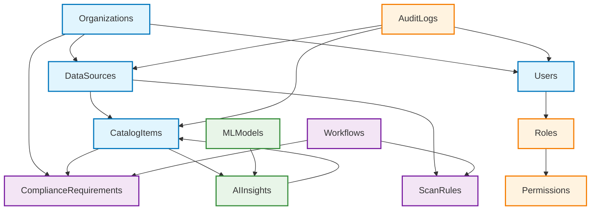
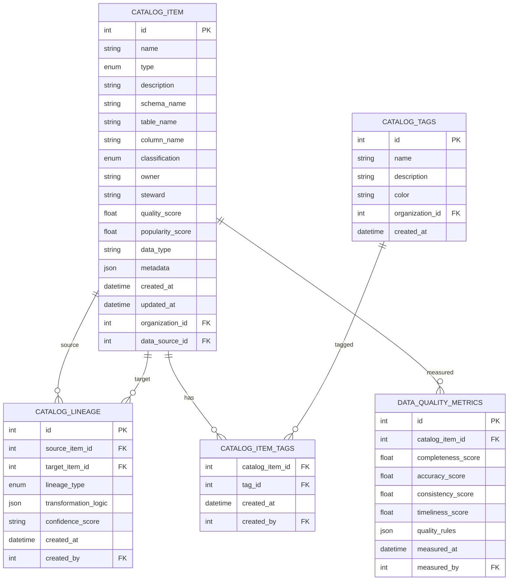
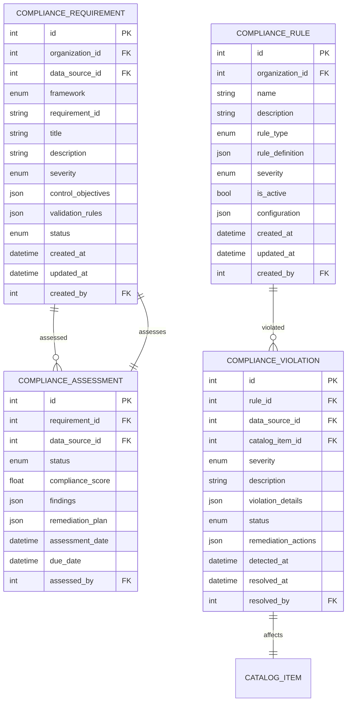
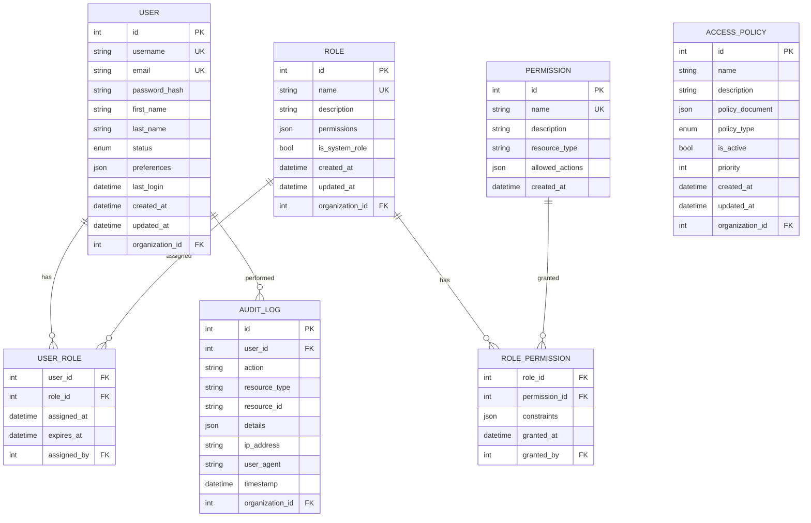
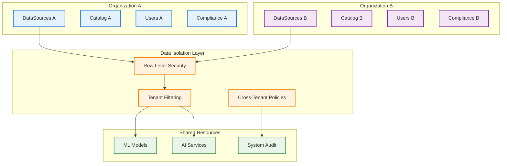
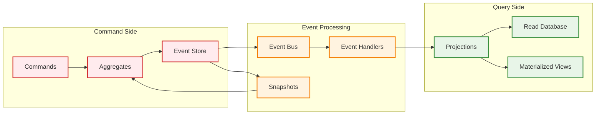
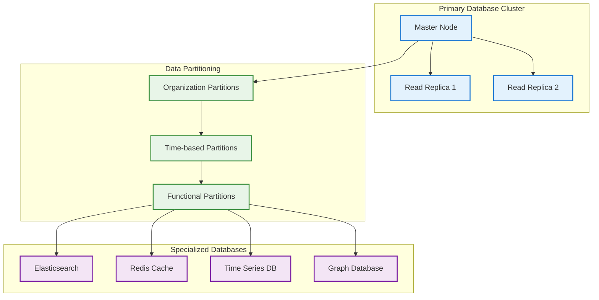
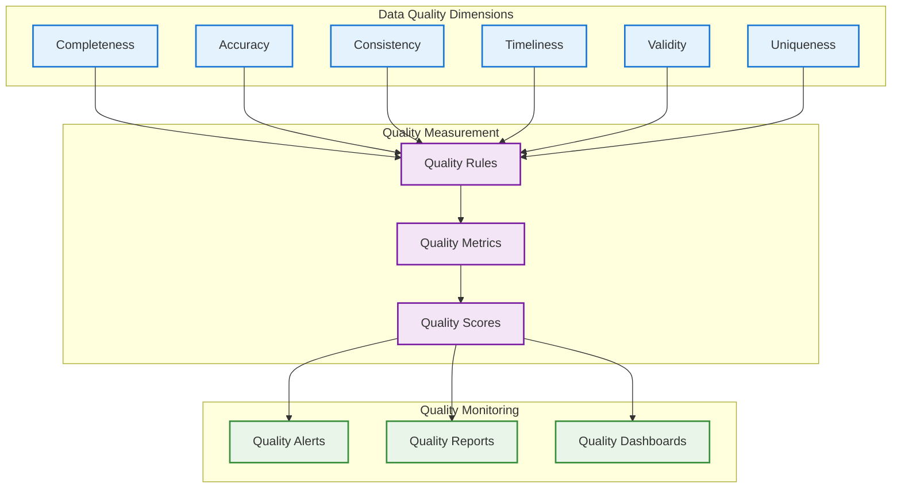
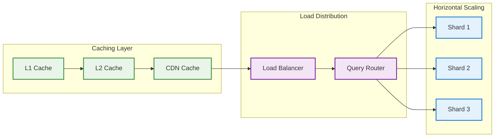
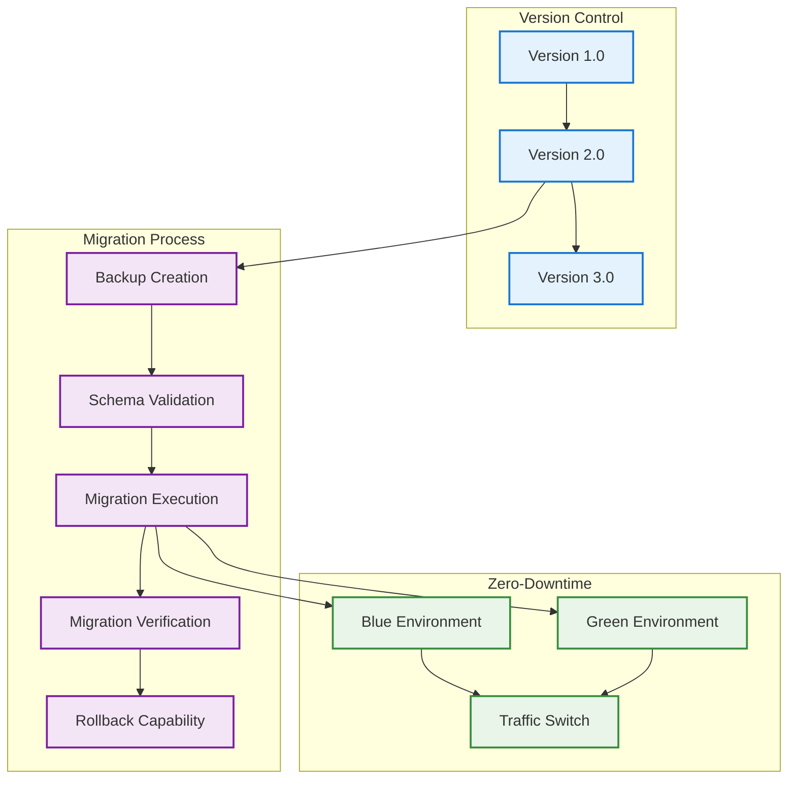

# Data Model Architecture - Mermaid Diagrams

## 1. High-Level Entity Relationship Overview

## 2. Catalog Domain Entity Relationship Diagram

## 3. Compliance Domain Entity Relationship Diagram

## 4. Security and RBAC Domain Entity Relationship Diagram

## 5. Multi-Tenancy Architecture Pattern

## 6. Event Sourcing and CQRS Architecture

## 7. Physical Database Architecture

## 8. Data Quality Framework Architecture

## 9. Database Scalability Architecture

## 10. Schema Evolution and Migration Strategy

